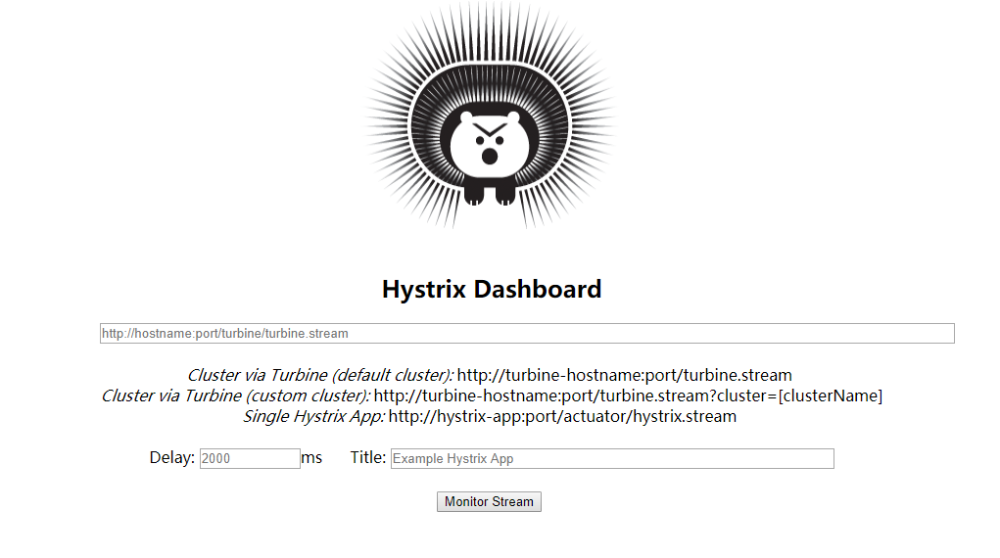
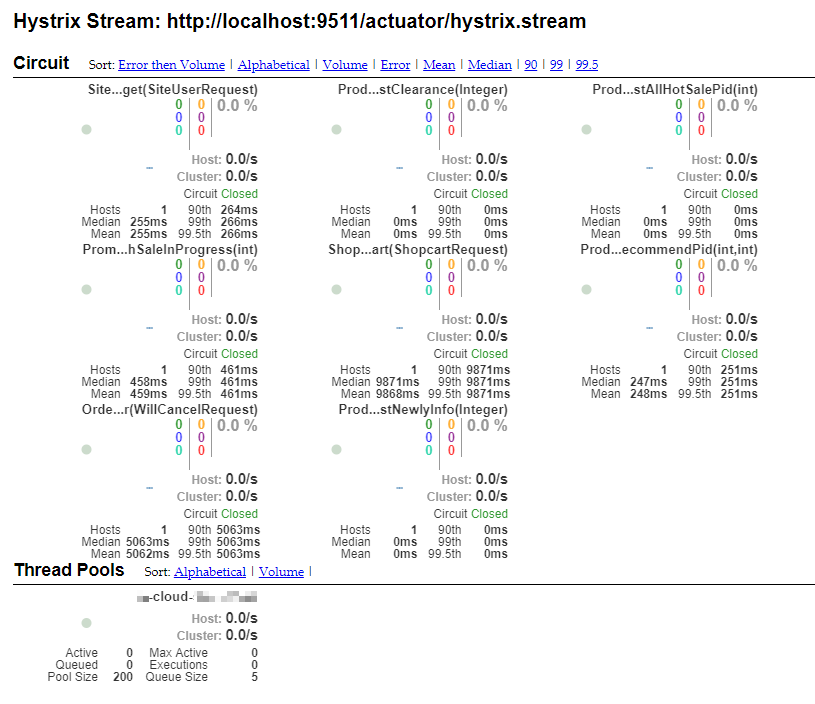

# hystrix

> [本章知识点大部分来自官网](https://cloud.spring.io/spring-cloud-static/spring-cloud-netflix/2.0.4.RELEASE/multi/multi_spring-cloud-netflix.html)

::: tip
本文不适合小白，适合有一定基础知识的
:::

版本交代：

- spring boot：2.0.4.RELEASE
- spring cloud：Finchley.SR1

背景：服务之间调用原本使用的是 feign；后来想开启 hystrix 功能；
根据这个背景来记录后续的一些问题和做法

## feign 使用

添加依赖

```groovy
compile('org.springframework.cloud:spring-cloud-starter-openfeign')
```

开启并扫描指定路径的 feignClient

```java
@EnableFeignClients({"cn.mrcode.cloud.b.*.client.support"})
```

yml 配置

```yml
feign:
  #  httpclient:
  #    enabled: true
  client:
    config:
      default:           #服务名，填写default为所有服务
        connectTimeout: 10000
        readTimeout: 400000 # 调用超时，单位毫秒；3.3 * 2 分钟
```

通过以上配置，在 A 服务中就可以通过 feign 调用 b 服务提供的快捷 client
（b 服务把自己暴露的接口通过 feign client 的方式写成了 jar 包方式，引用后，只要扫描到这个 jar 其他服务就可以使用了）了

这个时候需要查看 a 调用 b 的接口情况，比如：接口耗时、qps ，由于本人从事的工作没有高并发相关的，所以只能想到一些简单的需求，
其实我就是想看下这些接口调用耗时和调用频率；

那么这个就想到了这段时间正在学习的 hystrix。而 spring boot 提供了 hystrix 的集成

## hystrix 配置

添加依赖

```groovy
compile 'org.springframework.cloud:spring-cloud-starter-netflix-hystrix'
···

开启 hystrix

```java
@EnableHystrix
```

feign 中开启 hystrix

```java
feign:
  hystrix:
    enabled: true
```

通过以上配置， feign 在调用时就会使用 hystrix command 去调用接口了；

注：通过以上配置之后，在该项目中都支持 HystrixCommand 相关注解之定义调用了。

关于 HystrixCommand 原生使用请参考 [亿级流量缓存架构]('/cache-pdp/hystrix/084.md')

## hystrix-dashboard 配置

添加依赖

```groovy
compile 'org.springframework.cloud:spring-cloud-starter-netflix-hystrix-dashboard'
compile("org.springframework.boot:spring-boot-starter-actuator")
```

开启 dashborad

```java
@EnableHystrixDashboard
```

配置

```yml
management:
  endpoints:
    web:
      exposure:
        include:
          - "*"  # 暴露所有端点
          - "hystrix.stream" # 暴露这个断点
```

启动之后访问地址：` http://localhost:80/actuator/hystrix.stream` ;
能正常访问，就表示已经可以采集到短路器相关信息了

访问地址：`http://localhost:80/hystrix/` 可以打开一个豪猪的页面



上面地址栏中输入前面的 hystrix.stream 地址，就可以打开下面这样图的报表了



通过上图观察到，默认配置是按「服务」来划分线程池的，也就是说素有的接口共享一个线程池，每个接口是一个 command；

如果是按照上面的默认配置来执行的话，一个服务怎么可能只会有 10 个线程并发访问？修改这些参数

```yml
hystrix:
  command:
    default:
      execution:
        isolation:
          thread:
            timeoutInMilliseconds: 800000    # 6.6 * 2 分钟
  threadpool:
    default:
      allowMaximumSizeToDivergeFromCoreSize: true
      coreSize: 20
      maximumSize: 1000
      maxQueueSize: -1
      keepAliveTimeMinutes: 1
```

上面的配置简单说下：

- timeoutInMilliseconds 超时配置

    由于 feign 中配置了 6 分钟，这里要适当配置长一点，因为你配置了等待队列的话，
    饱和之后，就会进入等待队列，到真正执行的时候回检查该 command 是否有超时，
    如果不大一点，刚放出来就已经超时了，不会被执行了

    所以使用 hystrix 本人感觉难点就在于调优了，根据测试调优是个难点

- threadpool

    原生的 hystrix 线程池配置，上面的意思是使用动态的线程池配置，我这里配置了 500 个线程，
    一个服务共享一个线程池， 500 个感觉都有点少

    在亿级流量架构里面讲解得时按细粒度控制，每个服务接口来划分的。这里直接按一个微服务划分了

最后需要注意的一个坑：ui 上的 Pool Size 需要手动刷新才能看到变化，比如不活跃被销毁了

其他请参考 [hystrix-dashboard 含义和这里其他的配置注意事项](/cache-pdp/hystrix/108.md#hystrix-dashboard-含义)
[配置 withMaximumSize 无效解决](/cache-pdp/hystrix/106.md#配置-withMaximumSize-无效解决)

## turbine 配置

turbine 是聚合多个 hystrix.stream 的封装，在多个实例的微服务中，使用 turbin 才是有用的；

spring-cloud-starter-netflix-turbin 中的前提：

- 需要依赖 eurake
- 部署的服务需要能获取到 eurake 的信息，因为默认会通过配置的服务名来从 eurake 中获取具体服务实例的 hystrix.stream 地址
- turbine 需要和要监控的服务在同一个 eurake 中
- turbine 不能部署在 服务注册中心，服务注册中心一般不会注册在注册中心上（单服务注册中心是这样）

添加依赖

```groovy
compile 'org.springframework.cloud:spring-cloud-starter-netflix-turbine'
```

通过注解开启支持

```java
@EnableTurbine
```

项目启动之后，会在控制台中找到 mapping 信息 `/turbine.stream` (高版本的 boot 需要配置打印出 controller 的映射路径信息)

访问地址：`http://localhost:80/clusters`，如果能看见以下信息，说明配置没有问题了；

```json
[
  {
  "name": "MRCODE",
  "link": "http://localhost:80/turbine.stream?cluster=MRCODE"
  }
]
```

但是跟着本笔记走的话，肯定是不行的，还需要在 yml 中对 turbine 进行配置

配置需要聚合的微服务

```yml
turbine:
  aggregator:
     # 从服务注册中心返回的服务名是大写的，如有多个使用数组方式给出；
     # 它绑定的配置路径是 org.springframework.cloud.netflix.turbine.TurbineAggregatorProperties#setClusterConfig
    clusterConfig: MRCODE
  appConfig: mrcode
```

这个时候随意打开一个仪表盘，如 `http://localhost:80/hystrix/` ，填入通过 /clusters 获取到的 link 地址，即可观察该集群信息
