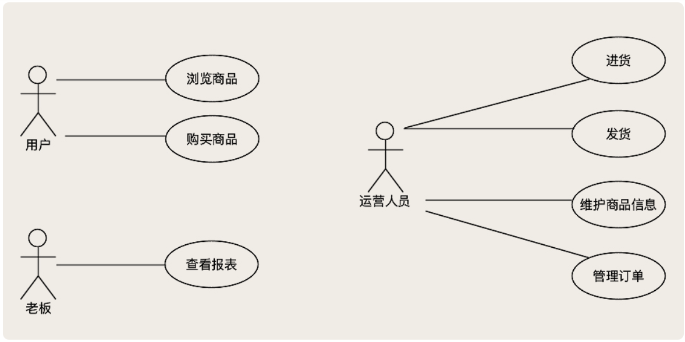
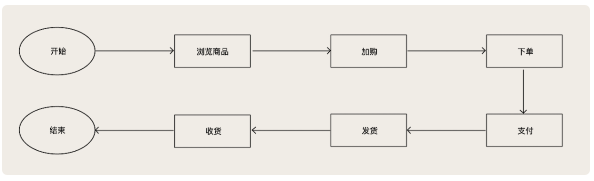
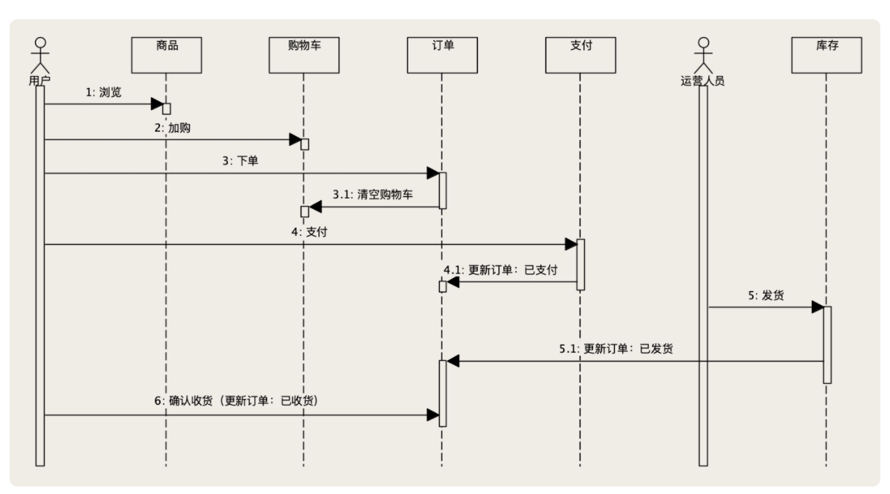
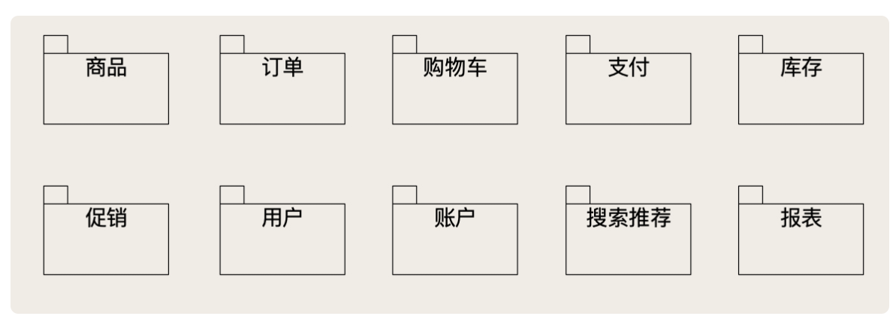

# 电商系统是如何设计的？

在这个系列课程中，我们会讲电商这个行业在多年系统建设和运维过程中，总结出来的使用分布式存储系统的一些最佳实践。也会以电商系统作为例子来讲解存储相关的技术知识和问题。这都需要你对电商的业务逻辑、系统架构、核心业务流程有一个基本的认知。

下面以一个创业公司的 CTO 视角，设计一个最小化的电商系统，在这个过程中理清楚电商系统的架构。

你是一个新公司的 CTO，你的老板要你做一个电商系统，具体做成什么样，还不清楚。你和你老板的需求讨论如下：

- 你：咱们要做的业务模式是 C2C、B2C 还是 B2B 呢？
- 老板：什么 B？什么 C？我不懂你们那些技术的东西。
- 你：这么说吧，你要山寨，啊不对，做一个某宝网，还是某东网，还是某 848 网呢？
- 老板：不都是一样的么？有什么区别？你赶紧做一个出来我看看不就知道了？！

如上，你碰了到一个啥也不懂的需求方，在这种情况下，要怎么办？

**在需求还不太明确的情况下，比较可行的方式就是，先把那些不太会变化的核心系统搭建出来，尽量简单地实现出一个最小化的系统，然后再逐步迭代完善。**

## 电商系统的核心流程是什么样的？

需求分析一般由产品来承担这个任务，但是大部分情况下，会落在开发身上，所谓的需求，就如上的对话，一两句话的需求。

这里不讲正儿八经的做需求分析的方法和理论，只告诉你最关键的一个点：**不要一上来就设计功能，而是先要回答下面这两个问题：**

1. 这个系统（或者是功能）是给哪些人用的？
2. 这些人使用这个系统来解决什么问题？

这两个问题的答案，我把它们称为业务需求。在我们将要设计的这个电商系统中，它的业务需求是什么？电商的业务，每个人都熟悉，很容易回答这两个问题。

**这个系统（或者是功能）是给哪些人用的？**

首先得有买东西的人，我们叫 **用户**，还得有卖东西的人？我们叫  **运营人员**。还有什么人会用这个系统？**老板** 啊！你记住，你在设计任何一个系统的时候，千万不要把老板或者是领导给忘了，他们是给你钱的人，他们的意见非常重要！

**这些人使用这个系统来解决什么问题？**

- 用户用系统来买东西

- 运营用系统来卖东西

- 老板需要在系统中看到他赚了多少钱

这两个问题的答案，或者说是业务需求，稍加细化后，可以用下面这个图来清晰的表述：

这个图在 UML（统一建模语言）中称为用例图（Use Case），是需求分析的时候你需要画的第一张图。它回答的就是，业务需求中的那两个关键的问题，这个系统给谁用？他们用这个系统解决什么问题？

**一般来说，业务需求和我们要设计的系统关系不大**。因为上面图例中，几乎上任何一个传统的商业企业都适用（如超市、小杂货铺）。**所以做业务需求的主要目的，是理清楚业务场景是什么样的**。

一个电商系统最主要的业务流程，一定是 **购物这个流程**。你应该很容易就能把这个流程分析出来，它的流程图是这样的：

所有的电商几乎都是这样一个流程。

流程从用户选购商品开始，用户先从你的 App 中浏览商品；找到心仪的商品之后，把商品添加到购物车里面；都选好了之后，打开购物车，下一个订单；下单结算之后，就可以支付了；支付成功后，运营人员接下来会给每个已经支付的订单发货；邮寄商品给用户之后，用户确认收货，到这里一个完整的购物流程就结束了。

## 如何根据流程来划分功能模块？

接下来，将这个业务流程细化，看看电商系统如何来实现这个流程。下图是细化之后的流程，也叫时序图（Sequence Diagram）

1. 用户开始浏览商品，需要有一个 **商品模块** 来支撑，给用户展示商品的介绍、价格等等这些信息。
2. 用户把选好的商品加入购物车，这个步骤，也需要一个 **购物车模块** 来维护用户购物车中的商品。
3. 用户下单肯定需要一个 **订单模块** 来创建这个新订单。订单创建好了之后，需要把订单中的商品从购物车中删除掉。
4. 订单创建完成后，需要引导用户付款，也就是发起支付流程，这里需要有一个 **支付模块** 来实现支付功能，用户成功完成支付之后，需要把订单的状态变更为 「已支付」。
5. 之后运营人员就可以发货了，在系统中，发货这个步骤，需要扣减对应商品的库存数量，这个功能需要 **库存模块** 来实现，发货完成后，还需要把订单状态变更为「已发货」。
6. 最后，用户收货之后，在系统中确认收货，系统把订单状态变更为「已收货」，流程结束。

这个流程涉及到的功能模块有：**商品、购物车、订单、支付和库存，** 这几个模块就是一个电商系统中的核心功能模块。

这只是其中一个 **购物** 流程，还有其他的流程，如：运营人员进货、老板查看报表等没有覆盖到。

相对于购物流程来说，剩下的相对较简单，就不做分析了，直接给出电商系统的功能模块划分：

上面这个图，我使用的是 UML 中的包图 (Package Diagram) 来表示。整个系统按照功能，划分为十个模块，除了购物流程中涉及到的：商品、订单、购物车、支付、库存五个模块以外，还补充了促销、用户、账户、搜索推荐和报表这几个模块，这些都是构建一个电商系统必不可少的功能。我们一个一个来说每个模块需要实现的功能。

- 商品：维护和展示商品信息和价格。

- 订单：维护订单信息和订单状态，计算订单金额。

- 购物车：维护用户购物车中的商品。

- 支付：负责与系统内外部的支付渠道对接，实现支付功能。

- 库存：维护商品的库存数量和库存信息。

- 促销：制定促销规则，计算促销优惠。

- 用户：维护系统的用户信息

  注意用户模块它是一个业务模块，一般不负责用户登录和认证，这是两个完全不同的功能。

- 账户：负责维护用户的账户余额。

- 搜索推荐：负责商城中，搜索商品和各种列表页和促销页的组织和展示

  简单的说就是决定让用户优先看到哪些商品。

- 报表：实现统计和分析功能，生成报表，给老板来做经营分析和决策使用。

特别说一下，**促销模块** 是电商系统中，最复杂的一个模块。各种优惠卷、满减、返现等促销规则，都非常复杂。再进行叠加，连定制促销规则的人都搞不清楚（比如各大公司的薅羊毛事件，就是没有搞清楚最终叠加之后的情况）。

**作为系统设计者，我们需要把促销的变化和复杂性封禁在促销模块内部**，不能让一个促销模块把整个电商系统都搞得非常复杂，**否则就很难去设计和实现**。

在创建订单时，**订单模块** 把商品和价格信息 **传给促销模块**，**促销模块返回** 一个可以使用的 **促销列表**，用户选择好促销和优惠，**订单模块把商品、价格、促销优惠这些信息，再次传给促销模块，促销模块则返回促销价格**。

至此，我们就完成了一个电商系统的概要设计，你应该对电商系统也有了一个初步的了解。

## 小结

今天我们再来回顾一下，一个电商系统的设计中，最核心的几个关键点。

首先，**系统的角色 是** ：用户、运营人员和老板。**这三个角色对电商系统的需求是** ：用户使用系统来购物，运营人员负责销售商品，老板关注系统中经营数据。**电商系统最核心的流程就是用户购物的流程** ，流程从用户浏览选购商品开始，加购、下单、支付、运营人员发货、用户确认收货，至此流程结束。

**细化这个流程** 之后，我们  **可以分析出，支撑这个流程几个核心的功能模块**：商品、订单、购物车、支付和库存。此外，还需要促销、用户、账户、搜索推荐和报表这些必备的功能模块支撑，才能构成一个完整的电商系统。

我还和你分享了作为一个开发者，**你在做需求分析的时候，需要把握的一个要点**：**不要一上来就设计功能，而是要先理清业务需求**，也就是这节课反复强调的两个问题：**这个系统是给哪些人用的？**  **他们分别用这个系统来解决什么问题？**  这样可以确保你做出来的系统，大体上不会偏离用户的预期。

最后，在讲解 **系统功能模块划分** 的时候，我们说了 **一个有效减少系统复杂度的设计经验**。那就是，**如果系统业务是复杂而多变的，尽量识别出这部分复杂业务的边界，将复杂封禁在一个模块的内部，避免这种复杂度扩散到整个系统中去**。

## 思考

做完了概要设计，就可以来做技术选型了。作为公司的 CTO，课后请你思考一下，这个电商系统的技术选型应该是什么样的？

- 使用什么编程语言和技术栈？
- 需要哪些第三方的框架和云服务？
- 我们最关心的存储系统该怎么选型？