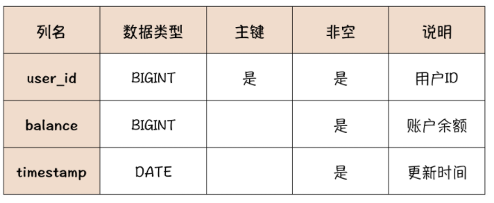

---
tags:
  - 冗余数据的一致性问题
  - 账户流水
  - 账户流水数据模型
---

# 事务：账户余额总是对不上账，怎么办？

今天这节课我们来说一下电商的 **账户系统**。

账户系统  **负责记录和管理用户账户的余额**，这个余额就是每个用户临时存在电商的钱，来源可能是用户充值或者退货退款等多种途径。

账户系统的用途也非常广泛，不仅仅是电商，各种互联网内容提供商、网络游戏服务商，电信运营商等等，都需要账户系统来管理用户账户的余额，或者是虚拟货币。包括银行的核心系统，也同样包含一个账户系统。

从业务需求角度来分析，一个最小化的账户系统，它的数据模型可以用下面这张表来表示：



这个表包括用户 ID、账户余额和更新时间三个字段。每次交易的时候，根据用户 ID 去更新这个账户的余额就可以了。

## 为什么总是对不上账？

每个账户系统都不是孤立存在的，**至少要和财务、订单、交易这些系统有着密切的关联**。理想情况下，账户系统内的数据应该是自洽的。 **所有用户的账户余额加起来，应该等于这个电商公司在银行专用账户的总余额**。账户系统的数据也应该和其他系统的数据能对的上。比如说，每个用户的余额应该能和交易系统中充值记录，以及订单系统中的订单对的上。

不过，由于业务和系统的复杂性，现实情况却是，很少有账户系统能够做到一点不差的对上每一笔账。所以，稍微大型一点儿的系统，都会有一个专门的对账系统，来核对、矫正账户系统和其他系统之间的数据差异。

**对不上账的原因非常多，比如业务变化、人为修改了数据、系统之间数据交换失败等等**。那作为系统的设计者，我们只关注 「**如何避免由于技术原因导致的对不上账**」就可以了，有哪些是因为技术原因导致的呢？比如说：网络请求错误，服务器宕机、系统 Bug 等。

对不上账 「是通俗的说法」，它的本质问题是，**冗余数据的一致性问题**。

这里面的冗余数据并 **不是多余或者重复的数据**，而是多份含有相同信息的数据。比如，我们完全可以通过用户的每一笔充值交易数据、消费的订单数据，来计算出这个用户当前的账户余额是多少。也就是说，账户余额数据和这些账户相关的交易记录，都含有 「账户余额」 这个信息，那它们之间就互为冗余数据。

**在设计系统的存储时，原则上不应该存储冗余数据**，一是浪费存储空间，二是让这些冗余数据保持一致是一件非常麻烦的事儿。但有些场景下存储冗余数据是必要的，比如用户账户的余额这个数据。

这个数据在交易过程中会被  **非常频繁地用到**，总不能每次交易之前，先通过所有历史交易记录计算一下当前账户的余额，**这样做速度太慢了，性能满足不了交易的需求**。所以账户系统保存了每个用户的账户余额，这实际上是一种用 **存储空间换计算时间** 的设计。

如果说只是满足功能需求，账户系统只记录余额，每次交易的时候更新账户余额就够了。但是这样做有一个问题，**如果账户余额被篡改，是没有办法追查的**，所以在记录余额的同时，还需要记录每一笔交易记录，也就是账户的流水。**流水的数据模型至少需要包含：流水 ID、交易金额、交易时间戳以及交易双方的系统、账户、交易单号等信息**。

虽然说，流水和余额也是互为冗余数据，但是记录流水，可以有效地修正由于系统 Bug 或者人为篡改导致的账户余额错误的问题，也便于账户系统与其他外部系统进行对账，所以 **账户系统记录流水是非常必要的**。

在设计账户流水时，有几个重要的原则必须遵守，最好是用技术手段加以限制：

1. **流水记录只能新增**

   一旦记录成功不允许修改和删除。即使是由于正当原因需要取消一笔已经完成的交易，也不应该去删除交易流水。正确的做法是再记录一笔 「 **取消交易** 」 的流水。

2. **流水号必须是递增的**，我们需要用流水号来 **确定交易的先后顺序**。

在对账的时候，一旦出现了流水和余额不一致，并且无法通过业务手段来确定到底是哪儿记错了的情况，一般的处理原则是以交易流水为准来修正余额数据，这样才能保证后续的交易能「对上账」。

那从技术上，如何保证账户系统中流水和余额数据一致呢？

## 使用数据库事务来保证数据一致性

在设计对外提供的服务接口时，不能提供  **单独更新余额或者流水的功能**，只提供交易功能。我们 **需要在实现交易功能的时候，同时记录流水并修改余额**，并且要尽可能保证，在任何情况下，记录流水和修改余额这两个操作，要么都成功，要么都失败。不能有任何一笔交易出现，记录了流水但余额没更新，或者更新了余额但是没记录流水。

这个事儿说起来挺简单，但实际上是非常难实现的。毕竟应用程序只能先后来执行两个操作，执行过程中，可能会发生网络错误、系统宕机等各种异常的情况，所以对于应用程序来说，很难保证这两个操作都成功或者都失败。

数据库提供了事务机制来解决这个问题，实际上事务这个特性最初就是被设计用来解决交易问题的，在英文中，事务和交易就是同一个单词：Transaction。

我们先看一下如何来使用 MySQL 的事务，实现一笔交易。比如说：

1. 在事务中执行一个充值 100 元的交易，先记录一条交易流水，流水号是 888，

2. 然后把账户余额从 100 元更新到 200 元。

对应的 SQL 是这样的：

```sql
mysql> begin;  -- 开始事务
Query OK, 0 rows affected (0.00 sec)

mysql> insert into account_log ...;  -- 写入交易流水
Query OK, 1 rows affected (0.01 sec)

mysql> update account_balance ...;  -- 更新账户余额
Query OK, 1 rows affected (0.00 sec)

mysql> commit; # 提交事务
Query OK, 0 rows affected (0.01 sec)
```

使用事务的时候，只需要在之前执行 begin，标记开始一个事务，然后正常执行多条 SQL 语句，在事务里面的不仅可以执行更新数据的 SQL，查询语句也是可以的，最后执行 commit，提交事务就可以了。

我们来看一下，事务可以给我们提供什么样的保证？

- **原子性（Atomic）**

  首先，它可以保证，记录流水和更新余额这两个操作，**要么都成功，要么都失败** ，即使是在数据库宕机、应用程序退出等等这些异常情况下，也不会出现，只更新了一个表而另一个表没更新的情况。这是事务的 **原子性（Atomic）**。

- **一致性 (Consistency)**

  事务还可以保证，数据库中的数据总是从一个一致性状态（888 流水不存在，余额是 100 元）转换到另外一个一致性状态（888 流水存在，余额是 200 元）。对于其他事务来说，不存在任何中间状态（888 流水存在，但余额是 100 元）。

  其他事务，在任何一个时刻，如果它读到的流水中没有 888 这条流水记录，它读出来的余额一定是 100 元，这是交易前的状态。如果它能读到 888 这条流水记录，它读出来的余额一定是 200 元，这是交易之后的状态。也就是说，**事务保证我们读到的数据（交易和流水）总是一致的，这是事务的**  **一致性 (Consistency)**。

- **隔离性 (Isolation)**

  实际上，这个事务的执行过程无论多快，它都是需要时间的，那修改流水表和余额表对应的数据，也会有先后。那一定存在一个时刻，流水更新了，但是余额还没更新，也就是说每个事务的中间状态是事实存在的

  数据库为了实现一致性，必须保证每个事务的执行过程中，**中间状态对其他事务是不可见的**。比如说我们在事务 A 中，写入了 888 这条流水，但是还没有提交事务，那在其他事务中，都不应该读到 888 这条流水记录。这是事务的**隔离性 (Isolation)**。

- **持久性 (Durability)**

  最后，只要事务提交成功，数据一定会被持久化到磁盘中，后续即使发生数据库宕机，也不会改变事务的结果。这是事务的 **持久性 (Durability)**。

你会发现，我上面讲的就是事务的 **ACID** 四个基本特性。你需要注意的是，这四个特性之间是紧密关联在一起的，不用去纠结每一个特性的严格定义，**更重要的是理解事务的行为**，也就是我们的系统在使用事务的时候，各种情况下，事务对你的数据会产生什么影响，这是使用事务的关键。

## 理解事务的隔离级别

有了数据库的事务机制，只要确保每一笔交易都在事务中执行，我们的账户系统就很容易保证流水和余额数据的一致性。但是，ACID 是一个非常严格的定义，或者说是理想的情况。如果要完全满足 ACID，一个数据库的所有事务和 SQL 都只能串行执行，这个性能肯定是不能满足一般系统的要求的。

对账户系统和其他大多数交易系统来说，**事务的原子性和持久性是必须要保证的**，否则就失去了使用事务的意义，**而一致性和隔离性其实可以做适当牺牲**，来换取性能。所以，MySQL 提供了四种隔离级别，具体来看一下这个表：


这个表里面自上到下，一共有四种隔离级别：RU、RC、RR 和 SERIALIZABLE，这四种级别的隔离性越来越严格，性能也越来越差，在 MySQL 中默认的隔离级别是 RR，可重复读。

几乎所有讲 MySQL 的事务隔离级别的文章里面，都有这个表，我们也不能免俗，因为这个表太经典了。很多同学看这个表的时候，面对这么多概念都有点儿晕，确实不太好理解。我来跟你说一下怎么来把这四种隔离级别搞清楚，重点在哪里。

**先说两种不常用的：**

- 第一种 RU 级别，实际上就是完全不隔离。每个进行中事务的中间状态，对其他事务都是可见的，所以有可能会出现「脏读」。我们上一个小节充值的例子中，读到了 888 这条流水，但余额还是转账之前的 100 元，这种情况就是脏读。这种级别虽然性能好，但是存在脏读的可能，对应用程序来说比较难处理，所以基本不用。

- 第四种「序列」级别，具备完美的「隔离性」和「一致性」，性能最差，也很少会用到。

常用的隔离级别其实就是 RC 和 RR 两种，其中 MySQL 默认的隔离级别是 RR。这两种隔离级别都可以避免脏读，能够保证在其他事务中是不会读到未提交事务的数据，或者通俗地说，**只要你的事务没有提交，那这个事务对数据做出的更新，对其他会话是不可见的，它们读到的还是你这个事务更新之前的数据**。

RC 和 RR 唯一的区别在于 **是否可重复读**，这个概念也有点儿绕口，但其实也很简单。

**在一个事务执行过程中，它能不能读到其他已提交事务对数据的更新，如果能读到数据变化，就是「不可重复读」，否则就是「可重复读」**。

我们举个例子来说明，比如，我们把事务的隔离级别设为 RC。会话 A 开启了一个事务，读到 ID 为 0 的账户，当前账户余额是 100 元。

```sql
mysql> -- 会话 A
mysql> -- 确认当前设置的隔离级别是RC
mysql> SELECT @@global.transaction_isolation, @@transaction_isolation;
+--------------------------------+-------------------------+
| @@global.transaction_isolation | @@transaction_isolation |
+--------------------------------+-------------------------+
| READ-COMMITTED                 | READ-COMMITTED          |
+--------------------------------+-------------------------+
1 row in set (0.00 sec)
mysql> begin;
Query OK, 0 rows affected (0.00 sec)
mysql> select log_id, amount, timestamp  from account_log  order by log_id;
+--------+--------+---------------------+
| log_id | amount | timestamp           |
+--------+--------+---------------------+
|      3 |    100 | 2020-02-07 09:40:37 |
+--------+--------+---------------------+
1 row in set (0.00 sec)
mysql> select * from account_balance;  -- 账户余额是100元；
+---------+---------+---------------------+--------+
| user_id | balance | timestamp           | log_id |
+---------+---------+---------------------+--------+
|       0 |     100 | 2020-02-07 09:47:39 |      3 |
+---------+---------+---------------------+--------+
1 row in set (0.00 sec)
```

这时候另外一个会话 B，对这个账户完成了一笔转账交易，并且提交了事务。把账户余额更新成了 200 元。

```sql

mysql> -- 会话 B
mysql> begin;
Query OK, 0 rows affected (0.00 sec)
mysql> select log_id, amount, timestamp  from account_log  order by log_id;
+--------+--------+---------------------+
| log_id | amount | timestamp           |
+--------+--------+---------------------+
|      3 |    100 | 2020-02-07 09:40:37 |
+--------+--------+---------------------+
1 row in set (0.00 sec)
mysql> -- 写入流水
mysql> insert into account_log values (NULL, 100, NOW(), 1, 1001, NULL, 0, NULL, 0, 0);
Query OK, 1 row affected (0.00 sec)
mysql> -- 更新余额
mysql> update account_balance
    -> set balance = balance + 100, log_id = LAST_INSERT_ID(), timestamp = NOW()
    -> where user_id = 0 and log_id = 3;
Query OK, 1 row affected (0.00 sec)
Rows matched: 1  Changed: 1  Warnings: 0
mysql> -- 当前账户有2条流水记录
mysql> select log_id, amount, timestamp  from account_log  order by log_id;
+--------+--------+---------------------+
| log_id | amount | timestamp           |
+--------+--------+---------------------+
|      3 |    100 | 2020-02-07 09:40:37 |
|      4 |    100 | 2020-02-07 10:06:15 |
+--------+--------+---------------------+
2 rows in set (0.00 sec)
mysql> -- 当前账户余额是200元；
mysql> select * from account_balance;
+---------+---------+---------------------+--------+
| user_id | balance | timestamp           | log_id |
+---------+---------+---------------------+--------+
|       0 |     200 | 2020-02-07 10:06:16 |      4 |
+---------+---------+---------------------+--------+
1 row in set (0.00 sec)
mysql> commit;
Query OK, 0 rows affected (0.00 sec)
```

注意，这个时候会话 A 之前开启的事务是一直未关闭的。我们再来会话 A 中看一下账户的余额，你觉得应该是多少？

我们来看一下实际的结果。

```sql
mysql> -- 会话 A
mysql> -- 当前账户有2条流水记录
mysql> select log_id, amount, timestamp  from account_log  order by log_id;
+--------+--------+---------------------+
| log_id | amount | timestamp           |
+--------+--------+---------------------+
|      3 |    100 | 2020-02-07 09:40:37 |
|      4 |    100 | 2020-02-07 10:06:15 |
+--------+--------+---------------------+
2 rows in set (0.00 sec)
mysql> -- 当前账户余额是200元；
mysql> select * from account_balance;
+---------+---------+---------------------+--------+
| user_id | balance | timestamp           | log_id |
+---------+---------+---------------------+--------+
|       0 |     200 | 2020-02-07 10:06:16 |      4 |
+---------+---------+---------------------+--------+
1 row in set (0.00 sec)
mysql> commit;
Query OK, 0 rows affected (0.00 sec)
```

可以看到，当我们把隔离级别设置为 RC 时，会话 A 第二次读到的账户余额是 200 元，也就是会话 B 更新后的数据。对于会话 A 来说，**在同一个事务内两次读取同一条数据，读到的结果可能会不一样，这就是「不可重复读」**。

如果把隔离级别设置为 RR，会话 A 第二次读到的账户余额仍然是 100 元，交易流水也只有一条记录。**在 RR 隔离级别下，在一个事务进行过程中，对于同一条数据，每次读到的结果总是相同的，无论其他会话是否已经更新了这条数据**，**这就是「可重复读」。**

理解了 RC 和 RR 这两种隔离级别的区别，就足够应对绝大部分业务场景了。

最后，我来简单说一下 **「幻读」**。在实际业务中，很少能遇到幻读，即使遇到，也基本不会影响到数据准确性，所以你简单了解一下即可。在 RR 隔离级别下，我们开启一个事务，之后直到这个事务结束，在这个事务内其他事务对数据的更新是不可见的，这个我们刚刚讲过。

比如我们在会话 A 中开启一个事务，准备插入一条 ID 为 1000 的流水记录。查询一下当前流水，不存在 ID 为 1000 的记录，可以安全地插入数据。

```sql
mysql> -- 会话 A
mysql> select log_id from account_log where log_id = 1000;
Empty set (0.00 sec)
```

这时候，另外一个会话抢先插入了这条 ID 为 1000 的流水记录。

```sql
mysql> -- 会话 B
mysql> begin;
Query OK, 0 rows affected (0.00 sec)
mysql> insert into account_log values
    -> (1000, 100, NOW(), 1, 1001, NULL, 0, NULL, 0, 0);
Query OK, 1 row affected (0.00 sec)
mysql> commit;
Query OK, 0 rows affected (0.00 sec)
```

然后会话 A 再执行相同的插入语句时，就会报主键冲突错误，但是由于事务的隔离性，它执行查询的时候，却查不到这条 ID 为 1000 的流水，就像出现了「幻觉」一样，这就是幻读。

```sql
mysql> -- 会话 A
mysql> insert into account_log values
    -> (1000, 100, NOW(), 1, 1001, NULL, 0, NULL, 0, 0);
ERROR 1062 (23000): Duplicate entry '1000' for key 'account_log.PRIMARY'
mysql> select log_id from account_log where log_id = 1000;
Empty set (0.00 sec)
```

理解了这几种隔离级别，最后我们 **给出一种兼顾并发、性能和数据一致性的交易实现 **。这个实现在隔离级别为 RC 和 RR 时，都是安全的。

1. 我们给账户余额表增加一个 log_id 属性，记录最后一笔交易的流水号。
2. 首先开启事务，查询并记录当前账户的余额和最后一笔交易的流水号。然后写入流水记录。
3. 再更新账户余额，需要在更新语句的 WHERE 条件中限定，只有流水号等于之前查询出的流水号时才更新。
4. 然后检查更新余额的返回值，如果更新成功就提交事务，否则回滚事务。

需要特别注意的一点是，更新账户余额后，不能只检查更新语句是不是执行成功了，还需要检查返回值中变更的行数是不是等于 1。因为即使流水号不相等，余额没有更新，这条更新语句的执行结果仍然是成功的，只是更新了 0 条记录。

下面是整个交易的 SQL，供你参考：

```sql
mysql> begin;
Query OK, 0 rows affected (0.00 sec)
mysql>  -- 查询当前账户的余额和最后一笔交易的流水号。
mysql> select balance, log_id from account_balance where user_id = 0;
+---------+--------+
| balance | log_id |
+---------+--------+
|     100 |      3 |
+---------+--------+
1 row in set (0.00 sec)
mysql>  -- 插入流水记录。
mysql> insert into account_log values
    -> (NULL, 100, NOW(), 1, 1001, NULL, 0, NULL, 0, 0);
Query OK, 1 row affected (0.01 sec)
mysql>  -- 更新余额，注意where条件中，限定了只有流水号等于之前查询出的流水号3时才更新。
mysql> update account_balance
    -> set balance = balance + 100, log_id = LAST_INSERT_ID(), timestamp = NOW()
    -> where user_id = 0 and log_id = 3;
Query OK, 1 row affected (0.00 sec)
Rows matched: 1  Changed: 1  Warnings: 0
mysql>  -- 这里需要检查更新结果，只有更新余额成功（Changed: 1）才提交事务，否则回滚事务。
mysql> commit;
Query OK, 0 rows affected (0.01 sec)
```

最后，我给出流水和余额两个表的 DDL，你自己执行例子的时候可以使用。

```sql
CREATE TABLE `account_log` (
  `log_id` int NOT NULL AUTO_INCREMENT COMMENT '流水号',
  `amount` int NOT NULL COMMENT '交易金额',
  `timestamp` datetime NOT NULL COMMENT '时间戳',
  `from_system` int NOT NULL COMMENT '转出系统编码',
  `from_system_transaction_number` int DEFAULT NULL COMMENT '转出系统的交易号',
  `from_account` int DEFAULT NULL COMMENT '转出账户',
  `to_system` int NOT NULL COMMENT '转入系统编码',
  `to_system_transaction_number` int DEFAULT NULL COMMENT '转入系统的交易号',
  `to_account` int DEFAULT NULL COMMENT '转入账户',
  `transaction_type` int NOT NULL COMMENT '交易类型编码',
  PRIMARY KEY (`log_id`)
);
CREATE TABLE `account_balance` (
  `user_id` int NOT NULL COMMENT '用户ID',
  `balance` int NOT NULL COMMENT '余额',
  `timestamp` datetime NOT NULL COMMENT '时间戳',
  `log_id` int NOT NULL COMMENT '最后一笔交易的流水号',
  PRIMARY KEY (`user_id`)
);
```

## 小结

账户系统用于记录每个用户的余额，为了保证数据的可追溯性，还需要记录账户流水。流水记录只能新增，任何情况下都不允许修改和删除，每次交易的时候需要把流水和余额放在同一个事务中一起更新。

事务具备原子性、一致性、隔离性和持久性四种基本特性，也就是 ACID，它可以保证在一个事务中执行的数据更新，要么都成功，要么都失败。并且在事务执行过程中，中间状态的数据对其他事务是不可见的。

ACID 是一种理想情况，特别是要完美地实现 CI，会导致数据库性能严重下降，所以 MySQL 提供的四种可选的隔离级别，牺牲一定的隔离性和一致性，用于换取高性能。这四种隔离级别中，只有 RC 和 RR 这两种隔离级别是常用的，它们的唯一区别是在进行的事务中，其他事务对数据的更新是否可见。

## 思考题

课后希望你能动手执行一下我们今天这节课中给出的例子，看一下多个事务并发更新同一个账户时，RC 和 RR 两种不同的隔离级别，在行为上有什么不同？

答：

- RC：不可重复读

  在同一个事务内两次读取同一条数据，读到的结果可能会不一样

- RR：可重复读

  在同一个事务内两次读取同一条数据，读到的结果是一样的
