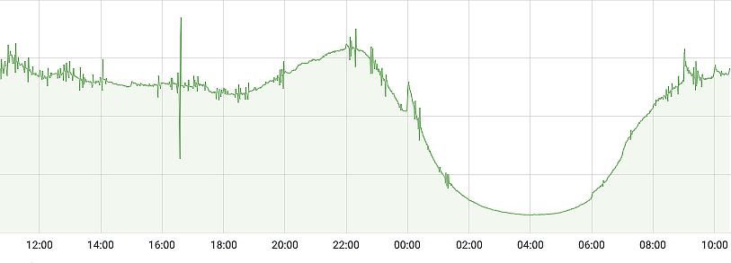
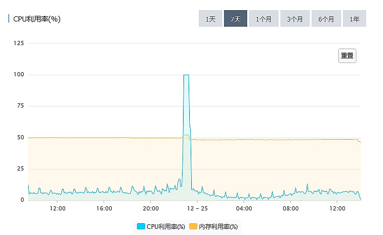
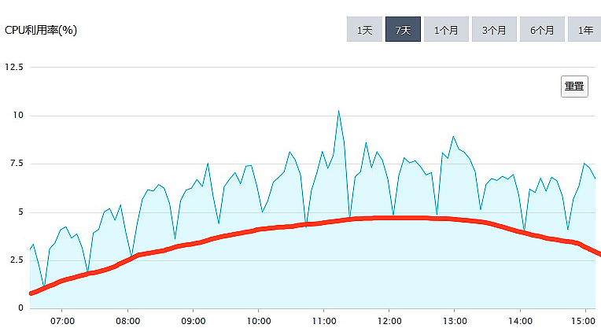
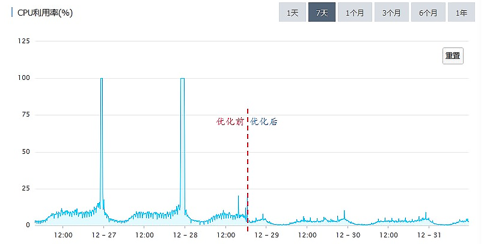

---
tags:
  - 慢 SQL
---


# 一个几乎每个系统必踩的坑儿：访问数据库超时

每一个创业公司，它的系统随着公司的发展一起成长的过程中，都难免会发生一些故障或者是事故，严重的会影响业务。搞技术的同学管这个叫：坑儿，分析解决问题的过程，称为：填坑儿。而访问数据库超时这个坑儿，是我见过的被踩的次数最多的一个坑儿，并且这个坑儿还在被不停地踩来踩去。

今天这节课，我和你 **分享一个典型的数据库超时案例**。我也希望你通过和我一起分析这个案例，一是，吸取其中的经验教训，日后不要再踩类似的坑儿；二是，**如果遇到类似的问题，你能掌握分析方法，快速地解决问题**。**最重要的是，学习存储系统架构设计思想，在架构层面限制故障对系统的破坏程度**。

## 事故排查过程

我们一起来看一下这个案例。

每一个做电商的公司都梦想着做社交引流，每一个做社交的公司都梦想着做电商将流量变现。我的一个朋友他们公司做社交电商，当年很有前途的一个创业方向，当时也是有很多创业公司在做。

有一天他找到我，让我帮他分析一下他们系统的问题。这个系统  **从圣诞节那天晚上开始，每天晚上固定十点多到十一点多这个时段，大概瘫痪一个小时左右的时间，过了这个时段系统自动就恢复了**。系统瘫痪时的现象就是，网页和 App 都打不开，请求超时。

这个系统的架构是一个非常典型的小型创业公司的微服务架构。系统的架构如下图：


整个系统托管在公有云上，Nginx 作为前置网关承接前端所有请求，后端按照业务，划分了若干个微服务分别部署。数据保存在 MySQL 中，部分数据用 Memcached 做了前置缓存。**数据并没有按照微服务最佳实践的要求，做严格的划分和隔离，而是为了方便，存放在了一起**。

这样的存储设计，对于一个业务变化极快的创业公司来说，是合理的。因为它的每个微服务，随时都在随着业务改变，如果做了严格的数据隔离，反而不利于应对需求变化。

听了我朋友对问题的描述，我的一反应是，每天晚上十点到十一点这个时段，是绝大多数内容类 App 的访问量高峰，因为这个时候大家都躺在床上玩儿手机。**初步判断，这个故障是和访问量有关系的**，看下面这个系统每天的访问量的图，可以印证这个判断。



**基于这个判断，排查问题的重点应该放在那些服务于用户访问的功能上。**比如说，首页、商品列表页、内容推荐这些功能。

在访问量峰值的时候，请求全部超时，随着访问量减少，**系统能自动恢复，基本可以排除后台服务被大量请求打死的可能性**，因为如果进程被打死了，一般是不会自动恢复的。排查问题的重点应该放在 MySQL 上。观察下面这个  **MySQL 的 CPU 利用率图**，发现问题：



从监控图上可以看出来，**故障时段 MySQL 的 CPU 利用率一直是 100%**。这种情况下，MySQL 基本上处于一个不可用的状态，执行所有的 SQL 都会超时。

MySQL 这种 CPU 利用率高的现象，绝大多数情况都是由慢 SQL 导致的，所以我们 **优先排查慢 SQL**。MySQL 和各大云厂商提供的 RDS 都能提供慢 SQL 日志，分析慢 SQL 日志，是查找类似问题原因最有效的方法。

一般来说，慢 SQL 的日志中，会有这样一些信息：SQL、执行次数、执行时长。通过分析慢 SQL 找问题，并没有什么标准的方法，主要还是依靠经验。

首先，你需要知道的一点是，**当数据库非常忙的时候，它执行任何一个 SQL 都很慢**。所以，并不是说，慢 SQL 日志中记录的这些慢 SQL 都是有问题的 SQL。大部分情况下，导致问题的 SQL 只是其中的一条或者几条。不能简单地依据执行次数和执行时长进行判断，但是，**单次执行时间特别长的 SQL，仍然是应该重点排查的对象**。

通过分析这个系统的慢 SQL 日志，首先找到了一个特别慢的 SQL。

这个 SQL 支撑的功能是一个红人排行榜，这个排行榜列出粉丝数最多的 TOP10 红人。

```sql

select fo.FollowId as vid, count(fo.id) as vcounts
from follow fo, user_info ui
where fo.userid = ui.userid
and fo.CreateTime between
str_to_date(?, '%Y-%m-%d %H:%i:%s')
and str_to_date(?, '%Y-%m-%d %H:%i:%s')
and fo.IsDel = 0
and ui.UserState = 0
group by vid
order by vcounts desc
limit 0,10

-- 上述 sql 有实际范围查询，有分组和排序，原本来说执行速度就不会特别快了
```

**这种排行榜的查询，一定要做缓存**。在这个案例中，排行榜是新上线的功能，可能忘记做缓存了，通过增加缓存可以有效地解决问题。

给排行榜增加了缓存后，新版本立即上线。本以为问题就此解决了，结果当天晚上，系统仍然是一样的现象，晚高峰各种请求超时，页面打不开。

再次分析慢 SQL 日志，排行榜的慢 SQL 不见了，说明缓存生效了。日志中的其他慢 SQL，查询次数和查询时长分布的都很均匀，也没有看出明显写的有问题的 SQL。

回过头来再看 MySQL CPU 利用率这个图。


把这个图放大后，发现一些规律：

1. CPU 利用率，以 20 分钟为周期，非常规律的波动；

2. 总体的趋势与访问量正相关。

那我们是不是可以猜测一下，对 MySQL 的 CPU 利用率的 「贡献」来自两部分：

1. 红线以下的部分，是正常处理日常访问请求的部分，它和访问量是正相关的。
2. 红线以上的部分，来自某一个以 20 分钟为周期的定时任务，和访问量关系不大。



排查整个系统，没有发现有以 20 分钟为周期的定时任务，继续扩大排查范围，排查周期小于 20 分钟的定时任务，最终定位了问题。

App 的首页聚合了非常多的内容，像精选商品、标题图、排行榜、编辑推荐等等。这些内容包含了很多的数据库查询。当初设计的时候，给首页做了一个整体的缓存，缓存的过期时间是 10 分钟。但是需求不断变化，首页需要查询的内容越来越多，导致查询首页的全部内容越来越慢。

通过检查日志发现，刷新一次缓存的时间竟然要 15 分钟。缓存是每隔 10 分钟整点刷一次，因为 10 分钟内刷不完，所以下次刷新就推迟到了 20 分钟之后，这就导致了上面这个图中，红线以上每 20 分钟的规律波形。

由于缓存刷新慢，也会很多请求无法命中缓存，请求直接穿透缓存打到了数据库上面，这部分请求给上图红线以下的部分，做了很多「贡献」。

找到了问题原因，做针对性的优化，问题很快就解决了。新版本上线之后，再没有出现过「午夜宕机」。



对比优化前后 MySQL 的 CPU 利用率，可以明显地看出优化效果。

## 如何避免悲剧重演

到这里问题的原因找到了，问题也圆满解决了。单从这个案例来看，问题的原因在于，开发人员犯了错误，编写的 SQL 没有考虑数据量和执行时间，缓存的使用也不合理。最终导致在忙时，大量的查询打到 MySQL 上，MySQL 繁忙无法提供服务。

作为系统的开发人员，对于这次事故，我们可以总结两点经验：

1. 在编写 SQL 的时候，一定要小心谨慎地仔细评估。先问自己几个问题：

   1. 你的 SQL 涉及到的表，它的数据规模是多少？
   2. 你的 SQL 可能会遍历的数据量是多少？
   3. 尽量地避免写出慢 SQL。

2. 能不能利用缓存减少数据库查询次数？

   在使用缓存的时候，还需要特别注意的就是缓存命中率，要尽量避免请求命中不了缓存，穿透到数据库上。

以上两点，是开发人员需要总结的问题。不过你想没想过，谁能保证，整个团队的所有开发人员以后不再犯错误？保证不了吧？那是不是这种的悲剧就无法避免了呢？

其实，还是有办法的。不然，那些大厂，几万开发人员，每天会上线无数的 Bug，系统还不得天天宕机？而实际情况是，大厂的系统都是比较稳定的，基本上不会出现全站无法访问这种情况。

靠的是什么？靠的是架构。

优秀的系统架构，可以在一定程度上，减轻故障对系统的影响。针对这次事故，我给这个系统在架构层面，提了两个改进的建议。

1. 第一个建议是，**上线一个定时监控和杀掉慢 SQL 的脚本**。

   这个脚本每分钟执行一次，检测上一分钟内，有没有执行时间超过一分钟（这个阈值可以根据实际情况调整）的慢 SQL，如果发现，直接杀掉这个会话。

   这样可以有效地避免一个慢 SQL 拖垮整个数据库的悲剧。即使出现慢 SQL，数据库也可以在至多 1 分钟内自动恢复，避免数据库长时间不可用。代价是，可能会有些功能，之前运行是正常的，这个脚本上线后，就会出现问题。但是，这个代价还是值得付出的，并且，可以反过来督促开发人员更加小心，避免写出慢 SQL。

2. 第二个建议是，做一个简单的静态页面的首页作为降级方案

   只要包含商品搜索栏、大的品类和其他顶级功能模块入口的链接就可以了。在 Nginx 上做一个策略，如果请求首页数据超时的时候，直接返回这个静态的首页作为替代。这样后续即使首页再出现任何的故障，也可以暂时降级，用静态首页替代。至少不会影响到用户使用其他功能。

这两个改进建议都是非常容易实施的，不需要对系统做很大的改造，并且效果也立竿见影。

当然，这个系统的存储架构还有很多可以改进的地方，比如说对数据做适当的隔离，改进缓存置换策略，做数据库主从分离，把非业务请求的数据库查询迁移到单独的从库上等等，只是这些改进都需要对系统做比较大的改动升级，需要从长计议，在系统后续的迭代过程中逐步地去实施。

## 小结

这节课，我和你一起分析了一个由于慢 SQL 导致的全站故障的案例。在「破案」的过程中，有一些很有用的经验，这些经验对于后续你自己「破案」时会非常有用。比如说：

1. 根据故障时段在系统忙时，推断出故障是跟支持用户访问的功能有关。

2. 根据系统能在流量峰值过后自动恢复这一现象，排除后台服务被大量请求打死的可能性。

3. 根据 CPU 利用率曲线的规律变化，推断出可能和定时任务有关。

在故障复盘阶段，除了对故障问题本身做有针对性的预防和改进以外，更重要的是，在系统架构层面进行改进，让整个系统更加健壮，不至于因为某一个小的失误，就导致全站无法访问。

我给系统提出的第一个自动杀慢 SQL 的建议，它的思想是：系统的关键部分要有自我保护机制，避免外部的错误影响到系统的关键部分。第二个首页降级的建议，它的思想是：当关键系统出现故障的时候，要有临时的降级方案，尽量减少故障带来的影响。

这些架构上的改进，虽然并不能避免故障，但是可以很大程度上减小故障的影响范围，减轻故障带来的损失，希望你能仔细体会，活学活用。

## 思考题

以你个人的标准，什么样的 SQL 算是慢 SQL？如何才能避免写出慢 SQL？
