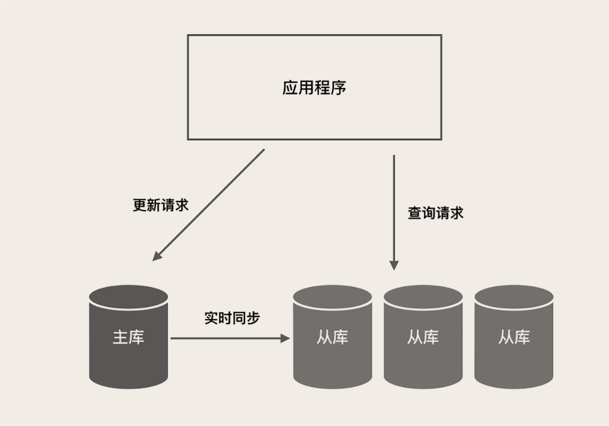

---
tags:
  - HAProxy
  - Keepalived
  - Atlas
  - MaxScale
  - 高可用负载均衡方案
---

# MySQL 如何应对高并发（二）：读写分离

使用 Redis 作为 MySQL 的前置缓存，可以帮助 MySQL 挡住绝大部分的查询请求。这种方法对于像电商中的商品系统、搜索系统这类 **与用户关联不大的系统**，效果特别的好。因为在这些系统中，每个人看到的内容都是一样的，也就是说，对后端服务来说，每个人的查询请求和返回的数据都是一样的。**这种情况下，Redis 缓存的命中率非常高**，近乎于全部的请求都可以命中缓存，相对的，几乎没有多少请求能穿透到 MySQL。

但是，**和用户相关的系统，使用缓存的效果就没那么好了**，比如说，订单系统、账户系统、购物车系统等等。在这些系统里面，每个用户需要查询的信息都是和用户相关的，即使是同一个功能界面，那每个人看到的数据都是不一样的。

比如说，「我的订单」这个功能，用户在这里看到的都是自己的订单数据，我打开我的订单缓存的数据，是不能给你打开你的订单来使用的，因为我们两个人的订单是不一样的。这种情况下，缓存的命中率就没有那么高，还是有相当一部分查询请求因为命中不了缓存，打到 MySQL 上。

那随着系统用户数量越来越多，打到 MySQL 上的读写请求也越来越多，当单台 MySQL 支撑不了这么多的并发请求时，我们该怎么办？

## 读写分离是提升 MySQL 并发的首选方案

当单台 MySQL 无法满足要求的时候，只能用多个 MySQL 实例来承担大量的读写请求。MySQL 和大部分常用的关系型数据库一样，都是典型的单机数据库，不支持分布式部署。用一个单机数据库的多个实例来组成一个集群，提供分布式数据库服务，是一个非常困难的事儿

在部署集群的时候，需要做很多额外的工作，而且 **很难做到对应用透明**，那你的应用程序也要为此做较大的架构调整。所以，**除非系统规模真的大到只有这一条路可以走，不建议你对数据进行分片**，自行构建 MySQL 集群，代价非常大。

一个 **简单而且非常有效的方案** 是，我们 **不对数据分片，而是使用多个具有相同数据的 MySQL 实例来分担大量的查询请求**，这种方法通常称为 **读写分离**。读写分离之所以能够解决问题，它实际上是基于一个对我们非常有利的客观情况，那就是，很多系统，特别是面对公众用户的互联网系统，**对数据的读写比例是严重不均衡的**。读写比一般都在几十左右，平均每发生几十次查询请求，才有一次更新请求。换句话来说，数据库需要应对的绝大部分请求都是只读查询请求。

一个分布式的存储系统，想要做分  **布式写是非常非常困难**  的，因为 **很难解决好数据一致性的问题**。但实现分布式读就相对简单很多，我只需要增加一些只读的实例，只要能够把数据实时的同步到这些只读实例上，保证这这些只读实例上的数据都随时一样，这些只读的实例就可以分担大量的查询请求。

读写分离的另外一个好处是，它实施起来相对比较简单。把使用单机 MySQL 的系统升级为读写分离的多实例架构非常容易，一般不需要修改系统的业务逻辑，**只需要简单修改 DAO 代码，把对数据库的读写请求分开**，请求不同的 MySQL 实例就可以了。

通过读写分离这样一个简单的存储架构升级，就可以让数据库支持的 **并发数量增加几倍到十几倍**。所以，当你的系统用户数越来越多，读写分离应该是你首先要考虑的扩容方案。

下图是一个典型的读写分离架构（一主多从）：

主库负责执行应用程序发来的所有数据更新请求，然后异步将数据变更实时同步到所有的从库中去，这样，主库和所有从库中的数据是完全一样的。多个从库共同分担应用的查询请求。

然后我们简单说一下，如何来实施 MySQL 的读写分离方案。你需要做两件事儿：

1. 部署一主多从多个 MySQL 实例，并让它们之间保持数据实时同步。

2. 分离应用程序对数据库的读写请求，分别发送给从库和主库。

**MySQL 自带主从同步的功能**，经过简单的配置就可以实现一个主库和几个从库之间的数据同步，部署和配置的方法，你看 MySQL 的官方文档照着做就可以。分离应用程序的读写请求方法有下面这三种：

1. 纯手工方式

   修改应用程序的 DAO 层代码，定义读写两个数据源，指定每一个数据库请求的数据源。

2. **组件方式** (推荐)

   也可以使用像 Sharding-JDBC 这种集成在应用中的第三方组件来实现，这些组件集成在你的应用程序内，代理应用程序的所有数据库请求，**自动把请求路由到对应数据库实例上**。

3. 代理方式

   在应用程序和数据库实例之间部署一组数据库代理实例，比如说 Atlas 或者 MaxScale。对应用程序来说，数据库代理把自己伪装成一个单节点的 MySQL 实例，应用程序的所有数据库请求被发送给代理，代理分离读写请求，然后转发给对应的数据库实例。

这三种方式，我最推荐的是第二种，使用读写分离组件。这种方式代码侵入非常少，并且兼顾了性能和稳定性。如果你的应用程序是一个逻辑非常简单的微服务，简单到只有几个 SQL，或者是，你的应用程序使用的编程语言没有合适的读写分离组件，那你也可以考虑使用第一种纯手工的方式来实现读写分离。

一般情况下，不推荐使用第三种代理的方式，原因是，使用代理加长了你的系统运行时数据库请求的调用链路，有一定的性能损失，并且代理服务本身也可能出现故障和性能瓶颈等问题。但是，代理方式有一个好处是，它对应用程序是完全透明的。**所以，只有在不方便修改应用程序代码这一种情况下，你才需要采用代理方式。**

另外，如果你配置了多个从库，推荐你使用 `HAProxy+Keepalived` 这对儿经典的组合，来给所有的从节点做一个**高可用负载均衡方案**，既可以避免某个从节点宕机导致业务可用率降低，也方便你后续随时扩容从库的实例数量。因为 HAProxy 可以做 L4 层代理，也就是说它转发的是 TCP 请求，所以用 `HAProxy+Keepalived` 代理 MySQL 请求，在部署和配置上也没什么特殊的地方，正常配置和部署就可以了。

## 注意读写分离带来的数据不一致问题

读写分离的一个 **副作用** 是，**可能会存在数据不一致的情况**。原因是，数据库中的数据在主库完成更新后，是异步同步到每个从库上的，这个过程有一个 **微小的时间差**，这个时间差叫 **主从同步延迟**。正常情况下，主从延迟非常小，不超过 1ms。但即使这个非常小的延迟，也会导致在某一个时刻，主库和从库上的数据是不一致的。**应用程序需要能接受并克服这种主从不一致的情况**，否则就会引发一些由于主从延迟导致的数据错误。

还是拿订单系统来举例，我们自然的设计思路是，用户从购物车里发起结算创建订单，进入订单页，打开支付页面进行支付，支付完成后，按道理应该再返回支付之前的订单页。但如果这个时候马上自动返回订单页，就很可能会出现订单状态还是显示 「未支付」。因为，支付完成后，订单库的主库中，订单状态已经被更新了，而订单页查询的从库中，这条订单记录的状态有可能还没更新。怎么解决？

这种问题其实没什么好的技术手段来解决，所以你看大的电商，它支付完成后是不会自动跳回到订单页的，它增加了一个无关紧要的“支付完成”页面，其实这个页面没有任何有效的信息，就是告诉你支付成功，然后再放一些广告什么的。你如果想再看刚刚支付完成的订单，需要手动点一下，这样就很好地规避了主从同步延迟的问题。

上面这个例子还只是订单状态显示错误，刷新一下就好了。我们 **需要特别注意的，是那些数据更新后，立刻需要查询更新后的数据**，然后再更新其他数据这种情况。比如说在购物车页面，如果用户修改了某个商品的数量，需要重新计算优惠和总价。更新了购物车的数据后，需要立即调用计价服务，这个时候如果计价服务去读购物车的从库，非常可能读到旧数据而导致计算的总价错误。

对于这个例子，你可以把「更新购物车、重新计算总价」这两个步骤合并成一个微服务，然后 **放在一个数据库事务中去，同一个事务中的查询操作也会被路由到主库，这样来规避主从不一致的问题**。

## 小结

随着系统的用户增长，当单个 MySQL 实例快要扛不住大量并发的时候，**读写分离是首选的数据库扩容方案**。读写分离的方案 **不需要对系统做太大的改动**，就可以让系统支撑的并发提升几倍到十几倍。

推荐你使用集成在应用内的读写分离组件方式来分离数据库读写请求，如果很难修改应用程序，也可以使用代理的方式来分离数据库读写请求。如果你的方案中部署了多个从库，推荐你用 `HAProxy+Keepalived` 来做这些从库的负载均衡和高可用，这个方案的好处是简单稳定而且足够灵活，不需要增加额外的服务器部署，便于维护并且不增加故障点。

**主从同步延迟会导致主库和从库之间出现数据不一致的情况**，我们的 **应用程序应该能兼容主从延迟，避免因为主从延迟而导致的数据错误**。规避这个问题最关键的一点是，我们在设计系统的业务流程时，尽量不要在更新数据之后立即去查询更新后的数据。

## 思考题

对照你现在负责开发或者维护的系统来分享一下，你的系统实施读写分离的具体方案是什么样的？比如，如何分离读写数据库请求？如何解决主从延迟带来的数据一致性问题？

答：分离读写请求大多数采用的是代理或者 Sharding-JDBC 这两种方案。那解决主从延迟，没有完全避免延迟的方法，但至少要做到能够监控主从延迟，当延迟太大的时候，采用一些降级方案。比如说，把重要业务的读请求切回主库，暂停一些不重要的业务，甚至限流等等。
