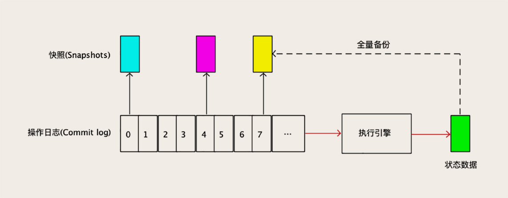

---
tags:
  - 异步复制
  - 半同步复制
  - rpl_semi_sync_master_wait_no_slave
  - rpl_semi_sync_master_wait_point
---

# MySQL 主从数据库同步是如何实现的？

回顾我们之前讲 MySQL 相关的几节课程，你会发现 **主从同步有多重要**：

- 解决数据可靠性的问题需要用到主从同步；
- 解决 MySQL 服务高可用要用到主从同步；
- 应对高并发的时候，还是要用到主从同步。

我们在运维 MySQL 集群时，遇到的很多常见的问题，比如说：

- 为什么从节点故障会影响到主节点？
- 为什么主从切换之后丢数据了？
- 为什么明明没有更新数据，客户端读到的数据还是变来变去的？

这些都和主从同步的配置有密切的关系。

**你不但要理解 MySQL 主从同步的原理，还要掌握一些相关配置的含义**，才能正确地配置你的集群，知道集群在什么情况下会有什么样的行为，可能会出现什么样的问题，并且知道该如何解决。

今天这节课我们就来详细讲一下，MySQL 的主从同步是怎么实现的，以及如何来正确地配置主从同步。

## 如何配置 MySQL 的主从同步？

当客户端提交一个事务到 MySQL 的集群，直到客户端收到集群返回成功响应，在这个过程中，MySQL 集群需要执行很多操作：

- 主库需要:
  - 提交事务
  - 更新存储引擎中的数据
  - 把 Binlog 写到磁盘上
  - 给客户端返回响应
  - 把 Binlog 复制到所有从库上
- 每个从库需要
  - 把复制过来的 Binlog 写到暂存日志中
  - 回放这个 Binlog
  - 更新存储引擎中的数据
  - 给主库返回复制成功的响应。

这些操作的时序非常重要，这里面的 **时序**，说的就是这些 **操作的先后顺序**。同样的操作，因为时序不同，对应用程序来说，有很大的差异。比如说，如果先复制 Binlog，等 Binlog 复制到从节点上之后，主节点再去提交事务，这种情况下，从节点的 Binlog 一直和主节点是同步的，任何情况下主节点宕机也不会丢数据。但如果把这个时序倒过来，先提交事务再复制 Binlog，性能就会非常好，但是存在丢数据的风险。

**MySQL 提供了几个参数来配置这个时序**，我们先看一下默认情况下的时序是什么样的。

**默认情况下，MySQL 采用异步复制的方式**，执行事务操作的线程不会等复制 Binlog 的线程。具体的时序你可以看下面这个图：

MySQL 主库在收到客户端提交事务的请求之后，会先写入 Binlog，然后再提交事务，更新存储引擎中的数据，事务提交完成后，给客户端返回操作成功的响应。同时，从库会有一个专门的 **复制线程**，**从主库接收 Binlog，然后把 Binlog 写到一个中继日志里面**，再给主库返回复制成功的响应。

从库还有另外一个 **回放 Binlog 的线程**，**去读中继日志，然后回放 Binlog 更新存储引擎中的数据**，这个过程和我们今天讨论的主从复制关系不大，所以我并没有在图中画出来。**提交事务和复制这两个流程在不同的线程中执行，互相不会等待，这是异步复制。**

掌握了异步复制的时序之后，我们就很容易理解之前几节课中讲到的一些问题的原因了。比如说，在异步复制的情况下，为什么主库宕机存在丢数据的风险？为什么读写分离存在读到脏数据的问题？产生这些问题，都是因为 **异步复制它没有办法保证数据能第一时间复制到从库上。**

与异步复制相对的就是同步复制。同步复制的时序和异步复制基本是一样的，**唯一的区别是，什么时候给客户端返回响应**。

- 异步复制时，主库提交事务之后，就会给客户端返回响应；
- 同步复制时，主库在提交事务的时候，会等待数据复制到所有从库之后，再给客户端返回响应。

同步复制这种方式在实际项目中，基本上没法用，原因有两个：

- 一是性能很差，因为要复制到所有节点才返回响应；
- 二是可用性也很差，主库和所有从库任何一个数据库出问题，都会影响业务。

为了解决这个问题，MySQL 从 5.7 版本开始，增加一种 **半同步复制（Semisynchronous Replication）**的方式。

- 异步复制是，事务线程完全不等复制响应；
- 同步复制是，事务线程要等待所有的复制响应；
- 半同步复制介于二者之间，事务线程不用等着所有的复制成功响应，只要一部分复制响应回来之后，就可以给客户端返回了。

比如说，一主二从的集群，配置成半同步复制，**只要数据成功复制到任意一个从库上**，主库的事务线程就直接返回了。这种半同步复制的方式，它兼顾了异步复制和同步复制的优点。如果主库宕机，至少还有一个从库有最新的数据，不存在丢数据的风险。并且，半同步复制的性能也还凑合，也能提供高可用保证，从库宕机也不会影响主库提供服务。所以，半同步复制这种折中的复制方式，也是一种不错的选择。

接下来我跟你说一下，在实际应用过程中，选择半同步复制需要特别注意的几个问题。

配置半同步复制的时候，有一个重要的参数 `rpl_semi_sync_master_wait_no_slave`，含义是：**「至少等待数据复制到几个从节点再返回」**。这个数量配置的越大，丢数据的风险越小，但是集群的性能和可用性就越差。最大可以配置成和从节点的数量一样，这样就变成了同步复制。

一般情况下，配成默认值 1 也就够了，这样性能损失最小，可用性也很高，只要还有一个从库活着，就不影响主库读写。丢数据的风险也不大，**只有在恰好主库和那个有最新数据的从库一起坏掉的情况下，才有可能丢数据**。

另外一个重要的参数是 `rpl_semi_sync_master_wait_point`，这个参数 **控制主库执行事务的线程，是在提交事务之前（AFTER_SYNC）等待复制，还是在提交事务之后（AFTER_COMMIT）等待复制**。默认是 AFTER_SYNC，也就是先等待复制，再提交事务，这样完全不会丢数据。AFTER_COMMIT 具有更好的性能，不会长时间锁表，但还是存在宕机丢数据的风险。

另外，虽然我们配置了同步或者半同步复制，并且要等待复制成功后再提交事务，还是有一种特别容易被忽略、可能存在丢数据风险的情况。

如果说，**主库提交事务的线程等待复制的时间超时了，这种情况下事务仍然会被正常提交**。并且，**MySQL 会自动降级为异步复制模式**，直到有足够多（`rpl_semi_sync_master_wait_no_slave`）的从库追上主库，才能恢复成半同步复制。如果这个期间主库宕机，仍然存在丢数据的风险。

## 复制状态机：所有分布式存储都是这么复制数据的

在 MySQL 中，无论是复制还是备份恢复，依赖的都是 **全量备份和 Binlog**，全量备份相当于备份那一时刻的一个数据快照，Binlog 则记录了每次数据更新的变化，也就是操作日志。我们这节课讲主从同步，也就是数据复制，虽然讲的都是 MySQL，但是你要知道，这种基于「快照 + 操作日志」的方法，不是 MySQL 特有的。

比如说，Redis Cluster 中，它的全量备份称为 Snapshot，操作日志叫 backlog，它的主从复制方式几乎和 MySQL 是一模一样的。

我再给你举个例子，之前我们讲过的 Elasticsearch，它是一个内存数据库，读写都在内存中，那它是怎么保证数据可靠性的呢？对，它用的是 translog，它备份和恢复数据的原理和实现方式也是完全一样的。这些什么什么 log，都是不同的马甲儿而已，**几乎所有的存储系统和数据库，都是用这一套方法来解决备份恢复和数据复制问题的**。

既然这些存储系统他们实现数据复制的方法是完全一样的，那这几节课我们讲的 MySQL 主从复制时，讲到的那些问题、丢数据的风险，对于像 Redis Cluster、ES 或者其他分布式存储也都是一样存在的。那我们讲的，如何应对的方法、注意事项、最佳实践，这些也都是可以照搬的。

这一套方法其实是有理论基础的，叫做 [复制状态机 (Replication State Machine)](https://en.wikipedia.org/wiki/State_machine_replication)，我能查到的最早的出处是 1978 年 Lamport 的一篇论文[《The Implementation of Reliable Distributed Multiprocess Systems》](http://lamport.azurewebsites.net/pubs/implementation.pdf)。

1978 年啊，同学，那时候我们都还没出生呢！这么老的技术到今天仍然在被广泛地应用！无论应用技术发展的多快，实际上解决问题的方法，或者说是理论基础，一直是没什么变化的。所以，你在不断学习新的应用技术的同时，还需要多思考、总结和沉淀，这样会让你学习新技术的时候更快更轻松。

## 小结

最后，那为了便于你理解复制状态机，我们把这套方法再抽象总结一下。任何一个存储系统，无论它存储的是什么数据，用什么样的数据结构，都可以抽象成一个状态机。

存储系统中的数据称为状态（也就是 MySQL 中的数据），状态的全量备份称为快照（Snapshot），就像给数据拍个照片一样。我们按照顺序记录更新存储系统的每条操作命令，就是操作日志（Commit Log，也就是 MySQL 中的 Binlog）。你可以对照下面这张图来理解上面这些抽象的概念。

复制数据的时候，只要基于一个快照，按照顺序执行快照之后的所有操作日志，就可以得到一个完全一样的状态。在从节点持续地从主节点上复制操作日志并执行，就可以让从节点上的状态数据和主节点保持同步。

主从同步做数据复制时，一般可以采用几种复制策略。**性能最好的方法是异步复制**，主节点上先记录操作日志，再更新状态数据，然后异步把操作日志复制到所有从节点上，并在从节点执行操作日志，得到和主节点相同的状态数据。

异步复制的劣势是，可能存在主从延迟，如果主节点宕机，可能会丢数据。另外一种常用的策略是半同步复制，主节点等待操作日志最少成功复制到 N 个从节点上之后，再更新状态，这种方式在性能、高可用和数据可靠性几个方面都比较平衡，很多分布式存储系统默认采用的都是这种方式。

## 思考题

复制状态机除了用于数据库的备份和复制以外，在计算机技术领域，还有哪些地方也用到了复制状态机？欢迎你在留言区与我讨论。

答：复制状态机的应用是非常广泛的，比如说现在很火的区块链技术，也是借鉴了复制状态机理论，它的链，或者说是账本就是操作日志，每个人的钱包，就是状态。它只要保证账本一旦记录后就不会被篡改，那在任何人的电脑上，计算出来的钱包就都是一样的。

- redis 中也有类似的：RDB 快照、AOF 日志
