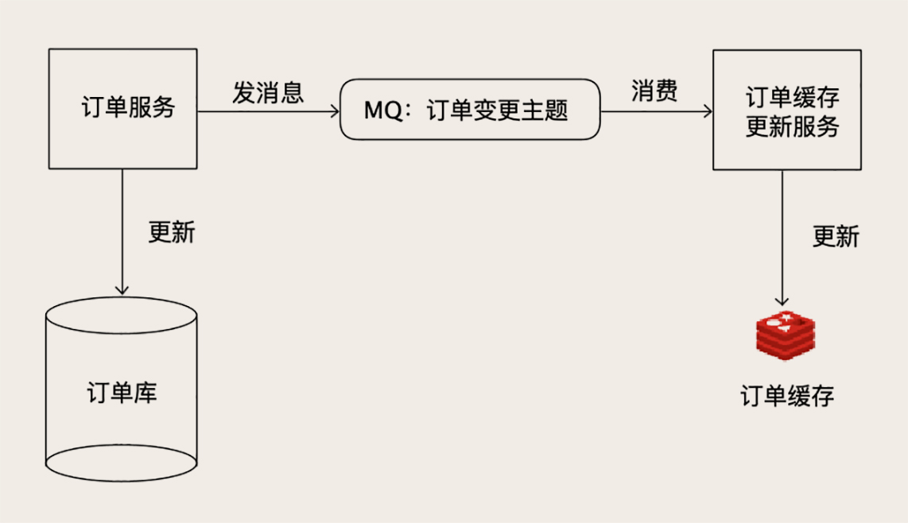
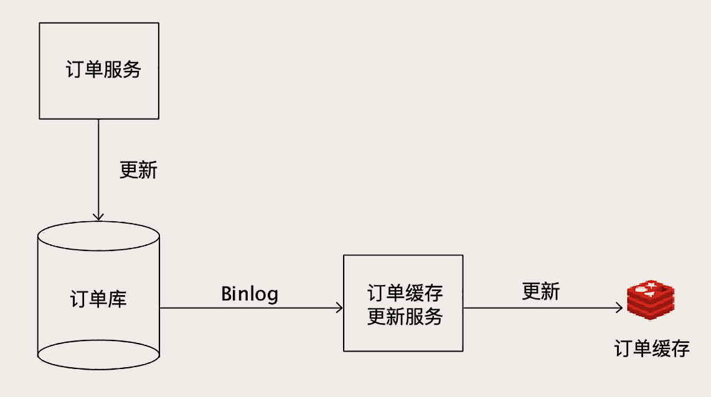
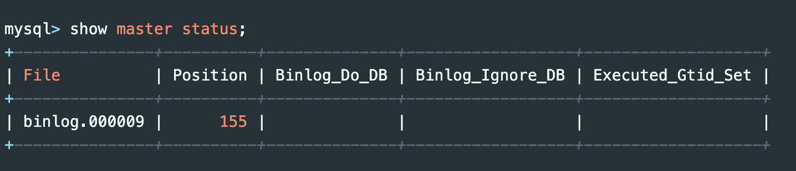

---
tags:
  - Canal 读取 binlog
---


# 大厂都是怎么做 MySQLtoRedis 同步的?

之前我们在[《MySQL 如何应对高并发（一）：使用缓存保护 MySQL》](../02/04.md)这一节课中，讲到了 Read/Write Through 和 Cache Aside 这几种更新缓存的策略，这几种策略都存在缓存穿透的可能，如果缓存没有命中，那就穿透缓存去访问数据库获取数据。

一般情况下，只要我们做好缓存预热，这个缓存的命中率很高，能穿透缓存打到数据库上的请求比例就非常低，这些缓存的策略都是没问题的。但是如果说，**我们的 Redis 缓存服务的是一个超大规模的系统**，那就又不一样了。

今天这节课，我们来说一下，在超大规模系统中缓存会面临什么样的问题，以及应该使用什么样的策略来更新缓存。

## 缓存穿透：超大规模系统的不能承受之痛

我们上节课讲到了如何构建 Redis 集群，由于集群可以水平扩容，那只要集群足够大，理论上支持海量并发也不是问题。但是，因为并发请求的数量这个基数太大了，即使有很小比率的请求穿透缓存，打到数据库上请求的绝对数量仍然不小。加上大促期间的流量峰值，还是存在缓存穿透引发雪崩的风险。

那这个问题怎么解决呢？其实方法你也想得到，不让请求穿透缓存不就行了？反正现在存储也便宜，只要你买得起足够多的服务器，Redis 集群的容量就是无限的。不如 **把全量的数据都放在 Redis 集群里面，处理读请求的时候，干脆只读 Redis，不去读数据库**。这样就完全没有「缓存穿透」的风险了，实际上很多大厂它就是这么干的。

在 Redis 中缓存全量的数据，又引发了一个新的问题，那就是，**如何来更新缓存中的数据呢**？因为我们取消了缓存穿透的机制，这种情况下，从缓存读到数据可以直接返回，如果没读到数据，那就只能返回错误了！所以，当系统更新数据库的数据之后，必须及时去更新缓存。

说到这儿，又绕回到那个老问题上了：怎么保证 Redis 中的数据和数据库中的数据同步更新？我们之前讲过用分布式事务来解决数据一致性的问题，但是这些方法都不太适合用来更新缓存，**因为分布式事务，对数据更新服务有很强的侵入性**。我们拿下单服务来说，如果为了更新缓存增加一个分布式事务，无论我们用哪种分布式事务，或多或少都会影响下单服务的性能。还有一个问题是，如果 Redis 本身出现故障，写入数据失败，还会导致下单失败，等于是降低了下单服务性能和可用性，这样肯定不行。

**对于像订单服务这类核心的业务，一个可行的方法是，我们启动一个更新订单缓存的服务，接收订单变更的 MQ 消息，然后更新 Redis 中缓存的订单数据。**因为这类核心的业务数据，使用方非常多，本来就需要发消息，增加一个消费订阅基本没什么成本，订单服务本身也不需要做任何更改。



唯一需要担心的一个问题是，如果丢消息了怎么办？因为现在消息是缓存数据的唯一来源，一旦出现丢消息，缓存里缺失的那条数据永远不会被补上。所以，必须保证整个消息链条的可靠性，不过好在现在的 MQ 集群，比如像 Kafka 或者 RocketMQ，它都有高可用和高可靠的保证机制，只要你正确配置好，是可以满足数据可靠性要求的。

像订单服务这样，本来就有现成的数据变更消息可以订阅，这样更新缓存还是一个不错的选择，因为实现起来很简单，对系统的其他模块完全没有侵入。

## 使用 Binlog 实时更新 Redis 缓存

如果我们要缓存的数据，本来没有一份数据更新的 MQ 消息可以订阅怎么办？很多大厂都采用的，也是更通用的解决方案是这样的。

数据更新服务只负责处理业务逻辑，更新 MySQL，完全不用管如何去更新缓存。**负责更新缓存的服务，把自己伪装成一个 MySQL 的从节点，从 MySQL 接收 Binlog，解析 Binlog 之后，可以得到实时的数据变更信息**，然后根据这个变更信息去更新 Redis 缓存。



这种收 Binlog 更新缓存的方案，和刚刚我们讲到的，收 MQ 消息更新缓存的方案，其实它们的实现思路是一样的，都是异步订阅实时数据变更信息，去更新 Redis。只不过，直接读取 Binlog 这种方式，它的通用性更强。不要求订单服务再发订单消息了，订单更新服务也不用费劲去解决「发消息失败怎么办？」这种数据一致性问题了。

而且，在整个缓存更新链路上，减少了一个收发 MQ 的环节，从 MySQL 更新到 Redis 更新的时延更短，出现故障的可能性也更低，所以很多大厂更青睐于这种方案。

**这个方案唯一的缺点是，实现订单缓存更新服务有点儿复杂**，毕竟不像收消息，拿到的直接就是订单数据，解析 Binlog 还是挺麻烦的。

有很多开源的项目就提供了订阅和解析 MySQL Binlog 的功能，下面我们以比较常用的开源项目 Canal 为例，来演示一下如何实时接收 Binlog 更新 Redis 缓存。

**Canal 模拟 MySQL 主从复制的交互协议**，**把自己伪装成一个 MySQL 的从节点**，向 MySQL 主节点发送 dump 请求，MySQL 收到请求后，就会开始推送 Binlog 给 Canal，Canal 解析 Binlog 字节流之后，转换为便于读取的结构化数据，供下游程序订阅使用。下图是 Canal 的工作原理：


在我们这个示例中，MySQL 和 Redis 都运行在本地的默认端口上，MySQL 的端口为 3306，Redis 的端口为 6379。为了便于大家操作，我们还是以[《事务：账户余额总是对不上账，怎么办？》](../01/04.md)这节课中的账户余额表 account_balance 作为演示数据。

首先，下载并解压 Canal 最新的 1.1.4 版本到本地：

```bash
wget https://github.com/alibaba/canal/releases/download/canal-1.1.4/canal.deployer-1.1.4.tar.gz
tar zvfx canal.deployer-1.1.4.tar.gz
```

然后来配置 MySQL，我们需要在 MySQL 的配置文件中开启 Binlog，并设置 Binlog 的格式为 ROW 格式。

```properties
[mysqld]
log-bin=mysql-bin # 开启Binlog
binlog-format=ROW # 设置Binlog格式为ROW
server_id=1 # 配置一个ServerID
```

给 Canal 开一个专门的 MySQL 用户并授权，确保这个用户有复制 Binlog 的权限：

```sql
CREATE USER canal IDENTIFIED BY 'canal';  
GRANT SELECT, REPLICATION SLAVE, REPLICATION CLIENT ON *.* TO 'canal'@'%';
FLUSH PRIVILEGES;
```

重启一下 MySQL，确保所有的配置生效。重启后检查一下当前的 Binlog 文件和位置：



记录下 File 和 Position 两列的值，然后我们来配置 Canal。编辑 Canal 的实例配置文件 `canal/conf/example/instance.properties`，以便让 Canal 连接到我们的 MySQL 上。

```properties
canal.instance.gtidon=false
# position info
canal.instance.master.address=127.0.0.1:3306
canal.instance.master.journal.name=binlog.000009
canal.instance.master.position=155
canal.instance.master.timestamp=
canal.instance.master.gtid=
# username/password
canal.instance.dbUsername=canal
canal.instance.dbPassword=canal
canal.instance.connectionCharset = UTF-8
canal.instance.defaultDatabaseName=test
# table regex
canal.instance.filter.regex=.*\\..
```

这个配置文件需要配置 MySQL 的连接地址、库名、用户名和密码之外，还需要配置 `canal.instance.master.journal.name`  和 `canal.instance.master.position`  这两个属性，取值就是刚刚记录的 File 和 Position 两列。然后就可以启动 Canal 服务了：

```bash
canal/bin/startup.sh
```

启动之后看一下日志文件 `canal/logs/example/example.log`，如果里面没有报错，就说明启动成功并连接到我们的 MySQL 上了。

Canal 服务启动后，**会开启一个端口（11111）等待客户端连接**，客户端连接上 Canal 服务之后，可以从 Canal 服务拉取数据，每拉取一批数据，正确写入 Redis 之后，给 Canal 服务返回处理成功的响应。如果发生客户端程序宕机或者处理失败等异常情况，Canal 服务没收到处理成功的响应，下次客户端来拉取的还是同一批数据，这样就可以保证顺序并且不会丢数据。

接下来我们来开发账户余额缓存的更新程序，以下的代码都是用 Java 语言编写的：

```java
while (true) {
    Message message = connector.getWithoutAck(batchSize); // 获取指定数量的数据
    long batchId = message.getId();
    try {
        int size = message.getEntries().size();
        if (batchId == -1 || size == 0) {
            Thread.sleep(1000);
        } else {
            // 处理
            processEntries(message.getEntries(), jedis);
        }
        connector.ack(batchId); // 提交确认
    } catch (Throwable t) {
        connector.rollback(batchId); // 处理失败, 回滚数据
    }
}
```

这个程序逻辑也不复杂，程序启动并连接到 Canal 服务后，就不停地拉数据，如果没有数据就睡一会儿，有数据就调用 processEntries 方法处理更新缓存。每批数据更新成功后，就调用 ack 方法给 Canal 服务返回成功响应，如果失败抛异常就回滚。下面是 processEntries 方法的主要代码：

```java
for (CanalEntry.RowData rowData : rowChage.getRowDatasList()) {
    if (eventType == CanalEntry.EventType.DELETE) { // 删除
        jedis.del(row2Key("user_id", rowData.getBeforeColumnsList()));
    } else if (eventType == CanalEntry.EventType.INSERT) { // 插入
        jedis.set(row2Key("user_id", rowData.getAfterColumnsList()), row2Value(rowData.getAfterColumnsList()));
    } else { // 更新
        jedis.set(row2Key("user_id", rowData.getAfterColumnsList()), row2Value(rowData.getAfterColumnsList()));
    }
}
```

这里面根据事件类型来分别处理，如果 MySQL 中的数据删除了，就删除 Redis 中对应的数据。如果是更新和插入操作，那就调用 Redis 的 SET 命令来写入数据。

把这个账户缓存更新服务启动后，我们来验证一下，我们在账户余额表插入一条记录：

```sql
mysql> insert into account_balance values (888, 100, NOW(), 999);
```

然后来看一下 Redis 缓存：

```bash
127.0.0.1:6379> get 888
"{\"log_id\":\"999\",\"balance\":\"100\",\"user_id\":\"888\",\"timestamp\":\"2020-03-08 16:18:10\"}"
```

可以看到数据已经自动同步到 Redis 中去了

## 小结

在处理超大规模并发的场景时，由于并发请求的数量非常大，即使少量的缓存穿透，也有可能打死数据库引发雪崩效应。对于这种情况，我们 **可以缓存全量数据来彻底避免缓存穿透问题**。

对于缓存数据更新的方法，可以订阅数据更新的 MQ 消息来异步更新缓存，更通用的方法是，把缓存更新服务伪装成一个 MySQL 的从节点，订阅 MySQL 的 Binlog，通过 Binlog 来更新 Redis 缓存。

需要特别注意的是，无论是用 MQ 还是 Canal 来异步更新缓存，对整个更新服务的数据可靠性和实时性要求都比较高，数据丢失或者更新慢了，都会造成 Redis 中的数据与 MySQL 中数据不同步。在把这套方案应用到生产环境中去的时候，需要考虑一旦出现不同步问题时的降级或补偿方案。

## 思考题

如果出现缓存不同步的情况，在你负责的业务场景下，该如何降级或者补偿？

答：设置一个合理的缓存过期时间，这样即使出现缓存不同步，等缓存过期后就会自动恢复。再比如，识别用户手动刷新操作，强制重新加载缓存数据（但要注意防止大量缓存穿透）。还可以在管理员的后台系统中，预留一个手动清除缓存的功能，必要的时候人工干预。

## 拓展知识

- 全量数据缓存，缓存同步有个时间差，这该如何处理？

  就像 MySQL 主从同步时延一样，只能接受它。一般这个时延都是毫米级的，不会对业务有很大影响。

- 对交易数据进行缓存，单个简单，批量查询如何？

  一般批量查询的时候可以用 Redis 的集合数据结构，比如 SET，SET 中的 Value 可以保存交易编号，而不用保存交易数据。
