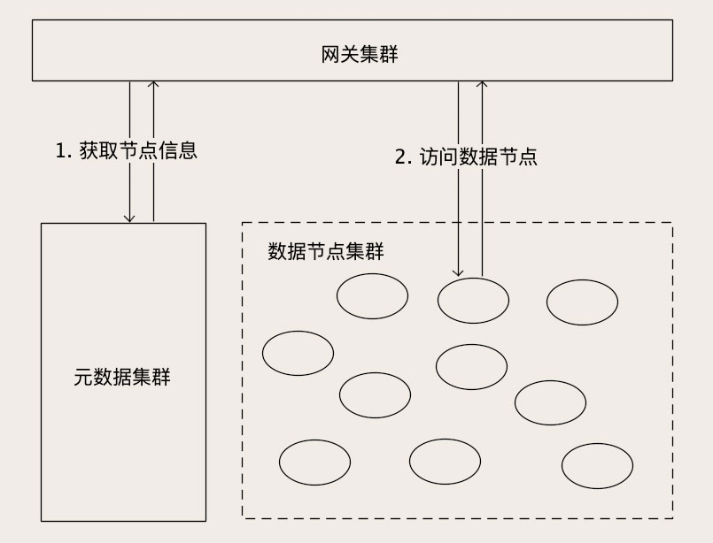

---
tags:
  - Elasticsearch
  - Ceph
  - ZooKeeper
  - etcd
---

# 分布式存储：你知道对象存储是如何保存图片文件的吗？

我们都知道，保存像图片、音视频这类大文件，最佳的选择就是 **对象存储**。对象存储不仅有很好的 **大文件读写性能**，还可以 **通过水平扩展实现近乎无限的容量**，并且可以 **兼顾服务高可用**、**数据高可靠** 这些特性。

对象存储之所以能做到这么「全能」，最主要的原因是，**对象存储是原生的分布式存储系统**。这里我们讲的「原生分布式存储系统」，是相对于 MySQL、Redis 这类单机存储系统来说的。虽然这些非原生的存储系统，也具备一定的集群能力，但你也能感受到，用它们构建大规模分布式集群的时候，其实是非常不容易的。

随着云计算的普及，很多新生代的存储系统，都是原生的分布式系统，它们一开始设计的目标之一就是分布式存储集群，比如说 Elasticsearch、Ceph 和国内很多大厂推出的新一代数据库，大多都可以做到：

- 近乎无限的存储容量；

- 超高的读写性能；

- 数据高可靠：节点磁盘损毁不会丢数据；

- 实现服务高可用：节点宕机不会影响集群对外提供服务。

那这些原生分布式存储是如何实现这些特性的呢？

实际上不用我说，你也能猜得到，这里面同样存在严重的「互相抄作业」的情况。这个也可以理解，除了存储的数据结构不一样，提供的查询服务不一样以外，这些分布式存储系统，它们面临的很多问题都是一样的，那实现方法差不多也是可以理解。

对象存储它的查询服务和数据结构都非常简单，是最简单的原生分布式存储系统。这节课，我们就来一起来研究一下对象存储这种最简单的原生分布式存储，**通过对象存储来认识一下分布式存储系统的一些共性**。掌握了这些共性之后，你再去认识和学习其他的分布式存储系统，也会感觉特别容易。

## 对象存储数据是如何保存大文件的？

对象存储对外提供的服务，其实就是一个 **近乎无限容量的大文件 KV 存储**，所以对象存储和分布式文件系统之间，没有那么明确的界限。**对象存储的内部，肯定有很多的存储节点，用于保存这些大文件，这个就是数据节点的集群**。

另外，我们为了管理这些数据节点和节点中的文件，还需要一个存储系统保存集群的节点信息、文件信息和它们的映射关系。**这些为了管理集群而存储的数据，叫做元数据 (Metadata)**。

元数据对于一个存储集群来说是非常重要的，所以保存元数据的存储系统必须也是一个集群。但是元数据集群存储的数据量比较少，数据的变动不是很频繁，加之客户端或者网关都会缓存一部分元数据，所以元数据集群对并发要求也不高。一般使用类似 ZooKeeper 或者 etcd 这类分布式存储就可以满足要求。

另外，存储集群为了对外提供访问服务，还需要一个 **网关集群**，对外接收外部请求，对内访问元数据和数据节点。网关集群中的每个节点不需要保存任何数据，都是无状态的节点。**有些对象存储没有网关，取而代之的是客户端，它们的功能和作用都是一样的**。

那么，对象存储是如何来处理对象读写请求的呢？这里面处理读和写请求的流程是一样的，我们一起来说。网关收到对象读写请求后，首先拿着请求中的 Key，去元数据集群查找这个 Key 在哪个数据节点上，然后再去访问对应的数据节点读写数据，最后把结果返回给客户端。

以上是一个比较粗略的大致流程，实际上这里面包含很多的细节，我们暂时没有展开讲。目的是让你在整体上对对象存储，以至于分布式存储系统，有一个清晰的认知。

上面这张图，虽然我画的是对象存储集群的结构，但是把图上的名词改一改，完全可以套用到绝大多数分布式文件系统和数据库上去，比如说 HDFS。

## 对象是如何拆分和保存的？

接下来我们说一下对象存储到底是如何来保存大文件对象的。一般来说，对象存储中保存的文件都是图片、视频这类大文件。**在对象存储中，每一个大文件都会被拆成多个大小相等的 块儿（Block）**，拆分的方法很简单，就是把文件从头到尾按照固定的块儿大小，切成一块儿一块儿，最后一块儿长度有可能不足一个块儿的大小，也按一块儿来处理。块儿的大小一般配置为几十 KB 到几个 MB 左右。

把大对象文件拆分成块儿的目的有两个：

1. 第一是为了 **提升读写性能**，这些块儿可以分散到不同的数据节点上，这样就可以并行读写。

2. 第二是 **把文件分成大小相等块儿**，便于维护管理。

对象被拆成块儿之后，还是太过于碎片化了，**如果直接管理这些块儿，会导致元数据的数据量会非常大**，也没必要管理到这么细的粒度。**所以一般都会再把块儿聚合一下，放到块儿的容器里面**。这里的「容器」就是存放一组块儿的逻辑单元。容器这个名词，没有统一的叫法，比如在 ceph 中称为 Data Placement，你理解这个含义就行。容器内的块儿数大多是固定的，所以容器的大小也是固定的。

到这里，这个 **容器的概念**，就比较 **类似** 于我们之前讲 MySQL 和 Redis 时提到的**「分片」的概念** 了，**都是复制、迁移数据的基本单位**。每个容器都会有 N 个副本，这些副本的数据都是一样的。其中有一个主副本，其他是从副本，**主副本负责数据读写，从副本去到主副本上去复制数据**，保证主从数据一致。

这里面有一点儿和我们之前讲的不一样的是，对象存储一般都不记录类似 MySQL 的 Binlog 这样的日志。主从复制的时候，复制的不是日志，而是整块儿的数据。这么做有两个原因：

1. 第一个原因是基于性能的考虑。

   我们知道操作日志里面，实际上就包含着数据。在更新数据的时候，先记录操作日志，再更新存储引擎中的数据，相当于在磁盘上串行写了 2 次数据。对于像数据库这种，每次更新的数据都很少的存储系统，这个开销是可以接受的。但是对于对象存储来说，**它每次写入的块儿很大，两次磁盘 IO 的开销就有些不太值得了**。

2. 第二个原因是它的存储结构简单，即使没有日志，只要按照顺序，整块儿的复制数据，仍然可以保证主从副本的数据一致性。

以上我们说的 **对象（也就是文件）、块儿和容器**，都是 **逻辑层面的概念**，数据落实到副本上，**这些副本就是真正物理存在了**。这些副本再被分配到 **数据节点** 上保存起来。这里的数据节点就是运行在服务器上的服务进程，负责在本地磁盘上保存副本的数据。

了解了对象是如何被拆分并存储在数据节点上之后，我们再来回顾一下数据访问的流程。当我们请求一个 Key 的时候，网关首先去元数据中查找这个 Key 的元数据。然后根据元数据中记录的对象长度，计算出对象有多少块儿。接下来的过程就可以分块儿并行处理了。对于每个块儿，还需要再去元数据中，找到它被放在哪个容器中。

我刚刚讲过，容器就是分片，怎么把块儿映射到容器中，这个方法就是我们在[《MySQL 存储海量数据的最后一招：分库分表》](./01.md) 这节课中讲到的几种分片算法。不同的系统选择实现的方式也不一样，有用哈希分片的，也有用查表法把对应关系保存在元数据中的。找到容器之后，再去元数据中查找容器的 N 个副本都分布在哪些数据节点上。然后，网关直接访问对应的数据节点读写数据就可以了。

## 小结

对象存储是最简单的分布式存储系统，主要由 **数据节点集群**、**元数据集群 **和 **网关集群（或者客户端）**三部分构成。

- 数据节点集群：负责保存对象数据，
- 元数据集群：负责保存集群的元数据，
- 网关集群和客户端：对外提供简单的访问 API，对内访问元数据和数据节点读写数据。

为了便于维护和管理，大的对象被拆分为若干固定大小的块儿，块儿又被封装到容器（也就分片）中，每个容器有一主 N 从多个副本，这些副本再被分散到集群的数据节点上保存。

对象存储虽然简单，但是它具备一个分布式存储系统的全部特征。所有分布式存储系统共通的一些特性，对象存储也都具备，比如说数据如何分片，如何通过多副本保证数据可靠性，如何在多个副本间复制数据，确保数据一致性等等。

希望你通过这节课的学习，不仅是学会对象存储，还要对比分析一下，对象存储和其他分布式存储系统，比如 MySQL 集群、HDFS、Elasticsearch 等等这些，它们之间有什么共同的地方，差异在哪儿。想通了这些问题，你对分布式存储系统的认知，绝对会上升到一个全新的高度。然后你再去看一些之前不了解的存储系统，就非常简单了。

## 思考题

我们刚刚说到过，**对象存储并不是基于日志来进行主从复制的**。假设我们的对象存储是一主二从三个副本，采用半同步方式复制数据，也就是主副本和任意一个从副本更新成功后，就给客户端返回成功响应。主副本所在节点宕机之后，这两个从副本中，至少有一个副本上的数据是和宕机的主副本上一样的，我们需要找到这个副本作为新的主副本，才能保证宕机不丢数据。

但是没有了日志，如果这两个从副本上的数据不一样，我们如何确定哪个上面的数据是和主副本一样新呢？

答：一般都是基于版本号来解决，在 Leader上，KEY 每更新一次，KEY 的版本号就加 1，版本号作为 KV 的一个属性，一并复制到从节点上，通过比较版本号就可以知道哪个节点上的数据是最新的。

另外，有的同学提出用比较时间戳的方式来解决这个问题。这个方法理论上可行，但实际上非常难实现，因为它要求集群上的每个节点的时钟都必须时刻保持同步，这个要求往往非常难达到。
