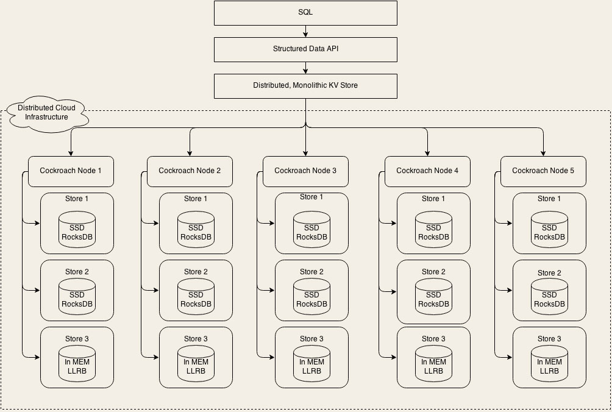

---
tags:
  - RocksDB
  - OceanBase 
  - Cloud Spanner
  - CockroachDB 
  - Raft
  - 写倾斜
  - 复制状态机
---


# MySQL 经常遇到的高可用、分片问题，NewSQL 是如何解决的？

在这个系列课程中，我们讲的都是如何解决生产系统中面临的一些存储系统相关的问题。在最后两节课里面，我们来说点儿新东西，看一下存储这个技术领域，可能会有哪些值得关注的新技术。当然，技术圈每天都有很多新的技术出现，也会经常发很多论文，出现很多的开源项目，这些大多数都不太靠谱儿。

今天我给你要说的这个 New SQL，它是我个人认为非常靠谱，甚至在未来可能会取代 MySQL 这样的关系型数据库的一个技术。MySQL 是几乎每一个后端开发人员必须要精通的数据库，既然 New SQL 非常有可能在将来替代 MySQL，那我们就非常有必要提前去了解一下了。

## 什么是 New SQL？

什么是 New SQL？这个说来话长了，还要从存储技术发展的历史来解读。我们知道，早期只有像 MySQL 这样的关系数据库，这种关系型数据库因为支持 SQL 语言，后来被叫做 SQL 或者 Old SQL。

然后，出现了 Redis 和很多 KV 存储系统，性能上各种吊打 MySQL，而且因为存储结构简单，所以比较容易组成分布式集群，并且能够做到水平扩展、高可靠、高可用。因为这些 KV 存储不支持 SQL，为了以示区分，被统称为 No SQL。

No SQL 本来希望能凭借高性能和集群的优势，替代掉 Old SQL。但用户是用脚投票的，这么多年实践证明，你牺牲了 SQL 这种强大的查询能力和 ACID 事务支持，用户根本不买账，直到今天，Old SQL 还是生产系统中最主流的数据库。

这个时候，大家都开始明白了，无论你其他方面做的比 Old SQL 好再多，SQL 和 ACID 是刚需，这个命你革不掉的。你不支持 SQL，就不会有多少人用。所以你看，近几年很多之前不支持 SQL 的数据库，都开始支持 SQL 了，甚至于像 Spark、Flink 这样的流计算平台，也都开始支持 SQL。当然，虽然说支持 SQL，但这里面各个产品的支持程度是参差不齐的，多多少少都有一些缩水。对于 ACID 的支持，基本上等同于就没有。

这个时候，New SQL 它来了！简单地说，New SQL 就是兼顾了 Old SQL 和 No SQL 的优点：

- 完整地支持 SQL 和 ACID，提供和 Old SQL 隔离级别相当的事务能力；

- 高性能、高可靠、高可用，支持水平扩容。

像 Google 的 Cloud Spanner、国产的 OceanBase 以及开源的 CockroachDB 都属于 New SQL 数据库。Cockroach 这个英文单词是蟑螂的意思，所以一般我们都把 CockroachDB 俗称为小强数据库。

这些 New SQL 凭什么就能做到 Old SQL 和 No SQL 做不到的这些特性呢？那我们就以开源的 CockroachDB 为例子，来看一下 New SQL 是不是真的这么厉害。

## CockroachDB 是如何实现数据分片和弹性扩容的？

首先，我们一起先来简单看一下 CockroachDB 的架构，从架构层面分析一下，它是不是真的像宣传的那么厉害。我们先来看一下它的架构图 (图片来自于官方文档)：



这是一个非常典型的分层架构，我们从上往下看。最上层是 SQL 层，SQL 层支持和关系型数据库类似的逻辑数据结构，比如说库、表、行和列这些逻辑概念。SQL 层向下调用的是一个抽象的接口层 Structured Data API，实际实现这个 API 的是下面一层：Distributed, Monolithic KV Store，这就是一个分布式的 KV 存储系统。

我们先不深入进去看细节，从宏观层面上分析一下这个架构。你可以看到，这个架构仍然是我们之间讲过的，大部分数据库都采用的二层架构：**执行器和存储引擎**。它的 SQL 层就是执行器，下面的分布式 KV 存储集群就是它的存储引擎。

那我们知道，MySQL 的存储引擎 InnoDB，实际上是 **基于文件系统的 B+ 树**，像 Hive 和 HBase，它们的存储引擎都是基于 HDFS 构建的。那 CockroachDB 这种，使用分布式 KV 存储来作为存储引擎的设计，理论上也是可行的，并没有什么特别难以逾越的技术壁垒。

而且，使用分布式 KV 存储作为存储引擎，实现高性能、高可靠、高可用，以及支持水平扩容这些特性，就不是什么难事儿了，其中很多分布式 KV 存储系统已经做到了，这里面使用的一些技术和方法，大多我们在之前的课程中也都讲到过。CockroachDB 在实现它的存储引擎这一层，就是大量地借鉴，甚至是直接使用了已有的一些成熟技术。

它的分片算法采用的是 **范围分片**，我们之前也讲到过，范围分片对查询是最友好的，可以很好地支持范围扫描这一类的操作，这样有利于它支撑上层的 SQL 查询。

它采用 **Raft 一致性协议** 来实现每个分片的高可靠、高可用和强一致。这个 Raft 协议，它的一个理论基础，就是我们之前讲的复制状态机，并且在复制状态机的基础上，Raft 实现了集群自我监控和自我选举来解决高可用的问题。Raft 也是一个被广泛采用的、非常成熟的一致性协议，比如 etcd 也是基于 Raft 来实现的。

CockroachDB 的元数据直接分布在所有的存储节点上，依靠流言协议来传播，这个流言协议，我们在[《 用 Redis 构建缓存集群的最佳实践有哪些？》](./02.md) 这节课中也讲到过，在 Redis Cluster 中也是用流言协议来传播元数据变化的。

CockroachDB 用上面这些成熟的技术解决了集群问题，在单机的存储引擎上，更是直接使用了 RocksDB 作为它的 KV 存储引擎。RocksDB 也是值得大家关注的一个新的存储系统，下节课我们会专门讲 RocksDB。

你可以看到，CockroachDB 的存储引擎，也就是它的分布式 KV 存储集群，基本上没有什么大的创新，就是重用了已有的一些成熟的技术，这些技术在我们之前讲过的其他存储系统中，全部都见到过。我讲这些并没有贬低 CockroachDB 的意思，相反，站在巨人的肩膀上，才能看得更远，飞得更高，这是一种非常务实的做法。

## CockroachDB 能提供金融级的事务隔离性么？

接下来我们说一下 CockroachDB 是怎么实现 ACID 的，它的 ACID 是不是类似于分布式事务的残血版？这是一个非常关键的问题，直接影响到它有没有可能在未来取代 MySQL。

在说 ACID 之前，我们还是要简单说一下 CockroachDB 是怎么解析和执行 SQL 的。我们在[《走进黑盒：SQL 是如何在数据库中执行的？》](../02/03.md) 这节课中讲过 SQL 是如何在 MySQL 中执行的，在 CockroachDB 中，这个执行的流程也是差不多的。同样是先解析 SQL 生成语法树，转换成逻辑执行计划，再转换为物理执行计划，优化后，执行物理执行计划返回查询结果，这样一个流程。

只是在 CockroachDB 中，物理执行计划就更加复杂了，因为它的物理执行计划面对的是一个分布式 KV 存储系统，在涉及到查找、聚合这类操作的时候，有可能需要涉及到多个分片（Range）。大致过程就是类似于 Map-Reduce 的逻辑，先查找元数据确定可能涉及到的分片，然后把物理执行计划转换成每个分片上的物理执行计划，在每个分片上去并行执行，最后，再对这些执行结果做汇总。

然后我们再来说 CockroachDB 的 ACID。我们在[《 事务：账户余额总是对不上账，怎么办？》](../01/04.md) 这节课中讲到过四种事务隔离级别，分别是 RU、RC、RR 和 SERIALIZABLE，那 CockroachDB 能提供哪种隔离级别呢？答案是，以上四种都不是。

CockroachDB 提供了另外两种隔离级别，分别是：**Snapshot Isolation (SI)** 和 **Serializable Snapshot Isolation (SSI)**，其中 SSI 是 CockroachDB 默认的隔离级别。

这两种隔离级别和之前提到的四种隔离级别是什么关系呢？我们通过下面这张表，和 MySQL 默认的隔离级别 RR 做一个对比。


首先我们看 SI 这一行。我们之前讲到过，RR 这种隔离级别，可以很好地解决脏读和不可重复读的问题，虽然可能会产生幻读，但实际上对绝大多数事务影响不大。SI 不会发生脏读、不可重复读，也不会发生幻读的情况，这个隔离级别似乎比 RR 还要好。

但你要注意一下，我们这个表格比之前那个表格多了一列：写倾斜。可以看到，RR 是不会出现写倾斜问题的，但是 SI 会有写倾斜问题。

什么是写倾斜？我们还是拿账户余额的例子来说明。比如说，我们的账户需要支持主副卡，主卡和副卡都分别有自己的余额，并且这个余额是可以透支的，只要满足主副卡的余额之和大于 0 就行了。如果我们需要给主卡支出 100 元，那 SQL 只要这样写就可以了：

```sql

update account
set balance = balance - 100 -- 在主卡中扣减100元
where id = ? and
  (select balance from account where id = ?) -- 主卡余额
  +
  (select balance from account where id = ?) -- 附卡余额
  >= 100; -- 主副卡余额之和必须大于100元
```

在传统的 RR 隔离级别下，由于更新数据时会对记录加锁，即使更新主副卡的两个 SQL 分别在两个事务中并发执行，也不会出现把主副卡的余额之和扣减成负数的情况。

但是在 SI 级别下，由于它没有加锁，而是采用快照的方式来实现事务的隔离，这个时候，如果并发地去更新主副卡余额，是有可能出现把主副卡余额之和扣减为负数的情况的。这种情况称为 **写倾斜**。这里顺便提一句，写倾斜是普遍的译法，我个人觉得 「倾斜」 这个词翻译得并不准确，实际上它表达的，就是因为没有检测读写冲突，也没有加锁，导致数据写错了。

SSI 隔离级别在 SI 的基础上，加入了冲突检测的机制，通过检测读写冲突，然后回滚事务的方式来解决写倾斜的问题，当然这种方式付出的代价是降低性能，并且冲突严重的情况下，会频繁地出现事务回滚。

从理论上来说，CockroachDB 支持的 SI 和 SSI 这两种事务隔离级别，能提供的事务隔离性，已经与传统的 RC 和 RR 隔离级别不相上下了，可以满足大多数在线交易类系统对 ACID 的要求。

## 小结

New SQL 是新一代的分布式数据库，它具备原生分布式存储系统高性能、高可靠、高可用和弹性扩容的能力，同时还兼顾了传统关系型数据库的 SQL 支持。更厉害的是，它还提供了和传统关系型数据库不相上下的、真正的事务支持，具备了支撑在线交易类业务的能力。

CockroachDB 是开源的 New SQL 数据库。它的存储引擎是一个分布式 KV 存储集群，执行器则大量借鉴了 PostgreSQL 的一些设计和实现，是一个集很多现有数据库和分布式存储系统技术于一身，这样的一个数据库产品。

从设计上来看，CockroachDB 这类 New SQL 数据库，有非常大的潜质可以真正地取代 MySQL 这类传统的关系型数据库。但是我们也应该看到，目前这些 New SQL 数据库都还处于高速发展阶段，并没有被大规模地应用到生产系统中去。我也不建议你做小白鼠，在重要的系统上去使用它。

## 思考题

你去看一下 Raft 一致性协议，然后简单总结一下，CockroachDB 是如何利用 Raft 协议实现 Range 高可用、高可靠和强一致的。

答：这里简单说一下 Raft 协议，Raft 是一个分布式一致性协议，在很多分布式系统中，都使用它来保证数据强一致性。它利用复制状态机来解决多个副本数据一致的问题，保证日志复制到半数以上节点才给客户端返回成功。并且，引入了主从心跳机制，当主节点故障时，其它节点能主动发起选举，选出新的主节点。通过复制状态机、心跳和选举机制，来保证集群数据的高可用、高可靠和强一致。
