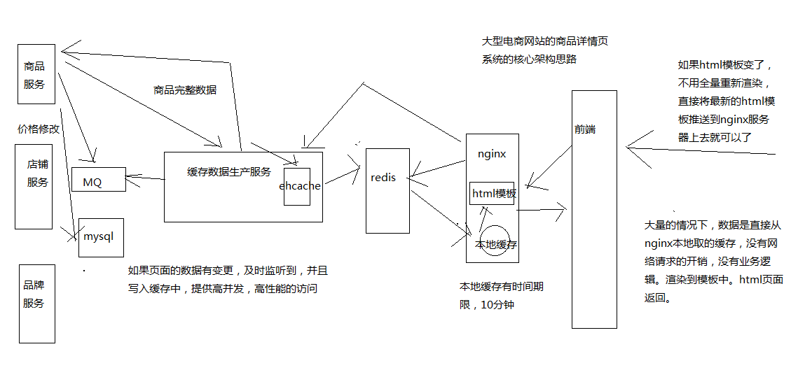

# 004. 大型电商网站的异步多级缓存构建 + nginx 数据本地化动态渲染的架构

大型电商网站的详情页架构一般是这样的核心思路，如上图

两个关键点：

1. 缓存数据生产服务
2. nginx 上的 html 模板 + 本地缓存数据

来捋一捋流程：

1. 用户访问 nginx

    会先从 nginx 的本地缓存获取数据渲染后返回，这个速度很快，因为全是内存操作。
    本地缓存数据是有时间的，比如 10 分钟
2. 假如 nginx 本地缓存失效

    会从 redis 中获取数据回来并缓存上
3. 假如 redis 中的数据失效

    会从缓存数据生产服务中获取数据并缓存上
3. 缓存数据生产服务

    本地也有一个缓存，比如用的是 ehcache
    他们通过队列监听商品修改等事件，让自己的缓存数据及时更新
4. 其他服务

    商品、店铺等服务能获取到商品的修改事件等，及时往 mq 中发出商品的修改事件，
    并提供商品原始数据的查询。这里可能是直接从 mysql 库中查询的

这样一来，在缓存上其实就挡掉了很多数据，一层一层的挡并发
