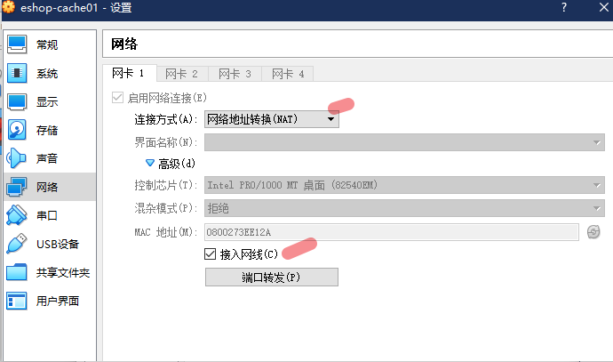
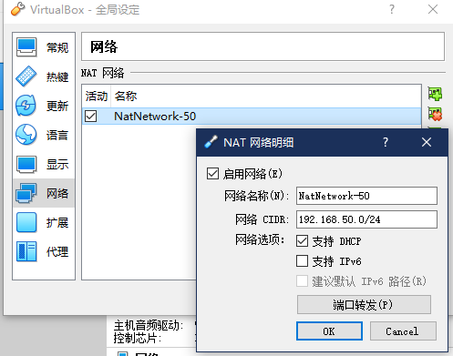
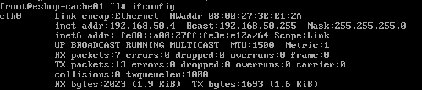
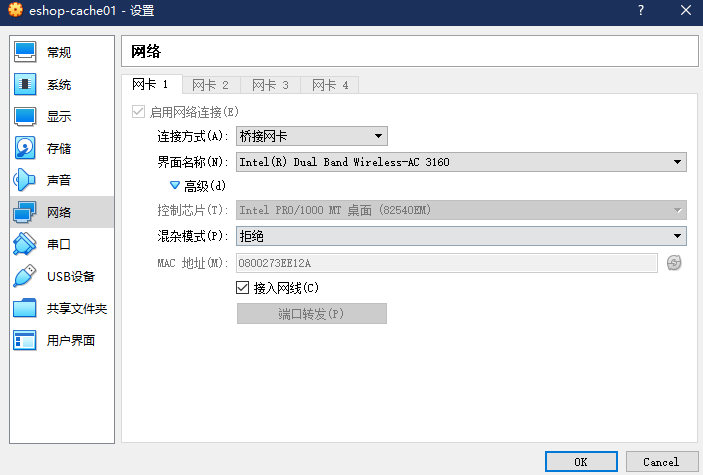
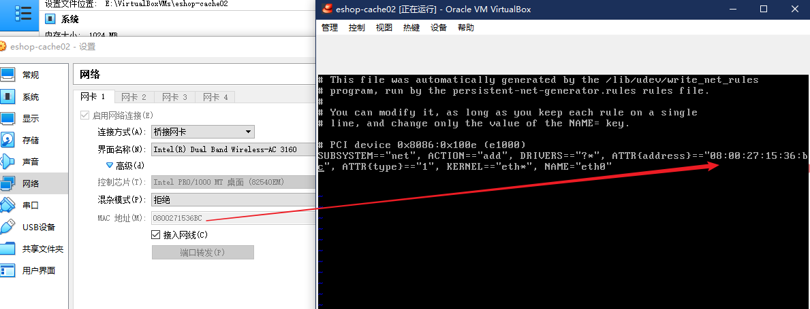

# 006. 从零开始在虚拟机中一步一步搭建一个 4 个节点的 CentOS 集群
[[toc]]

从零开始，纯手工，一步一步搭建出一个 4 个节点的 CentOS 集群，
为我们后面的课程做准备，后面会讲解大型的分布式的 redis 集群架构，
一步一步纯手工搭建 redis 集群，集群部署，主从架构，分布式集群架构

我们后面的课程，会讲解一些实时计算技术的应用，包括 storm，讲解一下 storm 的基础知识，对于 java 工程师来说，会用就可以了，用一些 storm 最基本的分布式实时计算的 feature 就 ok 了，搭建一个 storm 的集群

部署我们整套的系统、nginx、tomcat+java web 应用、mysql 等

尽量以真实的网络拓扑的环境，去给大家演示一下整套系统的部署，不要所有东西，全部放在一个节点上玩儿，也可以去试一试，但是作为课程来说，效果不是太理想

如果要说非常真实的网络拓扑环境来说的话：

- redis 集群，独立的一套机器
- storm 集群，独立的一套机器
- nginx 独立部署
- tomcat + java web 应用，独立部署
- mysql 独立部署

至少十台机器，去部署整套系统，我在自己的笔记本电脑上来讲课的，这么玩儿撑不住的，
电脑本身就 6G 内存的话，学习这种大型的系统架构的课程，是有点吃力，给大家建议，至少到 8G 以上，16G 凑合

我们会纯手工，从零开始，因为很多视频课程，里面讲师都是现成的虚拟机，自己都装好了，包括各种必要的软件，讲课的时候直接基于自己的虚拟机就开始讲解了

很多同学就会发现，想要做到跟讲师一样的环境都很难，自己可能照着样子装了个环境，但是发现，各种问题，各种报错，环境起不来，学习课程的过程很艰难

学视频课程，肯定是要跟着视频的所有的东西自己去做一做，练一练，结果你却因为环境问题，做不了，连不了，那就太惨了

我们的课程从 centos 的镜像文件，到所有的需要使用的软件，全都给你，在自己电脑上，下载一个虚拟机管理软件 virtual box，就可以跟着玩儿了

如果你一步一步跟着视频做，搭建起整个环境，应该问题不大，环境问题，给大家弄成傻瓜式的

## 在虚拟机中安装 CentOS
启动一个 virtual box 虚拟机管理软件（vmware，我早些年，发现不太稳定，主要是当时搭建一个 hadoop 大数据的集群，发现每次休眠以后再重启，集群就挂掉了）

virtual box，发现很稳定，集群从来不会随便乱挂，所以就一直用 virtual box 了

[virtual box 官网下载最新](https://www.virtualbox.org/wiki/Downloads) 即可（本次笔记使用的是 VirtualBox-6.0.4-128413-Win.exe），安装完成之后，需要先配置下虚拟电脑的默认位置：管理 -> 全局设定 -> 虚拟电脑位置，本次笔记是改动到了 `E:\VirtualBoxVMs`

1. 使用课程提供的 CentOS 6.5 镜像即可，CentOS-6.5-i386-minimal.iso

    32 位的系统，由于讲师内存不是很大，32 位的能节省不少内存占用
2. 创建虚拟机，打开 Virtual Box，点击“新建”按钮

    - 虚拟机名称：eshop-cache01
    - 类型：Linux
    - 版本：Red Hat（32-bit）
    - 内存大小：1024MB
    - 硬盘创建：选项默认（位置也默认，因为修改了全局的虚拟电脑位置，会默认在该位置下）
3. 设置虚拟机网卡：

    选择创建好的虚拟机，点击“设置”按钮，在网络一栏中，连接方式中，选择“Bridged Adapter” 桥接网卡。
4. 安装虚拟机中的 CentOS 6.5 操作系统
    1. 选择创建好的虚拟机，点击启动
    2. 选择启动盘：选择安装介质（即本地的 CentOS-6.5-i386-minimal.iso 文件）后启动
    3. 选择第一项：Install or upgrade an existing system
    4. Disc Found 弹窗中选择 Skip；（在虚拟机中鼠标怎么回到自己电脑？键盘右侧的 Ctrl 键，建议修改为 Ctrl + Alt 键，使用起来更方便 ）
    5. 图形界面选择 Next
    6. 语言选择：默认语言 English -> U.S.English
    7. 选择 Baisc Storage Devices -> Yes,discard any data
    8. 主机名：eshop-cache01
    9. 选择时区：Asia/Shanghai  亚洲/上海
    10. 设置初始密码（root 账户的）：hadoop
    11. Replace Existing Linux System -> Write changes to disk

    CentOS 6.5 自己开始安装了，这次选择的是 mini 的安装，所以很快，大概 5 分钟左右
5. 安装完以后，CentOS 会提醒你要重启一下，选择 reboot 重启。
6. 配置网络

    重启完成之后，使用 root/hadoop 登录系统，
    由于只安装终端模式，没有 ui 模式，登录系统后看到的就和终端登录的类似界面

    检测外网：`ping www.baidu.com`

    检测宿主机：`ping 192.168.99.111` ip 是你笔记本的局域网 ip

    会发现都 ping 不通，配置网络为静态地址

    ```bash
    vi /etc/sysconfig/network-scripts/ifcfg-eth0

    文件内容，需要删除几个默认的项目，最后保持如下内容

    DEVICE=eth0
    TYPE=Ethernet
    ONBOOT=yes
    BOOTPROTO=dhcp

    删除技巧：进入 vi 后，先不要按「i」键进入编辑模式，上下键移动到要删除的行，连续按两下「d」即可删除这一行文本

    使用 ifconfig 命令会发现没有 eth0 的信息
    使用 service network restart 重启网络，有可能会失败，如果显示 ok 的话，就是默认按照你的宿主机的相关网关信息分配了 ip，但是不要慌

    使用配置文件固定 ip 信息

    vi /etc/sysconfig/network-scripts/ifcfg-eth0

    修改为如下内容

    DEVICE=eth0
    TYPE=Ethernet
    ONBOOT=yes
    BOOTPROTO=static
    IPADDR=192.168.99.170
    NATMASK=255.255.255.0
    GATEWAY=192.168.99.1

    对于桥接网络模式来说：就是配置成和你宿主机同一个局域网即可

    再次 service network restart 重启网络服务和 ifconfig 查看 ip 信息
    ```
7. 配置 hosts

    `vi /etc/hosts` 增加一行，可以通过 eshop-cache01 访问本机
    ```bash
    192.168.99.170 eshop-cache01
    ```
8. 配置 SecureCRT

    此时就可以使用 SecureCRT 从本机连接到虚拟机进行操作了

    一般来说，虚拟机管理软件，virtual box，可以用来创建和管理虚拟机，但是一般不会直接在 virtualbox 里面去操作，因为比较麻烦，没有办法复制粘贴

    比如后面我们要安装很多其他的一些东西，perl、java、redis、storm，复制一些命令直接去执行

    在这里本人喜欢使用 xshell，就以 xshell 开始了
9. 关闭防火墙

    原因是为了方便，因为一些软件如集群之间需要打开固定的端口，防止连接不上，先关闭防火墙

    ```bash
    service iptables stop
    service ip6tables stop
    chkconfig iptables off
    chkconfig ip6tables off
    ```
    还有一个策略需要关闭下（视频中没有解说是为什么这个是什么）

    ```bash
    vi /etc/selinux/config

    内容修改为

    SELINUX=disabled

    ```

    windows 上的防火墙也需要关闭，后面要搭建集群，有的大数据技术的集群之间，在本地你给了防火墙的话，可能会没有办法互相连接，会导致搭建失败
10. 配置 yum 工具

    ```bash
    yum clean all
    # 生成缓存，安装的时候从缓存中查询相关数据，提高安装速度
    yum makecache
    ```
    安装 wget，可以通过该工具下载软件

    ```bash
    yum install wget
    ```

### 网络配置注意的地方
按照视频和百度来配置了好几个小时，笔记本用的无线网卡，同样无法连接网络，
可以 ping 通宿主机就是不能连接网络。

::: tip
最后发现问题了，无论是 nat 还是是桥接模式。我在配置中把 GATEWAY 错写尘 GETEWAY 了
:::

最后选择 nat 勾选接入网线，



全局配置 nat 网络



如上配置说明：

- 网段：192.168.50.[2 ~ 254]
- 子网掩码：255.255.255.0
- 网关：192.168.50.1

```
vi /etc/sysconfig/network-scripts/ifcfg-eth0
中设置 BOOTPROTO=dhcp

重启网络 service network restart 发现 ok 了。
```
通过 ifconfig 查看到的分配地址为



检测网络情况，均发现可以 ping 通

- 检测外网：`ping www.baidu.com`
- 检测宿主机：`ping 192.168.99.111` ip 是你笔记本的局域网 ip

那么静态化配置如下：

```bash
DEVICE=eth0
TYPE=Ethernet
ONBOOT=yes
BOOTPROTO=static
IPADDR=192.168.50.10
NETMASK=255.255.255.0
GATEWAY=192.168.50.1
```

### 桥接模式配置截图
一句话桥接模式重点：选择和物理机相同的网卡，且网段和物理机在同一网段即可

优点：配置简单，虚拟机在网络删就如同你物理机一



界面名称选择你物理机删连网用网卡；


## 在每个 CentOS 中都安装 Java 和 Perl
后面的很多软件都会依赖这两个软件

### lrzsz 安装
lrzsz 工具可以上传下载文件操作。所以比较方便

```bash
yum -y install lrzsz

rz  # 弹出上传文件的选择框，选择你要上传的文件
sz 文件名 # 弹出下载保存文件框，把 虚拟机上的文件下载到本机
```

后面我们的软件都装在 `/usr/local` 中，使用 `rm -rf ./*` 清空该文件夹下的内容，
我看过该文件夹下的其他目录基本上都是空目录，所以放心删除

### JAVA 安装

`jdk-7u65-linux-i586.rpm` 本次使用这个 java 版本，把包上传到 /usr/local 中

```bash
# 安装 java
# 后补：官网下载的 jdk8 rpm 包，执行 -ivh 之后就已经安装好了
# 通过 find / -name java 找到安装到了 /usr/java 目录下，环境变量暂时不知道在哪里配置的
rpm -ivh jdk-7u65-linux-i586.rpm
# 删除安装包
rm -rf jdk-7u65-linux-i586.rpm
```

配置环境变量

```bash
vi ~/.bashrc

# 增加 java 环境变量
export JAVA_HOME=/usr/java/latest
export PATH=$PATH:$JAVA_HOME/bin

# 刷新环境变量
source ~/.bashrc

# 检查是否安装成功
java -version
```

### rpm 自动安装后的环境变量问题
通过 rpm 安装之后，可以通过以下方式查找生效的命令路径，通过以下命令查找之后，发现最终指向了 jre/bin/java； 也就是说不是通过环境变量，而是直接是软连方式

```bash
[root@eshop-detail01 local]# which java
/usr/bin/java
[root@eshop-detail01 local]# ls -l /usr/bin/java
lrwxrwxrwx 1 root root 22 Jul 15 23:09 /usr/bin/java -> /etc/alternatives/java
[root@eshop-detail01 local]# ll /etc/alternatives/java
lrwxrwxrwx 1 root root 40 Jul 15 23:09 /etc/alternatives/java -> /usr/java/jdk1.8.0_202-i586/jre/bin/java
```
### 安装 Perl
perl：是一个基础的编程语言的安装，如同 java 一样

为什么要装 perl？对于大型电商网站的详情页系统来说是很复杂的。nginx+lua 的时候就需要依赖 perl

```bash
# 先安装 gcc
yum install -y gcc

# 下载 per
wget http://www.cpan.org/src/5.0/perl-5.16.1.tar.gz
# 解压
tar -xzf perl-5.16.1.tar.gz
# 记得，我们都在 /usr/local 中操作
cd perl-5.16.1
./Configure -des -Dprefix=/usr/local/perl
# 该命令耗时很长，只能等着
make && make test && make install
# 检查是否安装成功
perl -v
```

很多讲师，拿着自己之前花了很多时间调试好的虚拟机环境，去讲课，这个很不负责任，
要全新安装一个环境其实要做的事情还是很多的，有时候自己都有可能忘记了

## 在 4 个虚拟机中安装 CentOS 集群
现在只装好了一台虚拟机，还需要装三台。笨的方法就是手工一台一台按照上面的步骤去安装；

机器分布

hostName      | ip
--------------|---------------
eshop-cache01 | 192.168.99.170
eshop-cache02 | 192.168.99.171
eshop-cache03 | 192.168.99.172
eshop-cache04 | 192.168.99.173

这里选择使用 VirtualBox 的复制功能来完成其他 3 台机器的安装。（复制需要先关闭被复制的机器）

1. 复制

    
2. 修改每台机器的静态 ip
3. 修改每台机器的 hostName

    ```bash
    # 手动修改该文件中的主机名
    vi /etc/sysconfig/network
    HOSTNAME=XXXX

    # 修改 hosts 中的 hostname
    # 对于 hosts 中的修改，在本次的笔记实践过程中没有发现生成主机名的域名映射，所以可以忽略
    vi /etc/hosts
    127.0.0.1 localhost  # 这个是默认的
    127.0.0.1 对应主机名 # 我们主要是修改这个和主机名一致即可
    ```
    修改完所有的机器后，建议都重启，使用新 xshell 连接复制修改下面的域名地址映射
4. 每台机器的 hosts 配置域名地址映射；

    ```
    vi /etc/hosts

    192.168.99.170 eshop-cache01
    192.168.99.171 eshop-cache02
    192.168.99.172 eshop-cache03
    192.168.99.173 eshop-cache04
    ```
    配置完成之后可以使用 ping 检查是否已经配置好了域名映射，比如在 04 上运行 `ping eshop-cache01`

对于复制的机器网络服务启动不起来，也就是使用 `service network restart` 命令失败出现该错误  `device eth0 does not seem to be present,delaying initializationvim`

解决方案：



如图，修改 ` vi /etc/udev/rules.d/70-persistent-net.rules` 中的内容与桥接网卡的 mac 地址一致即可

## 配置 4 台 CentOS 为 ssh 免密码互相通信

```bash
# 生成秘钥，命令中一直回车即可
ssh-keygen -t rsa
# 进入秘钥文件目录
cd /root/.ssh/
# 让自己本机使用 ssh 免密，把 pub 中的内容复制到 authorized_keys 文件中
cp id_rsa.pub authorized_keys
# 可使用 ssh 命令连接本机 hostname，提示输入 yes 即可登录
ssh eshop-cache01
# 退出 ssh 登录的终端
exit
```

把自己的公钥 copy 到要指定机器的 authorized_keys 文件中，
也就是说，你想要免密登录那一台机器就把自己的公钥写入 authorized_keys 文件夹中

```bash
# 命令语法如下，在执行该命令的时候需要输入指定机器的密码
ssh-copy-id -i hostname

# 比如
ssh-copy-id -i eshop-cache01
ssh-copy-id -i eshop-cache02
ssh-copy-id -i eshop-cache03
ssh-copy-id -i eshop-cache04
```
一个小技巧，其他三台机器都使用 `ssh-copy-id -i eshop-cache01` 把公钥集中到一台机器上，这样  authorized_keys 中的文件内容就包含了 4 台机器的公钥，这个时候只需要把该文件内容 copy 到其他 3 台机器覆盖即可，可以使用如下命令来复制

在 eshop-cache01 上

```bash
cd /root/.ssh
scp authorized_keys eshop-cache02:/root/.ssh
scp authorized_keys eshop-cache03:/root/.ssh
scp authorized_keys eshop-cache04:/root/.ssh
```

## 为什么带领大家从 0 开始部署环境

做 java 在公司里做项目，有几个人是自己去维护 linux 集群的？几乎没有，或者很少很少，类似这一讲要做的事情，其实都是 SRE（运维的同学）去做的

但是对于课程来说，我们只能自己一步一步做，才有环境去学习啊！

基于虚拟机的 linux 集群环境，都准备好了，手上有 4 台机器，后面玩儿各种 redis、kafka、storm、tomcat、nginx，都有机器了
