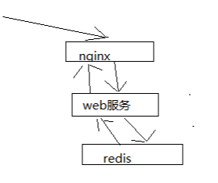

# 035. 亿级流量商品详情页的多级缓存架构以及架构中每一层的意义
[[toc]]

我们之前的三十讲，主要是在讲解 redis 如何支撑海量数据、高并发读写、高可用服务的架构

redis 架构，在我们的真正类似商品详情页读高并发的系统中，redis 就是底层的缓存存储的支持

从这一讲开始，我们正式开始做业务系统的开发

## 商品详情系统旁白

亿级流量以上的电商网站的商品详情页的系统，真实的系统中包含大量的业务，十几个人做一两年才堆出来复杂的业务系统。

而作为本课程不可能讲解复杂的业务，因为整套课程就几十个小时的课程。

如果只是纯粹的架构，那么就是一个骨架，所以必须有少量的业务，有血有肉，把整个项目串起来，在业务背景下去学习架构，效果才会理想

讲解商品详情页系统，主要讲解缓存架构，90% 大量的业务代码（没有什么技术含量），10% 的最优技术含量的就是架构，上亿流量，每秒 QPS 几万，上十万的，读并发

支撑读并发，主要是缓存架构

## 上亿流量的商品详情页系统的多级缓存架构
很多人以为，做个缓存其实就是用一下 redis 访问一下，就可以了，这个只是简单的缓存

如果做复杂的缓存，支撑电商复杂的场景下的高并发的缓存，遇到的问题非常非常之多，绝对不是说简单的访问一下 redsi 就可以的

采用三级缓存：nginx 本地缓存 + redis 分布式缓存 + tomcat 堆缓存的多级缓存架构

使用这个架构主要是为了解决业务中的一些需求和问题：

- 时效性要求非常高的数据：库存

    一般来说，显示的库存都是时效性要求会相对高一些，因为随着商品的不断的交易，库存会不断的变化

    当然，我们就希望当库存变化的时候，尽可能更快将库存显示到页面上去，而不是说等了很长时间，库存才反应到页面上去
- 时效性要求不高的数据：商品的基本信息（名称、颜色、版本、规格参数，等等）

    比如你现在改变了商品的名称，稍微晚个几分钟反应到商品页面上，也还能接受

商品价格/库存等 **时效性要求高** 的数据，而且种类较少，采取相关的服务系统每次发生了变更的时候，直接采取数据库和 redis 缓存双写的方案，这样缓存的时效性最高

商品基本信息等 **时效性不高** 的数据，而且种类繁多，来自多种不同的系统，采取 MQ 异步通知的方式，写一个数据生产服务，监听 MQ 消息，然后异步拉取服务的数据，更新 tomcat jvm 缓存 + redis 缓存

nginx+lua 脚本做页面动态生成的工作，每次请求过来，优先从 nginx 本地缓存中提取各种数据，结合页面模板，生成需要的页面，如果 nginx 本地缓存过期了，那么就从 nginx 到 redis 中去拉取数据，更新到 nginx 本地，如果 redis 中也被 LRU 算法清理掉了，那么就从 nginx走 http 接口到后端的服务中拉取数据，数据生产服务中，现在本地 tomcat 里的 jvm 堆缓存（ehcache）中找，如果也被 LRU 清理掉了，那么就重新发送请求到源头的服务中去拉取数据，然后再次更新 tomcat 堆内存缓存 + redis 缓存，并返回数据给 nginx，nginx 缓存到本地

结合上图去理解上面的文字，该架构 redis 不是应用服务主要使用的，是 nginx 通过 lua 脚本主要使用的缓存

## 多级缓存架构中每一层的意义
**nginx 本地缓存**，抗的是热数据的高并发访问，一般来说，商品的购买总是有热点的，比如每天购买 iphone、nike、海尔等知名品牌的东西的人，总是比较多的

这些热数据，利用 nginx 本地缓存，由于经常被访问，所以可以被锁定在 nginx 的本地缓存内

大量的热数据的访问，就是经常会访问的那些数据，就会被保留在 nginx 本地缓存内，那么对这些热数据的大量访问，就直接走 nginx 就可以了

那么大量的访问，直接就可以走到 nginx 就行了，不需要走后续的各种网络开销了

传统的缓存架构如下图（我自己就是这种使用的）

这样就会多出来转发的网络开销。而 nginx 直接走 redis + 本地缓存就少了很多的网络开销

**redis 分布式大规模缓存**，抗的是很高的离散访问，支撑海量的数据，高并发的访问，高可用的服务

redis 缓存最大量的数据，最完整的数据和缓存，1T+ 数据; 支撑高并发的访问，QPS 最高到几十万; 可用性，非常好，提供非常稳定的服务

因为 nginx 本地内存有限，也就能 cache 住部分热数据，除了各种 iphone、nike 等热数据，其他相对不那么热的数据，可能流量会经常走到 redis 中

利用 redis cluster 的多 master 写入，横向扩容，1T+ 以上海量数据支持，几十万的读写 QPS，99.99% 高可用性，那么就可以抗住大量的离散访问请求

**tomcat jvm 堆内存缓存**，主要是抗 redis 大规模灾难的，如果 redis 出现了大规模的宕机，导致 nginx 大量流量直接涌入数据生产服务，那么最后的 tomcat 堆内存缓存至少可以再抗一下，不至于让数据库直接裸奔

同时 tomcat jvm 堆内存缓存，也可以抗住 redis 没有 cache 住的最后那少量的部分缓存

## 小结

针对高并发访问的一些特点，进行了拆分：

- nginx 本地缓存：抗少量热数据请求
- redis：抗最完整最全量的离散访问请求
- 应用堆内存：安全防护措施，防止 mysql 数据库裸奔
