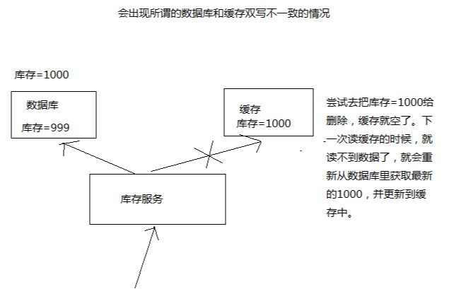
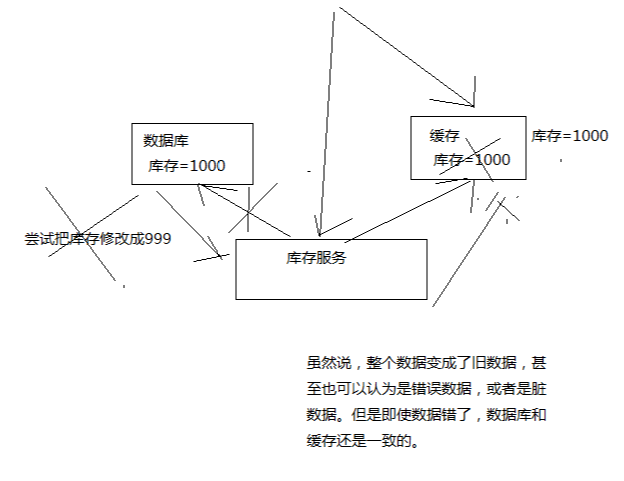
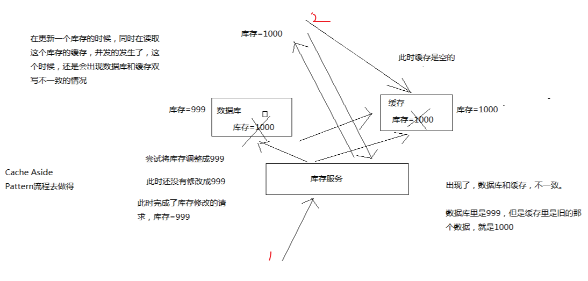
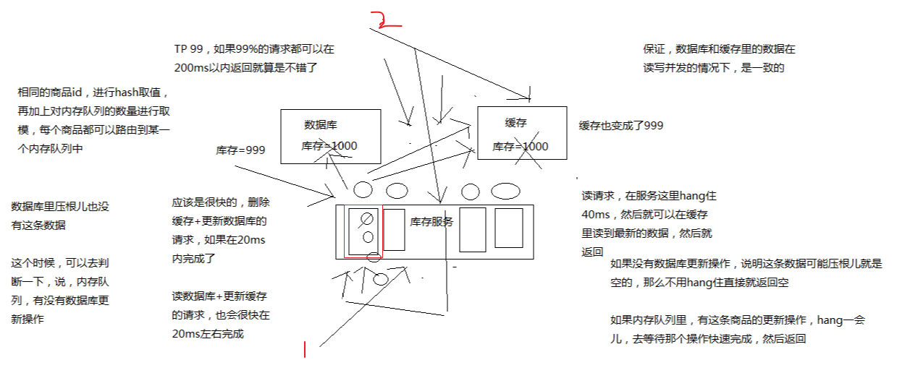
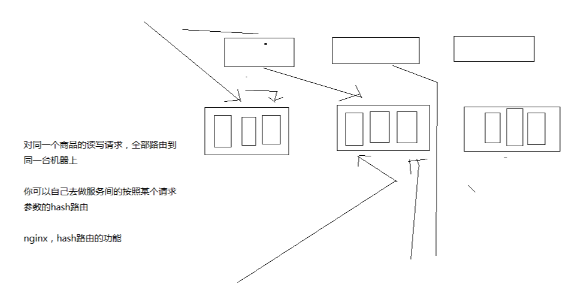

# 037. 高并发场景下的缓存 + 数据库双写不一致问题分析与解决方案设计
[[toc]]

下面要马上开始去开发业务系统了，那么从哪一步开始做？从比较简单的那一块开始做，实时性要求比较高的那块数据的缓存去做，这里选择的就是库存的服务

库存可能会修改，每次修改都要去更新这个缓存数据;
每次库存的数据，在缓存中一旦过期，或者是被清理掉了，前端的 nginx 服务都会发送请求给库存服务，去获取相应的数据

库存这一块，写数据库的时候，直接更新 redis 缓存，思路是这样简单粗暴，实际上没有这么的简单，这里其实就涉及到了一个问题，数据库与缓存双写，可能导致数据不一致的问题

围绕和结合实时性较高的库存服务，把数据库与缓存双写不一致问题以及其解决方案，给大家讲解一下

大型的缓存架构中第一个解决方案：数据库与缓存双写不一致，是一个很常见的问题

大型的缓存架构全部讲解完了以后，整套架构是非常复杂，架构可以应对各种各样奇葩和极端的情况

## 讲师旁白

也有一种可能，不是说，来讲课的就是超人，万能的

讲课，就跟写书一样，很可能会写错，也可能有些方案里的一些地方，我没考虑到

也可能说，有些方案只是适合某些场景，在某些场景下，可能需要你进行方案的优化和调整才能适用于你自己的项目

大家觉得对这些方案有什么疑问或者见解，都可以找我，沟通一下

如果的确我觉得是我讲解的不对，或者有些地方考虑不周，那么我可以在视频里补录，更新到网站上面去

多多包涵

## 最初级的缓存不一致问题以及解决方案
**问题**：先修改数据库，再删除缓存，如果删除缓存失败了，那么会导致数据库中是新数据，缓存中是旧数据，数据出现不一致

**解决思路**：先删除缓存，再修改数据库，如果删除缓存成功了，修改数据库失败了，那么数据库中是旧数据，缓存中是空的，那么数据不会不一致，因为读的时候缓存没有，则读数据库中旧数据，然后更新到缓存中

## 比较复杂的数据不一致问题分析

1. 数据发生了变更，先删除了缓存，然后要去修改数据库，此时还没修改

2. 一个请求过来，去读缓存，发现缓存空了，去查询数据库，查到了修改前的旧数据，放到了缓存中

数据变更的程序完成了数据库的修改，此时数据库是 999，缓存中却是 1000，完了，数据库和缓存中的数据不一样了。

## 为什么上亿流量高并发场景下，缓存会出现这个问题？
只有在对一个数据在并发的进行读写的时候，才可能会出现这种问题

其实如果说你的并发量很低的话，特别是读并发很低，每天访问量就 1 万次，那么很少的情况下，会出现刚才描述的那种不一致的场景

但是问题是，如果每天的是上亿的流量，每秒并发读是几万，每秒只要有数据更新的请求，就可能会出现上述的数据库 + 缓存不一致的情况

高并发了以后，问题是很多的

## 数据库与缓存更新与读取操作进行异步串行化

异步串行化是什么意思呢？原因是双写不一致的情况下才会出现：

1. 先删除缓存，更新数据库
2. 读缓存，发现缓存为空，从数据库获取数据，写入缓存

这里的双写，一个是写数据库，一个是写缓存。并发导致问题

那么看上图中的红框部分，将这两个请求通过队列串行化，就能保证数据的竞争问题

**具体流程如下**：

1. 更新数据的时候，根据数据的唯一标识，将操作路由之后，发送到一个 jvm 内部的队列中
2. 读取数据的时候，如果发现数据不在缓存中，那么将重新读取数据 + 更新缓存的操作，根据唯一标识路由之后，也发送同一个 jvm 内部的队列中
3. 一个队列对应一个工作线程，每个工作线程串行拿到对应的操作，然后一条一条的执行

这样的话，一个数据变更的操作，先执行，删除缓存，然后再去更新数据库，但是还没完成更新

此时如果一个读请求过来，读到了空的缓存，那么可以先将缓存更新的请求发送到队列中，此时会在队列中积压，然后同步等待缓存更新完成

待那个队列对应的工作线程完成了上一个操作的数据库的修改之后，才会去执行下一个操作，也就是缓存更新的操作，此时会从数据库中读取最新的值，然后写入缓存中

如果请求还在等待时间范围内，不断轮询发现可以取到值了，那么就直接返回; 如果请求等待的时间超过一定时长，那么这一次直接从数据库中读取当前的旧值

**可优化的点**：

- 一个队列中，其实多个更新缓存请求串在一起是没意义的

    因此可以做过滤，如果发现队列中已经有一个更新缓存的请求了，那么就不用再放个更新请求操作进去了，直接等待前面的更新操作请求完成即可

    比如 一个更新+写缓存操作后面更了一个读操作，那么后续的读操作就可以过滤掉，不往队列中写，只需要等待缓存能获取到数据即可
- 缓存为空，有可能不是在更新操作

    有可能是：在执行更新操作，需要阻塞一会儿

    有可能是：数据库中压根就没有该数据，那么可以判定下队列中是否有更新操作，如果没有，则直接返回空的。

我有个疑问：万一是有该数据过期了呢？是正常的读缓存呢？后续再看是怎么解决的？

## 高并发的场景下，该解决方案要注意的问题

### 读请求长时阻塞
由于读请求进行了非常轻度的异步化，所以一定要注意读超时的问题，每个读请求必须在超时时间范围内返回

该解决方案，最大的风险点在于说，可能 **数据更新很频繁**，导致队列中积压了大量更新操作在里面，然后读请求会发生大量的超时，最后导致大量的请求直接走数据库

务必通过一些模拟真实的测试，看看更新数据的频繁是怎样的

另外一点，因为一个队列中，可能会积压针对多个数据项的更新操作，因此需要根据自己的业务情况进行测试，可能需要部署多个服务，每个服务分摊一些数据的更新操作（疑问：如果是多实例，怎么能保证多实例之间不存在数据竞争呢？ -> [疑问解答](./037.md#多服务实例部署的请求路由)）

如果一个内存队列里居然会挤压 100个 商品的库存修改操作，每个库存修改操作要耗费 10ms 去完成，那么最后一个商品的读请求，可能等待 10 * 100 = 1000ms = 1s 后，才能得到数据

这个时候就导致读请求的长时阻塞

一定要做根据实际业务系统的运行情况，去进行一些压力测试，和模拟线上环境，去看看最繁忙的时候，内存队列可能会挤压多少更新操作，可能会导致最后一个更新操作对应的读请求，会阻塞多少时间，如果要求读请求在 200ms 返回，如果你计算过后，哪怕是最繁忙的时候，积压 10个 更新操作，最多等待 200ms，那还可以的

如果一个内存队列可能积压的更新操作特别多，那么你就要加机器，让每个机器上部署的服务实例处理更少的数据，那么每个内存队列中积压的更新操作就会越少

其实根据之前的项目经验，一般来说数据的写频率是很低的，因此实际上正常来说，在队列中积压的更新操作应该是很少的

针对读高并发，读缓存架构的项目，一般写请求相对读来说，是非常非常少的，每秒的 QPS 能到几百就不错了

一秒 500 的写操作，5 份，每 200ms，就 100个 写操作

单机器，20个 内存队列，每个内存队列，可能就积压 5个 写操作，每个写操作性能测试后，一般在 20ms 左右就完成，那么针对每个内存队列中的数据的读请求，也就最多阻塞一会儿，200ms 以内肯定能返回了

如果说写 QPS 扩大 10 倍，但是经过刚才的测算，就知道，单机支撑写 QPS 几百没问题，那么就扩容机器，扩容 10 倍的机器，10 台机器，每个机器 20 个队列，200 个队列

**这么一大段的解说**，主要是让你明白在高并发的超时需求下，需要严格的压测与计算

大部分的情况下，应该是这样的，大量的读请求过来，都是直接走缓存取到数据的

少量情况下，可能遇到读跟数据更新冲突的情况，如上所述，那么此时更新操作如果先入队列，之后可能会瞬间来了对这个数据大量的读请求，但是因为做了去重的优化，所以也就一个更新缓存的操作跟在它后面

等数据更新完了，读请求触发的缓存更新操作也完成，然后临时等待的读请求全部可以读到缓存中的数据

### 读请求并发量过高
这里还必须做好压力测试，确保恰巧碰上上述情况的时候，还有一个风险，就是突然间大量读请求会在几十毫秒的延时阻塞在服务上，看服务能不能抗的住，需要多少机器才能抗住最大的极限情况的峰值

但是因为并不是所有的数据都在同一时间更新，缓存也不会同一时间失效，所以每次可能也就是少数数据的缓存失效了，然后那些数据对应的读请求过来，并发量应该也不会特别大

按 1:99 的比例计算读和写的请求，每秒 5 万的读 QPS，可能只有 500 次更新操作（50000 * 0.01）

如果一秒有 500 的写 QPS，那么要测算好，可能写操作影响的数据有 500 条，这 500 条数据在缓存中失效后，可能导致多少读请求，发送读请求到库存服务来，要求更新缓存？

一般来说，1:1，1:2，1:3，每秒钟有 1000 个读请求，会阻塞在库存服务上，需要计算每个读请求最多阻塞多少时间，比如 200ms 就会返回

在同一时间最多阻塞住的可能也就是单机 200 个读请求，同时阻塞，单机阻塞 200 个读请求，还是 ok 的

比如你测算出来是 1:20，每秒更新 500 条数据，这 500秒数据对应的读请求，会有 20 * 500 = 1万，1 万个读请求全部阻塞在库存服务上，就死定了

**小结**：每个读请求阻塞时间不能太长，需要严格测算

### 多服务实例部署的请求路由

可能这个服务部署了多个实例，那么必须保证说，执行数据更新操作，以及执行缓存更新操作的请求，都通过 nginx 服务器路由到相同的服务实例上

看完这段，对于细节方面我还是不太明白，就算是路由怎么能分实例路由呢？对于写操作路由到一台固定的机器上，如果这台机器挂了呢？那么在微服务中来说微服务不就没有意义了么？这个细节上的问题不清楚，后续再看是怎么解决的；

### 热点商品的路由问题，导致请求的倾斜

万一某个商品的读写请求特别高，全部打到相同的机器的相同的队列里面去了，可能造成某台机器的压力过大

这个问题：因为只有在商品数据更新的时候才会清空缓存，然后才会导致读写并发，所以更新频率不是太高的话，这个问题的影响并不是特别大

但是的确可能某些机器的负载会高一些
