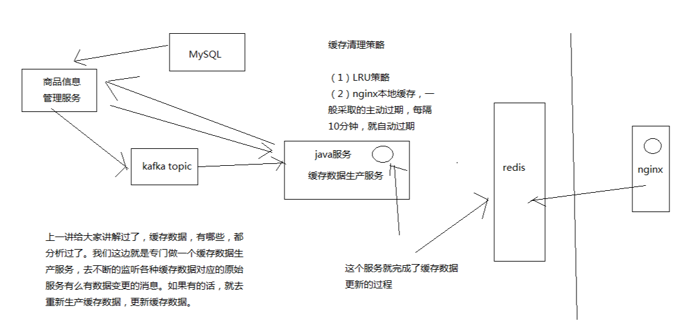

# 046. 缓存数据生产服务的工作流程分析以及工程环境搭建
接下来要做这个多级缓存架构，从底往上做，先做缓存数据的生产这一块

## 商品详情页缓存数据生产服务的工作流程分析

如上图

1. 监听多个 kafka topic，每个 kafka topic 对应一个服务

    简化一下，监听一个 kafka topic
2. 如果一个服务发生了数据变更，那么就发送一个消息到 kafka topic 中
3. 缓存数据生产服务监听到了消息以后，就发送请求到对应的服务中调用接口以及拉取数据，此时是从 mysql 中查询的
4. 缓存数据生产服务拉取到了数据之后，会将数据在本地缓存中写入一份，就是 ehcache 中
5. 同时会将数据在 redis 中写入一份

而缓存数据生产服务是前两层（nginx、redis）的基石

## 创建缓存数据生产服务项目

项目名：eshop-cache

项目基础架子可以参考 [039. 库存服务的开发框架整合与搭建：spring boot + mybatis + jedis](./039.md)

除了包名不同，基础架子就是 spring boot + mybatis + jedis 整合的架子

搭建好后：可以访问 http://localhost:6002/
