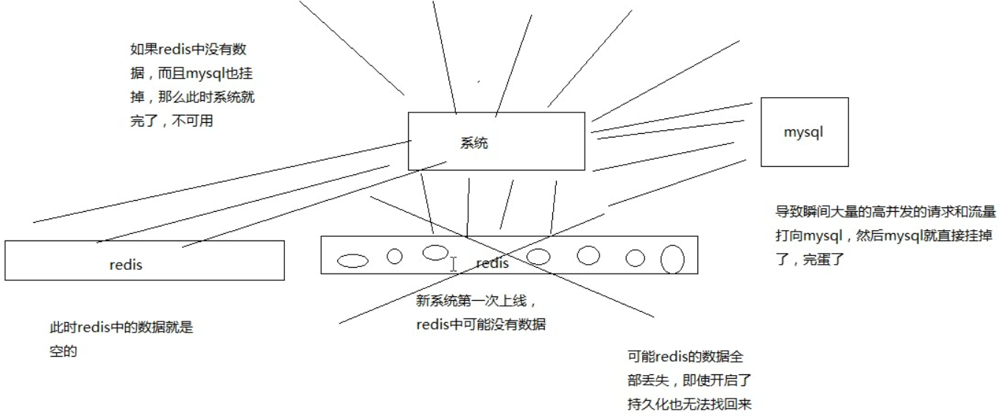

# 068. 缓存冷启动问题：新系统上线 redis 彻底崩溃导致数据无法恢复

什么是缓存冷启动？简单说就是缓存中没有数据，考虑下面两个场景

1. 新系统第一次上线，此时在缓存里可能是没有数据的
2. 系统在线上稳定运行着，但是突然间重要的 redis 缓存全盘崩溃了，而且不幸的是，数据全都无法找回来

系统第一次上线启动，系统在 redis 故障的情况下重新启动，在高并发的场景下就会出现所有的流量
都会打到 mysql（原始数据库） 上去。可能导致 mysql 崩溃

以下是图示：

本章要主题的点是 **「冷启动」**，是说缓存中没有数据但是缓存短时间又恢复正常后的流量被大量打到 mysql。

那么还有一种情况是「缓存雪崩」，可能是缓存失效、redis 挂了等，流量被大量打到 mysql 中

注意这两个场景的关注点是不同的。
