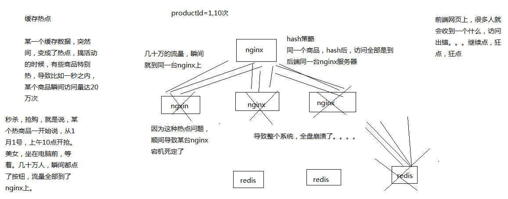

# 076. 热点缓存问题：促销抢购时的超级热门商品可能导致系统全盘崩溃的场景
热数据 -> 热数据的统计 -> redis 中缓存的预热要解决的场景是：避免新系统刚上线，或者是 redis 崩溃数据丢失后重启，
redis 中没有数据，redis 冷启动 -> 大量流量直接到数据库；

redis 启动前，必须确保其中是有部分热数据的缓存的？什么意思？不是缓存预热就是为了存入热数据到 redis 中吗？

疑问：但是这个场景貌似缺少前置条件？访问记录从何而来？而且是实时的？没有搞明白

总的来说，缓存预热的课程不是完整的，一些上下文没有交代清楚，让人无法串联知识点

现在这个热点缓存问题，是瞬间的缓存热点，如秒杀，简单说就是负载均衡的特点问题，导致大量访问瞬间被被路由到同一台机器

