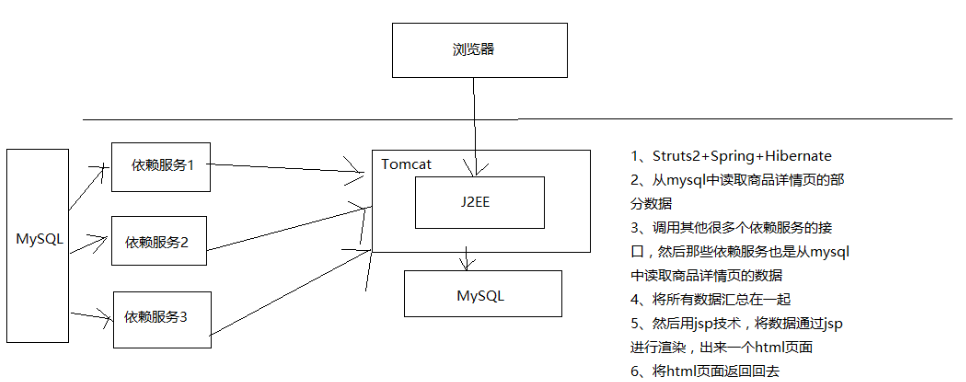

# 125. 大型电商网站的商品详情页系统架构是如何一步一步演进的
商品详情页系统架构演进历程，这里分三个版本来讲解

为什么要演进？这个只有经历过才会深刻明白，只要想到成本和时间就明白了，
在一定的时间和成本下，一般都是从第一个版本开始的，后续根据业务发展，
用户越来越多，业务越来越复杂，支撑不了的时候，就需要开始改版了

## 第一个版本

### 架构设计
J2EE + Tomcat + MySQL

动态页面，每次请求都要调用多个依赖服务的接口，从数据库里查询数据，
然后通过类似 JSP 的技术渲染到 HTML 模板中，返回最终 HTML 页面

### 架构缺陷
- 每次请求都是要访问数据库的，性能肯定很差
- 每次请求都要调用大量的依赖服务，依赖服务不稳定导致商品详情页展示的性能经常抖动

## 第二个版本

### 架构设计
页面静态化技术

- 通过 MQ 得到商品详情页涉及到的数据的变更消息
- 通过 Java Worker 服务全量调用所有的依赖服务的接口

    查询数据库，获取到构成一个商品详情页的完整数据，并通过 velocity 等模板技术生成静态 HTML

    将静态 HTML 页面通过 rsync 工具直接推送到多台 nginx 服务器上，
    每台 nginx 服务器上都有全量的HTML静态页面，nginx 对商品详情页的访问请求直接返回本地的静态 HTML 页面
### 架构缺陷
- 全量更新问题

    如果某一个商品分类、商家等信息变更了

    那么那个分类、店铺、商家下面所有的商品详情页都需要重新生成静态 HTML 页面
- 更新速度过慢问题

    分类、店铺、商家、商品越来越多，重新生成 HTML 的负载越来越高，rsync 全量同步所有 nginx 的负载也越来越高

    从数据变更到生成静态 HTML，再到全量同步到所有 nginx，时间越来越慢
- 扩容问题

    因为每个商品详情页都要全量同步到所有的 nginx 上，导致系统无法扩容，无法增加系统容量
### 架构优化

- 解决全量更新问题（维度化）

    每次 Java Worker 收到某个维度的变更消息，不是拉去全量维度并生成完整 HTML，而是按照维度拆分，
    生成一个变化维度的 HTML 片段

    nginx 对多个 HTML 片段通过 SSI 合并 html 片段然后输出一个完整的 html
- 解决扩容问题（集群化，每台机器负责其中一部分）

    每个商品详情页不是全量同步到所有的 nginx

    而是根据商品 id 路由到某一台 nginx 上，同时接入层 nginx 按照相同的逻辑路由请求
- 解决更新速度过慢问题（增加更多机器资源）

    多机房部署，每个机房部署一套 Java Worker + 应用 Nginx，
    所有机房用一套负载均衡设备，在每个机房内部完成全流程，不跨机房

### 架构优化后的缺陷
- 更新速度还是不够快的问题

    商品的每个维度都有一个 HTML 片段，rsync 推送大量的 HTML 片段，负载太高，性能较差

    Nginx 基于机械硬盘进行 SSI 合并，性能太差
- 还是存在全量更新的问题

    虽然解决了分类、商家、店铺维度的变更，只要增量重新生产较小的 HTML 片段即可，
    不用全量重新生成关联的所有商品详情页的 HTML

    但是如果某个页面模板变更，或者新加入一个页面模板，还是会导致几亿个商品的 HTML 片段都要重新生成和 rsync，
    要几天时间才能完成，无法响应需求
- 还是存在容量问题

    nginx 存储有限，不能无限存储几亿，以及增长的商品详情页的 HTML 文件

    如果 nginx 存储达到极限，需要删除部分商品详情页的 HTML 文件，改成 nginx 找不到 HTML，
    则调用后端接口，回到动态页面的架构

    动态页面架构在高并发访问的情况下，会对依赖系统造成过大的压力，几乎扛不住
## 第三个版本

### 需要支持的需求
- 迅速响应各种页面模板的改版和个性化需求的新模板的加入
- 页面模块化，页面中的某个区域变化，只要更新这个区域中的数据即可
- 支持高性能访问
- 支持水平扩容的伸缩性架构

### 系统架构设计
1. 依赖服务有数据变更发送消息到 MQ
2. 监听数据变更事件，写入缓存

    数据异构 Worker 服务监听 MQ 中的变更消息，调用依赖服务的接口，仅仅拉取有变更的数据即可，然后将数据存储到 redis 中

    数据异构 Worker 存储到 redis 中都是原子未加工数据，包括商品基本信息、商品扩展属性、
    商品其他信息、商品规格参数、商品分类、商家信息

    数据异构 Worker 发送消息到 MQ，数据聚合 Worker 监听到 MQ 消息

    数据聚合 Worker 将原子数据从 redis 中取出，按照维度聚合后存储到 redis 中，包括三个维度

      - 基本信息维度：基本信息、扩展属性
			- 商品介绍：PC 版、移动版
			- 其他信息：商品分类、商家信息

    nginx+lua：lua 从 redis 读取商品各个维度的数据，通过 nginx 动态渲染到 html 模板中，然后输出最终的 html

简单说最大的变化就是：使用上了缓存、html 是通过模板动态渲染的

### 如何解决的问题
- 更新问题：不再是生成和推送 html 片段了，不再需要合成 html，直接数据更新到 redis，然后走动态渲染，性能大大提升
- 全量更新问题：数据和模板分离，数据更新呢就更新数据，模板更新直接推送模板到 nginx，不需要重新生成所有 html，直接走动态渲染
- 容量问题：不需要依赖 nginx 所在机器的磁盘空间存储大量的 html，将数据放 redis，html 就存放模板，大大减少空间占用，而且 redis 集群可扩容

## 小结
从三个版本架构的演进来看，其实就是由一个从简到繁，不停的打补丁，最后打补丁都无法解决了，
才明白问题是出在根源上：没有使用缓存！

当第三个版本的时候，使用上了缓存，整个架构从根上就开始变化，后续的手段都是基于这个变化而变化的。
