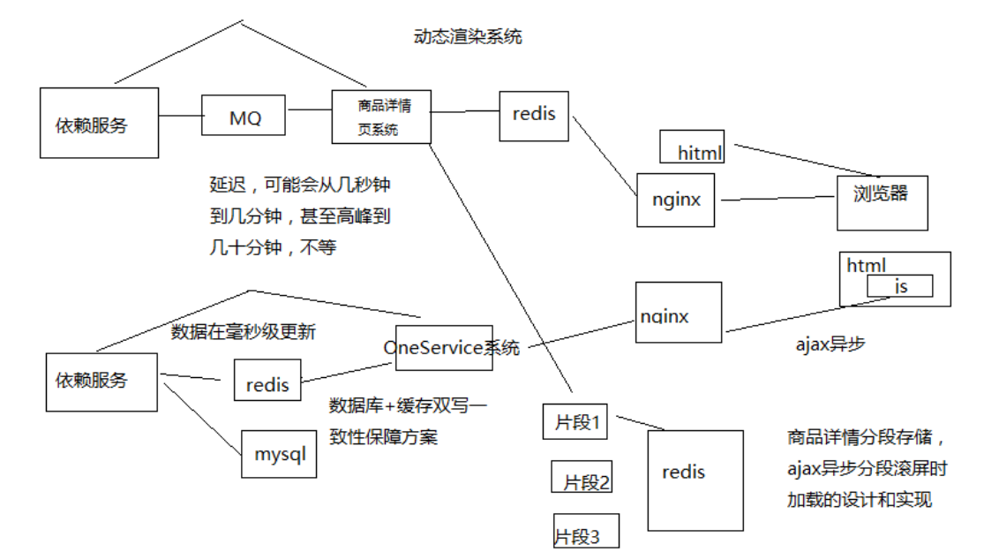

# 126. 亿级流量大型电商网站的商品详情页系统架构的整体设计
商品详情页整体架构组成（也就是上一章节的第三版）

- 动态渲染系统

    将页面中静的数据，直接在变更的时候推送到缓存，然后每次请求页面动态渲染新数据

    商品详情页系统（负责静的部分）：被动接收数据，存储 redis，nginx+lua 动态渲染

    商品详情页动态服务系统（对外提供数据接口）

    - 提供各种数据接口
    - 动态调用依赖服务的接口，产生数据并且返回响应
    - 从商品详情页系统处理出来的 redis 中，获取数据，并返回响应

- OneService 系统

    动的部分，都是走 ajax 异步请求的，不是走动态渲染的，
    商品详情页统一服务系统（负责动的部分）

- 前端页面

    静的部分，直接被动态渲染系统渲染进去了

    动的部分，html 一到浏览器，直接走 js 脚本，ajax 异步加载

    商品详情页，分段存储，ajax 异步分屏加载

- 工程运维：限流、压测、灰度发布

从上图和描述来看，暂时笔者还不知道为什么有动态渲染系统 和 OneService 系统，
他们在这里表现出来只是少了一个 mq，但是在高峰期要么失败，要么降级，
与 mq 排队更新，貌似是差不多的
