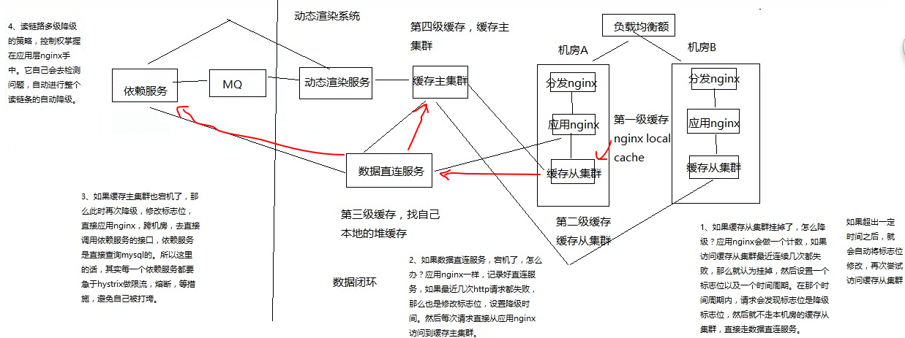

# 132. 商品详情页动态渲染系统：全链路高可用架构设计
动态渲染系统在 读链路 高可用方面怎么考虑，
由于采用了多级缓存，每级缓存都会通过网络访问，就有可能导致读异常（也有可能服务挂掉）



如上图：

```
nginx local cache -> 缓存从集群 -> 数据直连服务：缓存主集群 -> 数据直连服务: 依赖服务
```

读链路多级降级：本机房从集群 -> 主集群 -> 直连

1. 缓存从集群故障

  简单断路功能，降级访问数据直连服务
2. 数据直连服务故障

  断路功能，直接访问主集群
3. 主集群故障

  断路功能，直接调用依赖服务

貌似会觉得这个就是多次缓存找不到的一层一层去重建的过程，实际上还是有区别的，
这三个故障的请求控制都在 nginx 上，而多级缓存失效重建的流程却是分散在各个节点上的

全链路隔离

- 基于 hystrix 的依赖调用隔离、限流、熔断、降级
- 普通服务的多机房容灾冗余部署以及隔离

限流等功能能保证每个节点服务不会被直接打死，虽然限流，至少系统还能处理部分请求，
不至于全盘崩溃来的好。

通过这一章的分析，在降级方面的应用，多了一点理解
