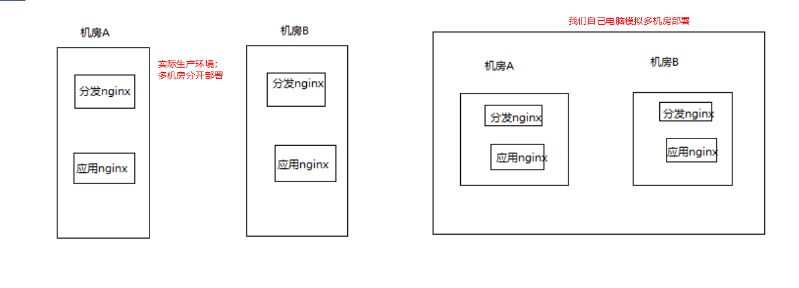

# 136. 商品详情页动态渲染系统：双机房部署接入层与应用层 Nginx+Lua


会分两个目录来安装 OpenResty:

- distribution_nginx：分发层，使用端口 80
- app_nginx：应用层，使用端口 8000

基本目录：/usr/servers/

安装 [openResty + lua 请参考这里](../052.md)，按照之前的安装方式，安装在这里的指定目录下，部署内容不包括工程化 nginx+lua 项目结构

过程中需要注意的是路径，比如下面这个 --prefix 的路径一定要是对应的 nginx 路径，否则就装成之前的了

```
./configure --prefix=/usr/servers/distribution_nginx --with-http_realip_module  --with-pcre  --with-luajit --add-module=./bundle/ngx_cache_purge-2.3/ --add-module=./bundle/nginx_upstream_check_module-0.3.0/ -j2
```

验证的时候使用下面的，如 distribution_nginx 目录下的 nginx，才表示没有安装错目录

```bash
[root@eshop-detail01 nginx]# /usr/servers/distribution_nginx/nginx/sbin/nginx -t
nginx: the configuration file /usr/servers/distribution_nginx/nginx/conf/nginx.conf syntax is ok
nginx: configuration file /usr/servers/distribution_nginx/nginx/conf/nginx.conf test is successful
```
同样启动也是启动对应目录下的

```
/usr/servers/distribution_nginx/nginx/sbin/nginx
```

启动后访问：http://192.168.99.11/lua 表示搭建第一个成功

只搭建了一个目前，后续几个照样搭建。

在搭建 app_nginx 的时候，需要把 nginx.conf 中的端口号修改为 8000，还有 lua.conf 中的也修改为 8000，才能正常启动

安装完毕后，访问一下地址是可以访问到的

- http://192.168.99.11/lua
- http://192.168.99.11:8000/lua
- http://192.168.99.12/lua
- http://192.168.99.12:8000/lua
