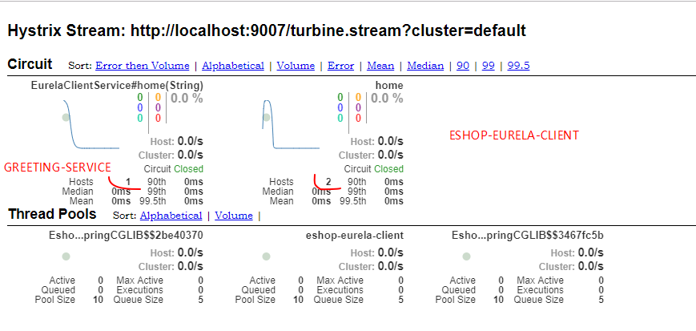
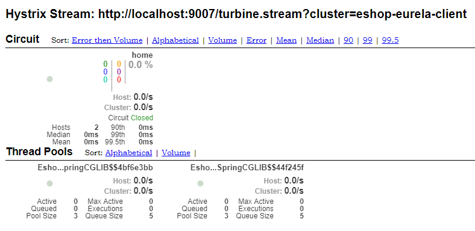

# 153. 商品详情页动态渲染系统：Spring Cloud 之 Hystrix 熔断降级
微服务架构，很重要的就是多个服务之间互相调用，很可能某个服务就死了，然后依赖它的其他服务调用大量超时，最后耗尽资源，继续死，最终导致整个系统崩盘

使用 hystrix 去做资源隔离、限流、熔断、降级

## 整合 hystrix
添加依赖

```
// 注：spring-cloud-starter-netflix-eureka-client 中已经依赖了 ribbon、hystrix、openfeign
compile 'org.springframework.cloud:spring-cloud-starter-netflix-hystrix'
```

开启 hystrix

```yml
feign:
  hystrix:
    enabled: true
```

配置与降级逻辑实现

```java
@FeignClient(name = "eshop-eurela-client", fallback = EurelaClientServiceFallback.class)
public interface EurelaClientService {
    @GetMapping("/")
    String home(@RequestParam(name = "name") String name);
}

@Component
public class EurelaClientServiceFallback implements EurelaClientService {

    @Override
    public String home(String name) {
        return "error " + name;
    }
}
```

测试步骤：

1. 重启项目后访问地址 http://localhost:9005/ 查看是否能访问
2. 关闭掉 eshop-eurela-client 实例
3. 再次访问 http://localhost:9005/ 查看是否走了降级机制

在测试过程中发现如下特性：

1. 当其中一个实例关闭时，第一次访问到挂掉的实例时会走降级机制，后续就不会再访问到该实例了
2. 2 个实例都挂掉时，肯定每次访问都是走降级机制了
3. 当实例恢复后，又可以正常提供服务了

## hystrix dashboard 整合

添加依赖

```
// https://cloud.spring.io/spring-cloud-netflix/reference/html/#_how_to_include_hystrix
// https://cloud.spring.io/spring-cloud-static/Greenwich.SR2/single/spring-cloud.html#_circuit_breaker_hystrix_dashboard
compile 'org.springframework.cloud:spring-cloud-starter-netflix-hystrix-dashboard'
compile 'org.springframework.boot:spring-boot-starter-actuator'
```

注解开启

```
@EnableHystrixDashboard
@EnableCircuitBreaker
```

hystrix dashboard ui 使用

- 访问地址：`http://localhost:9005/hystrix`
- 填入要监控的服务：`http://localhost:9005/actuator/hystrix.stream`

  由于我们在 greeting-service 上开启了 CircuitBreaker 断路器，它就会提供一个 `/hystrix.stream` 服务,
  通过这个服务，dashboard 就能拿到 greeting-service 上断路器状态数据并进行聚合展示了


## /hystrix.stream 404 问题解决
但是在访问 `/hystrix.stream` ，这是因为 boot 2 使用了 endpoint 来管理这些扩展端点，这个配置就是 actuator 包来自动配置的。
暴露该端点

```yml
management:
  endpoints:
    web:
      exposure:
        # 暴露所有端点
        include: '*'  # 或者单独暴露 /hystrix.stream 断点
```

配置之后还是发现无法访问，最后在 dashboard ui 中看到了正确的地址

```
https://hystrix-app:port/actuator/hystrix.stream
```


## 改造被调用服务也支持 hystrix

添加依赖等配置与上面的一致，唯一不同的一点就是下面这个。
手动让自己提供服务的方法也支持 hystrix 的管控

eshop-eurela-client 项目

```java
@RequestMapping("/")
@HystrixCommand(fallbackMethod = "sayHello")
public String home(String name) {
    // 注意，前面在 greeting-service 中调用没有传递相关参数
    // 这里为了模拟异常，已添加上
    if (name != null && name.equals("error")) {
        throw new RuntimeException("故意异常走降级机制");
    }
    return "Hello world port " + port;
}

public String sayHello(String name) {
    return "降级机制";
}
```

之前已经深入讲解过 hystrix 了，这里不再多说，这里只是使用了注解方式让我们自己的方法使用上 hystrix

测试：访问地址 http://localhost:9005/?name=error，可以看到输出了 `降级机制`

## turbine （hystrix dashboard 集群聚合服务）
[此方式在官网教程也有讲解](https://cloud.spring.io/spring-cloud-static/Greenwich.SR2/single/spring-cloud.html#_turbine)

turbine 只是一个聚合 hystrix dashboard stream 的服务，前面讲解的是单实例的 hystrix dashboard stream 支持。

::: tip
这里只要注意 turbine 不要部署在但实例 hystrix dashboard 上，
因为它是聚合多个流，一般建议建立一个空项目来开启 turbine
:::

新创建一个项目 eshop-turbine

eshop-turbine/build.gradle

```groovy
plugins {
    id 'org.springframework.boot' version '2.1.6.RELEASE'
    id 'java'
}

apply plugin: 'io.spring.dependency-management'

ext {
    set('springCloudVersion', "Greenwich.SR2")
}

dependencies {
    implementation 'org.springframework.cloud:spring-cloud-starter-netflix-eureka-client'
    implementation 'org.springframework.boot:spring-boot-starter-web'
    testImplementation 'org.springframework.boot:spring-boot-starter-test'
    compile 'org.springframework.boot:spring-boot-starter-actuator'
    // 添加 turbine 自动配置
    compile 'org.springframework.cloud:spring-cloud-starter-netflix-turbine'
    compile 'org.springframework.cloud:spring-cloud-netflix-turbine'
}

dependencyManagement {
    imports {
        mavenBom "org.springframework.cloud:spring-cloud-dependencies:${springCloudVersion}"
    }
}

```

使用注解开启

```java
@EnableTurbine
```

application.yml

```yml
server:
  port: 9007

spring:
  application:
    name: eshop-turbine

eureka:
  client:
    serviceUrl:
      defaultZone: http://localhost:8761/eureka/

management:
  endpoints:
    web:
      exposure:
        include: '*'

turbine:
  # 要聚合的服务
  app-config: ESHOP-EURELA-CLIENT,GREETING-SERVICE
  # 聚合集群配置，其他客户端没有配置，则这里使用默认
  # 注意下面的配置非常重要，否则访问 http://localhost:9007/clusters 不会出现任何 /urbine.stream 地址
  aggregator:
    cluster-config: default
  cluster-name-expression: "'default'"
```

启动项目后可访问如下地址：

- turbine 支持聚合的服务地址： http://localhost:9007/clusters
- 聚合流：http://localhost:9007/turbine.stream

在任意一个支持  hystrix dashboard ui 上填入这里的聚合流地址，都能监控所有已配置的服务



可以从图上看到，通过这里的默认配置，把集群中的所有断路器名称都拿过来聚合了，
这里也看到有一丝乱，因为集群没有分开，所以导致看到的是所有服务的

### 分集群聚合

```yml
turbine:
  # 要聚合的服务
  app-config: ESHOP-EURELA-CLIENT,GREETING-SERVICE
  aggregator:
    cluster-config: eshop-eurela-client
  clusterNameExpression: metadata['cluster']
```

具体的客户端需要通过如下配置暴露自己的集群名称

```yml
eureka:
  client:
    serviceUrl:
      defaultZone: http://localhost:8761/eureka/
  instance:
    metadata-map:
      # 这里的 cluster 对应了 clusterNameExpression 中的 metadata['cluster'] 表达式要获取的字段
      # 而这里的 eshop-eurela-client 则对应了 cluster-config 中的值
      cluster: eshop-eurela-client
```



现在就把 client 项目中的数据分离开来聚合统计显示了
