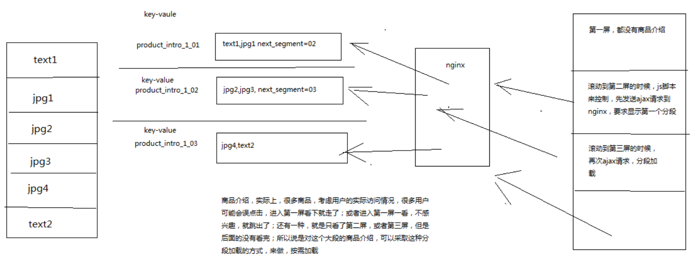

# 177. 商品详情页动态渲染系统：商品介绍分段存储以及分段加载的介绍
这里是提供一个思路，商品介绍 product_intro 里面可能包含大段的文字，还有大量的图片，
存储的时候，完全可以将大段的东西，分段来存储，因为一般最好不要将一个特别大的 value 存储到 redis 中

通过上图可以了解到一个 **使用场景** ：商品详情页面的浏览，很多时候只会加载第一屏，
所以如果你的商品详情内容很多，那么都查询出来，不在第一屏的内容就是白加载了，浪费了流量带宽
