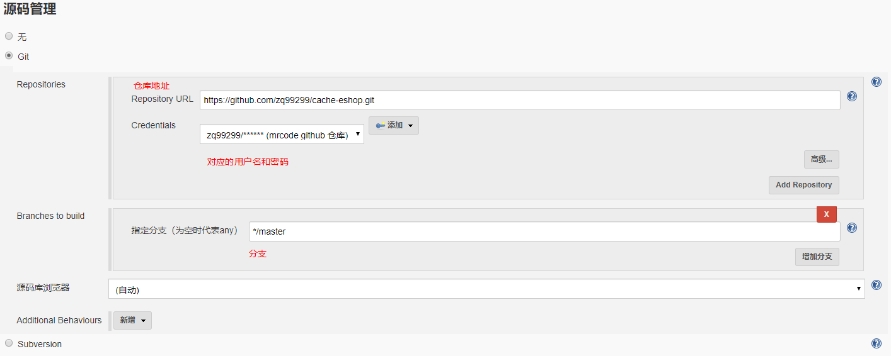
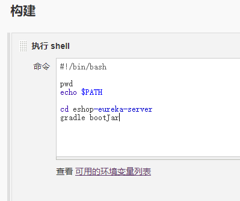
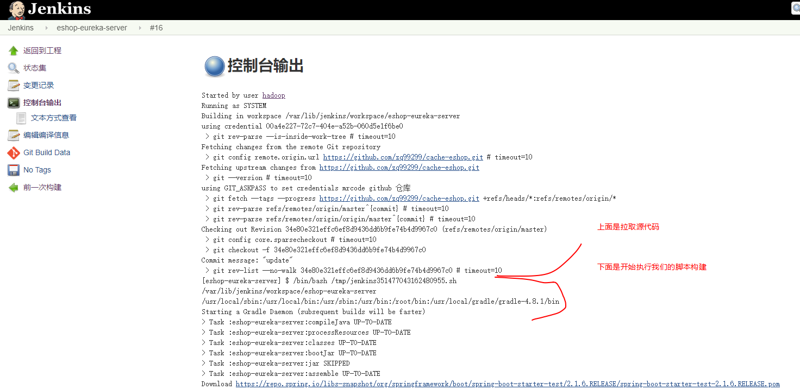

# 183. 商品详情页动态渲染系统：通过 jenkins+docker 部署 eureka 服务
1. 开始创建一个新任务。

2. 任务信息

  - 任务名称：eshop-eureka-server
  - 选择：构建一个自由风格的软件项目
3. General -> 源码管理

  
  
4. 添加构建步骤

  

  说明，由于我们这里的仓库只有一个，所以需要手动进入到服务注册中心这个目录，来构建。
  就无法使用 jenkins 自带的，gradle 或者 maven 来构建了。

  - pwd: 显示当前在那个目录下，可以看到当前目录在 `/var/lib/jenkins/workspace/eshop-eureka-server` 下，注意这里的 eshop-eureka-server 是任务名称。而这个目录下就是我们的 git 源代码了。
  - `echo $PATH`：显示当前的环境变量，当遇到执行系统中的某些命令提示 command not found 时，对比本机上的环境变量信息（后面有解决方案）

  上面是尝试和解决 command not found 的测试，下面是 gradle build 构建步骤的完整 shell 脚本

  ```bash
  #!/bin/bash
  cd eshop-eureka-server
  gradle build
  ```

  保存之后，可以点击立即构建，

  

  构建成功之后，会在 `/var/lib/jenkins/workspace/eshop-eureka-server/eshop-eureka-server/build/libs` 中生成 eshop-eureka-server-1.0.0.jar 包。构建成功

5. 给项目添加 DockerFile

  在 `H:\dev\project\mrcode\cache-eshop\eshop-eureka-server` 也就是服务注册中心的项目根目录下添加一个名为 Dockerfile 的文件，
  内容如下，有关 docker 的使用这里没有深入讲解，[可以参考这个入门教程 ](https://github.com/zq99299/essay-note/blob/master/chapter/container/index.md) 和这个[第一个 docker jar](https://github.com/zq99299/essay-note/blob/master/chapter/imooc/spring_cloud/container_deployment/first.md)

  ```
  # 从这个地址获取一个 doker 镜像
  FROM frolvlad/alpine-oraclejdk8:slim
  VOLUME /tmp
  # 使用 gradle build 打包好那个 jar
  ADD build/libs/eshop-eureka-server-1.0.0.jar app.jar
  #RUN bash -c 'touch /app.jar'

  # 运行这个 jar 包
  ENTRYPOINT ["java","-Djava.security.egd=file:/dev/./urandom","-jar","/app.jar"]

  # 暴露端口
  EXPOSE 8761
  ```
6. 添加构建步骤 - docker

  ```bash
  #!/bin/bash
  # doker 地址
  REGISTRY_URL=192.168.99.20:2375
  # 选择一个目录进行打包，这里写 /var/lib/jenkins 是为了简化 linux 权限相关，执行命令是用 jenkins 用户执行的
  # 所以这里直接写在 jenkins 目录下，跳过了目录权限等问题
  WORK_DIR=/var/lib/jenkins/work_build
  PROJECT_NAME=eshop-eureka-server
  PROJECT_VERSION=1.0.0

  # 如果这个目录不存在则创建它
  if [ ! -e ${WORK_DIR}/${PROJECT_NAME} ] && [ ! -d ${WORK_DIR}/${PROJECT_NAME} ]; then
  mkdir -p ${WORK_DIR}/${PROJECT_NAME}
  echo "Create Dir: ${WORK_DIR}/${PROJECT_NAME}"
  fi

  # 如果 Dockerfile 这个文件存在，则删除它
  if [ -e ${WORK_DIR}/${PROJECT_NAME}/Dockerfile ]; then
  rm -rf ${WORK_DIR}/${PROJECT_NAME}/Dockerfile
  echo "Remove File: ${WORK_DIR}/${PROJECT_NAME}/Dockerfile"
  fi

  # 把项目中的 Dockerfile 与 打好包的 boot jar 包 复制到目录下
  cp /var/lib/jenkins/workspace/eshop-eureka-server/eshop-eureka-server/Dockerfile ${WORK_DIR}/${PROJECT_NAME}/
  cp /var/lib/jenkins/workspace/eshop-eureka-server/eshop-eureka-server/build/libs/*.jar ${WORK_DIR}/${PROJECT_NAME}/
  cd ${WORK_DIR}/${PROJECT_NAME}/

  # docker 构建
  docker build -t ${REGISTRY_URL}/eshop-detail/${PROJECT_NAME}:${PROJECT_VERSION} .
  # 仓库 192.168.99.20:2375/eshop-detail/eshop-eureka-server
  docker push ${REGISTRY_URL}/eshop-detail/${PROJECT_NAME}:${PROJECT_VERSION}
  # 查看是否有这个服务运行
  # docker ps -a | grep eshop-eureka-server
  if docker ps -a | grep ${PROJECT_NAME}; then
  # 移除正在运行的镜像
  # docker rm -f eshop-eureka-server
  docker rm -f ${PROJECT_NAME}
  echo "Remove Docker Container: ${PROJECT_NAME}"
  fi

  # 使用 docker 运行镜像
  # 在运行时可能报错端口等问题，可参考后面的 重置 docker 网络 解决
  # 把 docker 中的 8761 与宿主机的 8761 相关联，
  # 运行 192.168.99.20:2375/eshop-detail/eshop-eureka-server:1.0.0 并取名 eshop-eureka-server
  # docker run -d -p 8761:8761 --name eshop-eureka-server 192.168.99.20:2375/eshop-detail/eshop-eureka-server:1.0.0
  docker run -d -p 8761:8761 --name ${PROJECT_NAME} ${REGISTRY_URL}/eshop-detail/${PROJECT_NAME}:${PROJECT_VERSION}
  ```

添加好之后，就可以尝试立即构建了，构建成功之后可以访问：http://192.168.99.20:8761/ 看到注册中心界面

后面的是这个实验过程中的各种错误解决。

## jenkins shell command not found
在 jenkins 中执行 shell 脚本提示 command not found，比如上面我们用到了 gradle，
居然报错：gradle command not found；

解决方案：

在终端上查看当前 path 信息

```
[root@localhost eshop-eureka-server]# echo $PATH
/usr/local/sbin:/usr/local/bin:/usr/sbin:/usr/bin:/root/bin:/usr/local/gradle/gradle-4.8.1/bin
```

覆盖 jenkins 中的 path 变量：jenkins -> 系统管理 -> 系统设置


如上图，使用终端上的 path 信息覆盖之后，就可以正常使用了

## dial unix /var/run/docker.sock: connect: permission denied

使用 jenkins 中执行 shell 出现权限不足的提示，这里还是让 jenkins 用 root 身份执行执行把，
不然要修改的脚本太多了。

让 jenkins 使用 root 身份执行设置如下：
## 让 jenkins 使用 root 用户
```bash
# 将配置中的 JENKINS_USER="jenkins" 修改为 root
vi /etc/sysconfig/jenkins

# 并将相关几个目录修改为 root 所有
chown -R root:root /var/lib/jenkins
chown -R root:root /var/cache/jenkins
chown -R root:root /var/log/jenkins

# 重启Jenkins（若是其他方式安装的jenkins则重启方式略不同）
service jenkins restart
# 查看Jenkins进程所属用户
# 若显示为 root 用户，则表示修改完成
ps -ef | grep jenkins

```

## docker run 报错 docker0，重置 docker 网络
```
[root@localhost eshop-eureka-server]# docker ps -a | grep eshop-eureka-server
[root@localhost eshop-eureka-server]# docker run -d -p 8761:8761 --name eshop-eureka-server  192.168.99.20:2375/eshop-detail/eshop-eureka-server:1.0.0
0fbb1b660dede294593a540bb6c5d64ea55517572e5f6fa49deeae4077f65238
docker: Error response from daemon: driver failed programming external connectivity on endpoint eshop-eureka-server (4f4111c8f21f1d4c29c14aeb4e5775b065e9e955819861f2a34ef23652ea6238):  (iptables failed: iptables --wait -t nat -A DOCKER -p tcp -d 0/0 --dport 8761 -j DNAT --to-destination 172.17.0.2:8761 ! -i docker0: iptables: No chain/target/match by that name.
 (exit status 1)).

```

重置 docker 网络

```bash
pkill docker
iptables -t nat -F
# yum install net-tools  安装后可用 ifconfig 命令
ifconfig docker0 down
# yum install bridge-utils 安装后可用 brctl
brctl delbr docker0
docker -d
service docker restart
```
