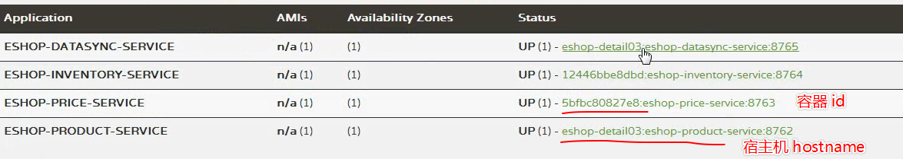

# 185. 商品详情页动态渲染系统：所有服务最终修改以及 jenkins+docker 部署

本章不部署所有的了，前面使用 jenkins + docker 部署了一个服务，
其他的服务也是类似的构建步骤，只是需要把其中的各种数据库等都写生产环境的 ip 地址，就可以了。

本次要实现这些部署，可能要耗费大量的时间，就不实践了

查看某个容器运行的日志：

## 查看 docker 容器应用日志 logs

语法：`docker logs -f -t --tail 行数 容器名`

比如：`docker logs --tail="100" eshop-eureka-server` 获取容器运行后 100 行的文件内容（文件末尾）

## 查看 docker 容器应用日志 inspect
通过查看某个镜像 CONTAINER ID 的详细信息

```
[root@localhost eshop-eureka-server]# docker ps -a
CONTAINER ID        IMAGE                                                       COMMAND                  CREATED             STATUS                  PORTS                    NAMES
45f7ac13c9c5        192.168.99.20:2375/eshop-detail/eshop-eureka-server:1.0.0   "java -Djava.securit…"   34 minutes ago      Up 34 minutes           0.0.0.0:8761->8761/tcp   eshop-eureka-server
27783f1b4c9f        hello-world                                                 "/hello"                 3 days ago          Exited (0) 3 days ago                            stupefied_matsumoto
[root@localhost eshop-eureka-server]# docker inspect 45f7ac13c9c5
```

在详细信息中找到 LogPath : `"LogPath": "/var/lib/docker/containers/45f7ac13c9c5d963489f9de09262258950a7b3dcf5a4b91d3eadbefae890c7fc/45f7ac13c9c5d963489f9de09262258950a7b3dcf5a4b91d3eadbefae890c7fc-json.log",
`，这个路径则是宿主机上的物理文件路径，里面就是存放的日志，可以直接查看，比如

```
[root@localhost eshop-eureka-server]# tail -f /var/lib/docker/containers/45f7ac13c9c5d963489f9de09262258950a7b3dcf5a4b91d3eadbefae890c7fc/45f7ac13c9c5d963489f9de09262258950a7b3dcf5a4b91d3eadbefae890c7fc-json.log
{"log":"2019-09-22 15:44:12.581  INFO 1 --- [a-EvictionTimer] c.n.e.registry.AbstractInstanceRegistry  : Running the evict task with compensationTime 0ms\n","stream":"stdout","time":"2019-09-22T15:44:12.582373481Z"}
{"log":"2019-09-22 15:45:12.581  INFO 1 --- [a-EvictionTimer] c.n.e.registry.AbstractInstanceRegistry  : Running the evict task with compensationTime 0ms\n","stream":"stdout","time":"2019-09-22T15:45:12.582319173Z"}
{"log":"2019-09-22 15:46:12.581  INFO 1 --- [a-EvictionTimer] c.n.e.registry.AbstractInstanceRegistry  : Running the evict task with compensationTime 0ms\n","stream":"stdout","time":"2019-09-22T15:46:12.581907101Z"}

```

## docker 运行后的 host name 问题

需要添加 `--network="host"`，参数，host 网络模式，所有容器端口都对应属主机端口，不存在映射关系。
```
docker run -d -p 8767:8767 --network="host" --name ${PROJECT_NAME} ${REGISTRY_URL}/eshop-detail/${PROJECT_NAME}:${PROJECT_VERSION}
```

下图展示了用 host 与不用 host 注册到 eureka 的区别


