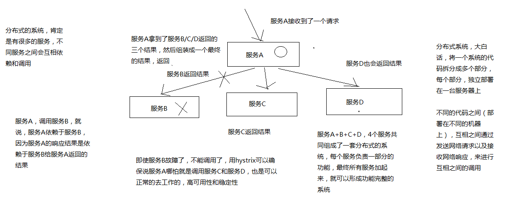
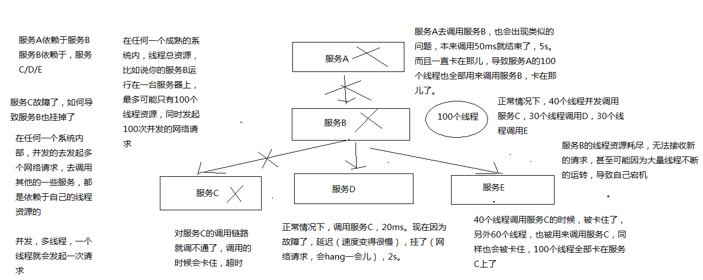

# 085. hystrix 要解决的分布式系统可用性问题以及其设计原则

我们的主题是：高可用性，会用几讲的时间来讲解一下如何用 hystrix 来构建高可用的服务的架构，
咱们会用一个真实的项目背景，作为业务场景，来带出来在这个特定的业务场景下，
可能会产生哪些各种各样的可用性的一些问题，针对这些问题，我们用 hystrix 的解决方案和原理是什么？

带着大家，纯手工将所有的服务的高可用架构的代码，全部纯手工自己敲出来，形成高可用服务架构的项目实战的一个课程

## hystrix 是什么？
在分布式系统中，每个服务都可能会调用很多其他服务，被调用的那些服务就是依赖服务，有的时候某些依赖服务出现故障也是很正常的。

Hystrix 可以让我们在分布式系统中对服务间的调用进行控制，加入一些调用延迟或者依赖故障的容错机制。
Hystrix 通过将依赖服务进行资源隔离，进而阻止某个依赖服务出现故障的时候，这种故障在整个系统所有的依赖服务调用中进行蔓延，
同时 Hystrix 还提供故障时的 fallback 降级机制

总而言之，Hystrix 通过这些方法帮助我们提升分布式系统的可用性和稳定性

上面一段文字用下图示意

疑问：看完还是没有概念能打消想知道 b 服务不能使用时怎么能保证，a 服务功能完整性?

## Hystrix 的历史
hystrix 就是一种高可用保障的一个框架，类似于 spring（ioc、mvc）、mybatis、activiti、lucene 框架，
预先封装好的为了解决某个特定领域的特定问题的一套代码库，用了框架来解决这个领域的特定的问题，
就可以大大减少我们的工作量，提升我们的工作质量和工作效率

Netflix（网飞公司，美国流媒体巨头、世界最大的收费视频网站网飞），API 团队从 2011 年开始做一些提升系统可用性和稳定性的工作，
Hystrix 就是从那时候开始发展出来的。在 2012 年的时候，Hystrix 就变得比较成熟和稳定了，
Netflix 中，除了 API 团队以外，很多其他的团队都开始使用 Hystrix。

时至今日，Netflix 中每天都有数十亿次的服务间调用，通过 Hystrix 框架在进行，
而 Hystrix 也帮助 Netflix 网站提升了整体的可用性和稳定性

## 初步看一看 Hystrix 的设计原则是什么？
hystrix 为了实现高可用性的架构，设计 hystrix 的时候，一些设计原则是什么？

1. 对依赖服务调用时出现的调用延迟和调用失败进行控制和容错保护
2. 在复杂的分布式系统中，阻止某一个依赖服务的故障在整个系统中蔓延

    服务 A - 服务 B -> 服务 C，服务 C 故障了，服务 B 也故障了，服务 A 故障了，整套分布式系统全部故障，整体宕机
3. 提供 fail-fast（快速失败）和快速恢复的支持
4. 提供 fallback 优雅降级的支持
5. 支持近实时的监控、报警以及运维操作

关键词总结：

- 调用延迟 + 失败，提供容错
- 阻止故障蔓延
- 快速失败 + 快速恢复
- 降级
- 监控 + 报警 + 运维

这里不是完全描述了 hystrix 的功能，简单来说是按照这些原则来设计 hystrix ，提供整个分布式系统的高可用的架构

## Hystrix 要解决的问题是什么？
在复杂的分布式系统架构中，每个服务都有很多的依赖服务，而每个依赖服务都可能会故障，
如果服务没有和自己的依赖服务进行隔离，那么可能某一个依赖服务的故障就会拖垮当前这个服务

**举例来说：某个服务有 30 个依赖服务，每个依赖服务的可用性非常高，已经达到了 99.99% 的高可用性**

那么该服务的可用性就是 99.99% - （100% - 99.99% * 30 = 0.3%）= 99.69%，
意味着 3% 的请求可能会失败，因为 3% 的时间内系统可能出现了故障不可用了

对于 1 亿次访问来说，3% 的请求失败也就意味着 300万 次请求会失败，也意味着每个月有 2个 小时的时间系统是不可用的，
在真实生产环境中，可能更加糟糕

上面的描述想表达的意思是：即使你每个依赖服务都是 99.99% 高可用性，但是一旦你有几十个依赖服务，
还是会导致你每个月都有几个小时是不可用的

下面画图分析说，当某一个依赖服务出现了调用延迟或者调用失败时，为什么会拖垮当前这个服务？
以及在分布式系统中，故障是如何快速蔓延的？

简而言之：

1. 假设只有系统承受并发能力是 100 个线程，
2. C 出问题的时候，耗时增加，将导致当前进入的 40 个线程得不到释放
3. 后续大量的请求涌进来，也是先调用 c，然后又在这里了
4. 最后 100 个线程都被卡在 c 了，资源耗尽，导致整个服务不能提供服务
5. 那么其他依赖的服务也会出现上述问题，导致整个系统全盘崩溃

当时这个只能是在 高并发高流量的场景下会出现这种情况，其实我工作中也遇到过一次真实的案例，
quartz 默认线程只有 25 个，当时定时任务接近 150 个左右，平时每个定时任务触发时间基本上上分散的，
而且基本上在 10 分钟左右会结束任务，当我们调用其他第三方服务时，没有加超时功能，
第三方服务可能出问题了，导致我们的请求被卡主，进而导致任务线程不能结束，最后整个任务调度系统完全崩溃，
完全不能提供服务。

这个场景在我所工作生涯中可能是记忆最深的一次了，因为当时在线上，根据日志打印完全看不出来问题，
就像系统假死一样，后来通过 jconsole 查看线程挂起情况，发现所有线程调用第三方服务后都被卡主了。
才顺藤摸瓜找到 quartz 的默认线程只有 25 个。最后加大了线程，也只是治标不治本，长时间运行还是会出问题

## 再看 hystrix 的更加细节的设计原则是什么？

1. 阻止任何一个依赖服务耗尽所有的资源，比如 tomcat 中的所有线程资源
2. 避免请求排队和积压，采用限流和 fail fast 来控制故障
3. 提供 fallback 降级机制来应对故障
4. 使用资源隔离技术

    隔离技术是为了实现第一条的功能

    比如 bulkhead（舱壁隔离技术），swimlane（泳道技术），circuit breaker（短路技术），
    来限制任何一个依赖服务的故障的影响
5. 通过近实时的统计/监控/报警功能，来提高故障发现的速度
6. 通过近实时的属性和配置热修改功能，来提高故障处理和恢复的速度
7. 保护依赖服务调用的所有故障情况，而不仅仅只是网络故障情况

    调用这个依赖服务的时候，client 调用包有 bug、阻塞，等等

    依赖服务的各种各样的 **调用的故障**，都可以处理

## Hystrix 是如何实现它的目标的？

1. 通过 HystrixCommand 或者 HystrixObservableCommand 来封装对外部依赖的访问请求
d
    这个访问请求一般会运行在独立的线程中，资源隔离
2. 对于超出我们设定阈值的服务调用，直接进行超时，不允许其耗费过长时间阻塞住。

    这个超时时间默认是 99.5% 的访问时间，但是一般我们可以自己设置一下
3. 为每一个依赖服务维护一个独立的线程池，或者是 semaphore(信号量)，当线程池已满时，直接拒绝对这个服务的调用
4. 对依赖服务的调用的成功次数、失败次数、拒绝次数、超时次数，进行统计
5. 如果对一个依赖服务的调用失败次数超过了一定的阈值，自动进行熔断

    在一定时间内对该服务的调用直接降级，一段时间后再自动尝试恢复
6. 当一个服务调用出现失败、被拒绝、超时、短路（熔断）等异常情况时，自动调用 fallback 降级机制
7. 对属性和配置的修改提供近实时的支持

疑问：上图只是站在全局角度来看的？并非自己所想，当一个依赖故障的时候，怎么搞也拿不到正确数据了？关注点关注错了？意思是说，及时这个一个小功能点不能用了，但是该系统其它的功能点能正常使用。并且不会因为这个故障导致整个系统崩溃？

## 《亿级流量电商详情页系统的大型高并发与高可用缓存架构实战》功能回顾
由于该章节稍微独立，所以需要照顾下这个独立同学的上下文知识点，回顾下这个主题的功能点

1. 亿级流量的电商网站的商品详情页系统架构
2. 大型的缓存架构，支撑高并发与高可用
3. 几十万 QPS 的高并发 + 99.99% 高可用 + 1T 以上的海量数据 + 绝对数据安全的 redis 集群架构
4. 高并发场景下的数据库 + 缓存双写一致性保障方案
5. 大缓存的维度化拆分方案
6. 基于双层 nginx 部署架构的缓存命中率提升方案
7. 基于 kafka + spring boot + ehcache + redis + nginx + lua 的多级缓存架构
8. 基于 zookeeper 的缓存并发更新安全保障方案
9. 基于 storm + zookeeper 的大规模缓存预热解决方案
10. 基于 storm + zookeeper + nginx + lua 的热点缓存自动降级与恢复解决方案
11. 基于 hystrix 的高可用缓存服务架构
12. hystrix 的进阶高可用架构方案、架构性能优化以及监控运维
13. 基于 hystrix 的大规模缓存雪崩解决方案
14. 高并发场景下的缓存穿透解决方案
15. 高并发场景下的缓存失效解决方案
