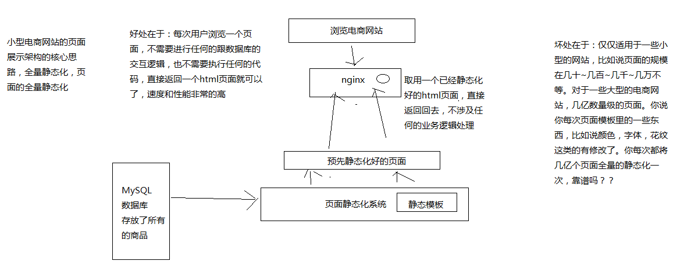

# 086. 电商网站的商品详情页缓存服务业务背景以及框架结构说明

::: tip
《亿级流量电商详情页系统的大型高并发与高可用缓存架构实战》

本笔记中会忽略这种独立章节的解释内容，本章内容是整套教程中的一部分。后续不再解释
:::

我们这个课程，基于 hystrix，如何来构建高可用的分布式系统的架构，项目实战

- 大背景：电商网站、首页、商品详情页、搜索结果页、广告页、促销活动、购物车、订单系统、库存系统、物流系统；电商里面系统太多了
- 小背景：商品详情页，如何用最快的结果将商品数据填充到一个页面中，然后将页面显示出来
- 分布式系统：商品详情页中的缓存服务，+ 底层源数据服务，商品信息服务，店铺信息服务，广告信息服务，推荐信息服务，综合起来组成一个分布式的系统

我们主要是讲解商品详情页中的缓存架构。在该背景下进行讲解；

::: tip
该章节的背景介绍在前面已经讲解过，本人不会写笔记，直接使用原始笔记润色
:::

## 电商网站的商品详情页系统架构
1. 小型电商网站的商品详情页系统架构（不是我们要讲解的）

    
2. 大型电商网站的商品详情页系统架构

    
3. 页面模板

    ```html
    举个例子

    将数据动态填充/渲染到一个 html 模板中，是什么意思呢？

    <html>
    	<title>#{name}的页面</title>
    	<body>
    		商品的价格是：#{price}
    		商品的介绍：#{description}
    	</body>
    </html>

    上面这个就可以认为是一个页面模板，里面的很多内容是不确定的，#{name}，#{price}，#{description}，这都是一些模板脚本，不确定里面的值是什么？

    将数据填充/渲染到 html 模板中，是什么意思呢？

    {
    	"name": "iphone7 plus（玫瑰金+32G）",
    	"price": 5599.50
    	"description": "这个手机特别好用。。。。。。"
    }

    <html>
    	<title>iphone7 plus（玫瑰金+32G）的页面</title>
    	<body>
    		商品的价格是：5599.50
    		商品的介绍：这个手机特别好用。。。。。。
    	</body>
    </html>
    上面这个就是一份填充好数据的一个html页面
    ```

## 缓存服务
缓存服务，订阅一个 MQ 的消息变更，如果有消息变更的话，那么就会发送一个网络请求，调用一个底层的对应的源数据服务的接口，去获取变更后的数据

将获取到的变更后的数据填充到分布式的 redis 缓存中去

高可用这一块儿，最可能出现说可用性不高的情况，是什么呢？就是说，在接收到消息之后，可能在调用各种底层依赖服务的接口时，会遇到各种不稳定的情况

比如底层服务的接口调用超时，预计 200ms 内返回，但是 2s 都没有返回; 底层服务的接口调用失败，比如说卡了 500ms 之后，返回一个报错

在分布式系统中，对于这种大量的底层依赖服务的调用，就可能会出现各种可用性的问题，一旦没有处理好的话，可能就会导致缓存服务自己本身会挂掉，或者故障掉，就会导致什么呢？不可以对外提供服务，严重情况下，甚至会导致说整个商品详情页显示不出来

**hystrix 的主题是**：缓存服务接收到变更消息后，去调用各个底层依赖服务时的**高可用架构的实现**

## 框架结构
围绕着缓存服务去拉取各种底层的源数据服务的数据，调用其接口时，可能出现的系统不可用的问题

在框架上一切从简：动手搭建 2 个 spring boot 服务，缓存服务和商品服务，缓存服务依赖于商品服务

模拟各种商品服务可能接口调用时出现的各种问题，导致系统不可用的场景，然后用 hystrix 完整的各种技术点全部贯穿在里面，解决了一大堆设计业务背景下的系统不可用问题，hystrix 整个技术体系，知识体系，也就讲解完了

消息队列、redis 咱们都不搞了，只关注这个 hystrix 的场景

简化的分布式系统的架构：spring boot + http client + hystrix
