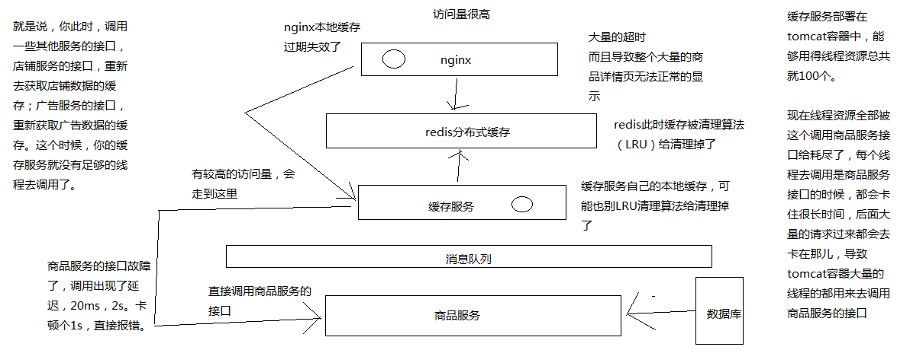

# 089. 商品服务接口故障导致的高并发访问耗尽缓存服务资源的场景分析

本章讲解一下最基本的商品服务接口调用故障，导致缓存服务资源耗尽的场景

这里总结下上图的信息：

1. 我们的缓存架构大体上上面这样，缓存架构简介

    1. nginx 本地缓存，段实际的过期，过期之后去请求 redis 缓存
    2. redis 哨兵集群，高可用，大数据量，高并发
    3. nginx 在 redis 获取不到的时候，就去缓存服务获取
    4. 缓存服务会在本地缓存中获取，如果获取不到则去商品服务获取，并返回 nginx，同时更新 redis 缓存信息（通过一些手段保证数据不会并发冲突覆盖）
    5. 商品信息有更新，则通过消息队列通知缓存服务更新 redis 相关缓存
2. 缓存故障的产生

    当所有缓存都失效的时候，大量获取商品详情的请求会到达商品服务，
    商品服务会去数据库获取信息（这里不考虑数据库是否能支撑住），
    这时当获取商品服务接口比平时耗时更长时，大量的请求会被阻塞

    缓存服务的线程资源也被阻塞，nginx 的线程资源也被阻塞，这个时候就会出现，
    大量的商品详情页请求失败，一个服务还有其他的接口，比如店铺接口，当线程资源被耗尽的时候，其他服务也不能正常提供服务了

    这样一来所有服务不能对外提供服务，大量流量进来，系统崩溃

下一章讲解怎么使用 hystrix 在具体的业务场景，去开发高可用的架构
