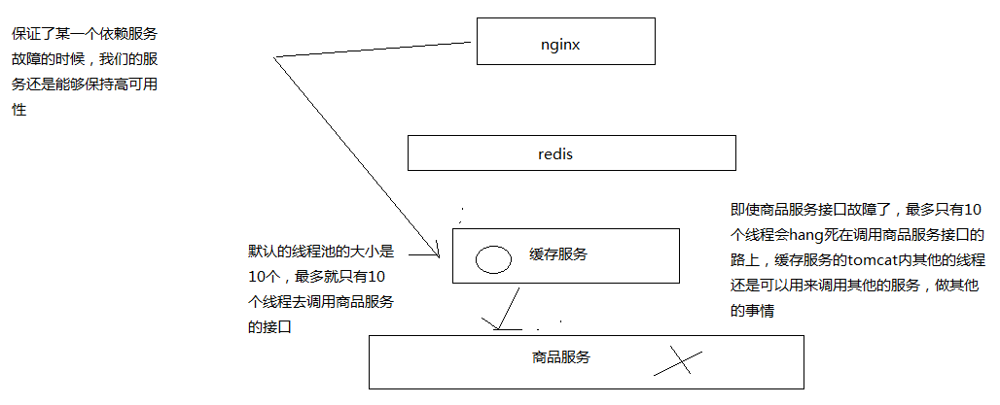

# 090. 基于 hystrix 的线程池隔离技术进行商品服务接口的资源隔离

```groovy
// 默认也是 1.5.12 的版本
compile 'com.netflix.hystrix:hystrix-core'
```

[官网解说 hystrix 原理 ](https://github.com/Netflix/Hystrix/wiki/How-it-Works)

我到官网 git hub pages 中溜达了一下，前面课程中讲解的基本上都是官网中讲解的，只是全身英文的，
我看起来很吃力，机翻有些看不太懂

这里介绍 hystrix 最基本的资源隔离技术：线程池隔离技术

提供了一个抽象 Command，把某一个依赖服务所有的调用请求，都走同一个线程池中的线程，
而不会用其他的线程资源，这就叫做资源隔离

Command ：每次服务调用请求，都是使用线程池内的一个线程去执行 command 的，
comman 里面是你的业务逻辑。

假设该组服务线程池是 3 个线程，同时发起了 1000  个请求，
最多也只会有 3 个线程去执行请求，那么就算这个服务故障了，也不会将所有资源耗尽

## HystrixCommand 将商品服务接口调用的逻辑进行封装
是一个获取单条数据的抽象

```java
package cn.mrcode.cachepdp.eshop.cache.ha.hystrix.command;

import com.alibaba.fastjson.JSON;
import com.netflix.hystrix.HystrixCommand;
import com.netflix.hystrix.HystrixCommandGroupKey;
import com.netflix.hystrix.HystrixCommandProperties;
import com.netflix.hystrix.HystrixThreadPoolProperties;

import java.util.concurrent.TimeUnit;

import cn.mrcode.cachepdp.eshop.cache.ha.http.HttpClientUtils;
import cn.mrcode.cachepdp.eshop.cache.ha.model.ProductInfo;

/**
 * ${todo}
 *
 * @author : zhuqiang
 * @date : 2019/6/1 23:45
 */
public class GetProductCommand extends HystrixCommand<ProductInfo> {
    private Long productId;

    public GetProductCommand(Long productId) {
//        super(HystrixCommandGroupKey.Factory.asKey("GetProductCommandGroup"));
        // 线程组名
        super(Setter.withGroupKey(HystrixCommandGroupKey.Factory.asKey("GetProductCommandGroup"))
                // 超时时间
                .andCommandPropertiesDefaults(HystrixCommandProperties.Setter().withExecutionTimeoutInMilliseconds(6000))
                .andThreadPoolPropertiesDefaults(HystrixThreadPoolProperties.Setter()
                        // 线程池大小，最多有多少个线程同时并发
                        .withCoreSize(2)
                        // 排队，默认为 -1 ，假设 10 个请求，2 个执行，2 个排队，那么其他 6 个将直接返回错误
                        .withMaxQueueSize(2)
                )

        );
        this.productId = productId;
    }

    @Override
    protected ProductInfo run() throws Exception {
        String url = "http://localhost:7000/getProduct?productId=" + productId;
        String response = HttpClientUtils.sendGetRequest(url);
        System.out.println("睡眠 5 秒，模拟");
        TimeUnit.SECONDS.sleep(5);
        return JSON.parseObject(response, ProductInfo.class);
    }
}

```

controller 调用

```java
@RequestMapping("/getProduct")
public ProductInfo getProduct(Long productId) {
    GetProductCommand getProductCommand = new GetProductCommand(productId);
    // 同步执行
    ProductInfo productInfo = getProductCommand.execute();
    return productInfo;
}
```

测试访问：`http://localhost:7001/getProduct?productId=1`

一共点击 6 次，只有 4 条被执行了，有两条直接报错

```
睡眠 5 秒，模拟
睡眠 5 秒，模拟
com.netflix.hystrix.exception.HystrixRuntimeException: GetProductCommand could not be queued for execution and no fallback available.
	at com.netflix.hystrix.AbstractCommand$22.call(AbstractCommand.java:819) ~[hystrix-core-1.5.12.jar:1.5.12]
睡眠 5 秒，模拟
睡眠 5 秒，模拟
```

上面的日志顺序，后面有两条请求，是因为后面的是前面 4 条数据，其中有两条在排队，所以前面两条请求完成后才会执行后面两条。
报错的两条被拒绝了，说不能排队也没有可用的 fallback（后面会讲解这个概念）

## HystrixObservableCommand 批量获取商品数据封装
[官网解说 hystrix 的使用 ](https://github.com/Netflix/Hystrix/wiki/How-To-Use)

本章的使用方式都是官网教程中有的 HelloWord 例子

```java
package cn.mrcode.cachepdp.eshop.cache.ha.hystrix.command;

import com.alibaba.fastjson.JSON;
import com.netflix.hystrix.HystrixCommandGroupKey;
import com.netflix.hystrix.HystrixObservableCommand;

import cn.mrcode.cachepdp.eshop.cache.ha.http.HttpClientUtils;
import cn.mrcode.cachepdp.eshop.cache.ha.model.ProductInfo;
import rx.Observable;
import rx.schedulers.Schedulers;

/**
 * ${todo}
 *
 * @author : zhuqiang
 * @date : 2019/6/2 15:41
 */
public class GetProductsCommand extends HystrixObservableCommand {
    private Long[] pids;

    public GetProductsCommand(Long[] pids) {
        super(HystrixCommandGroupKey.Factory.asKey("GetProductCommandGroup"));
        this.pids = pids;
    }

    @Override
    protected Observable construct() {
        // create OnSubscribe 方法已经过时
        // 文档说改为了 unsafeCreate 方法
        return Observable.unsafeCreate((Observable.OnSubscribe<ProductInfo>) onSubscribe -> {
//            for (Long pid : pids) {
//                String url = "http://localhost:7000/getProduct?productId=" + pid;
//                String response = HttpClientUtils.sendGetRequest(url);
//                onSubscribe.onNext(JSON.parseObject(response, ProductInfo.class));
//            }
//            onSubscribe.onCompleted();
            try {
                if (!onSubscribe.isUnsubscribed()) {
                    for (Long pid : pids) {
                        String url = "http://localhost:7000/getProduct?productId=" + pid;
                        String response = HttpClientUtils.sendGetRequest(url);
                        onSubscribe.onNext(JSON.parseObject(response, ProductInfo.class));
                    }
                    onSubscribe.onCompleted();
                }
            } catch (Exception e) {
                onSubscribe.onError(e);
            }
        }).subscribeOn(Schedulers.io());
    }
}

```

## HystrixObservableCommand 的调用方式

### Action1 方式
拉姆达表达式的方式调用，订阅获取每一条结果

```java
/**
 * @param productIds 英文逗号分隔
 */
@RequestMapping("/getProducts")
public void getProduct(String productIds) {
    List<Long> pids = Arrays.stream(productIds.split(",")).map(Long::parseLong).collect(Collectors.toList());
    GetProductsCommand getProductsCommand = new GetProductsCommand(pids.toArray(new Long[pids.size()]));
    // 第一种获取数据模式
    getProductsCommand.observe().subscribe(productInfo -> {
        System.out.println(productInfo);
    });
    System.out.println("方法已执行完成");
}
```

访问 `http://localhost:7001/getProducts?productIds=1,2,3` 日志

```
方法已执行完成
ProductInfo{id=1, name='iphone7手机', price=5599.0, pictureList='a.jpg,b.jpg', specification='iphone7的规格', service='iphone7的售后服务', color='红色,白色,黑色', size='5.5', shopId=1, modifyTime=Mon May 13 22:00:00 CST 2019}
ProductInfo{id=2, name='iphone7手机', price=5599.0, pictureList='a.jpg,b.jpg', specification='iphone7的规格', service='iphone7的售后服务', color='红色,白色,黑色', size='5.5', shopId=1, modifyTime=Mon May 13 22:00:00 CST 2019}
ProductInfo{id=3, name='iphone7手机', price=5599.0, pictureList='a.jpg,b.jpg', specification='iphone7的规格', service='iphone7的售后服务', color='红色,白色,黑色', size='5.5', shopId=1, modifyTime=Mon May 13 22:00:00 CST 2019}
```

### Observer 方式

```java
// 第二种获取数据模式
// 注意不要多次在同一个 command 上订阅
// 否则报错 GetProductsCommand command executed multiple times - this is not permitted.
getProductsCommand.observe().subscribe(new Observer<ProductInfo>() {

    @Override
    public void onCompleted() {
        System.out.println("Observer: onCompleted");
    }

    @Override
    public void onError(Throwable e) {
        System.out.println("Observer: onError:" + e);
    }

    @Override
    public void onNext(ProductInfo productInfo) {
        System.out.println("Observer: onNext:" + productInfo);
    }
});
```

```
方法已执行完成
Observer: onNext:ProductInfo{id=1, name='iphone7手机', price=5599.0, pictureList='a.jpg,b.jpg', specification='iphone7的规格', service='iphone7的售后服务', color='红色,白色,黑色', size='5.5', shopId=1, modifyTime=Mon May 13 22:00:00 CST 2019}
Observer: onNext:ProductInfo{id=2, name='iphone7手机', price=5599.0, pictureList='a.jpg,b.jpg', specification='iphone7的规格', service='iphone7的售后服务', color='红色,白色,黑色', size='5.5', shopId=1, modifyTime=Mon May 13 22:00:00 CST 2019}
Observer: onNext:ProductInfo{id=3, name='iphone7手机', price=5599.0, pictureList='a.jpg,b.jpg', specification='iphone7的规格', service='iphone7的售后服务', color='红色,白色,黑色', size='5.5', shopId=1, modifyTime=Mon May 13 22:00:00 CST 2019}
Observer: onCompleted
```

两种方式有什么不同，其实看对象方法就知道了，如：当异常时，可以通过方法回调获取异常，而 Action1 方式则没有这样的功能

```
Observer: onError:com.netflix.hystrix.exception.HystrixRuntimeException: GetProductsCommand timed-out and no fallback available.
java.net.ConnectException: Connection refused: connect
	at java.net.DualStackPlainSocketImpl.connect0(Native Method)
```

### 同步调用方式

```java
// 同步调用方式
Iterator<ProductInfo> iterator = getProductsCommand.observe().toBlocking().getIterator();
while (iterator.hasNext()) {
    System.out.println(iterator.next());
}
```
从日志看出来，同步方式的确能达到效果

```
ProductInfo{id=1, name='iphone7手机', price=5599.0, pictureList='a.jpg,b.jpg', specification='iphone7的规格', service='iphone7的售后服务', color='红色,白色,黑色', size='5.5', shopId=1, modifyTime=Mon May 13 22:00:00 CST 2019}
ProductInfo{id=2, name='iphone7手机', price=5599.0, pictureList='a.jpg,b.jpg', specification='iphone7的规格', service='iphone7的售后服务', color='红色,白色,黑色', size='5.5', shopId=1, modifyTime=Mon May 13 22:00:00 CST 2019}
ProductInfo{id=3, name='iphone7手机', price=5599.0, pictureList='a.jpg,b.jpg', specification='iphone7的规格', service='iphone7的售后服务', color='红色,白色,黑色', size='5.5', shopId=1, modifyTime=Mon May 13 22:00:00 CST 2019}
方法已执行完成
```

## 资源隔离效果



如图，这样一来调用都用线程去调用，的确能起到资源隔离的效果
