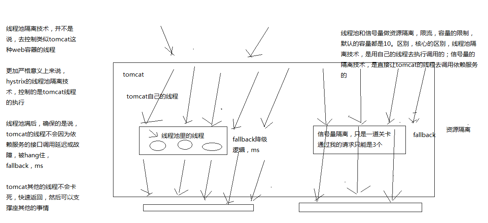

# 091. 基于 hystrix 的信号量技术对地理位置获取逻辑进行资源隔离与限流

## 什么是信号量（Semaphore）?
信号量（Semaphore）也称为计数器，在 jdk 线程知识中也提供了 [信号量](https://blog.csdn.net/mr_zhuqiang/article/details/47622621)


## 线程池与信号量隔离技术的区别？
在 hystrix 中的一个核心就是资源隔离，提供了线程池和信号量的方式，那么他们有什么区别呢?

::: tip
官网中详细讲解了 [线程池与信号量的区别于优缺点](https://github.com/Netflix/Hystrix/wiki/How-it-Works#semaphores) 只是是英文文档，看起来有点吃力
:::

简单来说：

- 线程池：
  - 使用独立线程池去执行业务逻辑，与当前请求线程（tomcat）不是同一个
  - 线程阻塞可中断，所以有超时功能
  - 可异步执行
- 信号量
  - 计数器方式，只能是当前请求线程去执行业务逻辑
  - 由于使用了当前请求线程，无法实现超时功能（实际测试可以实现，具体不知道是什么原因）
  - 由于使用了当前请求线程，无法异步执行

官网中说到线程池的优点有好长的列表。那么线程池主要缺点是它们增加了计算开销。每个命令执行都涉及在单独的线程上运行命令所涉及的排队，调度和上下文切换。

Netflix 在设计这个系统时决定接受这个缺点，以换取它提供的好处，并认为它足够小，不会产生重大的成本或性能影响。

所以信号量方式只是单纯的你觉得客户端不会有故障的情况下，丢掉线程池开销这点性能消耗时使用。

下图示意了线程池与信号量在线程上的区别于原理示意图



## 信号量在代码中的使用
在了解了信号量与线程池的区别情况下，课程中讲解的例子，我觉得在场景描述上有歧义，就不记录了

大体上的思路是：商品信息中包含了发货地址信息，地址信息是缓存在本地 map 中的，使用信号量方式来限流获取地址信息。

官网中已经讲得很明白了。所以，对于信号量的使用，这里只是演示下

使用信号量策略很简单，在构造 command 时，更改隔离策略为 SEMAPHORE

```java
package cn.mrcode.cachepdp.eshop.cache.ha.hystrix.command;

import com.alibaba.fastjson.JSON;
import com.netflix.hystrix.HystrixCommand;
import com.netflix.hystrix.HystrixCommandGroupKey;
import com.netflix.hystrix.HystrixCommandProperties;

import java.util.concurrent.TimeUnit;

import cn.mrcode.cachepdp.eshop.cache.ha.http.HttpClientUtils;
import cn.mrcode.cachepdp.eshop.cache.ha.model.ProductInfo;

/**
 * 基于信号量方式资源隔离
 *
 * @author : zhuqiang
 * @date : 2019/6/2 17:45
 */
public class GetCityCommand extends HystrixCommand<ProductInfo> {
    private Long productId;

    public GetCityCommand(Long productId) {
//        super(HystrixCommandGroupKey.Factory.asKey("GetProductCommandGroup"));
        // 线程组名
        super(Setter.withGroupKey(HystrixCommandGroupKey.Factory.asKey("GetProductCommandGroup"))
                // 超时时间
                .andCommandPropertiesDefaults(HystrixCommandProperties.Setter()
                        // 设置 4 秒超时，看是否有效果
                        .withExecutionTimeoutInMilliseconds(6000)
                        .withExecutionIsolationStrategy(HystrixCommandProperties.ExecutionIsolationStrategy.SEMAPHORE)
                        // 信号量最大请求数量设置
                        .withExecutionIsolationSemaphoreMaxConcurrentRequests(2)
                )

        );
        this.productId = productId;
    }

    @Override
    protected ProductInfo run() throws Exception {
        System.out.println(Thread.currentThread().getName());
        String url = "http://localhost:7000/getProduct?productId=" + productId;
        String response = HttpClientUtils.sendGetRequest(url);
        System.out.println("睡眠 5 秒，模拟");
        TimeUnit.SECONDS.sleep(5);
        return JSON.parseObject(response, ProductInfo.class);
    }
}

```

调用处代码

```java
@RequestMapping("/semaphore/getProduct")
public ProductInfo semaphoreGetProduct(Long productId) {
    GetCityCommand getCityCommand = new GetCityCommand(productId);
    System.out.println(Thread.currentThread().getName());
    ProductInfo productInfo = getCityCommand.execute();
    return productInfo;
}
```

访问：`http://localhost:7001/semaphore/getProduct?productId=1`

测试结果：

对于限流日志报错如下

```
com.netflix.hystrix.exception.HystrixRuntimeException: GetCityCommand could not acquire a semaphore for execution and no fallback available.
```

这里测试超时也是有效果的，但是不知道是怎么实现的，看了下源码，里面 jdk 多线程的代码很多，
看不明白；

应该是没有使用自己的线程池了，看日志打印的线程名称是 tomcat 的线程
