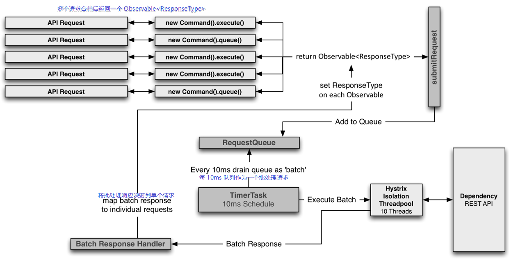

# 100. 基于 request collapser 请求合并技术进一步优化批量查询
hystrix 高级的技术：request collapser（请求合并技术，直译为 collapser 折叠）

## 请求合并原理 - 官网
> [官网 request collapser 直达](https://github.com/Netflix/Hystrix/wiki/How-it-Works#request-collapsing)

使用 HystrixCollapser 类型的 HystrixCommand 来实现请求合并，
可以实现将多个请求合并为对后端依赖服务的单个调用

怎么理解上面的话？先看下面的图，在线程数量和网络连接数量上的比较


### 为什么要使用 request collapser？
上面的图片是否是看得不太懂？

来简述下上图的含义：

1. 当使用普通单个请求 command 时：1个 请求 = 1个 线程 = 1个 网络连接

    比如：在 10 毫秒内，有 20 个并发请求，那么此时如果没有设置等待队列的话，应该只会有 10 个请求执行成功，剩下 10 个被拒绝了
2. 当使用请求合并 command 时：在一个请求窗口内 = 1个 线程 = 1个 网络连接

    比如：在 10 毫秒内，有 20 个并发请求，那么此时如果没有设置等待队列的话，那么可能只会占用 2 个请求线程

上面的解释之后是否比较有一点感觉了？至于你现在更多的问题，在后面示例代码之后，就会明白这个功能实现的原理了

使用请求合并来减少并发执行 HystrixCommand 执行所需的线程数和网络连接数。而且请求合并是自动的，不会强制你手动协调合并哪些请求。

### 请求合并的多种级别

- global context

    tomcat 所有调用线程，对一个依赖服务的任何一个 command 调用都可以被合并在一起，hystrix 就传递一个 HystrixRequestContext

    对于这一级别，没有更多的解释，官方推荐使用下面的那一个
- user request context

    tomcat 内某一个调用线程，将某一个 tomcat 线程对某个依赖服务的多个 command 调用合并在一起

    此种方式在前面 [request cache](./094.md) 中已经演示过怎么配置请求上下文了

    此种级别是 hystrix 默认级别
- object modeling 基于对象的请求合并

    如果有几百个对象，遍历后依次调用每个对象的某个方法，可能导致发起几百次网络请求，基于 hystrix 可以自动将对多个对象模型的调用合并到一起

    此方式也不推荐使用，没有更多的描述
上面的一个能实现的重要点是：使用请求合并 command 的时候，是需要单独提供一个批量获取数据的接口。 hystrix 负责把某一个时间窗口内的 command 合并成一个 collapser ，然后由你去调用这个批量获取数据接口

### 请求合并的代价是多少？
使用请求合并技术最大的代价就是：导致延迟大幅度增强，因为需要将一定时间内的多个请求合并

比如：发送 10 个请求，每个请求大概是 5 毫秒可以返回，要把 10 个请求合并在一个 command 内，统一执行，那么就有一个等待时间，假设是 10 毫秒，执行时间就可能变成 15 毫秒，延迟了 10 毫秒；通常情况下请求不会恰好在等待时间到达刚好 10 毫秒的时候才发出去请求，所以延迟还可以降一半，本例子为 5ms。

这个延迟开销是否是有意义的取决于正在执行的 command，并且与并发数量也有关系，因为有两个策略会触发合并请求发出去，一个是请求达到阀值，一个是等待时间达到阀值。请求合并并不适合在单线程中等待执行，这样会加大延迟。

比如 10 个请求单个数据总耗时将花费 50 毫秒，平均 5 毫秒；当并发 10 线程请求的时候，那么只需要 5 毫秒即可拿到数据；
同样，为了尽快达到合并发出请求阀值，在并发下会更快的达到阀值，批量请求数据可能需要耗时 10 毫秒。

总起看起来，不合并至需要 5 毫秒，合并之后可能需要 15 毫秒（10 毫秒请求接口，因为是批量数据的接口，假设会比单个耗时一点 + 5 毫秒的等待时间）

那么好处是什么呢？单个接口获取数据与批量接口获取数据去掉获取数据的时间因素（往往是业务聚合等因素），那么就是网络开销了；
如果特定命令同时大量使用并且可以将数十个甚至数百个调用一起批量处理，那么由于 Hystrix 减少了所需的线程数量和网络连接数量，因此实现的吞吐量通常远远超过了这个代价

所以总结：请求合并适合在高延迟 + 大量并发的情况下使用

- 每个请求就 2ms，batch 需要 8~10ms，延迟增加了 4~5 倍
- 每个请求本来就 30ms~50ms，batch 需要 35ms~55ms，延迟增加不太明显

### 请求合并流程



1. hystrix 会在 10ms（默认）内等待一批请求
2. 到达 10ms 时会将此次时间内收集到的单个请求合并调用一个批处理接口
3. 批处理响应返回后，需要为每个请求设置响应映射，不然怎么分得清楚哪个请求了什么？

原理和流程，优缺点了解了，但是感觉还是有点懵逼，没有关系，看看例子

## Request Collapsing 请求合并例子 - 官网
> [官网直达](https://github.com/Netflix/Hystrix/wiki/How-To-Use#request-collapsing)


```java
package cn.mrcode.cachepdp.eshop.cache.ha;

import com.netflix.hystrix.HystrixCollapser;
import com.netflix.hystrix.HystrixCommand;
import com.netflix.hystrix.HystrixCommandGroupKey;
import com.netflix.hystrix.HystrixCommandKey;

import java.util.ArrayList;
import java.util.Collection;
import java.util.List;

/**
 * @param <BatchReturnType>     一个合并请求 HystrixCommand 执行返回的结果
 * @param <ResponseType>        单个请求返回的结果
 * @param <RequestArgumentType> 单个 HystrixCommand 请求参数
 * @author : zhuqiang
 * @date : 2019/6/11 21:04
 */
public class CommandCollapserGetValueForKey extends HystrixCollapser<List<String>, String, Integer> {
    private final Integer key;

    public CommandCollapserGetValueForKey(Integer key) {
        this.key = key;
    }

    /**
     * 单个 command 请求参数
     */
    @Override
    public Integer getRequestArgument() {
        return key;
    }

    /**
     * 聚合多个命令由框架完成，这里只需要创建我们的 batchCommand 即可
     *
     * @param collapsedRequests 这个是多个请求的参数列表
     */
    @Override
    protected HystrixCommand<List<String>> createCommand(Collection<CollapsedRequest<String, Integer>> collapsedRequests) {
        return new BatchCommand(collapsedRequests);
    }

    /**
     * 将返回的数据对请求进行映射，外部的单个请求才能获取到对应的结果
     */
    @Override
    protected void mapResponseToRequests(List<String> batchResponse, Collection<CollapsedRequest<String, Integer>> collapsedRequests) {
        int count = 0;
        for (CollapsedRequest<String, Integer> collapsedRequest : collapsedRequests) {
            // 把请求回来的结果再分发到对应的请求中去
            collapsedRequest.setResponse(batchResponse.get(count++));
        }
    }

    /**
     * 发起批量请求的 command
     */
    private static final class BatchCommand extends HystrixCommand<List<String>> {
        private final Collection<CollapsedRequest<String, Integer>> requests;

        public BatchCommand(Collection<CollapsedRequest<String, Integer>> requests) {
            super(Setter.withGroupKey(HystrixCommandGroupKey.Factory.asKey("ExampleGroup"))
                    .andCommandKey(HystrixCommandKey.Factory.asKey("GetValueForKy"))
            );
            this.requests = requests;
        }

        @Override
        protected List<String> run() throws Exception {
            List<String> response = new ArrayList<>();
            // 这里模拟拿到这一组的请求参数去请求接口，然后返回数据
            for (CollapsedRequest<String, Integer> request : requests) {
                response.add("ValueForKey：" + request.getArgument());
            }
            System.out.println("请求合并-BatchCommand 执行");
            return response;
        }
    }
}

```

以上代码定义了三个泛型参数，现在一般还在懵逼状态中，下面来看看调用处是怎么使用的

```java
@Test
public void testCollapser() throws Exception {
    // 创建一个上下文
    HystrixRequestContext context = HystrixRequestContext.initializeContext();

    try {
      // 这里不能使用多线程来并发请求，因为请求合并技术依赖于上下文
      // 而这里初始化的是一个 HystrixRequestContext 上下文，也就是线程级别的
      // 如果使用多线程，那么必然会报错
      // 而且请求合并默认合并范围也是单个线程范围

      // 这里在一个线程中请求多次
      Future<String> f1 = new CommandCollapserGetValueForKey(1).queue();
      Future<String> f2 = new CommandCollapserGetValueForKey(2).queue();
      Future<String> f3 = new CommandCollapserGetValueForKey(3).queue();
      Future<String> f4 = new CommandCollapserGetValueForKey(4).queue();

        System.out.println(f1.get());
        System.out.println(f2.get());
        System.out.println(f3.get());
        System.out.println(f4.get());
        // 后续新增代码处
    } finally {
        context.shutdown();
    }
}
```

在一个线程中请求多次，查看打印的日志

```
请求合并-BatchCommand 执行
ValueForKey：1
ValueForKey：2
ValueForKey：3
ValueForKey：4
```

可以看到虽然在外部调用了多次，但是多个请求被合并了，只发生了一次调用

还可以通过 log 工具获取到当前执行的请求 command ，在上面的测试代码「后续新增代码处」新增如下代码

```java
HystrixRequestLog currentRequest = HystrixRequestLog.getCurrentRequest();
Collection<HystrixInvokableInfo<?>> allExecutedCommands = currentRequest.getAllExecutedCommands();
System.out.println("当前线程中请求实际发起了几次：" + allExecutedCommands.size());
HystrixCommand<?>[] hystrixCommands = allExecutedCommands.toArray(new HystrixCommand<?>[allExecutedCommands.size()]);
HystrixCommand<?> hystrixCommand = hystrixCommands[0];
System.out.println("其中第一个 command 的名称：" + hystrixCommand.getCommandKey());
System.out.println("command 执行事件" + hystrixCommand.getExecutionEvents());
```

打印日志如下：可以看到当次执行实际被合并成了 2 个请求，其中一个执行事件也是 COLLAPSED 和执行成功

```
请求合并-BatchCommand 执行
ValueForKey：1
请求合并-BatchCommand 执行
ValueForKey：2
ValueForKey：3
ValueForKey：4
当前线程中请求实际发起了几次：2
其中第一个 command 的名称：GetValueForKy
command 执行事件[SUCCESS, COLLAPSED]
```

走到这里，相信你已经明白了请求合并是怎么写的，大体上原理是什么了

下面来在我们的业务背景中实现请求合并

## 在业务背景中实现请求合并效果

在 eshop-product-ha 项目中先增加一个提供批量获取商品详情的接口

cn.mrcode.cachepdp.eshop.product.ha.controller.ProductController

```java
/**
 * 批量返回商品信息的接口
 *
 * @param productIdsStr 商品 id 用英文逗号分隔
 */
@RequestMapping("/getProducts")
public List<String> getProduct(String productIdsStr) {
    String[] productIds = productIdsStr.split(",");
    return Arrays.stream(productIds)
            .map(productId -> {
                String productInfoJSON = "{\"id\": " + productId + ", \"name\": \"iphone7手机\", \"price\": 5599, \"pictureList\":\"a.jpg,b.jpg\", \"specification\": \"iphone7的规格\", \"service\": \"iphone7的售后服务\", \"color\": \"红色,白色,黑色\", \"size\": \"5.5\", \"shopId\": 1," +
                        "\"modifyTime\":\"2019-05-13 22:00:00\"}";
                return productInfoJSON;
            })
            .collect(Collectors.toList());
}
```

在 eshop-cache-ha 项目中编写请求合并 command 相关代码

```java
package cn.mrcode.cachepdp.eshop.cache.ha.hystrix.command;

import com.alibaba.fastjson.JSON;
import com.netflix.hystrix.HystrixCollapser;
import com.netflix.hystrix.HystrixCommand;
import com.netflix.hystrix.HystrixCommandGroupKey;
import com.netflix.hystrix.HystrixCommandKey;

import java.util.Collection;
import java.util.List;
import java.util.stream.Collectors;

import cn.mrcode.cachepdp.eshop.cache.ha.http.HttpClientUtils;
import cn.mrcode.cachepdp.eshop.cache.ha.model.ProductInfo;

/**
 * 请求合并 command
 * @author : zhuqiang
 * @date : 2019/6/11 21:55
 */
public class CollapserGetProductCommand extends HystrixCollapser<List<ProductInfo>, ProductInfo, Long> {
    private final Long productId;

    public CollapserGetProductCommand(Long productId) {
        this.productId = productId;
    }

    @Override
    public Long getRequestArgument() {
        return productId;
    }

    @Override
    protected HystrixCommand<List<ProductInfo>> createCommand(Collection<CollapsedRequest<ProductInfo, Long>> collapsedRequests) {
        // 实现注意:要快。（<1ms)，否则会阻止计时器执行后续批次。除了构造命令并返回它之外，不要执行任何处理。
        return new BatchCommand(collapsedRequests);
    }

    @Override
   protected void mapResponseToRequests(List<ProductInfo> batchResponse, Collection<CollapsedRequest<ProductInfo, Long>> collapsedRequests) {
       int count = 0;
       for (CollapsedRequest<ProductInfo, Long> collapsedRequest : collapsedRequests) {
           collapsedRequest.setResponse(batchResponse.get(count++));
       }
       System.out.println("映射数量：" + collapsedRequests.size());
   }

   public static class BatchCommand extends HystrixCommand<List<ProductInfo>> {
       private Collection<CollapsedRequest<ProductInfo, Long>> requests;

       public BatchCommand(Collection<CollapsedRequest<ProductInfo, Long>> requests) {
           super(Setter.withGroupKey(HystrixCommandGroupKey.Factory.asKey("ExampleGroup"))
                   .andCommandKey(HystrixCommandKey.Factory.asKey("GetValueForKy"))
           );
           this.requests = requests;
           System.out.println("此次请求大小：" + requests.size());
       }

       @Override
       protected List<ProductInfo> run() throws Exception {
           // 从当前合并的多个请求中，按顺序拼接请求的 pid
           String productIdsStr = requests.stream()
                   .map(item -> item.getArgument())
                   .map(item -> String.valueOf(item))
                   .collect(Collectors.joining(","));
           System.out.println("执行批量接口请求:" + productIdsStr);
           String url = "http://localhost:7000/getProducts?productIdsStr=" + productIdsStr;
           String response = HttpClientUtils.sendGetRequest(url);
           return JSON.parseArray(response, String.class)
                   .stream()
                   .map(item -> JSON.parseObject(item, ProductInfo.class))
                   .collect(Collectors.toList());
       }
   }
}

```

在 cn.mrcode.cachepdp.eshop.cache.ha.controller.CacheController 中批量触发获取商品接口中调用请求合并的 command

```java
/**
    * @param productIds 英文逗号分隔
    */
   @RequestMapping("/getProducts")
   public void getProduct(String productIds) throws ExecutionException, InterruptedException {
       List<Long> pids = Arrays.stream(productIds.split(",")).map(Long::parseLong).collect(Collectors.toList());

       // 在批量获取商品接口中来使用请求合并
//        for (Long pid : pids) {
//            CollapserGetProductCommand getProductCommand = new CollapserGetProductCommand(pid);
//            Future<ProductInfo> queue = getProductCommand.queue();
//            System.out.println("请求结果：" + queue.get() + ": 是否只请求合并：" + queue.isCancelled());
//        }
       // 不要使用上面的调用方式，因为这样做就相当于是同步调用了，一个请求回来之后才能继续下一个
       List<Future<ProductInfo>> results = pids.stream()
               .map(pid -> {
                   CollapserGetProductCommand getProductCommand = new CollapserGetProductCommand(pid);
                   return getProductCommand.queue();
               })
               .collect(Collectors.toList());
       for (Future<ProductInfo> result : results) {
           System.out.println("请求结果：" + result.get());
       }
}
```

测试，访问地址：`http://localhost:7001/getProducts?productIds=1,2,1,3`

日志输出

```
此次请求大小：3
执行批量接口请求:1,2,3
请求结果：ProductInfo{id=1, name='iphone7手机', price=5599.0, pictureList='a.jpg,b.jpg', specification='iphone7的规格', service='iphone7的售后服务', color='红色,白色,黑色', size='5.5', shopId=1, modifyTime=Mon May 13 22:00:00 CST 2019}
映射数量：3
请求结果：ProductInfo{id=2, name='iphone7手机', price=5599.0, pictureList='a.jpg,b.jpg', specification='iphone7的规格', service='iphone7的售后服务', color='红色,白色,黑色', size='5.5', shopId=1, modifyTime=Mon May 13 22:00:00 CST 2019}
请求结果：ProductInfo{id=1, name='iphone7手机', price=5599.0, pictureList='a.jpg,b.jpg', specification='iphone7的规格', service='iphone7的售后服务', color='红色,白色,黑色', size='5.5', shopId=1, modifyTime=Mon May 13 22:00:00 CST 2019}
请求结果：ProductInfo{id=3, name='iphone7手机', price=5599.0, pictureList='a.jpg,b.jpg', specification='iphone7的规格', service='iphone7的售后服务', color='红色,白色,黑色', size='5.5', shopId=1, modifyTime=Mon May 13 22:00:00 CST 2019}
```

注意看上面的日志信息：在真正执行请求的时候本来传递了 4 个商品 id，其中 id=1 的有两个，
但是合并之后只有 3 个请求了，
但是神奇的是，在调用处打印数据的时候，却是有 4 个结果；

也就是说：请求合并自带类似请求缓存功能，保证在一次上下文中相同参数的 command 只会被请求一次

::: tip 注意
在测试的时候，第一次访问很有可能报错，报超时异常，这个很正常，由于第一次某些类需要初始化，
耗时较长，就会触发请求超时，这个之前讲过的，可以设置长一点的超时时间
:::

## 请求合并配置

```java
public CollapserGetProductCommand(Long productId) {
    super(Setter.withCollapserKey(HystrixCollapserKey.Factory.asKey("CollapserGetProductCommand"))
            .andCollapserPropertiesDefaults(HystrixCollapserProperties.Setter()
                    // 在 TimerDelayInMilliseconds 内最多允许多少个 request 被合并
                    // 默认是无限大，该参数一般不使用，而是使用时间来触发合并请求提交
                    .withMaxRequestsInBatch(10)
                    // 时间窗口：合并请求需要等待多久
                    // 默认是 10ms ，
                    .withTimerDelayInMilliseconds(20)
            )
    );
    this.productId = productId;
}
```

## 小结

request collapser 能做到在一个上下文中使用异步方式大量请求相同接口时进行请求合并；

它的本质是：提供了一个范围内的拦截器和调度器，等待请求到达，然后把请求参数给我们自己的业务逻辑去进行批量请求

有一个疑问，还是使用场景相关的：

1. 在上面的演示中，一个 tomcat 请求（也就是一个线程），在什么情况下才会使用这种大量异步单个商品请求的情况？暂时是在想象不到；很简单的一个就是全局上下文中，这种情况下多个用户并发请求过来，很容易就被合并了，目前能想到的是这个，但是官方不推荐此方式；
2. 上下文除了全局的，都是基于当前线程，所以在主线程中初始化了上下文，也不能分多线程去执行

还是这个使用场景问题
