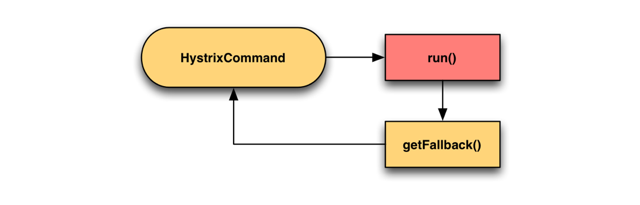

# 101. hystirx 的 fail-fast 与 fail-silient 两种最基础的容错模式
下面几节是 HystrixCommand 和 HystrixObservableCommand 的常见用法和使用模式。

## fail-fast
没有 fallback 降级逻辑，报错的话，异常可以被捕获到

```java
public class CommandThatFailsFast extends HystrixCommand<String> {

    private final boolean throwException;

    public CommandThatFailsFast(boolean throwException) {
        super(HystrixCommandGroupKey.Factory.asKey("ExampleGroup"));
        this.throwException = throwException;
    }

    @Override
    protected String run() {
        if (throwException) {
            throw new RuntimeException("failure from CommandThatFailsFast");
        } else {
            return "success";
        }
    }
}
```

```java
@Test
public void testFailure2() {
    try {
        new CommandThatFailsFast(true).execute();
    } catch (HystrixRuntimeException e) {
        // 异常可以被捕获到
        System.out.println("xxx");
        assertEquals("failure from CommandThatFailsFast", e.getCause().getMessage());
        e.printStackTrace();
        // 如果提供了降级机制，那么这里就不会被捕获到异常
    }
}
```

## fail-silent
有 fallback 降级逻辑；如果执行报错了，会走 fallback 降级，返回 fallback 的值给你



HystrixCommand

```java
@Override
protected String getFallback() {
    return "降级机制";
}
```

HystrixObservableCommand

```java
@Override
protected Observable<String> resumeWithFallback() {
   return Observable.empty();
}
```

很少会用 fail-fast 模式，比较常用的可能还是 fail-silent，特别常用，既然都到了 fallback 里面，肯定要做点降级的事情
