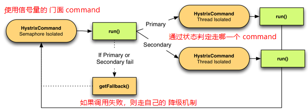

# 104. 基于 facade command 开发商品服务接口的手动降级机制

## Primary + Secondary with Fallback

> [官网直达](https://github.com/Netflix/Hystrix/wiki/How-To-Use#primary--secondary-with-fallback)

有些系统具有双重模式行为——主模式和辅助模式，或者主模式和故障转移模式。

有时，次要或故障转移被认为是一种故障状态，它仅用于 fallback；在这些场景中，前面章节的
[Fallback: Cache via Network](./103.md#fallback-cache-via-network) 符合这种需求

而本章的准备模式降级策略适合你已经知道该使用主还是备用 command；比如测试一段新的代码，
通过一个状态在新老代码之前手动进行切换；

实现本模式的核心思路是：

有 3 个 command

- 一个主 command ：比如调用新代码的逻辑
- 一个备用/次要 command：比如调用旧代码的逻辑
- 一个门面 command：它只用来决策到底是调用 主？还是备？

三个 command 都有降级策略，如果主备都不能使用，且降级策略也不能使用，那么将会走门面 command 的降级策略



这里解释下为什么门面 command 需要使用信号量：因为它的工作只是通过状态判定是否走主备，
而主备则会通过线程池的方式去真正执行业业务逻辑。所以这里是一个优化性能的地方

```java
package cn.mrcode.cachepdp.eshop.cache.ha;


import com.netflix.config.ConfigurationManager;
import com.netflix.hystrix.HystrixCommand;
import com.netflix.hystrix.HystrixCommandGroupKey;
import com.netflix.hystrix.HystrixCommandKey;
import com.netflix.hystrix.HystrixCommandProperties;
import com.netflix.hystrix.HystrixThreadPoolKey;
import com.netflix.hystrix.strategy.concurrency.HystrixRequestContext;

import org.apache.commons.configuration.AbstractConfiguration;
import org.junit.Test;

import static org.junit.Assert.assertEquals;

public class CommandFacadeWithPrimarySecondary extends HystrixCommand<String> {
    private boolean usePromary;
    private final int id;

    public CommandFacadeWithPrimarySecondary(int id) {
        super(Setter
                .withGroupKey(HystrixCommandGroupKey.Factory.asKey("SystemX"))
                .andCommandKey(HystrixCommandKey.Factory.asKey("PrimarySecondaryCommand"))
                .andCommandPropertiesDefaults(
                        // 这里使用信号量，因为至少包装其他两个 command，
                        // 其他两个 command 会使用线程池
                        HystrixCommandProperties.Setter()
                                .withExecutionIsolationStrategy(HystrixCommandProperties.ExecutionIsolationStrategy.SEMAPHORE)));
        this.id = id;
        AbstractConfiguration configInstance = ConfigurationManager.getConfigInstance();
        System.out.println(configInstance);
        usePromary = configInstance.getBoolean("primarySecondary.usePrimary");
    }

    @Override
    protected String run() {
        System.out.println("============================= usePromary：" + usePromary);
        if (usePromary) {
            return new PrimaryCommand(id).execute();
        } else {
            return new SecondaryCommand(id).execute();
        }
    }

    @Override
    protected String getFallback() {
        return "static-fallback-" + id;
    }
    // 在同一个上下文中执行 相同 id的话，打开了缓存就会走缓存的
//    @Override
//    protected String getCacheKey() {
//        return String.valueOf(id);
//    }

    private static class PrimaryCommand extends HystrixCommand<String> {

        private final int id;

        private PrimaryCommand(int id) {
            super(Setter
                    .withGroupKey(HystrixCommandGroupKey.Factory.asKey("SystemX"))
                    .andCommandKey(HystrixCommandKey.Factory.asKey("PrimaryCommand"))
                    .andThreadPoolKey(HystrixThreadPoolKey.Factory.asKey("PrimaryCommand"))
                    .andCommandPropertiesDefaults(
                            // 设置为超时未 600 毫秒
                            HystrixCommandProperties.Setter().withExecutionTimeoutInMilliseconds(600)));
            this.id = id;
        }

        @Override
        protected String run() {
            // 执行主服务调用
            System.out.println("---------------  " + "responseFromPrimary-" + id);
            return "responseFromPrimary-" + id;
        }

    }

    private static class SecondaryCommand extends HystrixCommand<String> {

        private final int id;

        private SecondaryCommand(int id) {
            super(Setter
                    .withGroupKey(HystrixCommandGroupKey.Factory.asKey("SystemX"))
                    .andCommandKey(HystrixCommandKey.Factory.asKey("SecondaryCommand"))
                    .andThreadPoolKey(HystrixThreadPoolKey.Factory.asKey("SecondaryCommand"))
                    .andCommandPropertiesDefaults(
                            // 设置超时为 100 毫秒
                            HystrixCommandProperties.Setter().withExecutionTimeoutInMilliseconds(100)));
            this.id = id;
        }

        @Override
        protected String run() {
            // 由于超时的设置，意味着备用服务将会更快的响应数据
            // 主备设置不同的超时时间，表达的意思是，他们调用响应数据的时间一个慢，一个快
            System.out.println("---------------  " + "responseFromSecondary-" + id);
            return "responseFromSecondary-" + id;
        }

    }

    public static class UnitTest {

        @Test
        public void testPrimary() {
            HystrixRequestContext context = HystrixRequestContext.initializeContext();
            try {
                ConfigurationManager.getConfigInstance().setProperty("primarySecondary.usePrimary", true);
                assertEquals("responseFromPrimary-20", new CommandFacadeWithPrimarySecondary(20).execute());
                // 切换为使用备用
                ConfigurationManager.getConfigInstance().setProperty("primarySecondary.usePrimary", false);
                assertEquals("responseFromSecondary-20", new CommandFacadeWithPrimarySecondary(20).execute());
            } finally {
                context.shutdown();
                ConfigurationManager.getConfigInstance().clear();
            }
        }

        @Test
        public void testSecondary() {
            HystrixRequestContext context = HystrixRequestContext.initializeContext();
            try {
                ConfigurationManager.getConfigInstance().setProperty("primarySecondary.usePrimary", false);
                assertEquals("responseFromSecondary-20", new CommandFacadeWithPrimarySecondary(20).execute());
            } finally {
                context.shutdown();
                ConfigurationManager.getConfigInstance().clear();
            }
        }
    }
}

```

输出日志

```
com.netflix.config.ConcurrentCompositeConfiguration@794cb805
============================= usePromary：true
---------------  responseFromPrimary-20
com.netflix.config.ConcurrentCompositeConfiguration@794cb805
============================= usePromary：false
---------------  responseFromSecondary-20
```

## 视频中用例

和上面例子一样， 3 个 command

1. 主：使用正常的接口请求数据
2. 备：使用残缺的拼接返回数据
3. 门面：通过自定义的一个配置类中的一个属性，进行判定走哪一个 command

最后在 controller 中提供了一个接口，在程序运行过程中，我们可以访问这个接口，
手动的去更改这个配置的属性，进行手动降级
