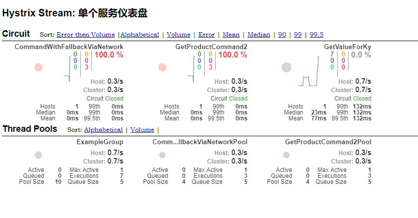
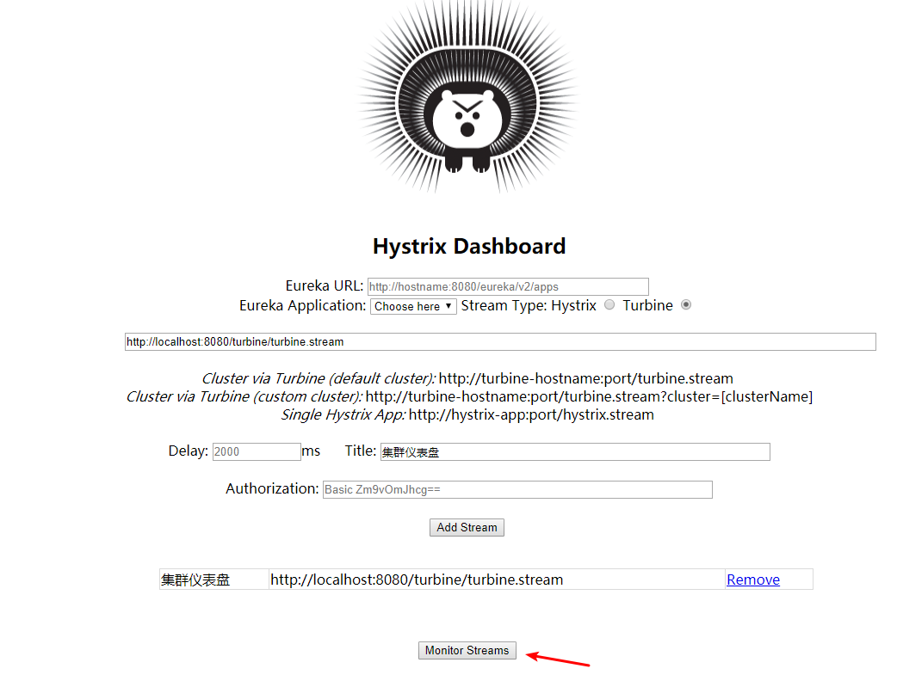
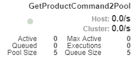

# 108. hystrix dashboard 可视化分布式系统监控环境部署

> [官网直达](https://github.com/Netflix-Skunkworks/hystrix-dashboard/wiki)
里面讲解了怎么安装 dashboard 和监控中的一些数值表示什么意思

## turbine-web 安装
turbine-web 是监控集群的，可以聚合集群中的所有机器相同的度量标准到一个报表中

由于在官网中，只找到了打包好的 turbine-web ，就使用它来启动

下载：https://github.com/downloads/Netflix/Turbine/turbine-web-1.0.0.war

要使用集群功能，需要先配置有哪些机器

在 /WEB-INF/classes/config.properties 文件中增加以下配置

```
turbine.ConfigPropertyBasedDiscovery.default.instances=localhost
turbine.instanceUrlSuffix=:7001/hystrix.stream
```

以上配置：

- instances ： 实例 ip
- instanceUrlSuffix：实例前缀

instanceUrlSuffix 是什么意思呢？在前面已经讲解到，单个项目需要暴露出订阅流信息，
供其他程序进行处理展示，所以需要先配置暴露流的功能

## hystrix-metrics-event-stream
> [官网直达](https://github.com/Netflix/Hystrix/tree/master/hystrix-contrib/hystrix-metrics-event-stream)

增加依赖

```groovy
compile 'com.netflix.hystrix:hystrix-metrics-event-stream:1.4.10'
```

将提供的 HystrixMetricsStreamServlet 注册到系统中

```java
@Bean
public ServletRegistrationBean indexServletRegistration() {
    ServletRegistrationBean registration = new ServletRegistrationBean(new HystrixMetricsStreamServlet());
    registration.addUrlMappings("/hystrix.stream");
    return registration;
}

```

测试地址：`http://localhost:7001/hystrix.stream`

```
ping:   // 当刚启动系统时，没有任何度量数据会一直刷屏 ping

// 然后访问一下触发几个 command 执行之后，就会有相关的统计信息输出了

data: {"type":"HystrixCommand","name":"GetValueForKy","
```

## turbine-web 启动后效果查看
由于下载的是 war 包，修改配置之后，放在一个 tomcat7+ 版本中，启动 tomcat

war 包地址： `D:\Program Files\apache-tomcat-7.0.42\webapps\turbine.war` (原始 war 包名称修改过)

运行 bat 启动 tomcat `D:\Program Files\apache-tomcat-7.0.42\bin\startup.bat`

访问地址：`http://localhost:8080/turbine/turbine.stream` ，可以看到和访问单个项目是一样的效果

## 安装 hystrix-dashboard

> [下面的 war 包是被发布在 maven 仓库中的](https://search.maven.org/search?q=a:hystrix-dashboard)
> [war 包下载地址](https://search.maven.org/remotecontent?filepath=com/netflix/hystrix/hystrix-dashboard/1.5.18/hystrix-dashboard-1.5.18.war)

下载后将 hystrix-dashboard-1.5.18.war 改名为 hystrix-dashboard.war，然后放到 tomcat `D:\Program Files\apache-tomcat-7.0.42\webapps\` 下。重启 tomcat

访问地址：`http://localhost:8080/hystrix-dashboard/`


- 本机缓存服务实例：`http://localhost:7001/hystrix.stream`
- 本机 turbine 集群：`http://localhost:8080/turbine/turbine.stream`

单个实例截图



集群实例截图




dashboard 上的指标都是什么？下面有说明一些简要的

- 圆圈的颜色和大小代表了健康状况以及流量，折线代表了最近 2 分钟的请求流量

     监控图中用圆点来表示服务的健康状态，健康度从 100%-0% 分别会用绿色、黄色、橙色、红色来表示。 另外，这个圆点也会随着流量的增多而变大。 监控图中会用曲线（圆点旁边）来表示服务的流量情况，通过这个曲线可以观察单个接口的流量变化/趋势
- Hosts：集群中的机器数量
- Host、Cluster：集群中 QPS 平均值
- 上面有好几个彩色的数据：

    右侧有颜色说明，10 秒内请求数量统计

    那个灰色的百分比则是最近 10 秒内的异常请求比例
- circuit：断路器的状态

- 最近一分钟的请求延时百分比，TP90，TP99，TP99.5

    比如第一个 GetValueForKy：百分之 90 的耗时在 20 毫秒


> 本文中部分图来自 [贲_WM](https://blog.csdn.net/wm6752062/article/details/86136204)


## 仪表盘注意事项
比如以下配置，使用动态大小这种

```java
super(Setter.withGroupKey(HystrixCommandGroupKey.Factory.asKey("GetProductCommandGroup"))
               // 不同的线程池
               .andThreadPoolKey(HystrixThreadPoolKey.Factory.asKey("GetProductCommand2Pool"))
                       .andThreadPoolPropertiesDefaults(HystrixThreadPoolProperties.Setter()
                                       // 配置线程池大小，同时并发能力个数
                                       .withCoreSize(5)
                                       // 设置线程池的最大大小，只有在设置 allowMaximumSizeToDivergeFromCoreSize 的时候才能生效
                                       .withMaximumSize(100)
                                       // 设置之后，其实 coreSize 就失效了
                                       .withAllowMaximumSizeToDivergeFromCoreSize(true)
                                       // 设置保持存活的时间，单位是分钟，默认是 1
                                       // 当线程池中线程空闲超过该时间之后，就会被销毁
                                       .withKeepAliveTimeMinutes(1)
                               // 配置等待线程个数；如果不配置该项，则没有等待，超过则拒绝
//                        .withMaxQueueSize(5)
                               // 由于 maxQueueSize 是初始化固定的，该配置项是动态调整最大等待数量的
                               // 可以热更新；规则：只能比 MaxQueueSize 小，
//                        .withQueueSizeRejectionThreshold(2)
                       )

       );
```
在仪表盘中是如下图显示，也就是说 ui 上显示的 poolSize 貌似就是这里 coreSize 的大小；
所以对于 ui 上每项含义还需要进一步弄清楚是什么意思



## hystrix-dashboard 含义

### 线程池


- Cluster：待证实
- Host：待证实
- Active：待证实
- Queued：待证实
- Pool Size ：目前线程池中存活的线程

    注意：在 ui 上变大能看到变化，数值变小貌似是个 bug，不会实时的显示，
    需要自己手动刷新页面才能看到变化
- Max Active：待证实
- Executions：目前正在执行的线程
- Queue Size：等待队列大小

    如果该项不为 0 那么一定是哪里设置了 maxQueueSize 或者 QueueSizeRejectionThreshold 的值
