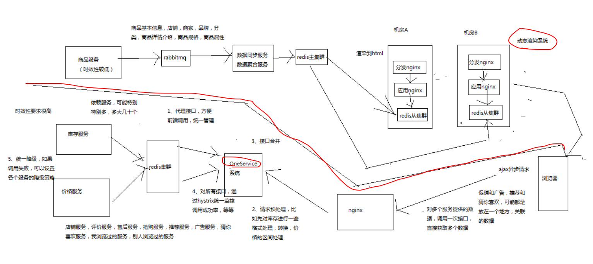

# 186. 商品详情页 OneService 系统：整体架构设计

前面把动态渲染系统这一套做完了，处理的是时效性不高的数据，而 OneService 处理的是时效性较高的数据。

OneService 系统的功能如下：

- 商品详情页依赖的服务达到数十个，甚至是上百个，需要给一个统一的入口，打造服务闭环
- 请求预处理
- 合并接口调用，减少 ajax 异步加载次数
- 统一监控
- 统一降级

后面的课程针对以上几点进行讲解，不一定都做出来代码，但是会有经验
