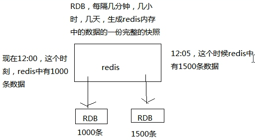
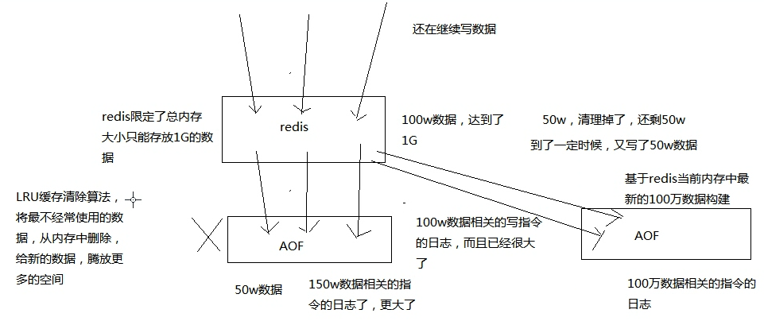

# 009. 图解分析 redis 的 RDB 和 AOF 两种持久化机制的工作原理
[[toc]]

我们已经知道对于一个企业级的 redis 架构来说，持久化是不可减少的

::: tip
牢记企业级 redis 集群架构是用来支撑海量数据、高并发、高可用

持久化主要是做灾难恢复、数据恢复，也可以归类到高可用的一个环节里面去
:::

比如你 redis 整个挂了，redis 就不可用了，你要做的事情是让 redis 变得可用，尽快变得可用你会怎么做？

你会重启 redis，尽快让它对外提供服务，但是就像上一讲说，如果你没做数据备份，这个时候 redis 就算启动了，也不可用，数据没有了，如果这个时候大量的请求过来，缓存全部无法命中，在 redis 里根本找不到数据，这个时候就死定了，缓存雪崩（后面会讲解）问题，所有请求没有在 redis 命中，就会去 mysql 数据库这种数据源头中去找，一下子 mysql 承接高并发，然后就挂了

mysql 挂掉，你都没法去找数据恢复到 redis 里面去，redis 的数据从哪儿来？从 mysql 来，所以这个事情在大型互联网项目中是恐怖的

具体的完整的缓存雪崩的场景，还有企业级的解决方案，到后面讲

如果你把 redis 的持久化做好，备份和恢复方案做到企业级的程度，那么即使你的 redis 故障了，也可以通过备份数据，快速恢复，一旦恢复立即对外提供服务

redis 的持久化跟高可用是有关系的，放在企业级 redis 架构中去讲解

redis 持久化的两种机制：RDB，AOF

## RDB
对 redis 中的数据执行周期性的持久化，如下图

## AOF
每条写入命令作为日志，写入 aof 文件中

为了保证性能，会先写入 os cache 中，然后定期强制执行 fsync 操作将数据刷入磁盘

它的原理：

- 因为每台单机 redis 的数据量是受内存限制的，所以 aof 文件不会无限增长
- 且当数据超过内存限制的时候，会自动使用 LRU 算法将一部分数据淘汰掉
- AOF 存放的是每条写入命令，所以会不断膨胀，当达到一定时候，会做 rewrite 操作
- rewrite 操作：基于当时 redis 内存中的数据，重新构造一个更小的 aof 文件，然后删除旧的 aof 文件

如上图，总结一下： aof 不断被追加，内存中数据有最大限制会自动淘汰，当 aof 中的数据大于内存中数据时，就会执行 rewrite 操作，生成新的 aof 文件

AOF 机制对每条写入命令作为日志，以 append-only 的模式写入一个日志文件中，在 redis 重启的时候，可以通过回放 AOF 日志中的写入指令来重新构建整个数据集

## 小结

通过 RDB 或 AOF，都可以将 redis 内存中的数据给持久化到磁盘上面来，然后可以将这些数据备份到别的地方去，比如说阿里云，云服务

如果 redis 挂了，服务器上的内存和磁盘上的数据都丢了，可以从云服务上拷贝回来之前的数据，放到指定的目录中，然后重新启动 redis，redis 就会自动根据持久化数据文件中的数据，去恢复内存中的数据，继续对外提供服务

如果同时使用 RDB 和 AOF 两种持久化机制，那么在 redis 重启的时候，会使用 AOF 来重新构建数据，因为 AOF 中的数据更加完整
