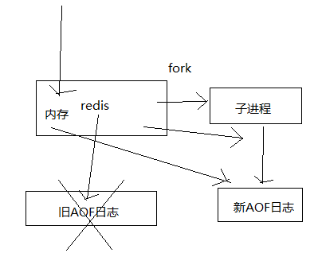

# 012. redis 的 AOF 持久化深入讲解各种操作和相关实验
[[toc]]

## AOF 持久化的配置

AOF 持久化，默认是关闭的，RDB 是默认开启的

打开 AOF 持久化机制之后，redis 每次接收到一条写命令，就会写入日志文件中，当然是先写入 os cache 的，然后每隔一定时间再 fsync 一下

/etc/redis/6379.conf 中的 APPEND ONLY MODE 配置区。

`appendonly yes` 启用后 appendfsync 属性开始生效，有三个策略可选

- no：不主动执行fsync

    仅仅 redis 负责将数据写入 os cache 就撒手不管了，然后后面 os 自己会时不时有自己的策略将数据刷入磁盘，不可控了
- always：每次写入一条数据就执行一次 fsync

    每次写入一条数据，立即将这个数据对应的写日志 fsync 到磁盘上去，性能非常非常差，吞吐量很低; 确保说 redis 里的数据一条都不丢，那就只能这样了
- everysec：每隔一秒执行一次 fsync

    每秒将 os cache 中的数据 fsync 到磁盘，这个最常用的，生产环境一般都这么配置，性能很高，QPS 还是可以上万的

QPS 指每秒钟的请求数量。大概的举个例子 :
- mysql -> 是基于大量磁盘，1~2K QPS
- redis -> 基于内存，磁盘做持久化，单机 QPS 一般来说上万没有问题


## AOF 持久化的数据恢复实验
1. 先仅仅打开 RDB，写入一些数据，然后 kill -9 杀掉 redis 进程，接着重启 redis，发现数据没了，因为 RDB 快照还没生成（上一节一节做过该实验）
2. 打开AOF的开关，启用 AOF 持久化
3. 写入一些数据，观察 AOF 文件中的日志内容
4. kill -9 杀掉 redis 进程，重新启动 redis 进程，发现数据被恢复回来了，就是从 AOF 文件中恢复回来的

    redis 进程启动的时候，直接就会从 appendonly.aof 中加载所有的日志，把内存中的数据恢复回来

/var/redis/6379 该路径下，是之前配置的路径
```
[root@eshop-cache01 6379]# cat appendonly.aof
*2
$6
SELECT
$1
0
*3
$3
set
$6
mykey1
$4
123k
```
上面的内容是我写入了一条 set mykey1 123k 命令之后的。但是不太能看懂是什么

它们先被写入 os cache 的，1 秒后才 fsync 到磁盘中的


## AOF rewrite
redis 中的数据其实有限的，很多数据可能会自动过期，可能会被用户删除，可能会被 redis 用缓存清除的算法清理掉，总之 redis 中的数据会不断淘汰掉旧的，就一部分常用的数据会被自动保留在 redis 内存中

所以可能很多之前的已经被清理掉的数据，对应的写日志还停留在 AOF 中，AOF 日志文件就一个，会不断的膨胀，到很大很大

所以 AOF 会自动在后台每隔一定时间做 rewrite 操作，比如日志里已经存放了针对 100w 数据的写日志了; redis 内存中只剩下 10 万; 基于内存中当前的 10 万数据构建一套最新的日志，到 AOF 中; 覆盖之前的老日志; 确保 AOF 日志文件不会过大，保持跟 redis 内存数据量一致

redis 2.4 之前，还需要手动，开发一些脚本 crontab 定时通过 BGREWRITEAOF 命令去执行 AOF rewrite，但是 redis 2.4 之后，会自动进行 rewrite 操作

> aof rewrite 有两个重要的配置参数

/etc/redis/6379.conf
```
auto-aof-rewrite-percentage 100
auto-aof-rewrite-min-size 64mb
```
上面的配置意思是： 当 aof 日志超过 64 m 且，上一次 aof 之后的文件大小，比如是 60 m，那么当文件增长到 120 m 的时候，就会触发 rewrite 操作

- auto-aof-rewrite-percentage: 增长百分比，比上一次增长多少内容的时候就会触发 rewrite 操作
- auto-aof-rewrite-min-size：rewrite 操作的最小文件大小，超过该大小才会执行 rewrite 操作

> rewrite 流程

1. redis fork 一个子进程
2. 子进程基于当前内存中的数据，构建日志，开始往一个新的临时的 AOF 文件中写入日志
3. redis 主进程，接收到 client 新的写操作之后，在内存中写入日志，同时新的日志也继续写入旧的 AOF 文件
4. 子进程写完新的日志文件之后，redis 主进程将内存中的新日志再次追加到新的 AOF 文件中
5. 用新的日志文件替换掉旧的日志文件

下图对上面文字描述的演示



## AOF 破损文件的修复
如果 redis 在 append 数据到 AOF 文件时，机器宕机了，可能会导致 AOF 文件破损

可以用 redis-check-aof --fix 命令来修复破损的 AOF 文件（该命令在 redis 安装目录下）

```bash
redis-check-aof --fix xxx.aof
```

可以手动以破坏，然后执行修复：

1. 将 aof 文件删除后两行数据
2. 然后使用 redis-check-aof 修复
3. 查看被修复的文件

修复的原理貌似就是删除掉破损的数据。因为 aof 的内容变少了。

## AOF 和 RDB 同时工作

- 他们的自动执行是互斥的
- 如果 RDB 在执行 snapshotting，此时用户手动执行 BGREWRITEAOF 命令，那么等 RDB 快照生成之后，才会去执行 AOF rewrite
- 同时有 RDB snapshot 文件和 AOF 日志文件，那么 redis 重启的时候，会优先使用 AOF 进行数据恢复，因为其中的日志更完整

## 最后一个小实验
在有 rdb 的 dump 和 aof 的 appendonly 的同时，rdb 里也有部分数据，aof 里也有部分数据，这个时候其实会发现，rdb 的数据不会恢复到内存中

1. 设置 rdb 5 秒保存一次，写入两条数据，等待 rdb 数据持久化后停止 redis 进程
2. 这个时候 rdb 和 aof 中的数据都是完整的
3. 我们模拟让 aof 破损，然后 fix，有一条数据会被 fix 删除
4. 再次用 fix 的 aof 文件去重启 redis，发现数据只剩下一条了

同时存在的时候，会优先使用 aof 文件恢复数据。

数据恢复完全是依赖于底层的磁盘的持久化的，如果 rdb 和 aof 上都没有数据，那就没了
