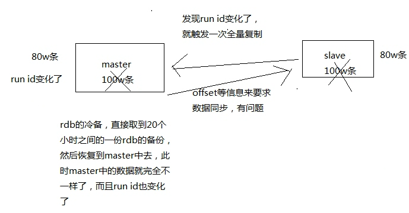

# 017. redis replication 的完整流运行程和原理的再次深入剖析
[[toc]]

## 复制的完整流程


1. slave node 启动，仅仅保存 master node 的信息

    但是复制流程没开始，master 信息包括 host 和 ip ，
    那么是从哪儿来的？是在配置文件 redis.conf 里面的 slaveof 配置的

2. slave node 定时检查是否需要与 master 连接

    内部有个定时任务，每秒检查是否有新的 master node 要连接和复制，如果发现，就跟 master node 建立 socket 网络连接
3. slave node 发送 ping 命令给 master node
4. 口令认证

    如果 master 设置了 requirepass，那么 salve node 必须发送 masterauth的口令过去进行认证
5. master node 第一次执行全量复制，将所有数据发给 slave node
6. master node 后续持续将写命令，异步复制给 slave node

## 数据同步相关的核心机制

指的就是第一次 slave 连接 msater 的时候，执行的全量复制，该过程里面的一些细节的机制

- master 和 slave 都会维护一个 offset

    master 会在自身不断累加 offset，slave 也会在自身不断累加 offset

    slave 每秒都会上报自己的 offset 给 master，同时 master 也会保存每个 slave的 offset

    这个倒不是说特定就用在全量复制的，主要是 master 和 slave 都要知道各自的数据的 offset，才能知道互相之间的数据不一致的情况

- backlog

  master node 有一个 backlog，默认是 1MB 大小

  master node 给 slave node 复制数据时，也会将数据在 backlog 中同步写一份

  backlog 主要是用来做全量复制中断候的增量复制的

  疑问：那么这个 backlog 里面是存储 offset 的吗？

- master run id

  通过 info server 命令可以看到 master run id

  ```bash
  [root@eshop-cache01 ~]# redis-cli
  127.0.0.1:6379> info server
  # Server
  redis_version:3.2.8
  redis_git_sha1:00000000
  redis_git_dirty:0
  redis_build_id:6daa1ff954b79779
  redis_mode:standalone
  os:Linux 2.6.32-431.el6.i686 i686
  arch_bits:32
  multiplexing_api:epoll
  gcc_version:4.4.7
  process_id:1045
  run_id:9b3e4cb502e78b0b5664f66eeac6eceb36bc8e28   # 这里
  tcp_port:6379
  uptime_in_seconds:169663
  uptime_in_days:1
  hz:10
  lru_clock:9598685
  executable:/usr/local/bin/redis-server
  config_file:/etc/redis/6379.conf
  ```

  如果根据 host+ip 定位 master node，是不靠谱的，如果 master node 重启或者数据出现了变化，那么 slave node 应该根据不同的 run id 区分，run id 不同就做全量复制

  

  如上图，解释了为什么要通过 run id 来定位 master node

  如果需要不更改 run id 重启 redis，可以使用 redis-cli debug reload 命令

- psync

    从节点使用 psync 从 master node 进行复制，psync runid offset

    master node 会根据自身的情况返回响应信息，可能是 FULLRESYNC runid offset 触发全量复制，可能是 CONTINUE 触发增量复制

    解释下：假如 runid 与自身不符，那么久可以全量更新数据

## 全量复制

1. master 执行 bgsave，在本地生成一份 rdb 快照文件
2. master node 将 rdb 快照文件发送给 salve node

    如果 rdb 复制时间超过 60 秒（可通过 repl-timeout 属性配置），那么 slave node 就会认为复制失败，可以适当调节大这个参数

    对于千兆网卡的机器，一般每秒传输 100MB，6G 文件，很可能超过 60s
3. master node 在生成 rdb 时，会将所有新的写命令缓存在内存中，在 salve node 保存了 rdb 之后，再将新的写命令复制给 salve node，保证主从数据一致
4. client-output-buffer-limit slave 256MB 64MB 60

    如果在复制期间，内存缓冲区持续消耗超过 64MB，或者一次性超过 256MB，那么停止复制，复制失败

    什么意思呢？比如在等待 slave 同步 rdb 文件的时候，master 接收写的命令在缓冲区超过了 64m 的数据，那么此次复制失败
5. slave node 接收到 rdb 之后，清空自己的旧数据，然后重新加载 rdb 到自己的内存中，同时基于旧的数据版本对外提供服务
6. 如果 slave node 开启了 AOF，那么会立即执行 BGREWRITEAOF，重写 AOF

总的来说，还是比较耗时的，rdb 生成、rdb 通过网络拷贝、slave 旧数据的清理、slave aof rewrite，很耗费时间

如果复制的数据量在 4G~6G 之间，那么很可能全量复制时间消耗到 1 分半到 2 分钟

## 增量复制

1. 如果全量复制过程中，master-slave 网络连接断掉，那么 salve 重新连接 master 时，会触发增量复制
2. master 直接从自己的 backlog 中获取部分丢失的数据，发送给 slave node，默认 backlog 就是 1MB
3. msater 就是根据 slave 发送的 psync 中的 offset 来从 backlog 中获取数据的

## heartbeat

主从节点互相都会发送 heartbeat 信息

- master 默认每隔 10 秒发送一次 heartbeat
- salve node 每隔 1 秒发送一个 heartbeat

## 异步复制

master 每次接收到写命令之后，先在内部写入数据，然后异步发送给 slave node
