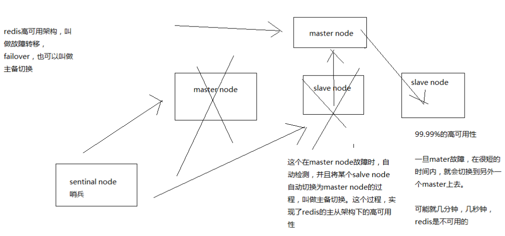

# 020. redis 主从架构下如何才能做到 99.99% 的高可用性？
[[toc]]
## 什么是 99.99% 高可用？

- 不可用：系统挂掉，很难恢复起来，短时间内都不行，这就不可用
- 高可用：全年 99.99/99.9/99 % 的时间都能正常提供服务就是高可用

这里有一个比较学术点的解释：**可用性的高低** 是使用 **不可用时间** 占 **总时间** 的比例来衡量。不可用时间是从故障发生到故障恢复的时间。比如，可用性 4 个 9 的系统（99.99%），它一年宕机时间不能超过53分钟（=365*24*60*(1-0.9999)）。做到高可用系统，需要尽可能的 **降低故障发生的次数** 和 **减少故障持续的时间**。

## redis 不可用是什么？
单实例不可用？主从架构不可用？不可用的后果是什么？

如上图，简单说就是 master 不可用的时候，后果就很严重

## redis 怎么才能做到高可用？

通过主备切换，在很短的时间内恢复可用状态。redis 哨兵（sentinal node）功能提供了这种支持。

接下来的几个章节都是讲解哨兵相关知识
