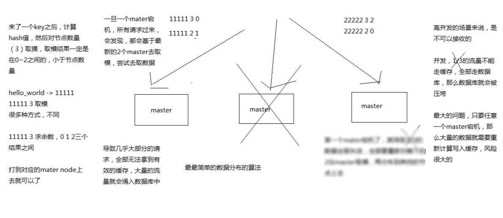

# 027. 数据分布算法：hash+ 一致性 hash + redis cluster 的 hash slot
[[toc]]

讲解分布式数据存储的核心算法，数据分布的算法

hash 算法 -> 一致性 hash 算法（memcached） -> redis cluster 的 hash slot 算法

用不同的算法，就决定了在多个 master 节点的时候，数据如何分布到这些节点上去，解决这个问题

看到这里的时候，已经明白了，可能是通过 key 去路由到多个 master 上的

## redis cluster 介绍

- 自动将数据进行分片，每个 master 上放一部分数据
- 提供内置的高可用支持，部分 master 不可用时，还是可以继续工作的

在 redis cluster 架构下，每个 redis 要放开两个端口号，比如一个是 6379，另外一个就是加 10000 的端口号，比如 16379

16379 端口号是用来进行节点间通信的，通过 cluster bus（集群总线）。cluster bus 的通信是用来进行故障检测，配置更新，故障转移授权

cluster bus 用了另外一种二进制的协议，主要用于节点间进行高效的数据交换，占用更少的网络带宽和处理时间

## 最老土的 hash 算法和弊端（大量缓存重建）

的确它的最大弊端就是，增加或者减少节点的时候，基本上所有数据都要重建路由

## 一致性 hash 算法（自动缓存迁移）+ 虚拟节点（自动负载均衡）

- 优点：自动缓存迁移
- 缺点：缓存热点问题

一致性 hash 的严重问题是缓存热点，关键字是 **区间**，因为它是一个环，顺时针找可用节点，所以只要节点够多，就能更均匀的均衡负载。

所以出现了虚拟节点，来解决这个缺点

如上图，假设只有 3 个物理节点，但是在这个环上，分布了若干个虚拟节点（最后指向的是物理节点）

对于数据落在 1-3 这个区间

- 无虚拟节点：顺时针向右，全部导向了节点 3
- 有虚拟节点：顺时针向右，被多个虚拟节点分割，可能会遇上节点 1、2、3 。这样就负载均衡了

## redis cluster 的 hash slot 算法

redis cluster 有固定的 16384 个 hash slot，对每个 key 计算 CRC16 值，然后对 16384 取模，可以获取 key 对应的 hash slot

redis cluster 中每个 master 都会持有部分 slot，比如有 3 个 master，那么可能每个 master 持有 5000 多个 hash slot

hash slot 让 node 的增加和移除很简单：

- 增加一个 master，就将其他 master 的 hash slot 移动部分过去
- 减少一个 master，就将它的 hash slot 移动到其他 master 上去

移动 hash slot 的成本是非常低的

客户端的 api，可以对指定的数据，让他们走同一个 hash slot，通过 hash tag 来实现

如上图，思路与一致性 hash 是一样的。通过更过的 hash slot，将路由分布得更均匀。
当一台机器挂掉之后，会在极短的时间内，将挂掉的 hash slot 分配给其他两个物理节点

可以看成是 -> hash slot -> 机器，hash slot 数量固定，不一一对应机器，动态分配的。
