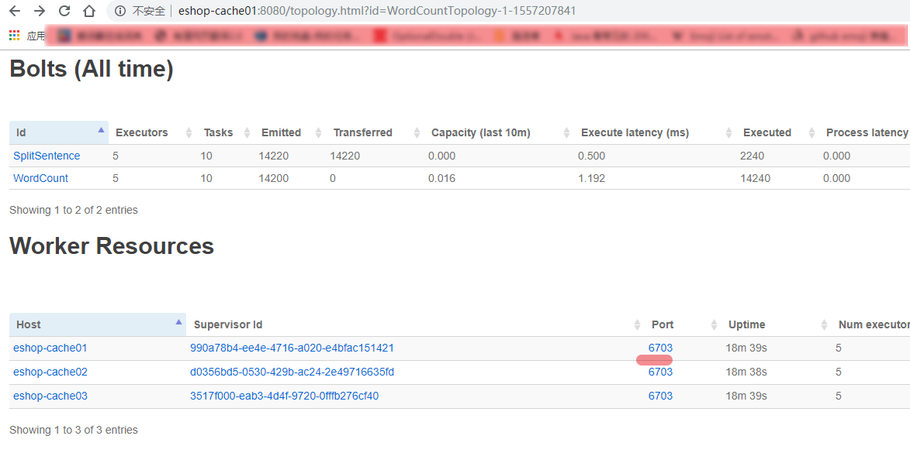

# 067. 基于集群运行计算拓扑

## 打包

之前配置的 jar 任务，把依赖也打到 jar 中

由于在提交到 storm 集群中遇到的一些坑，最后把调试通过后的 gradle 配置内容贴出来

```
//指定编译的编码
tasks.withType(JavaCompile) {
    options.encoding = "UTF-8"
}
version = '1.0.0'
// 打包与集群中的服务器中的 java 版本要一致
sourceCompatibility = '1.7'

dependencies {
    // 打包的时候不打包该依赖，因为提交的作业是会被 storm 程序加载
    // 所以 storm-core 已经被加载到程序中了
    compileOnly 'org.apache.storm:storm-core:1.1.0'
    compile 'commons-collections:commons-collections:3.2.1'
}

jar {
    manifestContentCharset 'utf-8'
    metadataCharset 'utf-8'
    manifest {
        attributes(
                "Manifest-Version": 1.0,
                "Main-Class": "cn.mrcode.cachepdp.storm.helloword.WordCountTopology")
    }
    from { configurations.compile.collect { it.isDirectory() ? it : zipTree(it) } }
}
```


## 提交作业到 storm 集群
语法：storm jar path/to/allmycode.jar org.me.MyTopology arg1 arg2 arg3

```
# 本次练习，后面的参数是自定义的
# StormSubmitter.submitTopologyWithProgressBar(args[0], conf, builder.createTopology());
# 之前代码中用到了 第一个参数当做 提交的 topology 名称
storm jar storm-helloword-1.0.0.jar cn.mrcode.cachepdp.storm.helloword.WordCountTopology WordCountTopology
```

启动过程中报错，`compileOnly 'org.apache.storm:storm-core:1.1.0'` 使用 compileOnly 打包不把该依赖打包

```
Caused by: java.lang.RuntimeException: java.io.IOException: Found multiple defaults.yaml resources. You're probably bundling the Storm jars with your topology jar. [jar:file:/usr/local/storm/lib/storm-core-1.1.0.jar!/defaults.yaml, jar:file:/usr/local/storm/storm-helloword-0.0.1-SNAPSHOT.jar!/defaults.yaml]
at org.apache.storm.utils.Utils.findAndReadConfigFile(Utils.java:383)
at org.apache.storm.utils.Utils.readDefaultConfig(Utils.java:427)
at org.apache.storm.utils.Utils.readStormConfig(Utils.java:463)
at org.apache.storm.utils.Utils.<clinit>(Utils.java:177)
... 39 more
```

再次运行报错，有可能是你打包是用 1.8 ，运行是用 1.7

```
Exception in thread "main" java.lang.UnsupportedClassVersionError: cn/mrcode/cachepdp/storm/helloword/WordCountTopology : Unsupported major.minor version 52.0
at java.lang.ClassLoader.defineClass1(Native Method)
```

运行成功显示

```
[root@eshop-cache01 storm]# storm jar storm-helloword-1.0.0.jar cn.mrcode.cachepdp.storm.helloword.WordCountTopology WordCountTopology
Running: /usr/java/latest/bin/java -client -Ddaemon.name= -Dstorm.options= -Dstorm.home=/usr/local/storm -Dstorm.log.dir=/usr/local/storm/logs -Djava.library.path=/usr/local/lib:/opt/local/lib:/usr/lib -Dstorm.conf.file= -cp /usr/local/storm/storm-helloword-1.0.0.jar:/usr/local/storm/lib/log4j-over-slf4j-1.6.6.jar:/usr/local/storm/lib/reflectasm-1.10.1.jar:/usr/local/storm/lib/storm-core-1.1.0.jar:/usr/local/storm/lib/storm-rename-hack-1.1.0.jar:/usr/local/storm/lib/log4j-api-2.8.jar:/usr/local/storm/lib/ring-cors-0.1.5.jar:/usr/local/storm/lib/log4j-slf4j-impl-2.8.jar:/usr/local/storm/lib/clojure-1.7.0.jar:/usr/local/storm/lib/servlet-api-2.5.jar:/usr/local/storm/lib/asm-5.0.3.jar:/usr/local/storm/lib/objenesis-2.1.jar:/usr/local/storm/lib/disruptor-3.3.2.jar:/usr/local/storm/lib/minlog-1.3.0.jar:/usr/local/storm/lib/log4j-core-2.8.jar:/usr/local/storm/lib/slf4j-api-1.7.21.jar:/usr/local/storm/lib/kryo-3.0.3.jar:storm-helloword-1.0.0.jar:/usr/local/storm/conf:/usr/local/storm/bin -Dstorm.jar=storm-helloword-1.0.0.jar -Dstorm.dependency.jars= -Dstorm.dependency.artifacts={} cn.mrcode.cachepdp.storm.helloword.WordCountTopology WordCountTopology
2228 [main] INFO  o.a.s.StormSubmitter - Generated ZooKeeper secret payload for MD5-digest: -6684020447691510709:-7027356525674661306
2524 [main] INFO  o.a.s.u.NimbusClient - Found leader nimbus : eshop-cache01:6627
2583 [main] INFO  o.a.s.s.a.AuthUtils - Got AutoCreds []
2589 [main] INFO  o.a.s.u.NimbusClient - Found leader nimbus : eshop-cache01:6627
2678 [main] INFO  o.a.s.StormSubmitter - Uploading dependencies - jars...
2680 [main] INFO  o.a.s.StormSubmitter - Uploading dependencies - artifacts...
2681 [main] INFO  o.a.s.StormSubmitter - Dependency Blob keys - jars : [] / artifacts : []
2713 [main] INFO  o.a.s.StormSubmitter - Uploading topology jar storm-helloword-1.0.0.jar to assigned location: /var/storm/nimbus/inbox/stormjar-84efb0f9-e1a4-4d54-a55f-a4fe68adfd62.jar
Start uploading file 'storm-helloword-1.0.0.jar' to '/var/storm/nimbus/inbox/stormjar-84efb0f9-e1a4-4d54-a55f-a4fe68adfd62.jar' (581266 bytes)
[==================================================] 581266 / 581266
File 'storm-helloword-1.0.0.jar' uploaded to '/var/storm/nimbus/inbox/stormjar-84efb0f9-e1a4-4d54-a55f-a4fe68adfd62.jar' (581266 bytes)
2836 [main] INFO  o.a.s.StormSubmitter - Successfully uploaded topology jar to assigned location: /var/storm/nimbus/inbox/stormjar-84efb0f9-e1a4-4d54-a55f-a4fe68adfd62.jar
2837 [main] INFO  o.a.s.StormSubmitter - Submitting topology WordCountTopology in distributed mode with conf {"storm.zookeeper.topology.auth.scheme":"digest","storm.zookeeper.topology.auth.payload":"-6684020447691510709:-7027356525674661306","topology.workers":3,"topology.debug":false}
3636 [main] INFO  o.a.s.StormSubmitter - Finished submitting topology: WordCountTopology
```

## ui 查看

访问 http://eshop-cache01:8080/index.html

进入 WordCountTopology 这个拓扑页面之后，点击端口号，可以看到这台机器上面的日志信息



## kill 掉某个 storm 作业

语法：storm kill topology-name

```
[root@eshop-cache01 storm]# storm kill WordCountTopology
Running: /usr/java/latest/bin/java -client -Ddaemon.name= -Dstorm.options= -Dstorm.home=/usr/local/storm -Dstorm.log.dir=/usr/local/storm/logs -Djava.library.path=/usr/local/lib:/opt/local/lib:/usr/lib -Dstorm.conf.file= -cp /usr/local/storm/storm-helloword-1.0.0.jar:/usr/local/storm/lib/log4j-over-slf4j-1.6.6.jar:/usr/local/storm/lib/reflectasm-1.10.1.jar:/usr/local/storm/lib/storm-core-1.1.0.jar:/usr/local/storm/lib/storm-rename-hack-1.1.0.jar:/usr/local/storm/lib/log4j-api-2.8.jar:/usr/local/storm/lib/ring-cors-0.1.5.jar:/usr/local/storm/lib/log4j-slf4j-impl-2.8.jar:/usr/local/storm/lib/clojure-1.7.0.jar:/usr/local/storm/lib/servlet-api-2.5.jar:/usr/local/storm/lib/asm-5.0.3.jar:/usr/local/storm/lib/objenesis-2.1.jar:/usr/local/storm/lib/disruptor-3.3.2.jar:/usr/local/storm/lib/minlog-1.3.0.jar:/usr/local/storm/lib/log4j-core-2.8.jar:/usr/local/storm/lib/slf4j-api-1.7.21.jar:/usr/local/storm/lib/kryo-3.0.3.jar:/usr/local/storm/conf:/usr/local/storm/bin org.apache.storm.command.kill_topology WordCountTopology
13712 [main] INFO  o.a.s.u.NimbusClient - Found leader nimbus : eshop-cache01:6627
16632 [main] INFO  o.a.s.c.kill-topology - Killed topology: WordCountTopology
```

在 ui 上也可以操作
