#  absolute 绝对定位

深入理解 CSS 的 position:absolute 声明的表现、掌握一些 position:absolute 的高级应用。

[[toc]]

## 1. absolute 和 float

一个是值，一个是属性名不是一个类别，但是他们的确是亲兄弟：一致的包裹与破坏性。

###  包裹性


如上图，会让容器包裹住它，[absolute 的包裹性 demo 演示](https://github.com/zq99299/css-zxx/tree/master/absolute/1-2/absolute的包裹性.html) ；**包裹性** 是让父元素 absolute

### 破坏性

[absolute 的破坏性 demo 演示](https://github.com/zq99299/css-zxx/tree/master/absolute/1-2/absolute的破坏性.html)

同样它也有破坏性，让父容器高度塌陷


### 相互替代

所以在很多场景下，float 和 absolute 是可以互相代替的

[absolute和float高尔基 demo 演示](https://github.com/zq99299/css-zxx/tree/master/absolute/1-2/absolute和float高尔基.html) 

## 2. 别把我和 relative 栓在一起

一个大大的误区，把一张图片决定定位到右上角时间，大多数人都是先在父元素上使用 relative，然后在元素上使用 absolute，并且还使用了 left 和 top，其实这样使用时对 absolute 的理解不够深刻导致的


### 一个小故事

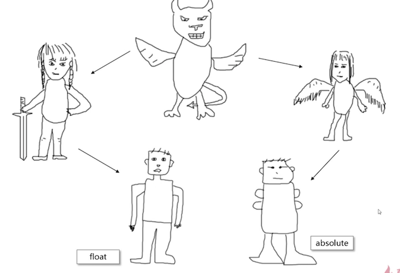

恶魔和剑士、天使各生了一个儿子，他们都有恶魔血统，因此都具有破坏性，但是由于母亲的不同，absolute 还具有飞翔的特性。

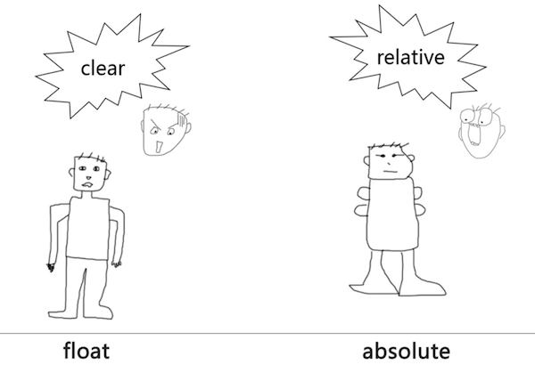

由于他们有破坏性，要么父容器高度塌陷，要么不翼而飞，因此：

- clear 用来收拾 float 的残局

- relative 用来限制 absolute

  至于 relative 是如何限制的，在 relative 篇来讲解

### 你要明白

relative 和 absolute 是分离的，对立的，他们不是兄弟关系。另外 absolute 越独立越强大

### 超越 overflow

[超越overflow demo 演示](https://github.com/zq99299/css-zxx/tree/master/absolute/3-2/超越overflow.html) 

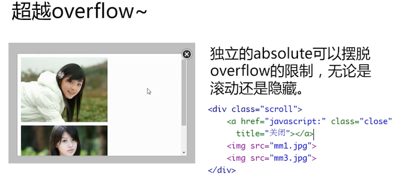

哪个按钮是在容器内部的，在容器滚动时，本应该跟随滚动，但是它却一直在右上角，这就是因为它是一个独立的 absolute 定位的元素，即便父元素是 `overflow:hidden` 的，它也不会被隐藏掉

要记住这个很有用：如果想要这个对话框整个的使用 `postition:fixed` 这肯定就破坏了上述的规定，导致无法超越 overflow 了，但是：只需要在 scroll 外增加一层容器，在该容器上进行 fixed，这就符合了上述的规定，能达到让该对话框固定，并且 scroll 的 absolute 元素还能超越 scroll 的 overflow

## 3. 无依赖的 absolute

> 上辈子就是折翼的天使

无依赖的意思是：不受 `relative` 限制的 `absolute` 定位，行为表现上是不使用 `top/right/bottom/left` 任何一个属性或使用 `auto` 作为值

### 定位的表现

1. 脱离文档流
2. 折翼的天使

#### 脱离文档流

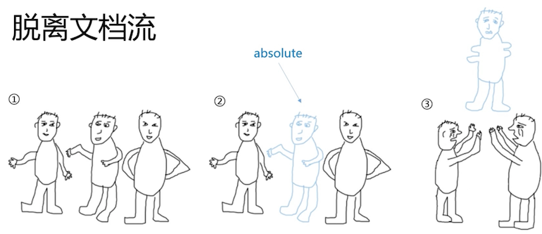

飞走了。

#### 折翼的天使

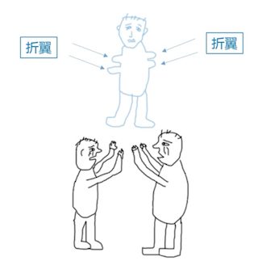

可以避免不受控制的瞬间移动功能，它能安安稳稳的定位在两个小伙伴的上方

[折翼的天使 demo 演示](https://github.com/zq99299/css-zxx/tree/master/absolute/3-2/折翼的天使.html) 

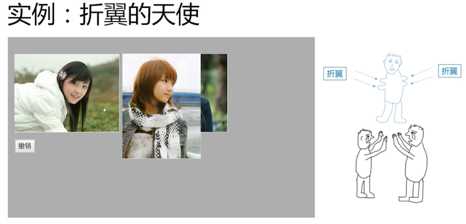

原本三张图片是并排在一起的，使用 absolute 后，第二张图片飞翔了，但是它还是在原来的位置，只是飞起来了


### 折翼天使的表现

1. 去浮动
2. 位置跟随

#### 去浮动

[折翼天使表现特性一：去浮动 demo 演示](https://github.com/zq99299/css-zxx/tree/master/absolute/3-2/折翼天使表现特性一：去浮动.html) 


当地二张图片使用 `float:left` 时，这个文字环绕的特性我们已经很熟悉了


但是当他同时存在 float 与 absolute 时，浮动就无效了


#### 位置跟随

[折翼天使表现特性二：位置跟随 demo 演示](https://github.com/zq99299/css-zxx/tree/master/absolute/3-2/折翼天使表现特性二：位置跟随.html) 

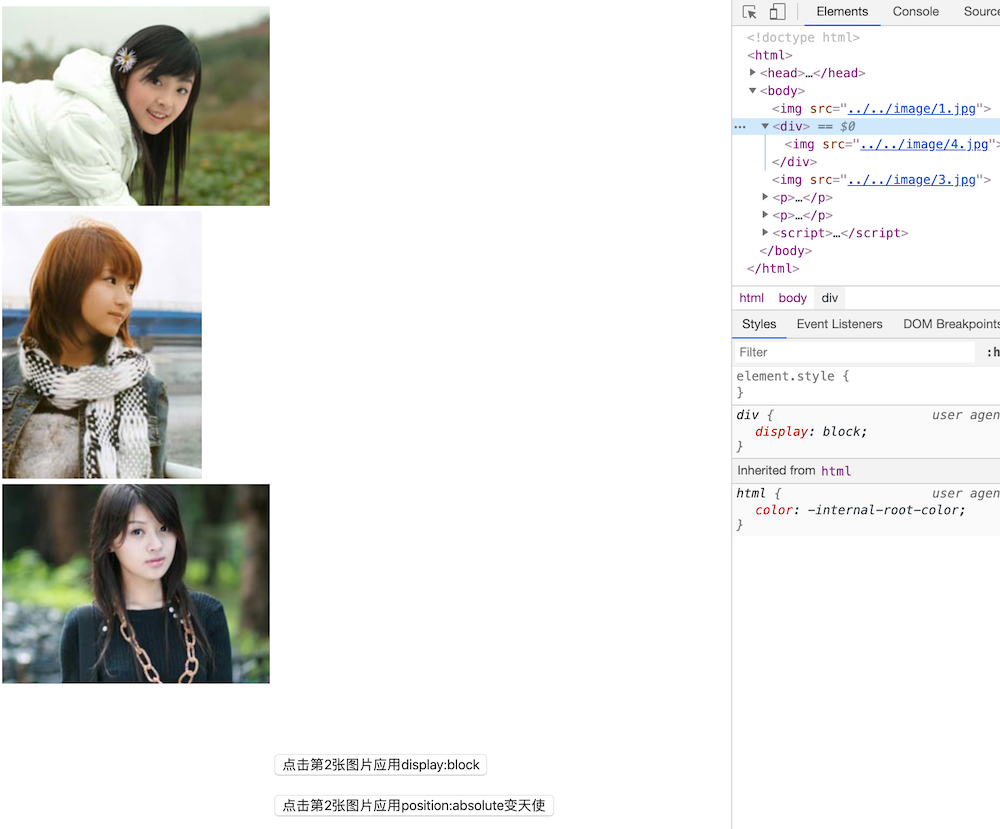

在谷歌浏览器中，可能会表现不一致，这个是他的机制问题：当一个元素被绝对定位后，去更改他的 display 属性是 **不生效的**，需要在绝对定位前被更改

而在 IE7 中，绝对定位后，元素会变成 `display:inline-block` ，而且无法更改，解决 IE 7 的这个问题

```html

<div></div>   在元素外增加一层没有任何样式的 div

```

#### 配合 margin 的精确定位

1. 支持负值定位
2. 超赞的兼容性：支持 IE6

### 总结

作者把这种不依赖的 abslute 定位称为：**不影响其他布局的绝对定位下的相对定位之王**

它使用了绝对定位，但是实现的是相对定位，下章继续讲解

## 4. 图片图标绝对定位覆盖

强大的折翼天使，无依赖 absolute 相对定位实例篇，目录如下：

1. 图片图标来覆盖，无依赖、真不赖
2. 如何定位下拉框，最佳实践来分享
3. 对齐居中或边缘，定位实现有脸面
4. 星号时有时没有，破坏对象不用愁
5. 图文对齐兼容差，绝对定位来开挂
6. 文字溢出不够放，不值一提就小样

### 图片图标覆盖

> 图片图标来覆盖，无依赖、真不赖

图片图标使用绝对定位覆盖在其他元素上，不依赖 `relative` 实现定位，最终实现的效果很赞！

[图标定位二三事 demo 演示](https://github.com/zq99299/css-zxx/tree/master/absolute/4-2/图标定位二三事.html) 


上述几个都是图标覆盖在其他元素上面，**在实现无依赖的绝对定位时，元素的位置是非常重要的**，比如左上角的覆盖效果

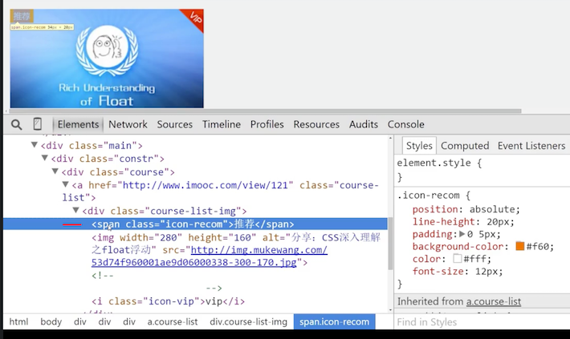

左上角的图标在图片前面，使用绝对定位后，由于它不占据空间，图片跟随上去代替了它原本的位置，效果就非常完美


此现象在上一节解释过了，无依赖的绝对定位元素有一个很大的特性 **跟随性**，普通元素所在位置，在绝对定位后它还是在原来的位置。图片后面有一行文字的话，这个文字会和图片在一行上面，但是绝对定位后的 **宽高不占据任何尺寸**，所以它才能完美的在容器外显示，如果该元素前面有 1像素元素时，就会错位（比如正常的换行，也会导致错位）

次类方式定位的优点：由于与父元素无依赖，利于维护、健壮、强大

### 如何定位下拉框

> 如何定位下拉框，最佳实践来分享

主要介绍使用无依赖绝对定位实现自定义下拉框效果

[下拉框定位二三事 demo 演示](https://github.com/zq99299/css-zxx/tree/master/absolute/4-2/下拉框定位二三事.html) （此实现应该是最佳实现）


以上自定义下拉框，一般实现由如下方式：

- 通过 js 计算定位
- 父容器 relative，子元素通过 margin 定位
- 使用本章讲解的无依赖绝对定位

简单的描述下它的实现：输入框在下拉列表后面

- 首先输入框要 `float:left`，
- 容器进行 `overflow: hidden;`，由于前面浮动了，这里产生 BFC 包裹住输入框
- 下拉列表使用绝对定位，还会在原来的位置，使用 margin-top 给输入框留出来高度

就就是基本的下拉框跟随输入框的效果定位了

### 对齐居中或边缘

> 对齐居中或边缘，定位实现有脸面

通过 `text-align` 控制无依赖绝对定位元素的居中或边缘定位效果

[ 居中、边缘定位二三事 demo 演示](https://github.com/zq99299/css-zxx/tree/master/absolute/4-2/居中、边缘定位二三事.html) 


图片水平居中，代码很简单，它利用的就是跟随特性，跟随哪个空格。

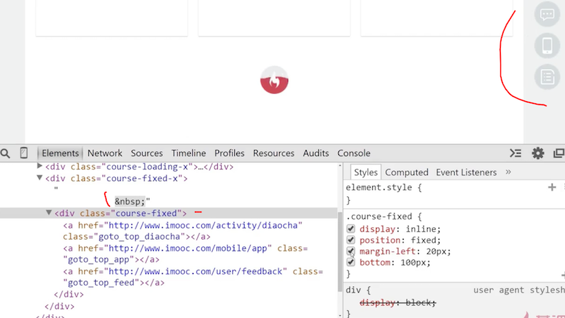

这个侧边栏也是一样的使用了上述的原理，利用跟随属性实现；

那么这个侧边栏跟随实现的优点是什么呢？

- 传统的实现方式：`left 50% + margin-left 自身的一半`，需要计算宽度
- 而这里的跟随实现：不需要计算宽度 （最佳实践）

### 其他三个

> 星号时有时没有，破坏对象不用愁
>
> 图文对齐兼容差，绝对定位来开挂
>
> 文字溢出不够放，不值一提就小样

以上三个在一个例子中 [文本图标对齐与定位二三事 demo 示例](https://github.com/zq99299/css-zxx/tree/master/absolute/4-2/文本图标对齐与定位二三事.html)


#### 星号对齐

- 有可能是左对齐或则是右对齐
- 后面文字还需要对齐
- 有的有 `*` 号，有的没有


只要将星号绝对定位，它不会占据空间，后面的文字就都对齐了

#### 图文对齐

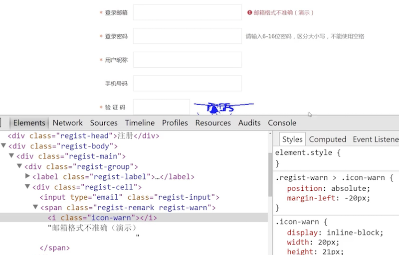

同样适用绝对定位，而且不影响后面的布局

#### 文字溢出


容器尺寸不够放下文字了，但是还能完整显示出来，这里和前面那个 vip 图标定位原理一致


不占据真实空间尺寸，就算是 0 ，也会跟随前面的 input 显示

### 总结

还设有很多类似的布局，都可以使用无依赖定位，特别的强。

无依赖绝对定位为页面布局与重构提供了更加广阔的选型新思路！

所以当有合适场景的时候或则当你布局搞不定的时候，可以尝试下这种方式

## 5. 脱离文档流二三事

> 天使专属隐藏技

### 回流与重绘

由于有脱离文档流的特性，动画尽量用在绝对定位元素上，因为就算它怎么搞，都不会影响普通元素  

### 垂直空间的层级

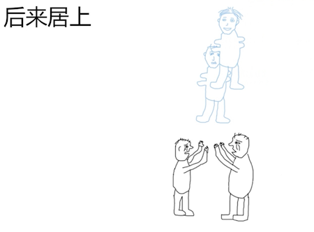

当有多个脱离文档流时，当他们靠近时，后来的会骑在前一个上面。

由于有这种特性，那么就出来**误区**了：以为绝对定位元素都需要 z-index 控制层级，确定其显示位置

### 绝对定位于 z-index 无依赖

1. 如果只有一个绝对定位元素，自然不需要 z-index ，自动覆盖普通元素
2. 如果两个绝对定位，控制 DOM 流的前后顺序达到需要的覆盖效果，依然无 z-index
3. 如果多个绝对定位交错，非常非常少见，z-index:1 控制
4. 如果非弹框类的绝对定位元素 `z-index > 2` ，必定 `z-index` 冗余，请优化

## 6. 天使的翅膀

> top/right/bottom/left

折翼天使 VS 大天使

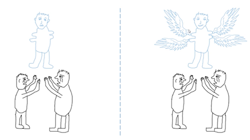

使用他们将能够让自己长出翅膀，主动定位，一般是组合使用 

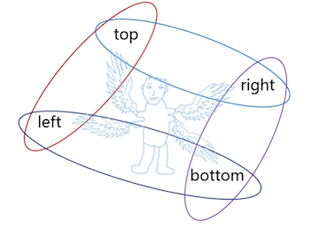

比如下图的组合使用，能让它位移到左上角


牛逼的技能也有克星，当遇到 `postition:relative/absolute/fixed/sticky` 时，就被禁锢了

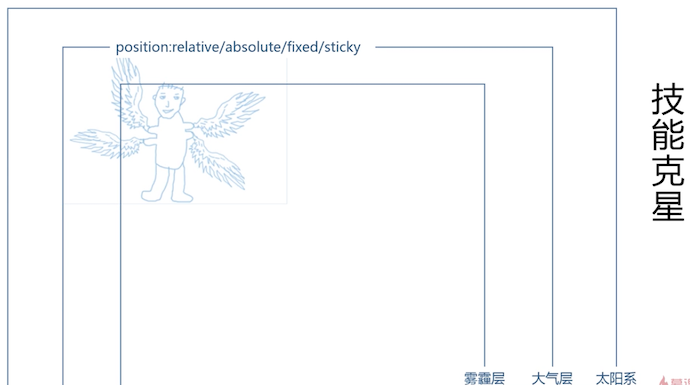

## 7. 与 width/height 的特殊表现

> left/top/right/bottom 与 width/height 异曲同工与特殊表现

### 相互替代性

已知页面样式： `html,body{height: 100%}`

实现一个 **全屏自适应** 的 50% 黑色半透明 _遮罩层_ 你会怎么实现？

```css
通常的技术方案

.overlay{
  postition: absolute;
  width:100%; height:100%;   重点是这个
  left:0;top:0;
  ...
}

其实还可以这样实现：

.overlay{
  postition: absolute;
  left:0;top:0;right:0;bottom:0;
  ...
}
```

没有宽度高度，也能实现自适应的全屏效果，这涉及到一个很重要的特性：**绝对定位方向是对立**（如 left vs right）的时候，结果不是瞬间位移，而是 **身体爆裂拉伸**

也就是说，很多情况下，absolute 的翅膀拉伸和 `width/height` 是可以相互替代的

```css
position: absolute; left:0; top0; width：50% 

等同于

position: absolute; left:0; top0; right：50% 
```

注意：至少需要 IE7+ 的浏览器才会支持

虽然他们可以相互替代，但是 **拉伸更强大**

实现一个距离右侧 200 像素的的 **全屏自适应** 的容器层，你会怎么实现？

```css
拉伸直接：
position: absolute; left:0; right:200px

但是，width 只能使用 CSS3 calc 计算：
position: absolute; left:0; width:calc(100% - 200px);
```

[没有宽度和高度声明实现的全屏自适应效果 demo 演示](https://github.com/zq99299/css-zxx/tree/master/absolute/7/没有宽度和高度声明实现的全屏自适应效果.html)

### 相互支持性

1. 容器无需固定 `width/height` 值，内部元素就可以拉伸
2. 容器拉伸，内部元素支持百分比 `width/height` 值


实现一个 50% 透明的遮罩层，使用绝对定位拉伸是最好的办法


[无固定width或height容器内的绝对定位元素拉伸 demo 演示](https://github.com/zq99299/css-zxx/tree/master/absolute/7/无固定width或height容器内的绝对定位元素拉伸.html)

内部拉伸特性应用


在这种场景上，无论图片多大，都能够自适应覆盖。

第 2 点：容器拉伸，内部元素支持百分比 `width/height` 值

- 通常情况下：

  元素百分比  height 要想起作用，需要父级容器的 height 值不是 auto

- 绝对定位拉伸下：

  即使父级容器的 height 值是 auto，只要容器绝对定位拉伸形成，百分比高度值也是支持的

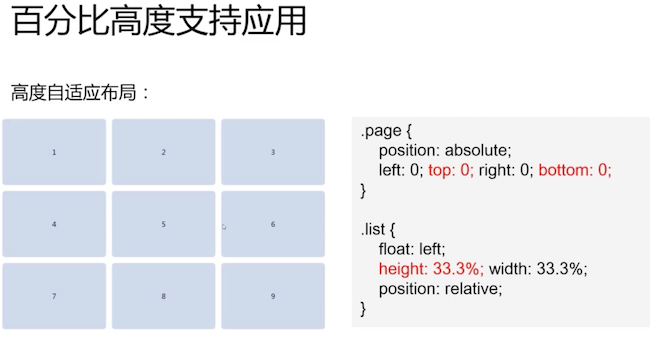

如上图的九宫格布局，在任意尺寸上的安卓手机，都能够一屏展示 9 宫格。父容器进行绝对定位拉伸而成，子元素可以使用百分比的值

[高度自适应的九宫格效果 demo 演示](https://github.com/zq99299/css-zxx/tree/master/absolute/7/高度自适应的九宫格效果.html)

### 相互合作性

如果天使拉伸和 `width/height` 尺寸同时存在：那么 `width/height` 设置的尺寸会优先于 `left/top/right/bootom` 拉伸的尺寸

因此：

```css
postition:absolute;top:0;left:0;right:0;width:50%
```

虽然，拉伸全屏，但是后面有一个宽度出现，最终的实际宽度是 50%；

但是在 `margin:auto` 下，两者的合作就体现出来了：当尺寸限制、拉伸以及 `margin:auto` 同时出现的时候，就会有 绝对定位元素的 **绝对居中** 效果

::: tip
这个绝对居中的场景，需要 IE8+ 支持
:::

[left或right拉伸和width同时存在 demo 演示](https://github.com/zq99299/css-zxx/tree/master/absolute/7/left或right拉伸和width同时存在.html)

## 8. absolute 网页整体布局

> 适合移动 web 的布局策略

### 摆脱狭隘的定位

与 fixed、relative 一样，absolute 涉及的初衷确实是定位（position），但与他们不同的是：absolute 包含更多特有且强大的特性，如果仅仅是使用其实现一些覆盖于定位，则未免大材小用了，因此可以尝试使用 absolute 实现网页的整体布局

你会发现他的优点有：

- 兼容性好
- 自适应强
- 扩展方便
- 性能优异
- 可以方便实现诸多效果
- 适合移动端
- PC 端同样精彩

### body 降级，子元素升级

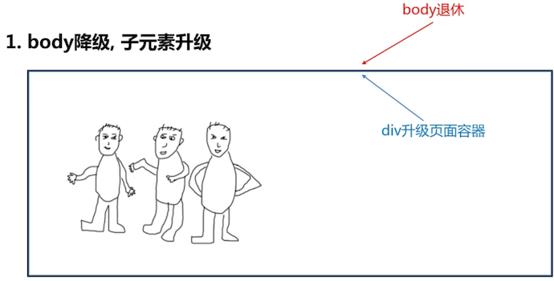

升级的子 div (假设类名为 page)，满屏代码如下

```css
.page {position: absolute; left: 0; right: 0; top: 0; bottom: 0}
```

但是绝对定位受限于父级，因此，page 想要愉快的拉伸，还需要

```css
html,body {height:100%;}

因为在默认情况下，body 的高度为 0
```

### 各模块、侧边栏（PC 端）各居其位


```css
/*注意其中的 absolute*/
header,foot {position: absolute;left: 0;right: 0;}
header {height: 48px;top: 0;}
footer {height: 52px;bottom: 0;}
aside {
  width: 250px; 
  position: absolute;
  left: 0;top: 0;bottom: 0;
}
```

### 内容区域想象成 body


有侧边栏等之后，内容区域你可以看成是 body

```css
.content {
  position: absolute;
  top: 48px;   /*这些值就是去掉对应的组件的值*/
  bottom: 52px;
  left: 250px; /*如果有侧边栏*/
  overflow: auto; /**增加滚动条*/
}
```

此时的头尾以及侧边栏都是 fixed 效果，不跟随滚动。避免了移动端 `position:fixed` 实现的诸多问题

### 全屏覆盖于 page 平级


与 page 类似，全屏拉伸

```css
.overlay {
  position: absolute; 
  left: 0; right: 0; top: 0; bottom: 0;
  background-color: rgba(0,0,0,.5);
  z-index: 9;
}
```

 HTML 元素就需要 page 与 overlay 平级了

```html
<div class="page"></div>
<div class="overlay"></div>
```

这是完整的 [慕课网-绝对定位整页布局演示 demo 演示](https://github.com/zq99299/css-zxx/tree/master/absolute/8/慕课网-绝对定位整页布局演示.html)

