# border

本章知识：

- 了解 border-width 属性；
- 深入了解各种 border-style 类型；
- border 在某些背景定位需求下的妙用；
- border 与三角等图形构建；
- border 与透明边框；
- 如何借助 border 使用有限标签完成我们的布局。

## 1. border-width 不支持百分比
**为何不支持？** 语义和使用场景决定的

拿手机和显示器边框来对比下，他们的内容边框，不会随着设备变大就按比例变大的。

所以不支持百分比单位；类似的还有 `outline、box-shadow、text-shadow`...

### 支持关的键字：（ie7除外）

- thin ： 薄薄的 1px
- medium ：薄厚均匀 3px（默认值）
- thick : 厚厚的 5px

**为什么 medium 是默认值 3px ，而不是常用的 1px 呢？**

因为 `border-style:double`至少3px 才有效果

## 2. 深入了解各种 border-style 类型
- solid ： 实线；很熟
- dashed ：虚线；
  
    在 ie 和其他浏览器下兼容性有问题，边框宽高 2:1 和 3:1
- dotted ： 点线，不熟但有故事

    在 ie 和其他浏览器下兼容性有问题，小圆和小方（点的形状）
    在 ie7 和 ie8 下可以利用小圆点来实现实线的圆（利用 overflow:hiden 指显示其中一个角的圆）
- double： 双线，非常不熟
- inset ： 内凹，大眼瞪小眼（基本不使用）    
- outset ：外凹，大眼瞪小眼 
- groove : 沟槽，大眼瞪小眼 
- ridge : 山脊，大眼瞪小眼

 后4个毫无价值，风格过时，各种浏览器间差异大，不兼容， 

### dashed

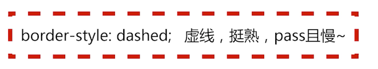

### dotted

实现圆角效果

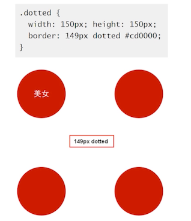

### double

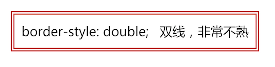

它的线计算规则如下，并且 **双线宽度永远相等，中间间隔±1**

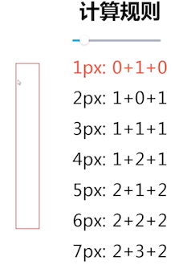

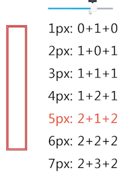

### double 实现绘图三道杠

先三等分，然后 bottom 占用一分

### inset

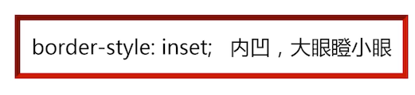

### outset 

### groove :

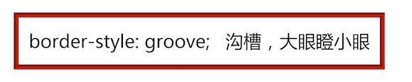

### ridge 

### 后面 4 个毫无价值

## 3. border-color 与 color
简单说：border-color 默认颜色就是 color

看个例子

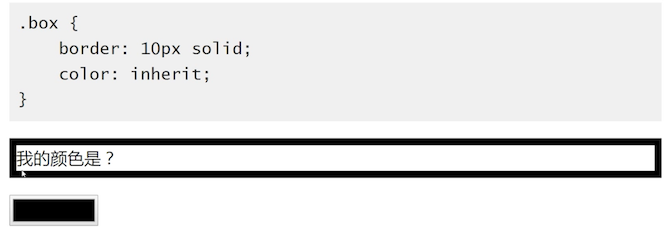

变个颜色，也会跟着变

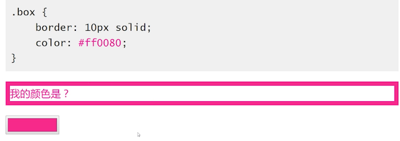

不单独指定 border 的颜色，那么就使用 color 的

类似的还有 box-shadow、text-shadow 等

这个特性有什么用？

### hover 与图形变色

使用边框来处理，值需要一处就可以

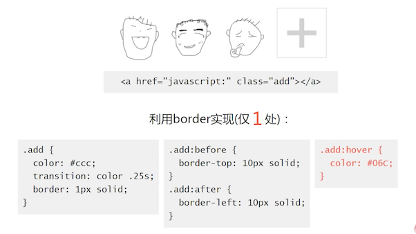

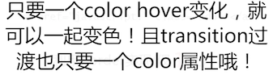

## 4. border 与 background 定位
### background 定位的局限

只能相对左上角数值定位，不能相对右下（css2.1）

让图片距离容器左边框永远是 50 px，而不管他外部容器的高度宽度。

要样图片永远距离右边框 50 的化，方法有很多，在这里借助 border 来实现

使用了一个空白的 50px 的边框去填充右侧的空白

## 5. border 与三角等图形构建

温故而知新：前面讲解过两种了图形的实现

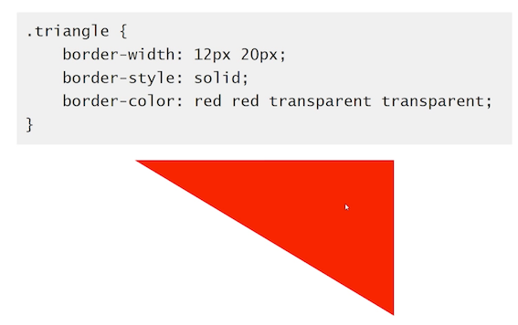

上图实现的原理是：下图是帮助我们认知边框的图

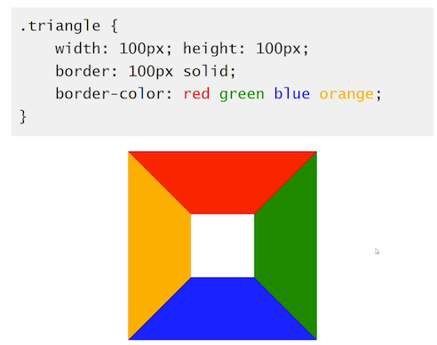

三角的形成：宽度和高度都为 0

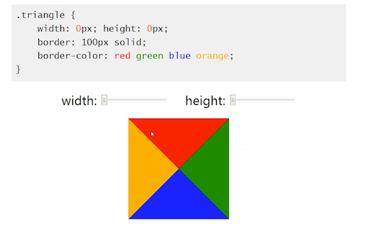

到这里就很简单了，要实现一个三角，把其他边变成透明的

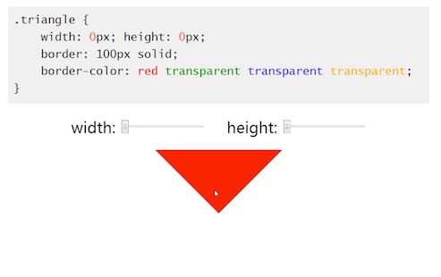

### 实际应用场景

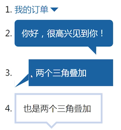

### 模拟圆角

更高级的应用，模拟圆角

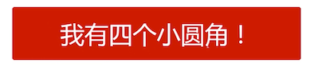

原理是

上面的梯形优点小，放大一点，就能看清楚了

## 6. border 与透明边框

> border 的透明边框很有用！用途非常广！

因为，始于 IE7，足够兼容。

下面开始分享案例

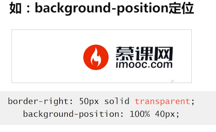

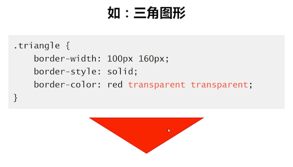

以及...

### 优雅增加响应区域大小

 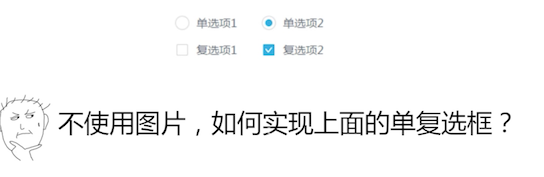

 一般第一想法是下面这样

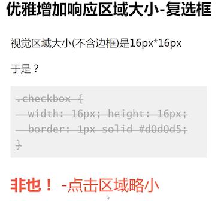

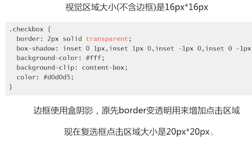

实现方式步骤：

1. 边框用来扩大点击区域的大小
2. 原来的边框使用内阴影实现； 第 2 行代码

### 增加可视渲染区域

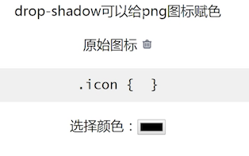

让图标任意变色，想变色的时候 drop-shadow 出来一个，然后把原来的图标隐藏掉。就很方便了，如下图的示意图

但是这种方式，在 Chrome 浏览器下，**页面中不可见元素的 drop-shadow** 也是不可见的，还包括如下的投影都失败

那么在可视区域外元素无投影，区域内但透明的部分呢？

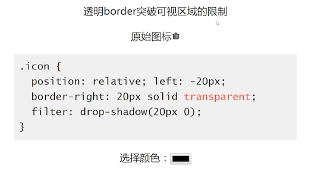

上面是最终实现效果的样子。

将隐藏属性去掉，左边是原始图标，显示的图标是投影到透明的 边框上的

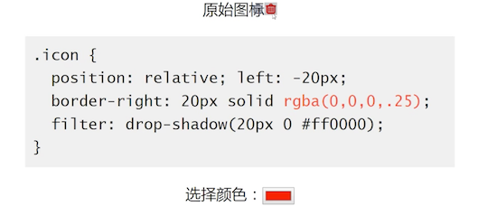

## border 在布局中的应用

还是相当普遍和可靠的。

### 有限标签下的标题栏

由于不常使用，就不展开讲解

### border 与等高布局

先看他的效果

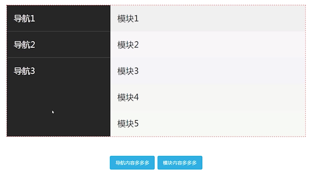

原理如下

- 黑色区域是： `.box border-left` 左边框模拟的
- 文字是：通过 margin-left -300px 定位到边框上面去的

此类实现的好处：之前讲解过，使用 锚点时有可能飞来飞去的效果，使用边框就没有这种问题。

但是也是有局限的：不支持百分比宽度