# line-height 行高
简介：本课程将带领大家深入理解 

- line-height 的定义
- line-height 与恒内框盒子模型的关系
- 高度机理
- 各类属性值
- 图片的表现等内容，

同时张鑫旭老师将倾情分享一些实际开发中应用的经验！

[[toc]]

## 1. line-height 的定义

**定义**：两行文字基线之间的距离

1. 什么是基线？ 
2. 为何是基线？ 
3. 需要两行吗？ 

### 什么是基线


如上图，在中学，写英文的本子，为了让我们写英文字母整齐使用的

### 为何是基线

可以是中线？可以是底线？个人觉得是可以的，那么为什么是基线？

**这是因为：** 基线乃 `* 线`（任意线）定义之根本

比如：文本的上边缘线、下边缘线等，都是基于基线来定义的


上图是针对不同的预先体系，它的基线是不一样的

### 需要两行吗？

一行文字也是有行高的！两行的定义已经决定了一行的表现！

本章稍后章节[3. line-height 的高度机制原理](#_3-line-height-的高度机制原理) 详细讲解

### 一些直观的展示图

仔细看这些图，能让你更清楚的明白基线与行高是什么东西


不同字体之间的基线也不太一样，如下图和上图的比较，上图的偏下，下图的偏上

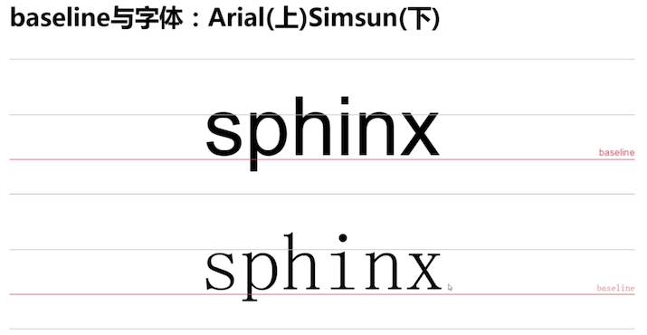

行高与基线的直观展示


### 何为 `line-height` 可以让单行文本垂直居中？


实际上不是不是完全的垂直居中了，下面使用图片来展示

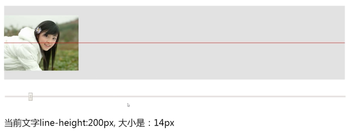

字体为 14 px 的时候，看起来是垂直居中的，但是吧字体大小变得更大


可以发现，没有垂直居中了；而只有字体大小为 0 时，才会真正的垂直居中

问题：为什么会这样表现呢？这就与 「行内框盒子模型」有关了

## 2. line-height 与行内框盒子模型

> 行内框盒子模型- CSS 进阶必备知识

所有内联元素的样式表现都与行内框盒子模型有关！

例如：浮动的图文环绕效果

```html
<p>普通文字，这里有个<em>em</em>标签</p>
```
上面的代码包含了 **4** 种盒子：

1. 内容区域（content area）

    是一种围绕文字看不见的盒子，盒子大小与 `font-size`大小相关

    大神理解：选中文字出现的蓝色背景应该就是这个盒子

    

2. 内联盒子（inline boxes）

    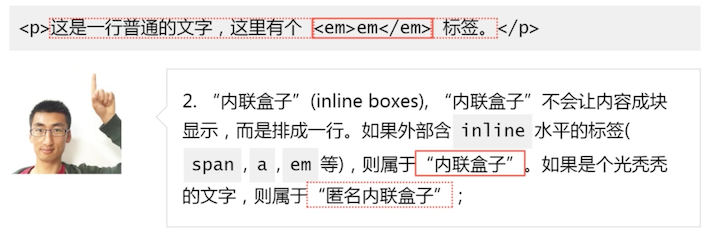

3. 行框盒子（line boxes）

    每一行就是一个 行框盒子。每个行框盒子又是由一个一个内联盒子组成

    

    无论是否是由于宽度不足导致整个 P 标签换行，只要是两行就是两个行框盒子，

4. 包含盒子（containing box） 

    `<p>` 标签所在的位置，此盒子由一行一行的行框盒子组成

    

汇总下:

1. 内容区域（content area）
2. 内联盒子（inline boxes）
3. 行框盒子（line boxes）
4. 包含盒子（containing box）

由下向上包含，其中 2 和 1 的关系，说不清

疑问：了解行内框盒子模型，对理解 line-height 有什么现实意义？请看下一小节

## 3. line-height 的高度机制原理

> 深入理解内联元素的高度表现

### 文本占据的高度

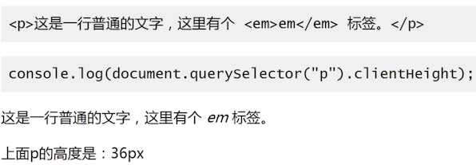

那么整个高度是从哪里来的呢？它不是由文字撑开得到的，而是由 line-height 决定的，下面进行实践

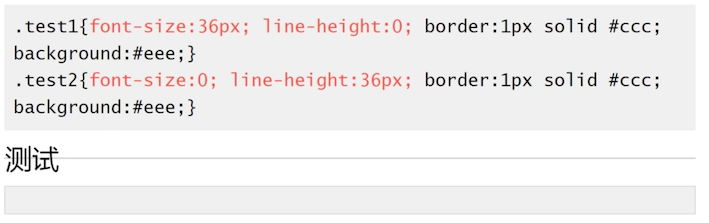

- test1：虽然他的文字很大，但是它的高度就是中间那一根线，其实是没有高度的，那一根线是边框的高度
- test2：虽然它的文字大小为 0，但是它的高度很高

所以 **内联元素的高度是由 line-height** 决定的！

> **第 1 小节的问题：** line-height 明明是两基线距离，单行文字哪来行高？还控制了高度？

要回答这个问题，我们需要提前知道的知识点有：

1. 行高由于其继承性，影响无处不在，即使单行文本也不例外
2. 行高只是幕后黑手，**高度的表现不是行高**，而是 **内容区域** 和 **行间距**

### 内容区域高度

只不过，正好他们碰巧了


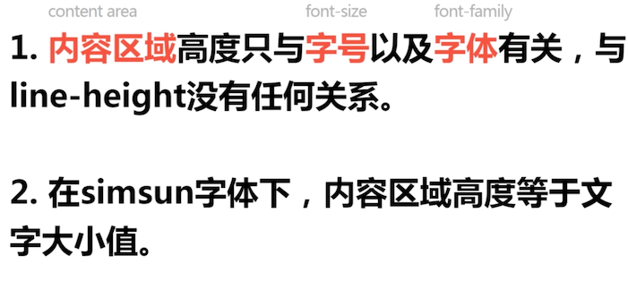

在宋体下：`font-size`+  行间距 = `line-height`，其他字体则可能不是

### 行间距

下面计算，是在宋体的情况下，可以这样计算：

```css
font-size: 240px;
line-height:360px;

则 行间距 = 360px -240px = 120px
```

### 半行间距

行间距上下拆分，就有了「半行间距」 ，`半行间距计算公式 = 行高 - 内容区域高度 / 2`

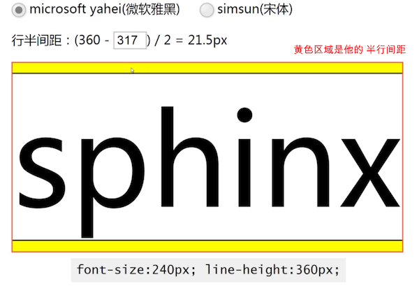

在微软雅黑字体下，它的半行间距就是 21.5px 。至于那个 317 ，在 Chrome 浏览器开发模式中（F12）可以查看


在宋体的下，它的内容区域高度就是 240px，可以明显的看到它的行半间距明显比微软雅黑要高出不少

### 总结

- 行高决定内联盒子高度
- 行间距墙头草，可大可（甚至负值），保证高度正好等于行高。

行高需要两根基线，但是由于 `内容区域 + 行间距 = 行高`，所以看起来就像行高决定了它的高度

>  **问题 2**：如果有多个不同行高的内联盒子？这时候高度会怎么表现

网上乃至各大教程讲解：由行高最高的那个盒子决定。

这个结论，只对了一半：


上面这个例子，其中有一个匿名内联盒子，和一个 em 的内联盒子，P 的高度刚好久等于行高


而这个例子来看，内联盒子还是行高 80px，但是给了一个往上的偏移，整个 P 的高度就变成 98 px 了。

所以：**由行高最高的那个盒子决定**，是不准确的；（至于 vertical-align 则是内联元素中非常重要的东西，下一节讲解）

多行文本（行多个行框盒子的包含容器）的高度就是 **单行文本高度累加**

> 问题 3：若行框盒子里面混入 inline-block 水平元素（如图片），高度如何表现呢？

该问题下节课讲解

## 4. line-height 各类属性值

> 深入理解 line-height 不同类别值的不同表现

### line-height 支持属性值

1. normal
2. `<number>`：这种尖括号括起来的表示一种类别
3. `<length>`
4. `<percent>`
5. inherit

### `normal`

默认属性值，正常；对应的具体行高的数值，是跟着用户的浏览器走，且与元素字体关联

在 Chrome 浏览器下，微软雅黑字体的 normal 约等于 1.32 

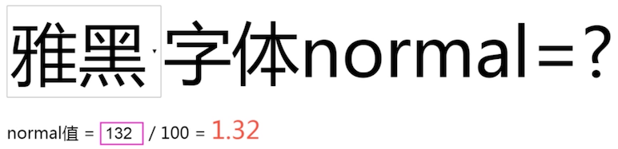


由于行高极其不确定的状态下，一般开发中都会在 body 中重置行高。

### `number`

使用数值作为行高值。例如 `line-height: 1.5;` 则行高像素值，是根据当前元素的 font-size 大小计算。

例如：假设文字大小（font-size） 20 px，则实际的行高像素值是 `line-height` = `1.5 * 20px` = `30px`

### `length`

使用具体的长度值作为行高值。例如

```css
line-height: 1.5em；  // 相对单位
line-height: 1.5rem； // 相对单位
line-height: 20px;
line-height: 20pt;
```

### `percent`

使用百分比作为行高值。例如 `line-height:150%`.

相对于设置了该 `line-height` 属性的元素的 `font-size` 大小计算  

假设文字大小是 20px，则实际的行高像素值是：`line-height = 150% * 20px = 30px`

### `inherit`
行高继承。ie8+

```css
input { line-height:inherit; }
```
有些元素的行高是默认是继承的，而有些则不是

比如 input 框等元素默认行高是 normal，使用 inherit 可以让文本框样式可控性更强

### 各种类型设置有什么区别？

下面几种设置有啥区别？

```css
line-height:1.5
line-height:1.5rem
line-height:1.5em;
```

计算无差别。应用元素有差别

- `line-height: 1.5`：所有可继承元素根据 font-size 重计算行高
- `line-height: 150%、1.5em `：当前元素根据 font-size 计算行高，继承给下面的元素（所有的子元素不会重新按照自己的 font-size 计算）

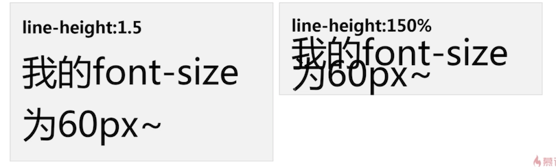

父级为 1.5，文字会根据自身的 font-size 大小重新计算行高，那么这里两行则是 90 + 90 = 180 px 

父级为 `150%`，父级的字体大小是 24 像素，那么下面的子元素的行高则为 `1.5 * 24 = 36`，而不是按照它自身的 font-size 进行计算，所以他们会重叠在一起

### body 全局数值行高使用经验

```css
body { font-size: 14px; line-height: ？}
```

- 如果是博客类，以阅读为主的，至少要设置为 1.5
- 如果是面向用户的网页，重阅读的场景

作者的经验是：匹配 20 像素的使用经验  ---> 方便心算

```css
line-height = 20px / 14px 约等于 1.42857


body { font-size: 14px; line-height: 1.42857？}

在 Chrome 浏览器中，1.42857 会被还原为 19 px，所以向上舍入

body { font-size: 14px; line-height: 1.4286; }
```

此时，使用大字号字体，也不会发生重叠的问题，一举两得


## 5. line-height 与图片的表现

> 深入探讨行高和图片的样式表现

> 问题 1：行高会不会影响图片实际占据的高度？

比如说，将行高 100 修改为 200，图片实际占据的高度会不会变化？


改变容器行高，会看到图片底部的间隙变化；

那意思是说：行高会影响图片实际占据的高度？其实这是不对的

::: tip
结论是：行高 **不会** 影响图片实际高度
:::

下面再继续探讨，验证这个结论

### 行高与图文混排


可以看到默认情况下，文字与图片是下边缘对齐的，是因为基于基线对齐的；


改变行高，给文字样式添加背景色，并内联块化（不内联块，看不到实际的行高），就会看到白色区域就是 90px ，但是文字的基线还是与图片底部对齐的（默认对齐方式是基线对齐）

一开始默认的样子，图片下面就有一点间隙，就是因为文字有默认的行高，为了基线对齐，就出现了间隙

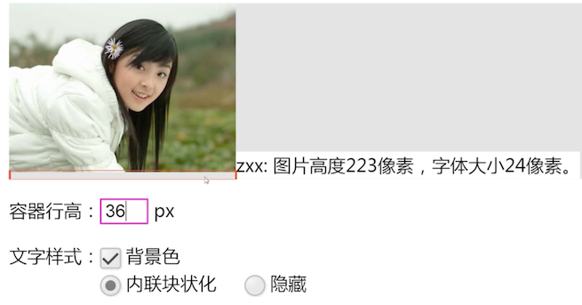

为啥只有图片没有文字的时候，表现形式与有问题一样呢？这就需要了解 隐匿文本节点了

### 隐匿文本节点

这个概念是作者自己抽象出来的，因为 CSS 是一门很感性的语言


在前面讲解的过绝对定位的时候，图片为什么能跟随在中心线？就是因为有隐匿文本节点的原因，它无法通过 js 或则，也看不到

### 行高与图片-隐匿文本节点


这也是如此。了解这个原理之后，面对图文混合排版的时候，你就能更好的处理一些场景

### 如何消除图片底部间隙？

推荐三种方法：

1. 图片块状化 - 无基线对齐

   因为 block 元素是没有`vertical-align: baseline;` 的

   ```css
   img { display: block; }
   ```

2. 图片底线对齐

   ```css
   img { vertical-align: bottom; }
   ```

   默认是基线对齐，改为底线对齐，就可以了

3. 行高足够小 - 基线位置上移

   ```css
   box { line-height: 0; }
   ```

   当行高足够小的时候，文字的基线就会上移，空隙就消除了

### 小图片和大文字

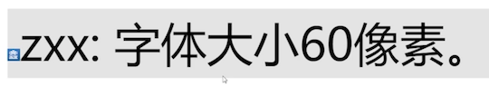

因为图片很小，很难对大的文字造成影响，基本上高度受行高控制

1. 不要故事闹事，故意把文字 `vertical-align= -100`
2. 不是 IE6 浏览器

容器行高设置后，剩下的就是图文的 `vertical-align` 垂直对齐了

## 6. line-height 的实际应用

一些基础的就不讲解了，这里讲解一些实用的特殊的干货

> 实际应用：大小不固定的图片、多行文字垂直居中

### 图片水平垂直居中


近似的达到垂直居中，这个就是 `vertical-align middle` 的知识点了，简单的提一下，middle 是基线往上 `二分之一x` 高度

### 多行文本水平垂直居中

单行文本前面讲解过了，直接行高垂直居中


> 实际应用：代替 height、避免 IE6/7 下的 haslayout

简单讲解下，IE6/7 很快会被淘汰


在 iE6 下 line-height 可以代替 height，解决它不受控制的兼容性；

所以：在高级浏览器中，要实现一个单行文字垂直居中，只需要使用 line-height 就可以了

