# margin

本节能学到的知识：

- margin 与元素尺寸的关系、
- margin 的百分比单位、
- 正确看待 CSS 的 margin 重叠、
- 深入理解 margin：auto、
- 剖析 CSS margin 负值定位的常见应用、
- 剖析在使用 margin 时容易发生困惑的无效情形、
- 扩展介绍 margin-start/margin-end 属性

[[toc]]

## 1. CSS margin 与容器的尺寸
>了解 margin 与元素尺寸之间关系

总的来讲：margin 可以改变容器的尺寸；而且是比较激进的那种，人若犯我，我必犯人

### 标准盒模型与元素尺寸

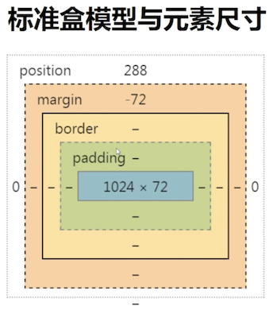

- 上图 margin 内层的实线：可视尺寸 clientWidth（标准）
- 上图 margin 外层的虚线：占据尺寸 outerWidth (非标准)

### margin 与可视尺寸

**margin 影响可视尺寸的前提**：

1. 适用于没有设定 width/height 的普通 blokc 水平元素。
  
    float、absolute/fixed、inline 水平、table-cell... 都可以让元素 block 化，但是这些已经不属于普通的 blokc 元素了
    
2. 只适用于水平方向尺寸

上面蓝色区域设置了一个 margin 为 50px，改变它的值为 `-50`，会发现它变宽了

修改为 100 px，会发现宽度变得更小了

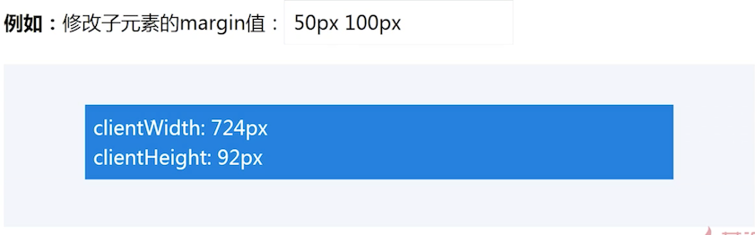

就是说：margin 为负值的时候，会让可视宽度变大；但是只适用于水平方向的尺寸，对于垂直方向的尺寸是无效的。

这种特性也是可以利用的，下面来讲解使用它实现一侧定宽的自适应布局

### 一侧定宽的自适应布局

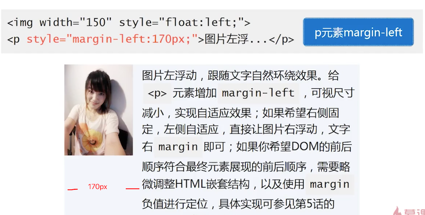

上图的示例在 float 课程中讲过的，那么能实现这一的原理就是，margin 改变了水平方向的可视宽度。

还可以利用他实现两端对齐布局（本章第 5 节讲解）等。

### margin 与占据尺寸

1. `block/inline-block` 水平元素均适用
2. 与有没有设定 `width/height` 值无关
3. 适用于水平方向和垂直方向

比如下图，负值的时候，它占据的尺寸变小了，所以背景变小了

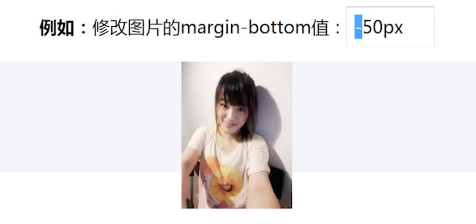

如何利用这一特性？

### 在滚动容器中让图片上下留白

左侧图片在非 Chrome 浏览器下，底部没有留白，这个原理在 overflow 中讲解过了。右侧的上下都成功留白了

还可以利用它实现等高布局（本章第 5 节讲解）等...

## 2. CSS margin 与百分比单位

>了解 margin 百分比单位

这里讲解百分比单位是因为有可讲的，特性可以用来实现厉害的东西，也不是初级科普内容

主要讲解两点：

- 认识：水平方向百分比/垂直方向百分比

- 搞清楚：普通元素百分比/绝对定位元素百分比 有啥区别？

### 百分比 margin 的计算规则

- 普通元素的百分比 margin 都是相对于容器的宽度计算的
- 绝对定位元素的百分比 margin是相对于第一个定位祖先元素(relative/absolute/fixed)的宽度计算的

可以看到，10% 都是基于 600 这个宽度计算的

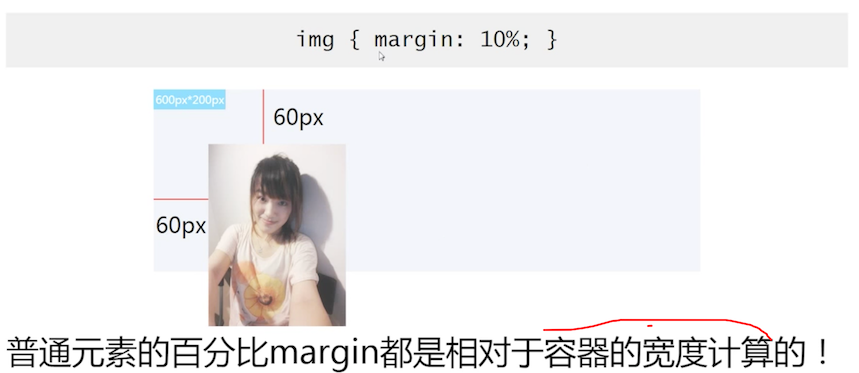

普通元素的百分比是相对于他的第一个父级元素计算的，而绝对定位元素是基于第一个定位祖先元素计算的

都是基于宽度计算，但是他们基于的对象不同

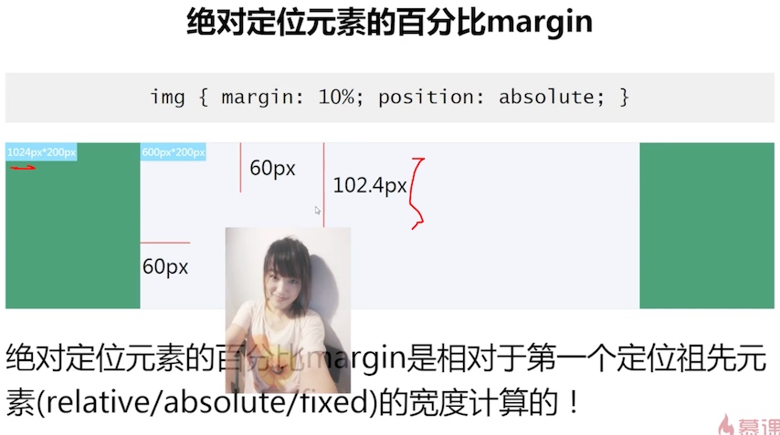

如何利用这个特性？

### 宽高 `2：1` 自适应矩形

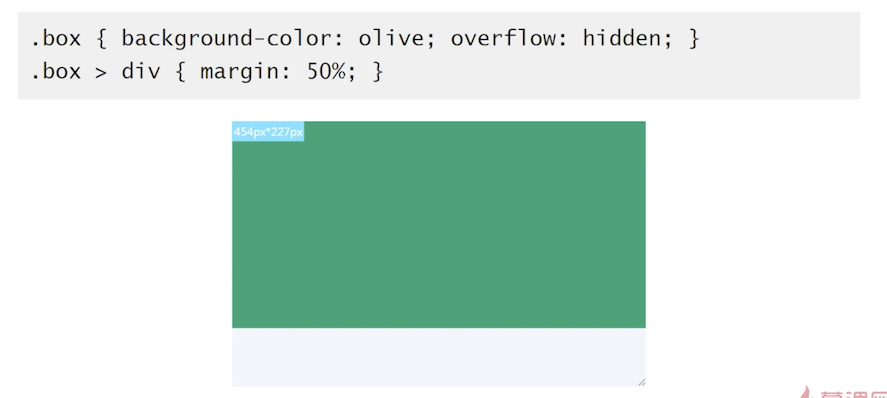

无论怎么更改 box 的宽度高度，蓝色区域都会以 2:1 的比例进行缩放；因为利用的就是他的计算是通过父级的宽度来进行计算的

这里有一个主意的地方：margin 50%，其实是 4 个方向的，top 和 bottom 也会有 50% 的计算，这个在 css 里面有一个 margin 重叠的现象。下节讲解

## 3. 正确看待 CSS 的 margin 重叠

>margin 重叠如何发生，存在的价值

### margin 重叠通常特性

1. block 水平元素（不包括 float 和 absolute 元素）

2. 只发生在垂直方向（margin-top、margin-bottom）

   前提是：不考虑 writing-mode（类似古文从上往下排列）

### margin 重叠 3 种情景

1. 相邻兄弟元素
2. 父级和第一个 或 最后一个子元素
3. 空的 block 元素（自己与自己发生重叠）

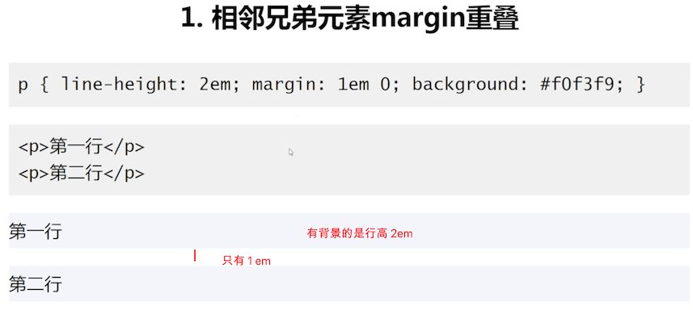

给 P 设置为 1 em，第 1 行和第 2 行中间应该会出现 2 em 的空间，但是发生了重叠现象

那个 son 的背景颜色，让我们看到了它的高度；给他施加 margin-top 后，按照理解，它的背景颜色区域会变高。实际上是被重合了。没有任何变化，反而是距离上面的距离远了。

这里的表现实际上是等同于 father 与 son 同时设置 top，或则父级设置 top

相当于是 father 的 margin-top=0，son 的 margin-top=80，一重叠，就相当于公用一个

### 父子 margin 重叠其他条件

#### margin-top重叠

1. 父元素非块状格式化上下文（bfc）
2. 父元素没有 border-top 设置
3. 父元素没有 padding-top 设置
4. 父元素和第一个子元素之间没有 inline 元素分割

#### margin-bottom重叠

1. 父元素非块状格式化上下文元素
2. 父元素没有 border-bottom 设置
3. 父元素没有 padding-bottom 设置
4. 父元素和最后一个子元素之间没有 inline 元素分割
5. 父元素没有 height,min-height,max-height 限制

### 干掉 margin-top 重叠

通过上述所说的限制，来干掉 margin-top 发生的重叠

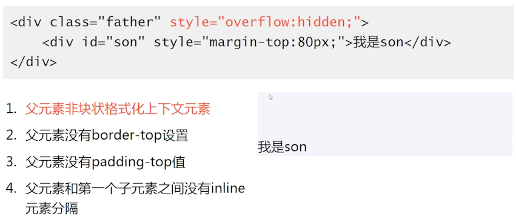

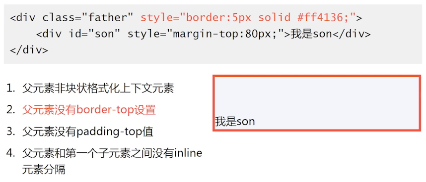

### 干掉 margin-bottom 重叠

和上面类似，这里演示下多出来的那一个

### 空 block 元素 margin 重叠

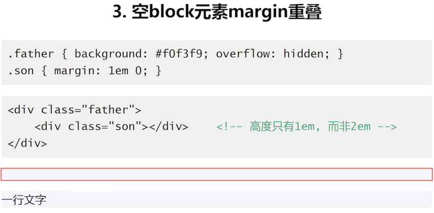

只需要看 son，father 是为了能看清楚他的高度。也发现重叠了

### 空 block 元素 margin 重叠其他条件

当出现以下项目时，就会发生重叠，只要破坏掉这些限制就破坏掉了重叠

1. 元素没有 borde 设置
2. 元素没有 padding 值
3. 里面没有 inline 元素
4. 没有 height，或则 min-height

### margin 重叠计算规则

前面介绍了三种重叠的原因，这里介绍重叠计算规则

1. 正正取大值
2. 正负值相加
3. 负负最负值
  1. 相邻重叠绝对值最大的负值
  2. 父子重叠绝对值最大的负值

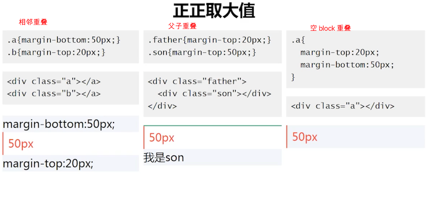

负负最负值，对布局的影响比较大，看起来也很复杂

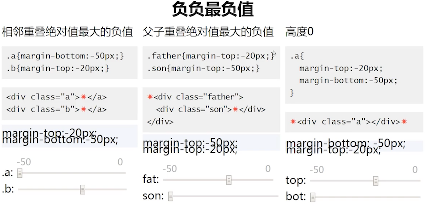

红色的 * 标识下面的浅色区域中的效果展示；

### margin 重叠的意义是  ？

在实际工作中，它重叠其实为我们带来了不小的麻烦

这个就需要从历史来看，为了排版更自然：

1. 连续段落或列表之类，如果没有 margin 重叠，首尾项间距会和其他兄弟标签 `1:2`关系，排版不自然（兄弟重叠）
2. web 中任何地方嵌套或直接放入任何裸 div，都不会影响原来的布局（父子重叠）
3. 遗落的空任意多个`
`元素，不要影响原来的阅读排版（空的 block 元素）

如果没有重叠，就会导致各种间距、比例等不一

### 实践：善用 margin 重叠

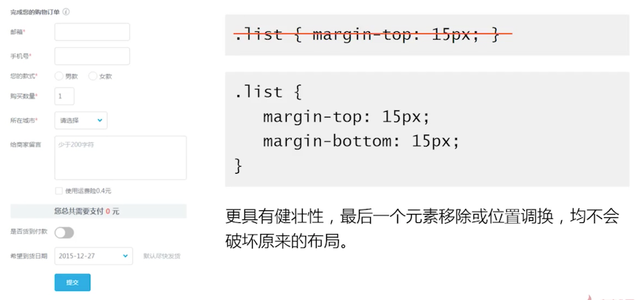

的确是这样，由于有 margin 重叠，故意让它发生重叠，这就具有了健壮性；

建议：写垂直布局的时候，上下都使用 margin。

## 4. 理解 CSS 中的 margin:auto

> 又是比较深入的课程。看上去简单，实际上比较有学问

### 作用机制

元素有时候，就算没有设置 width 或则 height，也会自动填充;

比如，一个 div，没有设置宽高，都会自动填充满容器

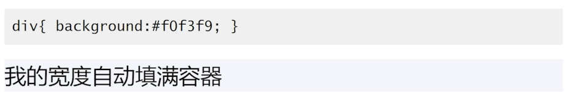

还有绝对定位也是一样

如果设置它的 width 或 height，自动填充特性就被覆盖了

### auto 填充 规则

- 如果一侧是固定值，一侧是 auto，auto 为剩余空间大小
- 如果两侧均是 auto，则平分剩余空间

总之一句话：auto 就是用来分配剩余空间的

### 为什么图片不居中？

它不具备让 auto 来计算剩余空间的规则

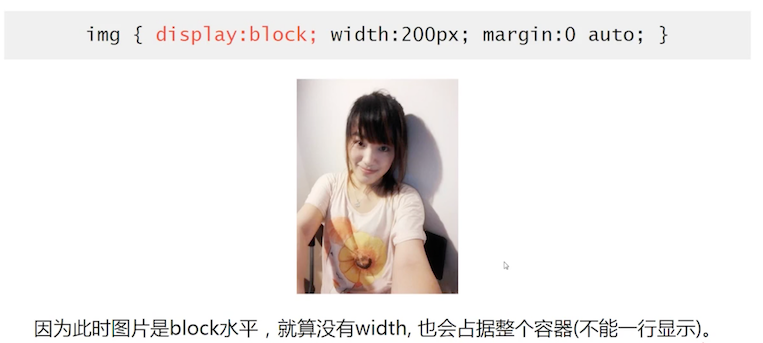

现在他原本要占据一行的，使用宽度定死了，于是它就有了剩余空间

### 为什么 `margin:auto 0` 无法垂直居中 ?

> 为什么明明容器定高，元素定高，`margin:auto 0`无法垂直居中

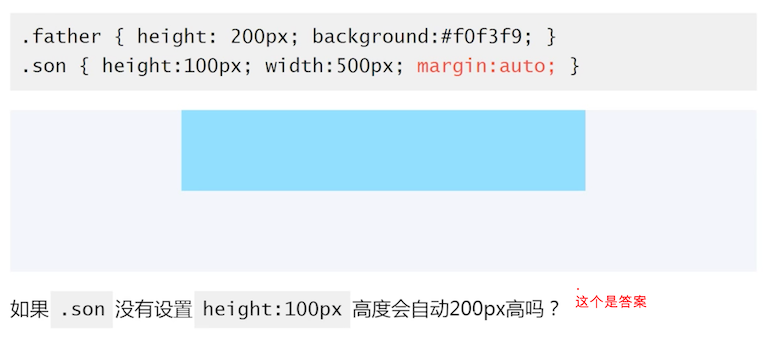

::: tip
看到这里笔者大概似乎明白了：一个元素要他原本不加限制，就有某个区域的宽度，限制之后，就可以用 margin atuo 来计算被限制剩余的宽度。

而垂直高度，很显然不符合。

还有一个，auto 计算后的值如果是负值，也不会生效 

:::

> 我们垂直方向 margin 无法实现居中了吗？ 可以的，方法还不止一种

### writing-mode 与垂直居中

因为更改了流的方向，所以水平方向的填充属性失效了，无法水平居中了

### 绝对定位元素的 `margin:auto` 居中

使用拉伸特性，填满整个容器，再用宽高限制，自动填充就被强制更改了，这就符合了 auto 的定义

## 5. CSS margin 负值定位

>margin 负值应用实例展示

### margin 负值下的两端对齐

主要运用了：margin 改变元素尺寸的特性

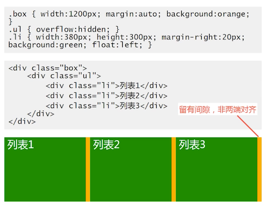

在一个没有宽的元素上，使用负值，会让它的长度变长。那么 ul 的长度由 1200 变成了 1220，再让 li 的宽度改成  `1220/3=406.66 - 20= 386.66`，由于外围容器是 1200，多出来的被截断了，看起来就是等宽的了

### margin 负值下的等高布局

主要运用了：margin 改变元素占据空间

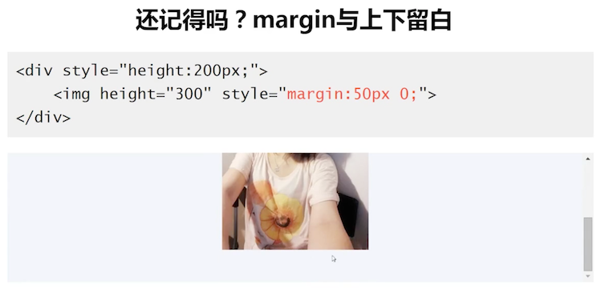

把他改成负值的化，就能实现一些有意思的事情。

比如要实现任意一边增加或减少 n 个矩形，少的那一边能自动填充变高

当给他一个很大的父值的时候，消失了；这其实是 margin 负值会改变元素的占据空间，但是由于容器有 hidden 属性，BFC 了，我们就看不到了

使用 padding 把消失的间距补回来，因为背景色可以在 padding 里面显示的

这种方式，在有 focus 的场景里面，就会出现一些问题，比如获得焦点时，页面飞掉了（focus 在锚点那一章节里面讲到过，因为重定位了） 

### margin 负值下的两栏自适应布局

主要运用了：元素占据空间跟随 margin 移动的特性

这个例子在前面讲解过的

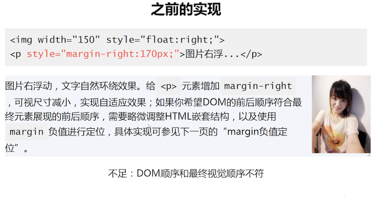

## 6. CSS margin 无效情形解析

> 有时候 margin 无效，为什么呢？

按照作者的经验分享一下：

1. inline 水平元素的垂直 margin 无效，前提是：

   1. 非替换元素，如：不是`img` 元素
   2. 正常书写模式

2. margin 重叠

  有可能是和父级或则兄弟元素重叠了，在前面 margin 重叠章节中有讲过

3. table-cell 与 margin
   `display:table-cell/table-row` 等声明的 margin 无效
   
   无论是内联元素还是 block 元素，只要 `display:table-cell` 后，margin 就会失效
   
4. position:absolute 与 margin   

   绝对定位元素非定位的 margin 值“无效”

   什么是非定位呢？`left=100%、right=10%` 这个叫定位，没有设置的为非定位。

   “无效”：给如果是子元素定位了，要想有 margin 有效果，需要给父容器添加 `postion:relative`

   结论：绝对定位的 margin 值一直有效，只是不像普通元素那样，可以和兄弟元素插科打混（脱离文档流，和相邻元素么有关系）

5. 鞭长莫及导致无效

   实际是有效，只是你看错它 margin 的对象了

6. 内联特性导致的 margin 无效

### inline 水平元素的垂直 margin 无效

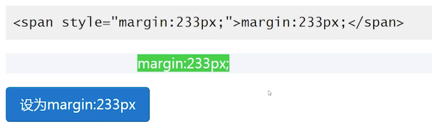

内联元素垂直方向无效。水平方向有效

### table-cell 与 margin

[mdn 上有一段描述](https://developer.mozilla.org/zh-CN/docs/Web/CSS/margin)

> all elements, except elements with table display types other than table-caption, table and inline-table. It also applies to ::first-letter.

> margin 应用于：除了 display 为 table 相关类型（不包括 table-caption、table 以及inline-table）的所有。甚至也可以应用于 ::first-letter

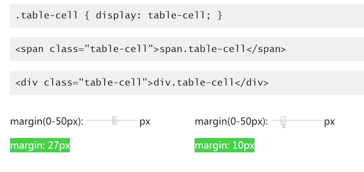

简单说，无论是内联元素还是 block 元素，只要 `display:table-cell` 后，margin 就会失效;

因此无法通过 table-cell 上增加 margin 来撑开宽度，实现两栏自适应布局

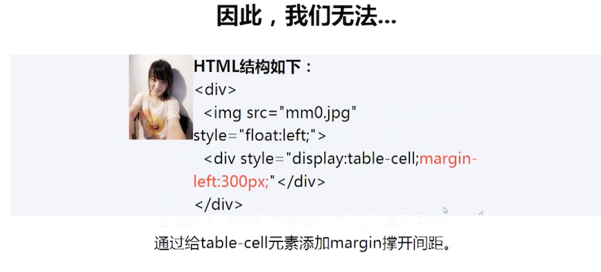

**但是在替换元素上，它是个例外**

右侧的按钮，给他施加 `display：table-cell` 后，通过 JS 获取它的类型却变成了 inline-blok 类型，margin 也是生效的

### `osition:absolute 与 margin   `

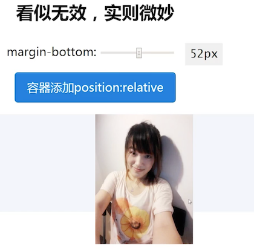

结论：绝对定位的 margin 值一直有效，只是不像普通元素那样，可以和兄弟元素插科打混（脱离文档流，和相邻元素么有关系）

### 鞭长莫及导致无效

下图是通过 BFC 实现的两栏自适应布局

会发现设置 margin 值，没有效果。实际上是生效了的，只是由于 float 具有破坏特性，margin 是相对于容器了，而不是图片了。把 margin 值变大，就会看到效果了

### 内联特性导致的 margin 无效

非常简单的一个结构，希望通过 margin 改变图片在容器中的位置。看似都有效果

但是当 margin 小到一定程度的时候，就看上去没有效果了，这个解释就和之前的基线有关了，

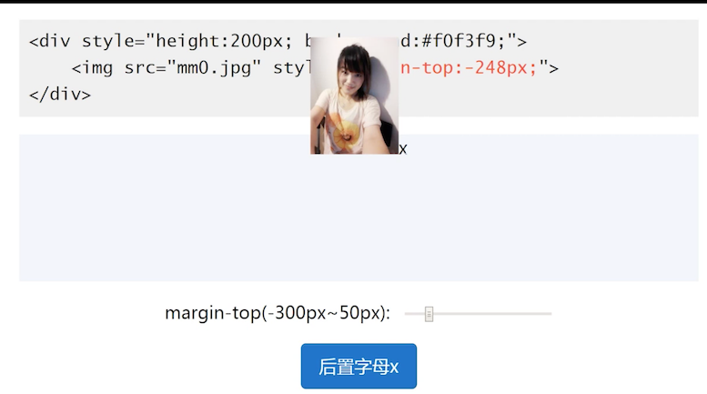

内联元素默认是基线对齐，添加辅助 x 后，可以看到，需要和 x 对齐。 x 是不可能跑到容器意外的。所以就失效了

## 7. 了解 margin-start/margin-end 属性

> 进一步拓展对 margin 的深广度的理解  

margin-start/end  是 css3 中的属性

结论：

- 正常的流向，margin-start 等同于 margin-left，两则重叠不累加
- 水平流是从右往左，margin-start 等于于 margin-right
- 在垂直流下(`writing-mode:vertical-*`)，margin-start 等同于 margin-top

在正常的流向，left 和 start 是相同的表现，且他们重叠（如果都出现），改变他的流向

可以看到辅助文字跑到右侧 100 px 距离了

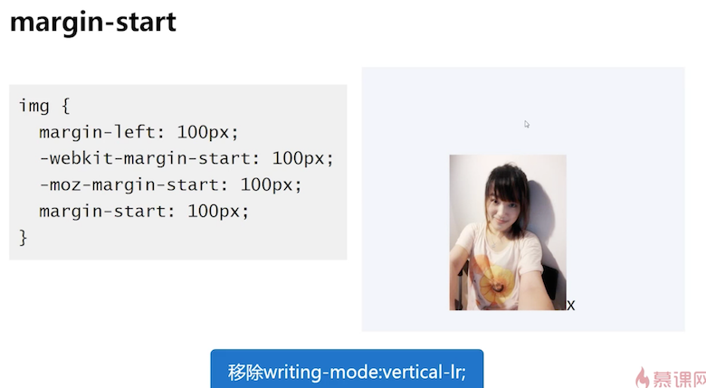

margin-start 的出现变的更为智能，它代表了当前流向的一个 margin 效果

### ` -webkit` 的 margin 的其他属性    

- `-webkit-margin-before` : 默认流向情况下，等同于 margin-top  
- `-webkit-margin-collapse` : `<collapse>|<discard>|separate`

默认情况下，是由 margin 重叠的

直接取消 margin 。看到他们在一起了

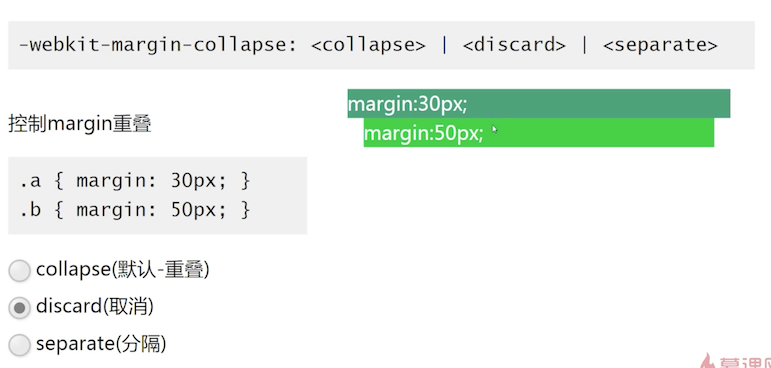

还可以取消 margin 重叠，可以看到他们的 margin 距离变多了，是 30+80

