# overflow
简介：overflow 看上去其貌不扬，其中蕴含的知识点还是很多的。
有很多鲜为人知的特性表现，本课程就将带你走入 overflow 的世界，为你打开另外一扇学习之窗。


[[toc]]

## 1. overflow 基本属性

> 基本表现，包括兼容性等


1. visible ( 默认 )

   图片超出框框同样显示

2. hidden 

   超出的部分会被 **隐藏**； 不是剪裁

3. scroll 

   在容器右侧和下侧出现滚动条，而且一直不消失

4. auto 

    在容器右侧和下方智能出现滚动条，当内容没有超出区域时，不显示滚动条

5. inherit

   兼容性不好，IE8+ 才支持

### overflow-x/y hidden 特殊说明

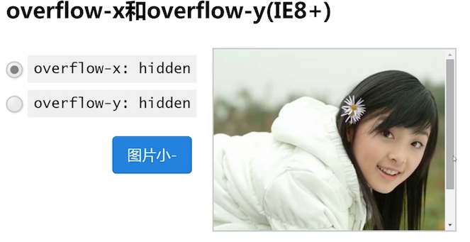

上面那个图，图片是超出去的，让 `overflow-x:hidden` 生效，就变成上述那样了，这很奇怪，按属性值来说，应该是让 x 轴隐藏掉，这的确是下方被隐藏了，但是 y 轴出现了滚动条。

这不是 BUG，是特性：当 x、y **一方设置为 visible 时**，另一方出现 hidden 、auto、scroll 时，另一方会被 **重置为 auto**

### 兼容性

#### 各个浏览器表现不一样

在各个浏览器上表现形式都不太一样


Google Chrome 浏览器上支持样式自定义，其他的就不行了，反正就是丑

#### 宽度设定机制


右图是代码对应的描述效果，只有垂直滚动条出现，内容高度 200px 大于容器的 100px。

这是由于宽度设定即使的问题，在宽度 100% 时会计算成外框的宽度，但是垂直滚动条出现时 ，实际的内容区域会被压缩，导致在 IE7 出现了横向滚动条

### 如何让 overflow 起作用

1. 非 `display: inline` 水平
2. 对应方位的尺寸限制 `width/height/max-width/max-height/absolute` 拉伸
3. 对于单元格`td`等，还需要 table 为`table-layout:fixed`状态才行

### `voerflow:visible` 妙用

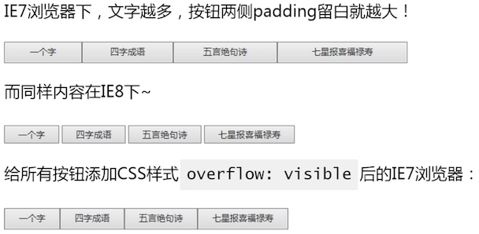

## 2. overflow 与滚动条

> 滚或不滚，我就在那里

### 滚动条出现的条件

1. 当 `overflow:auto/scroll`  时， `<html>、<textarea>` 自带滚动条
2. 内容尺寸超出了容器的限制


如上图，当内容大于区域时会自动出现滚动条

### `body/html` 与滚动条

::: tip 重要
无论什么浏览器，默认滚动条均来自 html 标签，而不是 body 标签。
:::

**原因：**新建一个空白的 HTML 页面，`<body>` 默认有 `.5em`margin 值，如果滚动条出现在 `<body>` 上，那么滚动条与浏览器边缘则会有间距，而不是靠着浏览器边缘

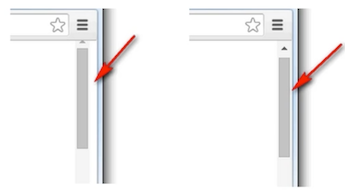

在不同的浏览器下，它默认值不同

- IE7 浏览器默认： `html {overflow-y: scroll}`
- IE8 浏览器默认： `html {overflow: auto;}`

所以如果我们想要去除页面默认滚动条，只需要

```css
html{ overflow: hidden;}
```

### `body/html` 与滚动条高度

如何知道浏览器的滚动条高度，找个需要 JS 支持

* chrome 浏览器是： `document.body.scrollTop`
* 其他浏览器是：`document.documentElement.scrollTop`

目前，两者不会同时存在，因为，坊间流传这类写法：
```javascript
// 因为必然有一个为 0，但是应该很容易出错吧。
// 会出现 undefined 吧？ 用 || 双或 来代替+号更好
var st = document.body.scrollTop + document.documentElement.scrollTop
```

### overflow 的 padding-bottom 缺失现象

```css
.box { width:400px; height:100px; overflow:auto; padding:100px 0 }
/** 重点是后面哪个上下 padding 100px */
```


左侧是 chrome 浏览器，滚动条滚动到最底部，会出现 100 px 的空白，其他浏览器则不会出现

**导致：不一样的 scrollHeight（元素内容高度）**

### 滚动条的宽度机制

一句话：滚动条会占用容器的可用宽度或高度

怎么计算滚动条的宽度呢？通过下面的方法可以简单获得
```html
  <div class="box">
    <div id="in" class="in"></div>
  </div>
```
```css
  .box {
    width: 400px;
    height: 400px;
    overflow: scroll;
    .in {*zoom:1 /* for ie7*/}
  }
```
```javascript
// 结果是17
console.log(400 - document.getElementById('in').clientWidth)
```

结果：`ie7/chrome/fireFox` 宽度应该都是 17，这个宽度是跟着用户主题的不一样而不一样的

### `overflow:auto`的潜在布局隐患

因为有滚动条出现占用宽度，那么在这类布局下，就有可能会出现直接崩溃，布局错乱


如上图，房子本来是 60 平，每人 30 平，当滚动条出现时，就破坏了这种平衡。

在实现此类布局时，要么预先留出滚动条的宽度，要么就采用自适应布局

### 水平居中跳动问题

在页面中的内容，出现滚动条和不出现滚动条，会导致内容往左跳动，这个体验非常的不好。

比如以下的水平居中对齐布局：

```css
.container { width:1150px; margin: 0 auto;}
```
这类布局当滚动条出现的时候，由于滚动条会占用宽度，就会导致内容往右边跳动

那怎么修复呢？有以下两种方法：

1. 让页面一开始就显示垂直滚动条

  ```css
  html { overflow-y:scroll; }
  ```
2. 动态宽度

  ```css
  // ie9 +
  // 100vw：浏览器宽度； 100%：可用内容宽度
  // 自己测试在 html 上。内容貌似也没有怎么跳动了
  .container{padding-left: calc(100vw - 100%);}
  ```

### 自定义滚动条-webkit内核

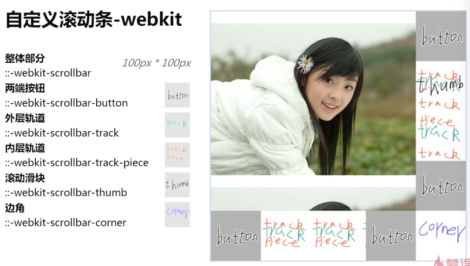

上图左右标识了对应部分，可以参考他们的位置

- 整体部分 `::-webkit-scrollbar` 
- 两端按钮 `::-webkit-scrollbar-button`
- 外层轨道 `::-webkit-scrollbar-track `
- 内层轨道 `::-webkit-scrollbar-track-piece `
- 滚动滑块 `::-webkit-scrollbar-thumb `
- 边角 `::-webkit-scrollbar-corner `

还有其他伪类元素等，自行学习


如上图的效果，就好看多了；

直接把这个放在 css 中就可以了。但是要有滚动条出现才有效果。

```css
::-webkit-scrollbar { /*血槽宽度*/
  width: 8px; /*控制垂直滚动条宽度*/
  height: 8px; /*控制水平高度 */
}

::-webkit-scrollbar-track { /*背景槽*/
  background-color: #ddd;
  border-radius: 6px;
}

::-webkit-scrollbar-thumb { /*拖动条*/
  background-color: rgba(0, 0, 0, .3);
  border-radius: 6px;
}

```

经过尝试，在我的 mac 上的 Chrome 中改不改感觉都是一样的

且只要定义了 `-webkit-scrollbar`，那么下面都要定义，不然滚动条就会消失，应该是把自定义默认的都给重置为无了吧。

如果嫌弃自定义的滚动条丑，那么可以使用别人写好的插件库来模拟滚动条

### IOS 原生滚动回调效果

如果是运行在 IOS 系统上的化，可以使用如下配置，可以让滚动效果丝滑起来

```css
-webkit-overflow-scrolling: touch
```

## 3. overflow 与 BFC

> 清除浮动、自适应布局等

**什么是BFC?**

Block formatting context : 块级格式化上下文 ；

页面之结界，内部元素再怎么翻云覆雨都不会影响外部。

**以下熟悉会触发BFC:**

 1. auto
 2. scroll
 3. hidden
   

**一般有以下场景应用：**

  1. 清除浮动影响
  2. 避免 margin 穿透问题
  3. 两栏自适应布局 

### 内部浮动无影响


图片使用了 `float: left`，导致父元素塌陷了，给父元素增加上述属性，只有 visible 没有效果，其他的都能让父元素的高度包裹住图片

下列代码只在 IE7+ 支持，并且会让容器之外的普通元素不可见，无法广泛应用

```css
.clearfix { overflow: hidden; _zoom: 1;}
```

因此广泛流传的清除浮动影响的写法如下

```css
.clearfix { *_zoom: 1;}
.clearfix:after { content: ''; display: table; clear:both;}
```

如果是局部修复，第一种死最高效的写法

### 避免 margin 穿透问题


蓝色背景的子元素，有一个 `margin-top:30` 的声明，但是它的颜色是父级的颜色，被穿透了


上述属性除了 visible 之外，都能解决穿透问题。但是请 **注意** overflow 只是解决 margin 穿透的其中一种方法

可以使用边框、padding、自身元素 BFC 都可以避免此问题

### overflow 与两栏自适应布局


上图的表现是正常的，就是前面说的文字环绕效果，但是施加了 overflow 其他属性后，变成了下面这样


那为啥会产生这样的现象？先来看看流体特性下的自适应布局

###  流体自适应布局

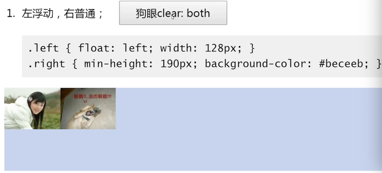

给狗眼施加 `clear: both` 后，不环绕图片了，跑到浮动元素下面去了


上述是环绕布局，不是自适应布局，完善一下


上图使用 `margin-left` 之后，就变成了自适应的布局，但是给狗眼添加 `clear:both` 后，还是受到了环绕的影响，由于妹子图片是左浮动的，狗眼不能与它在一排


还需要再完善下


但是还是如此，增加 `clear:both` 之后，狗眼还是受到了影响


### 回到 overflow 与两栏自适应布局


从效果来看，与前面流体特性的布局效果一致；给狗眼施加 `clear:both` ，没有任何变化，这重点来了 **在开题讲到 BFC 后，容器作为结界，内部元素翻云覆雨，与外面都没有任何关系**

这就是 BFC 的特性，如果去掉 hidden，布局变成文字环绕，内容与浮动元素是重叠的，狗眼 clear，就会受到影响


这就是 overflow 实现两栏自适应布局的原理：` left.float` + `right.overflow:hidden`

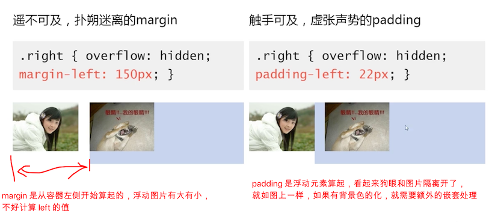

额外的嵌套处理很容易理解，增加外层容器不带背景颜色。

所以 **推荐方式是，使用浮动元素撑开**：

```css
.left {float: left; margin-right: 22px}
```

### 两栏自适应布局

可见，流体自适应布局 与 BFC 自适应布局是两种 **不同的思想** 实现，一定要注意不要让他们掺杂在一起混淆使用

比如：使用 padding 做流体自适应布局的时候，万万不可让自适应层 BFC 化，否则会出现下图的效果

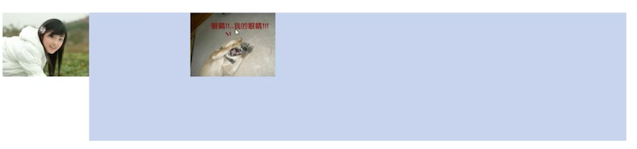

这其实很容易理解，记得 BFC 的特性，现在 padding 的计算方式是 BFC 容器左侧开始计算的。

### 疑问：是否所有的 BFC 属性都有如此表现？

答案是肯定的！，但是由于自身的特性，具体表现不一：

1. `overflow:hidden ;` 自适应，但「溢出不可见」限制应用场景

2. `float + float ；` 包裹性 + 破坏性，无法自适应，一般适用于块状浮动布局

3. `position:absolutr; `脱离文档流，自娱自乐，一般没有实际的使用场景

4. `display:inline-block；`具有包裹性，无法自适应； IE6/7 block 水平不相识

5. `display:table-cell; `包裹性，但天生无溢出特性，绝对宽度也能实现自适应

   就算宽度设置得很宽，也不会超出父容器的

因此一般使用 `overflow:hidden`、`display:inline-block；`、`display:table-cell; `

所以与清除浮动影响类似，可以使用一下方式实现两栏自适应布局

```css
.cell { overflow: hidden; _display: inline-block;}
```

由于有副作用（hidden 溢出不可见），于是有广为流传的是

```css
.cell {
  display: table-cell; width: 2000px  /* IE8+ BFC 特性 */
  *display: inline-block; *width: auto;  /* IE7- 伪 BFC 特性 */
}
```

超出 2000px 可以确保自适应层，永远自适应外部的容器长度，除非外部的容器宽度大于 2000px

## 4. overflow 与 absolute 绝对定位

> 隐藏失效与滚动固定

### `overflow:hidden` 失效

先看一个 `overflow:hidden` 失效的列子

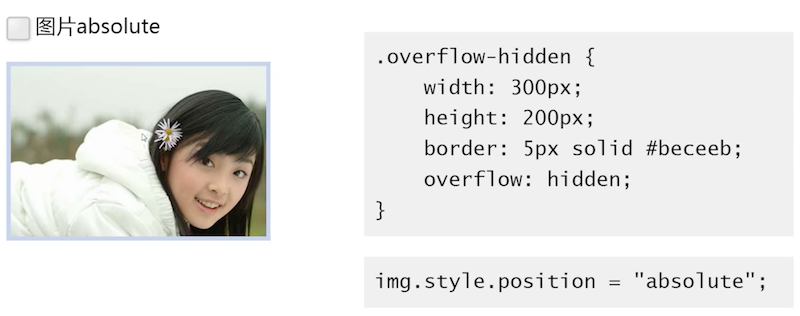

图片比容器大，容器使用 hidden 后，让图片溢出部分不可见了。但是当图片施加 absolute 后


hidden 就失效了

### overflow 滚动失效


 给图片施加 absolute 后，图片不会跟着一起滚动了

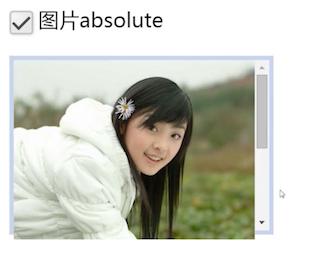

### 失效原因

这个可以在官网文档中找到 **positioned absolutely** 这一段描述，大概意思是：

绝对定位元素不总是被父级 overflow 属性剪裁，尤其当 overflow 在绝对定位元素及包含块之间的时候。

什么是包含块？：含`position:relative/absolute/fixed`声明的父级元素，如果父级元素没有这样的声明，则 body 元素作为其包含块

那么来看下例子，就明白为什么会失效了

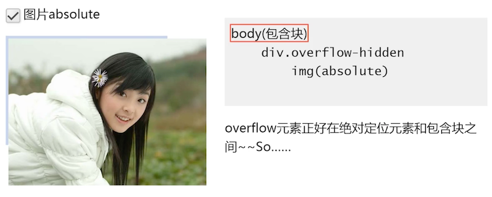

上图是 hidden 失效的例子，右侧是他的结构，图片在一个有 hidden 的 div 上，当图片施加 absolute 时，会找寻他的包含块（看父元素上有没有声明 `position:relative/absolute/fixed`），没有找到，那么 body 则作为它的包含块，所以，就失效了

### 如何避免失效

1. overflow 元素自身为包含块

2. overflow 元素的子元素为包含块

   当然，该子元素需要是绝对定位元素的父级

3. 任意合法 transform 声明当做包含块（IE9+和 fireFox）

#### overflow 元素自身为包含块

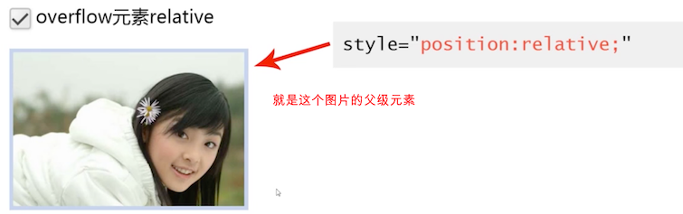

#### overflow 元素的子元素为包含块

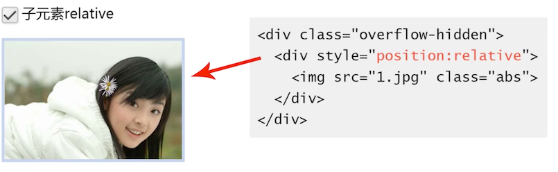

#### transform 声明当做包含块

1. overflow 元素自身 transform：比如旋转 0 度

   - IE9+ 、FireFox 支持
   - Chrome、Safari(win)、Opera 不支持

2. overflow 子元素 transform：

   - IE9+ 、FireFox 支持

   - Chrome、Safari(win)、Opera 支持

   但是，动态渲染异常：Chrome / Opera 包含块重定位，但点击重绘自修正（Safari 非定位 overflow 元素左上角）

    这一点，可能还在发展和修正阶段，不深入讲解，意义不大

###  overflow 失效妙用

> 所有每人都有自身的存在价值，所以 CSS 特性没有好不好，只有是否适合，怎么用

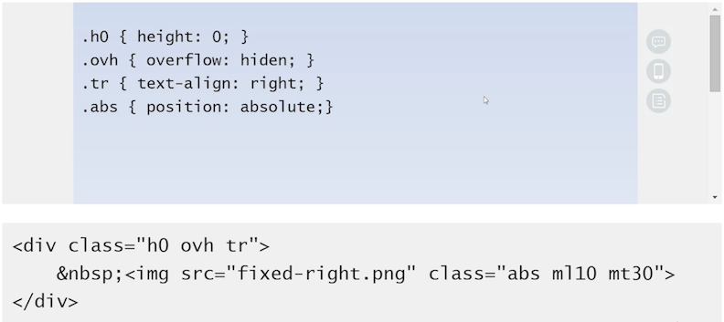

实现的效果是：右侧哪个图片侧边栏，定位在蓝色容器边上，滚动条滚动，相当于实现了 fixed 的效果，不会跟着蓝色的内容滚动；

要注意：下面的 div 代码，仅是右侧哪个 fixed 的代码，不是蓝色容器的代码

**fixed 效果原理**：可见图片上使用了 absolute，它的容器上使用了 overflow，并且没有其他的  `position:relative/absolute/fixed` 声明（也就是没有包含块产生），那么图片的包含块就变成了 body，达到了 fixed 的效果

**如何定位的**：这个就是前面讲解过的，利用跟随特性，跟随`&nbsp;`  产生的定位效果

- `.h0 {height:0}` ，高度为 0 

  当图片使用 absolute 时，会让父级的 overflow hidden 失效，包含块不是这个父级的 div 了

- `.tr {text-align:right;}` 空格被排列到最右边

那么当 img 跟随的时候，就同样被定位在右边了

## 5. 依赖 overflow 的样式表现

### 跪舔 resize 拉伸

CSS3 有个属性为 resize，可以拉伸元素尺寸

* `resize: both` 水平垂直两边拉
* `resize:horizontal` 只有水平方向拉
* `resize:vertical` 只有垂直方向拉

但是，要想此声明起作用，元素的 overflow 属性值不能是 visible

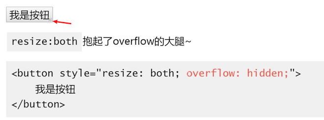

这里的拉伸指：出现一个标识，可以让用户拖动改变元素的宽高。就如同文本域一样,

那么你有没有发现，文本域你没有写这个属性的时候，为什么它天生外挂 resize 特性？是因为文本域天生就是 `overflow:auto`

 


### 跪舔 ellipsis 文字溢出点点点省略

`texttext-overflow:ellipsis`  ：顾名思义，文本溢出省略号表示

必须要元素声明是：`overflow:hidden` 才有效果

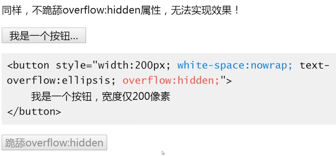

## 6. overflow 与锚点技术

### 锚链与锚点

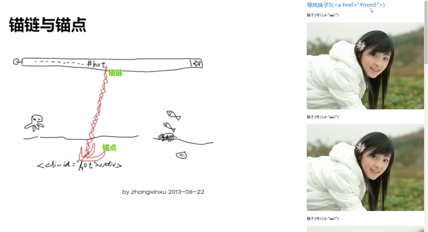

### 锚点定位的本质？

锚点定位的本质就是：“滚床单”


上图是汪星人从左滚动到右

床单即页面中可滚动容器，汪星人则是锚点对应的锚点元素（需要在容器内部），锚点定位就是汪星人滚床单

滚动条出现的前提：

1. 容器可滚动：右 overflow 属性，并且不是 visible；元素比容器高
2. 锚点元素在容器内：

**锚点定位的本质就是**：“滚床单”，专业解释是：**改变容器的滚动高度**

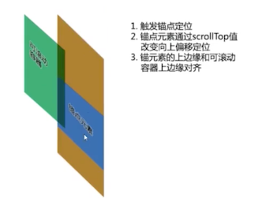

如上图，绿色是我们的可视区域，滚动的时候，是后面滚动容器的滚动高度改变

### 锚点定位的触发

- url 地址中的锚链与锚点元素

- 可 focus 的锚点元素处于 focus 态

  比如 input 可以获得 focus 焦点，当一个元素是 focus 的时候，浏览器会滚动到该元素的位置，让他出现在浏览器中

### 锚点定位的作用

- 快速定位

  比如一篇文章中的一节，可以快速滚动到这一章节

- 锚点定位于 overflow 选项卡技术

  它兼容 ie6、ie7 的，不依赖 js 的选项卡

  

锚点定位于 overflow 选项卡技术  

  

可以看到，如果把 hidden 改为 auto 的时候，就会看到其实只是把多余的内容隐藏起来了，使用锚点，让滚动条滚动，就出现了 选项卡的效果

**这种技术的不足**：可以看到图片上这一块的内容是靠在顶部的，如果你的不是在顶部，那么当选项卡切换的时候（锚点定位），会将选项卡滚动到顶端（上图的样子，往上走）

### 适用的场景

单页应用，在这种页面布局中，没有浏览器的滚动条，就很适合用来做选项卡切换


上图是左了一个竖向的选项卡造型。