# padding
本课程中，张鑫旭老师不仅将为大家深入讲解 padding 常用的一些特性

- 比如与元素尺寸的关系，
- 负值和百分比值等
- 更为大家带来一些 padding 的小秘密！
- 并为大家介绍如何运用 padding 来绘制图形
- 以及 padding 在布局的一些应用。

精彩不容错过噢！

[[toc]]

padding 中规中矩，性格温婉平和

## 1. CSS padding 与容器的尺寸

> 了解 padding 与元素尺寸之间关系。

CSS padding 与容器的尺寸关系复杂，我们直接来看例子来了解

### 对于 block 水平元素（演示探讨）

可以想象成 padding 是人类的脂肪，现在它很瘦

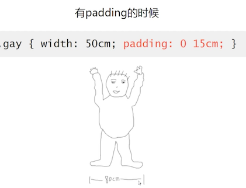

从这点来看：**padding 是会影响元素尺寸的**

骨架没有变化，红色部分的内容区域收缩。上面的或许过于抽象，下面来看个技术层面的

给文字增加左右的 padding  时，背景绿色区域的宽度并没有变化

从这里来看：**padding 不会影响元素的尺寸**（其实这句话是不严谨的）

 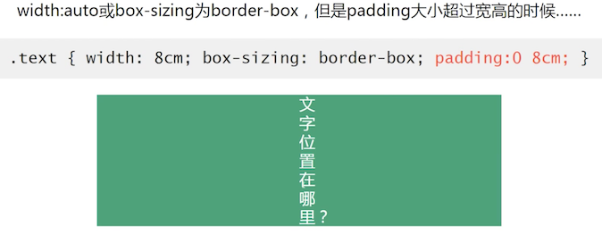

此时：padding 会影响元素的尺寸

### 对于 block 水平元素（结论）

1. padding 值 暴走，一定会影响尺寸
2. width 非 auto，padding 影响尺寸
3. width 为 auto 或box-sizing 为 border-box ，同时 padding 值没有暴走，不影响尺寸

### 对于 inline 水平元素

**结论：**水平 padding 影响尺寸，垂直 padding 不影响尺寸

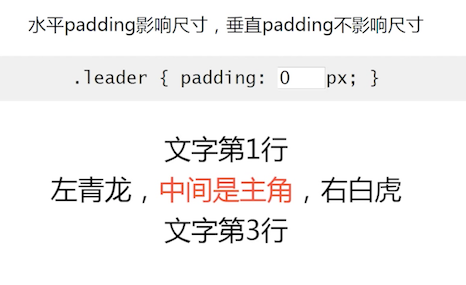

给四周都加上 padding 会发现只有左右有效果，垂直没有效果

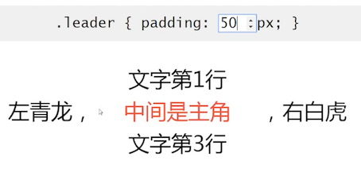

给 容器增加背景色，再看看; 注意这里的数值，现在是没有加 padding 的时候

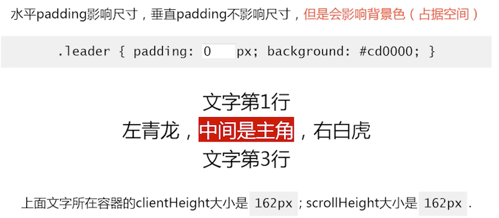

在父级大小内，只是背景占据大小改变，内容尺寸并未改变，大到超出父级容器大小的时候，就看到尺寸变化了, scrollHeight 滚动高度变化了

### 高度可控的分割线（inline）

> 利用 padding 对 inline 元素的特性： 水平 padding 影响尺寸，垂直 padding 不影响尺寸

这里使用 padding ，然后给它添加边框的方法实现可控高度

## 2. CSS padding 负值和百分比值

> 了解 padding 负值和百分比值的表现

- padding 不支持任何形式的负值
- padding 百分比均是 **相对于宽度计算** 的

### 轻松实现一个正方形

### 真实案例

APP 的头图是一个正方形的，但是在手机上面各种分辨率都有，怎么实现呢？

使用的是背景 + padding 来显示正方形的可视区域

### inline 水平元素的 padding 百分比值

1. 同样相对于宽度计算
2. 默认的高度宽度细节有差异
3. padding 会断行

这是由于文字掉下来的缘故导致的，当他能存放文字的时候，就又正常了

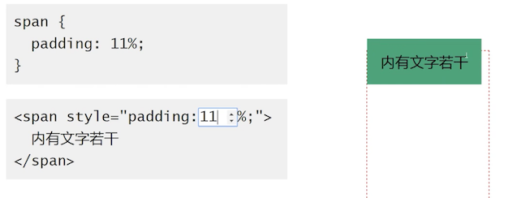

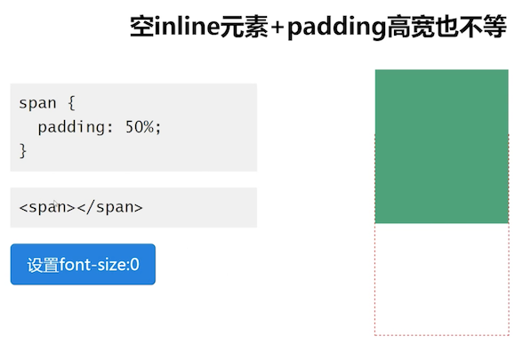

把 font-size 设置为 0 ，就能看到高度变小了

 

### inline 百分比下为什么会有额外的高度？

inline 元素的垂直 padding 会让「幽灵空白节点」显现，也就是规范中的「strut」出现

## 3. 标签元素的内置 padding

> 这里有一些你可能不知道的小秘密。

### `ol/ul` 列表

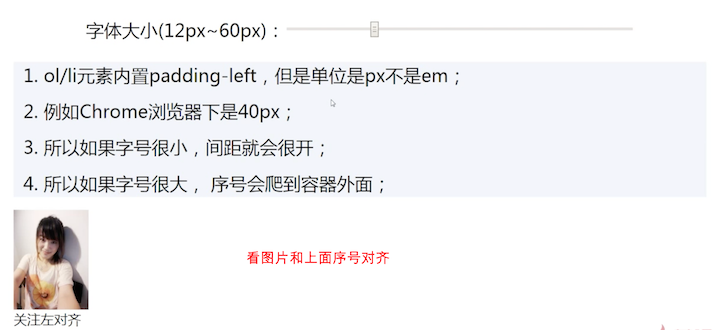

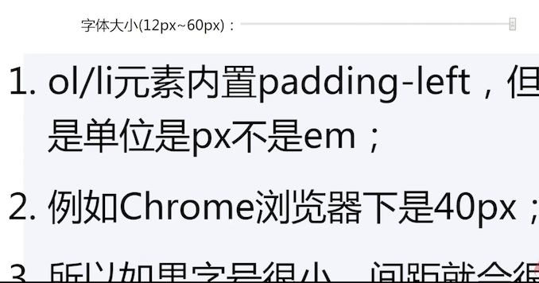

**经验分享：**平时文字大小 12 或 14 px，padding 的值设置为 22 ~ 25 是比较合适的，可以基本的实现，序号和下面的类容左对齐

### 表单元素的内置 padding

**结论：**

- 所有浏览器 input/textarea 输入框内置 padding

- 所有浏览器 button 按钮内置 padding

- 部分浏览器 select 下拉内置 padding

  如 FireFox、IE8+ 可以设置 padding

- 所有浏览器 `radio/chxkbox` 单复选框无内置 padding

- button 按钮元素的 padding 是最难控制

在各种浏览器下的 button 按钮 padding 表现不一

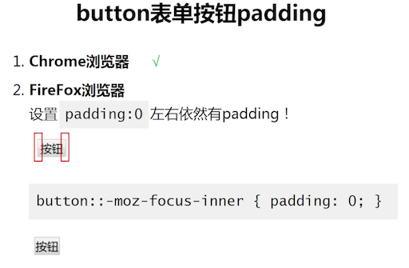

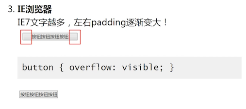

所以，建议使用 label 来模拟按钮，达到完全控制；

如果非要用原生的 button，比如表单中 button 可以拥有回车自动提交的功能，那么就可以如下实现：

- 让原始 button 可访问性不可见：使用定位等方式移除到不可见区域（不是 display:none）
- 让 label 的 for 属性关联 button

## 4. padding 与图形绘制

> 利用 padding 和其他一些 CSS 来绘制图形。

### 实现 3 道杠效果

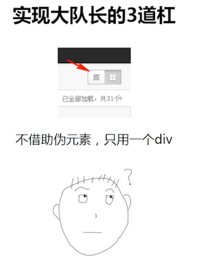

就是上面那个三道杠的的图标

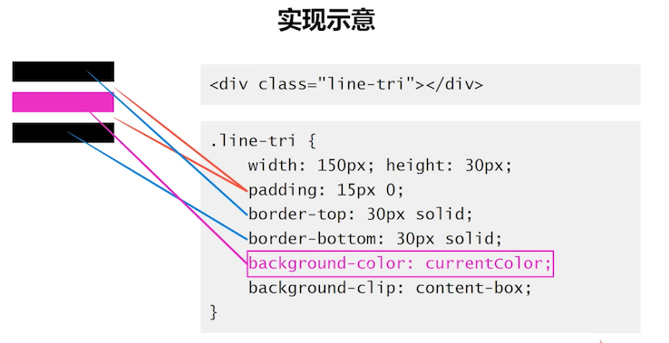

### 实现白眼效果

 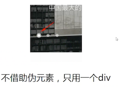

## 5. padding 布局实战

> padding 在布局这块一些比较好的应用。

### 使用百分比单位构建固定比例布局结构

还有 `1:2、3:4` 等也是可以实现的，前面讲解过。

### 配合 margin 等高布局

也是前面介绍过的

### 两栏自适应布局

 

