# vertical-align 垂直对齐
简介：本课程将带领大家深入的理解 CSS 中的属性 vertical-align 所支持的各类属性值们，
会简单介绍下 vertical-align 所存在的兼容性问题，也会分享一些开发中的实际应用经验以及一些最佳的实践效果

[[toc]]

顾名思义，垂直居中。

**定义：** 属性设置元素的垂直对齐方式。


## 1. vertical-align 家族基本认识

> 了解 vertical-align 支持的属性值以及组成

是 CSS 里非常重要，且是非常难理解之一

1. inherit 继承
2. 线类： baseline 是默认值
  
    `baseline、top、middle、bottom`
3. 文本类

    `text-top、text-bottom`
4. 上标下标类
  
    `sub、super`
5. 数值百分比类

    `20px、2em、20%,...`

### 数值百分比类

在这几个中是比较好理解的，他们其实还细分为两大类：

- 数值类
- 百分比类

把他们合在一起时因为：

1. 共性
2. 例子太多，分开将很多

### 共性

- 都带数字： `20px、20em、20%`

- 都支持负值

  支持负值的其实不多，还有他们也支持：

  - `margin `
  - `letter-spacing`
  - `word-spacing`
  - `vertical-align`
  
- 行为表现机制一致

### 数值类表现 

  

  上图一段文字和图片是对齐的，改变他的 vertical-align ，值为数值类型，会发现他们的表现形式是一样的，是因为，**在 baseline 对齐基础上，上下偏移数值的大小 **

### 百分比类的差异


而百分比类，则是相对于 line-height 计算的，上图为 0 ，无论怎么改动它的行高，都没有变化


::: tip
vertical-align 和 line-height 是组合非常紧密的好基友
:::

## 2. vertical-align 起作用的前提

> 探讨各种 display 值对 vertical-align 的影响

问题：为什么我设置了 vertical-align 却没有起作用？这个问题很常见，有必要普及说明下。

答案是：应用于 inline 水平以及 table-cell 元素 （文档描述里面有）

**inline 水平元素**

* `inline` ：` img、span、strong、em、未知元素..`

  未知元素：我们自定义的一个元素

* `inline-blokc`：`input(IE8+)`、`button(IE8+)` ...

**table-cell 元素**

* `table-cell`：`td`

于是，我们认为在 **默认状态下** ：图片、按钮、文字和单元格 支持 vertical-align。

因为有以下属性可以更改元素的显示水平：

1. `display` ： 更改元素的显示水平

2. CSS 声明更改元素的显示水平

   使用了 `float`、`absolute` 等改变了元素的 display 等

### 更改元素的显示水平示例

下图是一个不起作用的示例，原因是因为： P 标签是一个 block 的元素，不是 inline 或 table=cell


下面是一个有效的垂直对齐示例


加入更改图片的 display 为 block ，则垂直居中就没有效果了

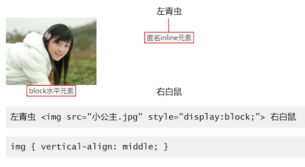

### CSS 声明更改元素的显示水平示例


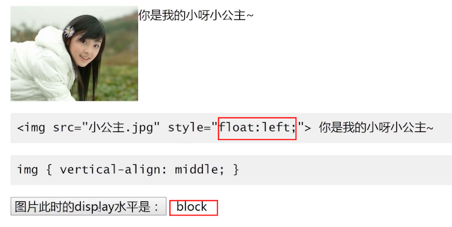

施加浮动之后，它的 display 属性被改变了，垂直居中不起效果了；

问题说失效，可能不是以上说的这种情况，可能是下面这种情况

### 失效的另一种情况

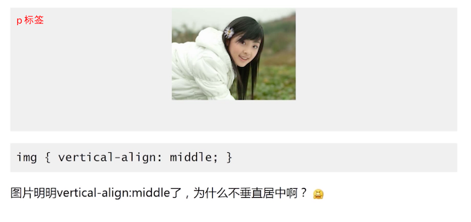

p 标签中的图片设置了 middle 后，没有生效。

这个时候，只要把 p 标签的行高设置为容器的高度，就会发现图片垂直居中了。

**结论**：不是 `vertical-align:middle` 没有起作用，而是太短，不够居中。

这里的短：可以先理解为是行高，下节课会详细解释这个原理

> 问题：上面的示例，把 p 标签设置为 table-cell 也会生效

这里要告诉你：table-cel 是他自身起作用


不居中，但是吧 middle 也设置在 p 标签上，就看似居中了


这就是 middle 值对 table-cell 自身起作用，对里面的子元素无效

### 实战

实战效果：个数不定文字内容和图片垂直居中对齐


效果如上，分左右两栏，左边文字无论有多少行，都会自适应的垂直居中；

下面一个例子，文字是通过 `<br/>` 换行形成的多行文字，默认样式就如同下面这样


那么怎么才能实现上面需求的那个样子？

- 容器的高度是不定的：有可能是文字的高度，有可能是容器的高度
- 需要文字或图片都垂直居中对齐

先满足左右两栏的布局，可以使用 `text-align: justify;` 本节不是讲解这个的，这里先不讲解


- 先实现两栏布局：

  - 因为要使 `vertical-align：middle` 生效
  - 同时又要让 span 的有宽度

  所以使用了 `inline-block`，再利用 width 让文字和图片隔开

- 最后：span 和 图片 都增加 middle 属性，就完成了

## 3. vertical-align 与 line-height 之间的关系

### 温故

vertical-align 百分比是相对于 line-height 值计算的。例如下面这个

```css
{
  line-height:30px;
  vertical-align:-10%;  
}

等同于

{
  line-height:30px;
  vertical-align:-3px; /* 30 * -10% = -3 */
}
```

### 通过现象看本质

随意写个标签，比如 P，里面放个图片

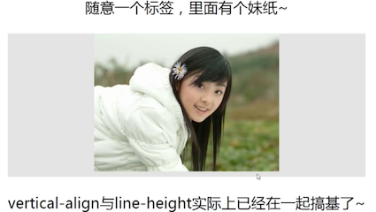

给容器添加个背景颜色，就会发现，图片底部有一点空隙，要解释这个，需要你现在明确的牢记下面这一点


换个通俗一点的说法：只要你这个元素是 inline ，就一定会受 `vertical-align` 与 `line-height` 的影响。 

这时候，图中的红色虚线，你可以想象成是一个匿名的文本节点，它只是用来帮助我们理解的，在下面的 css 声明中，红线的行高就是 `24*1.5=36px`


默认是以基线对齐，图片的基线是底部，但是字符的基线却不是底部，为了他们的基线对齐，所以图片下面就会被字符撑开一点间隙。

### 对症下药

那么问题已找到，随便改动他们两个其中一个都可以，比如：

- `vertical-align` 要生效，必须是内联元素：破坏图片的内联性

  `display: block; margin:auto;`

- 改变 `vertical-align` 的对齐方式：

  - bottom
  - middle
  - top

  把默认的 baseline 改掉

- 改变 `line-height` 为 0，基线就往上移动了

- 改变 `font-size:0`，行高是 = font-size * 相对值的 1.5; 也相当于改变了行高 

### 基本现象衍生：（近似）垂直居中

根据基本现象，我们可以衍生出一些常用的非常实用的「 垂直居中」技能

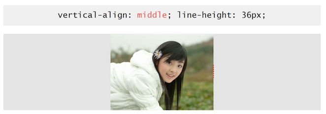


上图是一个垂直居中的演示，可以看到红色虚线也垂直居中了，但是我们把行高改变成，比图片还要高的行高

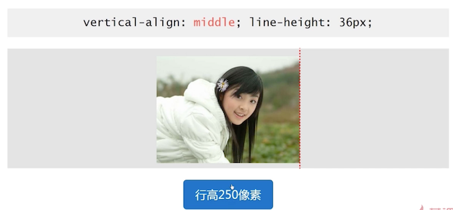

这是因为：空白字符应用行高的时候，它的实际高度就是行高的高度；

利用这种特性，实现大小不固定图片的垂直居中

### 通过简单现象看复杂现象


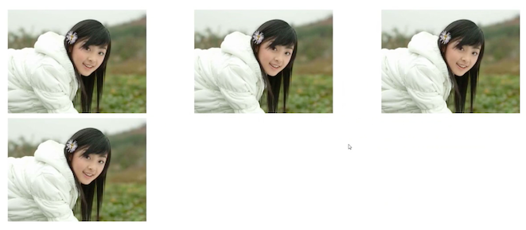

这就两端对齐了，任意数目的列表都可以实现；实际上是由一点问题的，把 P 标签增加背景，和用辅助线标识出来会发现


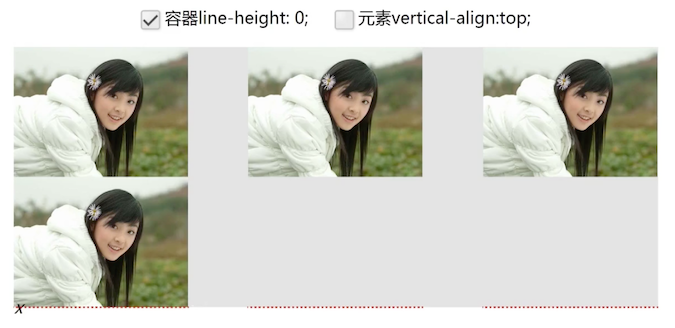

当 行高为 0 的时候，其实不能完全去掉这个空隙，我们在 i 标签里面增加空格元素，那么此时空 i 标签的基线对齐则是空格元素了，他们为了能对齐基线，就没有空隙了

更改掉他们的对齐方式，就更加和谐了

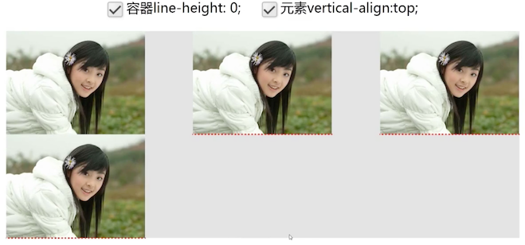

### 小测试

> 问题：2 个相似 inline-block 按钮，一个行高 0，一个行高正常，默认的基线对齐，两个按钮 UI 表现是？

答案是不对齐：


如果理解不了，请回头把刚刚讲解的复杂现象，自己写一遍，去理解理解，就基本上能理解很多类似的问题了


上上图两个按钮中，基线就是以最后一个按钮为准的，同时，它里面没有 line boxes 本身也没有 overflow 的属性，所以以他的文字的基线为准。

下面再来看一个例子，就差不多明白了


两个一样的元素，只是一个有内容，一个没有内容，它就会按照文字的基线作为自己的基线，就看到了这种效果，如果把文字干掉，他们就会对齐


把后面盒子行高变成 0 ，会发现，它又往下面掉了一点；一个字符行高变成 0 ，那么他占据的高度就变成了 0 了。行高变成 0 的时候，会让文字居中，那么字符的中间就正好是 baseline 。所以就下掉了

## 4. vertical-align 线类属性值深入理解

> 深入理解 vertical-align 底线、线、中线的行为表现

### bottom
定义：

1. `inline/inline-block` 元素：元素底部和整行的底部对齐
2. `table-cell `元素：单元格底 padding 边缘和表格行的底部对齐

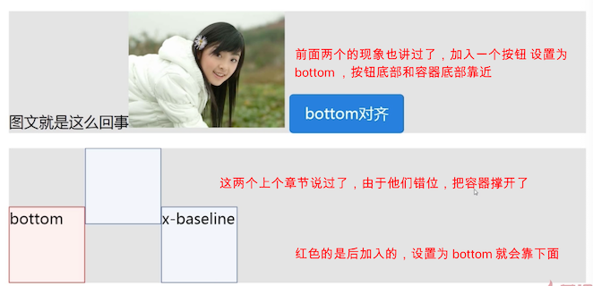


### top

定义：

1. `inline/inline-block`：元素顶部和整行的顶部对齐
2. `table-cell` 元素：单元格顶 padding 边缘和表格行的顶部对齐

### middle

复杂且是重点

定义：

1. `inline/inline-block`：元素的**垂直中心点**和**元素基线**上 `1/2x` height  处对齐
2. `table-cell`元素：单元格填充盒子相对于外面的表格行居中对齐


可以看到，字符的中心点，是他自己行高的中心点，而不是字符本身的中心点，字符有下沉的特点。 

加大字号，看得更清楚，**图片的垂直中心点**与字符 x 的的基线上 1/2 处，对齐； 所以他是近似的垂直居中。


 

想要完全垂直居中，把 fonx-size 设置为 0 即可，它的各种线都在同一条线上了。所以会完全的垂直居中

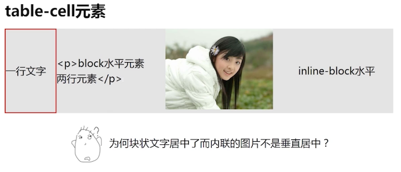

图片看上去没有垂直居中，还是之前那种是基线的问题，导致有间隙

## 5. vertical-align 文本类属性值

> 说说 text-top/text-bottom

定义：
1. `text-top`： 盒子的自己的顶部和父级 content area 的顶部对齐
2. `text-bottom`： 盒子的底部和父级 content area 的底部对齐

**提示：**content area 内容区域高度受 font-size 大小影响，一般认为鼠标选中文字后出现的蓝色背景是 内容区域高度。

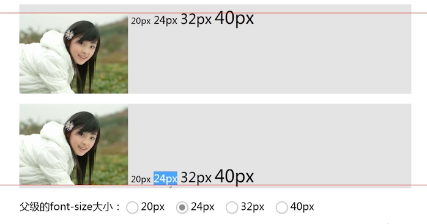

上图是上面图片使用了 text-top ，下面图片使用了 text-bottom，现在是 24 像素，可以看到图片的顶部和底部都与 24px 的底部对齐的；

改变父级的 font-size 大小，会发现图片顶部和文字 40px 顶部对齐了


所以：

- **父级：** 所以元素 vertical-align 垂直对齐的位置与前后的元素都没有关系
- **内容区域顶部：**所以和行高没有关系。和字体大小有关系

### 实际作用

**一般使用场景**：表情图片（或原始尺寸背景图标）与文字的对齐效果


图中表情是 24 px，内容是 14 px

* 使用基线的问题在于图标偏上

  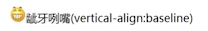

* 使用顶线、底线的问题在于受**其他内联内联元素**影响，造成巨大的定位偏差

  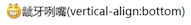

  比如插入一个图片，就错位了

  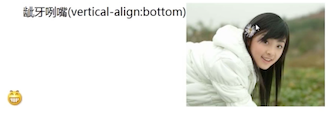

* 使用中线也是不错的选择，但需要恰好的字体大小以及兼容性要求不高

* 使用文本底部比较合适，不受**行高**以及**其他内联元素**影响

  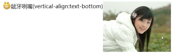

  

## 6. vertical-align 上标下标类属性值深入理解

简单讲解下  `sub/super`

html 中也有上标下标:`<sup>`、`<sub>`


在使用上标下标的时候，会把元素的大小变成父级的 75% 左右。


**定义**

1. super ：提高盒子的基线到父级合适的上标基线位置
2. sub   ： 降低盒子的基线到父级合适的下标基线位置

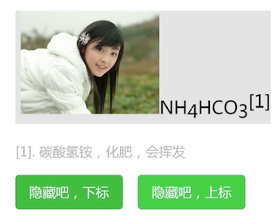

听不太懂。。。 没有啥实际的应用

## 7. vertical-align 前后不一的作用机制

就是相邻的前后两个元素，比如一个是 middle，另一个是 bottom，那么他们之间是否有相互的影响呢？

对前面讲解的进行一个综合性的总结。

对立属性，没有记录，有点乱了。


下面是混杂属性：


前面讲解过使用 `font-size=0` 来达到完美垂直居中，但是如果后面跟上文字怎么办？就不行了，这里在图片后跟一个空的内联元素，让他也 middle。他们基线就重合对齐了

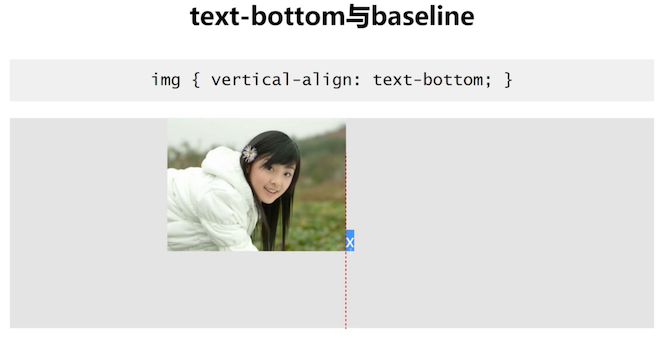

父级行高 250px，比图片高，后面跟了一个 x，图片使用 text-bottom 会发现图片下面多了很多的空白，这是是什么原因？

笔者这里算是醒悟了，当你不明白为什么这样的时候，先去看 text-bottom 的定义！

盒子的底部和父级 content area 的底部对齐，看 x 内容区域，他们底部是对齐的！

### 结论

**关注_当前元素和父级_，前后并没有直接影响**

## 8. vertical-align 的糟糕的兼容性

> 简单介绍低版本 IE 浏览器们的非标准解析以及其他兼容性问题

大致分为：

- IE6/7：守旧派
- IE8+、Chrome、FireFox：高版本浏览器

分为三个方向来展示：

1.  小图片和文字
2. 大图片和文字
3. 大行高下的大图片和文字

笔者这里就不记录了。

## 9. vertical-align 的实际应用

> 一些最佳经验实践分享

### 小图标和文字的对齐


第一想到的应该是用 `vertical-align:middle`，结果可能发现不太好用，原因前面有，简单的方式就是使用负值，就对齐了

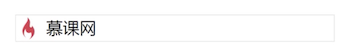

根据经验：图标 20 px，文字 14 px，负值设置为 -5px 会达到比较好的对齐效果

### 不定尺寸图片或多行文字的垂直居中

 大致分以下三步

 1. 主体元素  `inline-block` 化
 2. 0 宽度 100% 高度辅助元素
 3. `vertical-align:middle` 

要实现任意图片尺寸的垂直居中

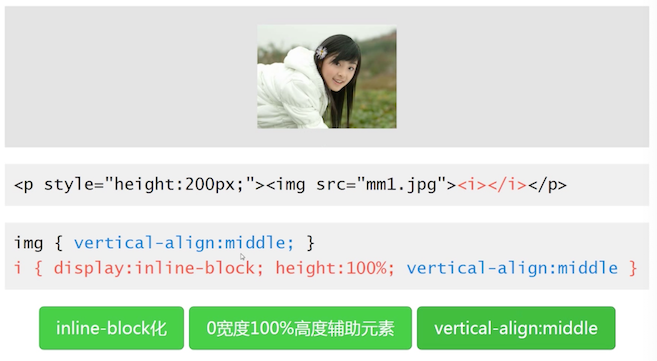

大小不定的文字垂直居中

