# z-index 层级
简介：本课程中，张鑫旭大大将带领大家学习 z-index 的基本知识，并深入讲解嵌套表现以及 z-index 计算规则。
同时还将介绍 CSS 中非常基础且重要的元素层叠表现的概念、元素的层叠顺序，以及 z-index、
还有其他 CSS 属性与层叠上下文的关系。还有最值得期待的 z-index 实践经验分享！

[[toc]]

## 1. CSS z-index 基础

> 了解 z-index 的语法，支持的特性等

### 含义
z-index 属性指定了元素及其子元素的 「z 顺序」，而 「z 顺序」可以决定当元素发生覆盖的时候，哪个元素在上面。通常一个较大 z-index 值的元素会覆盖较低的那一个

### 支持的属性值

1. `z-index: auto`： 默认值
2. `z-index: <integer>` ：数值
3. `z-index:  inherit`： 继承

### 基本特性

1. 支持负值： `z-index:-1` ，整个后续会讲解比较微妙

2. 支持 css3 animation 动画

3. 在 css2.1 时代，需要和定位元素配合使用

   如果不考虑 css3，只有定位元素（`position：relative/absolute/fixed/sticky`）的 z-index 才有作用，在 css3 中有例外

下图是一个从 `z-index -1 到 50 ` 的动画，图片也是从 -1 到 50 排列得，当动画播放的时候，就会产生类似进度条的样式，你会看到，透明的区域是一层一层显示出来的


动画代码如下

```css
@keyframes zIndex {
  0% { z-index: -1; }
  100% {z-index: 51;}
}
```

但是这种动画，并没有什么太多的适用场景

## 2. z-index 与 CSS 定位属性

> 理解嵌套表现以及 z-index 计算规则

**一个观点要知道：**z-index 只对定位元素有作用


### 如果定位元素 z-index 没有发生嵌套

1. 后来居上的准则
2. 哪个大，哪个上

#### 后来居上

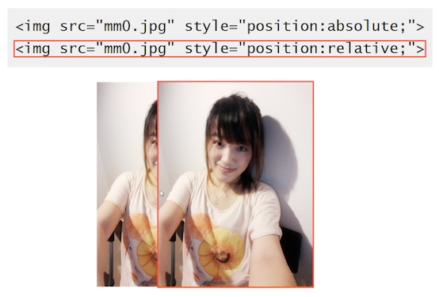

#### 哪个大哪个上

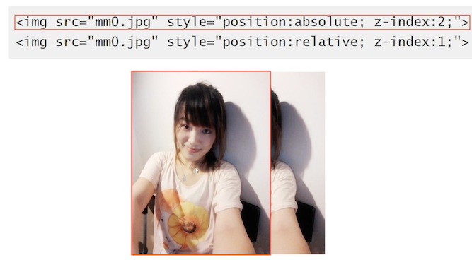

### 如果定位元素 z-index 发生嵌套

祖先优先原则，前提是：非 auto


很好理解，看最祖先的层级来算。如果为 auto，则第一个覆盖了第二个


为什么会这样呢？

在官网文档有对应的描述：**CSS2.1:z-index:auto**，
当前层叠上下文的生成盒子层叠水平是 0， 盒子（除非是根元素）不会创建一个新的层叠上下文

## 3. CSS 中的层叠上下文和层叠水平

> 元素层叠表现基础且 **非常重要的概念**

###  **层叠上下文（stacking context）**
是 HTML 元素中的一个三维概念，表示元素在 z 轴上有了「可以高人一等」

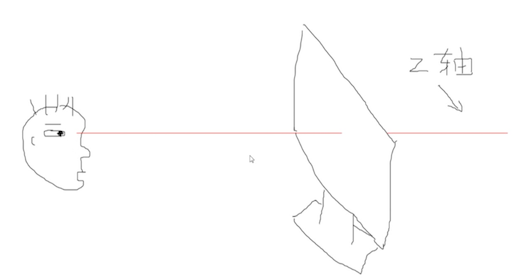

就是我们人眼看演示器，层叠上下文可以让这个元素在 z 轴上离我们更近。

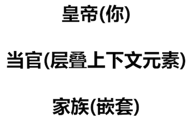

上图，使用打比方的形式，让你能记住；

**层叠上下文（stacking context）** 是表示普通老百姓 HTML 元素当官了，离皇帝更近了。

### 具有层叠上下文的元素有

* 页面根元素天生具有层叠上下问，称之为「根层叠上下文」   -- 皇亲国戚
* z-index值为数值的定位元素也具有层叠上下文   -- 科考入选
* 其他属性   -- 其他当官途径

### 层叠水平（stacking level）

**层叠上下文中** 的每个元素都有一个 **层叠水平**，决定了同一个层叠上下文中元素在 z 轴上的显示顺序。

也是遵循「后来居上」和「谁大谁上」的层叠准则，该准则在层叠元素领域中是通用的。

用当官的来解释：所谓打狗看主人，每一个当官的家里儿孙、仆人什么的，都有一个论资排辈（即层叠水平），决定了在一起的时候，谁排在前面，离官员更近

::: tip 注意
层叠水平（stacking level）和 z-index 不是一个东西。普通元素也有层叠水平，而 z-index 只在定位元素上才有作用
:::

### 层叠上下文的特性

* 层叠上下文可以嵌套，组合成一个分层次的层叠上下文

  解释：一个家，爸爸可以当官，孩子也可以同时当官的。这家族的官就当得比较有层次

* 每个层叠上下文和兄弟元素独立：

  当进行层叠变化或渲染的时候，只需要考虑后代元素。

  解释：自己当官，兄弟不沾光。有什么福利或则变故只有会影响自己的孩子们

* 每个层叠上下文是自成体系的：

  当元素的内容被层叠后，整个元素被认为是在父层的层叠顺序中。

  解释：每个当官的都有属于自己的小团体。当子孙或属下发生的排辈摩擦什么的，都是自己宅院的事情，不会影响官员自己和皇帝之间的距离。


## 4. 元素的层叠顺序

**层叠顺序 （stacking order）：**元素发生层叠时候有着特定的垂直显示顺序

### 著名的 7 阶层叠水平（stacking level）


1. 层叠顺序的意义

    规范元素重叠时候的呈现规则
    
2. 为何层叠顺序是这样的？

    比如 float 元素不是应该更屌一点，为什么 inline 元素还在 float 元素上呢？    
    

因为：更符合页面加载的功能和视觉呈现

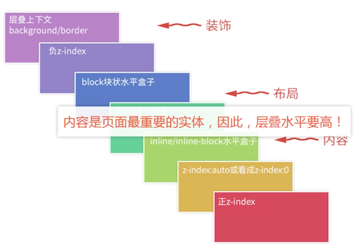

### 感受下

内容元素元素层叠顺序比文字高

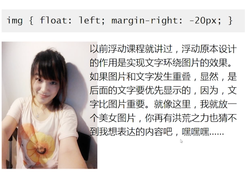

上图图片浮动之后，文字会环绕，图片 -20px，如果文字层叠顺序比 float 要高，就会是上图效果这样，文字覆盖了图片

下面这个更直观，他们有 30 px 的重叠区域，在 7 阶层叠水平图中， inline-block 顺序要比 block 要高。 显示效果也说明了这一点


还发现一点，绿色的文字居然覆盖了上面的背景色，这个也好解释：**背景色覆盖是层叠顺序**，文字覆盖是后来居上

## 5. z-index 与层叠上下文

> 解释 z-index 的实际行为表现

这里罗列了 3 个行为要点：

1. 定位元素默 `z-index：auto` 可以看成是 `z-index：0`
2. z-index 不为 auto 的定位元素会创建层叠上下文
3. z-index 层叠顺序的比较止步于父级层叠上下文

### 为何定位元素要覆盖普通元素？


两个元素在没有其他样式的加持下，后来居上，如上图，后来覆盖了先来的。

给先来的加上 **定位元素**，就覆盖了后来的


可以这样来解释：


在 7 阶层叠水平表中，z-index:auto 高于水平盒子


### z-index 与创建层叠上下文

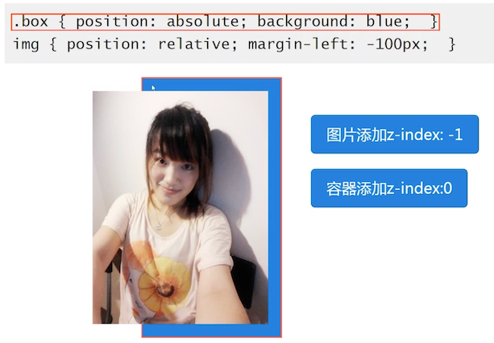


让图片 -1，就看见图片到下面去了，给容器增加 0 ，又上来了

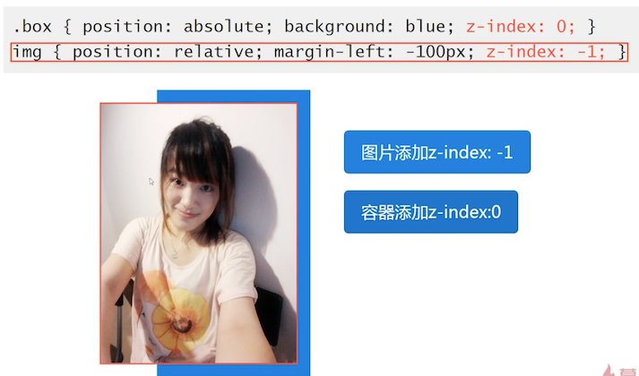


这可以这样解释：


box 是 absolute，但是是一个普通元素（默认为 auto，但是 auto 不创建层叠上下文）层叠上下文就不是 box 了


图片就又上来了，是因为一直在说的， 负值 z-index 在 **层叠上下文的背景色之上**！ 

###层叠顺序上讲： auto 与 0 的差异

从 **层叠顺序**上讲， `z-index:auto` 可以看成 `z-index:0` ，但是从 **层叠上下文** 来讲，两者却有着本质差异！

- auto ：不会创建层叠上下文
- 0 ： 会创建层叠上下文

以上观点不包括 IE7 （是它的一个 bug 或则说是不符合标准的表现）


### z-index 受限于层叠上下文

啥意思呢？先看列子

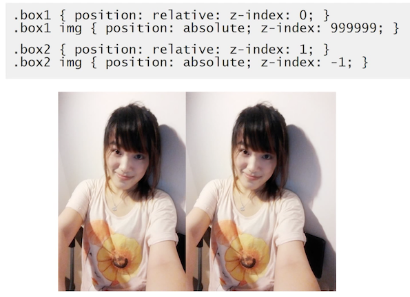

box1 是 **定位** 元素，创建额层叠上下文（z-index=0），box2 同样也是，但是 z-index 是 1，比 0 大，所以 box2 在上面，而里面的图片是依赖这个层叠上下文的

这章节最重要的是，要学会看为什么一些 z-index 底的元素反而在上面，最最重要的要去 **套 7 阶层叠水平图的规范**。只要一套，基本上就懂了，还有边框和背景色、内容之分，所以要注意


## 6. 其他 CSS 属性与层叠上下文

> 不只是 z-index

本章讲解的是 z-index 的层叠上下文，其实还有其他的 CSS 属性会创建层叠上下文

1. z-index 值不为 auto 的 flex 项（父元素 `display:flex|inline-flex`）
2. 元素的 opacity 值不是1；透明度
3. 元素的 transform 值不是 none
4. 元素 mix-blend-mode 值不是 normal；混合模式
5. 元素的 filter 值不是 none；滤镜模式
6. 元素的 isolation 值是 isolate
7. `postion:fixed` 声明 （ chrome 等 `blink/webkit` 内核浏览器）
8. will-change 指定的属性值为上面任意一个；与 GPU 加速渲染的东西
9. 元素的 `-webkit-overflow-scrolling`设为 touch 

以上大多数的都是 CSS3 的特性

### `display:flex` 与层叠上下文

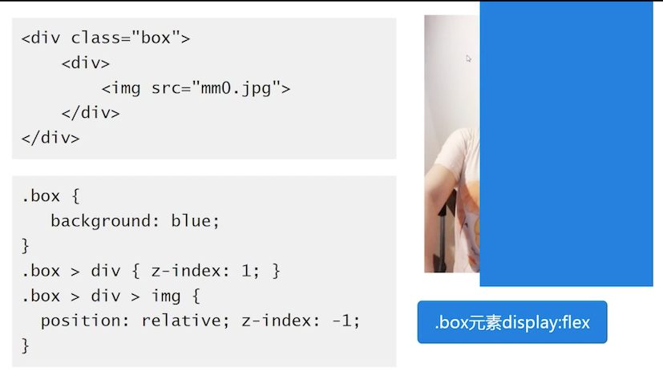

图片 `z-index:-1` ，由于 box 不是层叠上下文元素，会去找根元素，所以图片在背景下面


给 box 施加 `display:flex` 图片上来了，说明 box 变成了一个层叠上下文元素；最重要的是，flex 的子元素的 z-index 值不是 auto。 他们两个要配合使用

### opacity ≠ 1 与层叠上下文

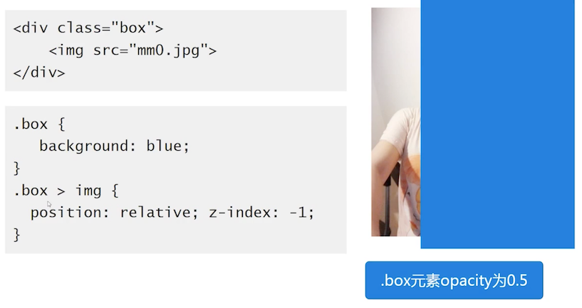

同样，box 是非层叠上下文元素，图片就穿过去了， 给 box 的透明度改变为 0.5 ，会发现它变成了层叠上下文元素


**结论：** opacity 不等于 1 的元素是层叠上下文元素

### transform ≠ none 与层叠上下文元素


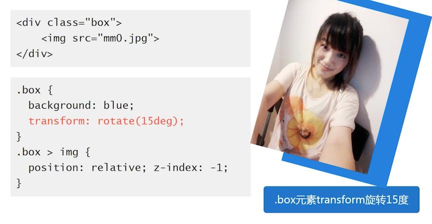

**结论：** transform ≠ none 的元素是层叠上下文元素

###  mix-blend-model ≠ normal 与层叠上下文


tip: 图片中代码 screen 是 darken

背景是额外加的效果，如果是白色的话，混合模式看不到效果

**结论：**mix-blend-model ≠ normal 的元素是层叠上下文元素

### filter ≠ none 与层叠上下文元素

这里的 filter 指的是， css3 里面的


**结论：**filter ≠ none 的元素是层叠上下文元素

### `isolation:isolate` 与层叠上下文元素

 与混合模式配合使用，希望不被混合模式混合的化，就设置该属性


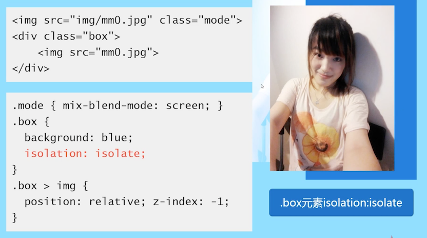

**结论：**`isolation:isolate` 的元素是层叠上下文元素

### `position:fixed` 与层叠上下文元素

 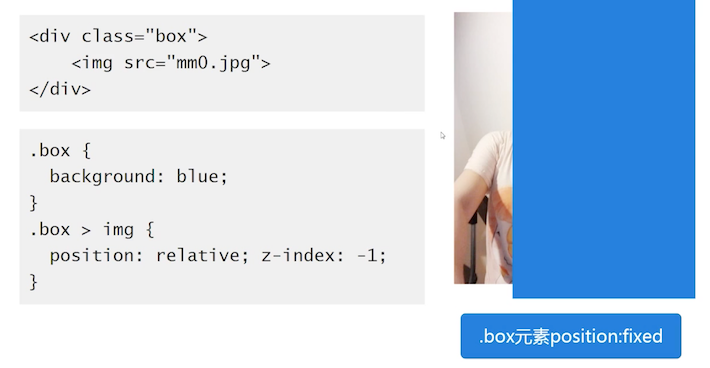

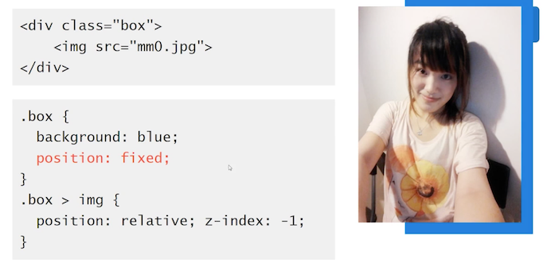

**结论：**`position:fixed` 的元素是层叠上下文元素; 只在 Chrome 等 blink/webkit 内核浏览器

### `will-change` 与层叠上下文

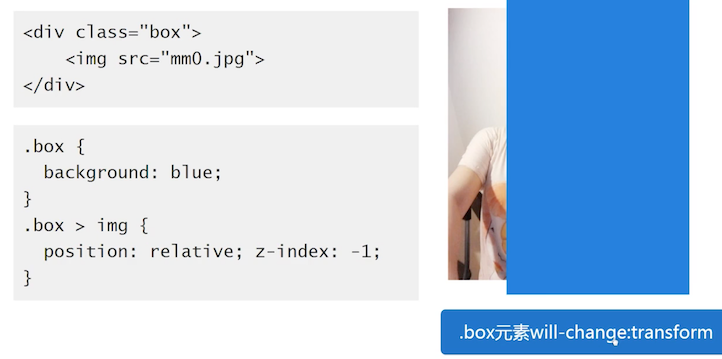


**结论：** `will-change`  的元素是层叠上下文元素

### `-webkit-overflow-scrolling` 与层叠上下文

在手机端才拥有的，这里无法展示

## 7. z-index 与其他 CSS 属性层叠上下文

> 非定位元素层叠上下文和 z-index 关系大揭秘。 重点

先上结论：

 1. 不支持 z-index 的层叠上下文元素的层叠顺序均是 `z-index:auto`级别
 2. 依赖 z-index 的层叠上下文元素的层叠顺序取决于 z-index 值

### 更完整的 7 阶层叠水平图

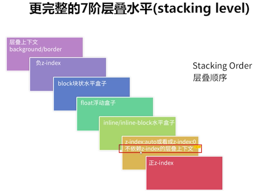

### 举例


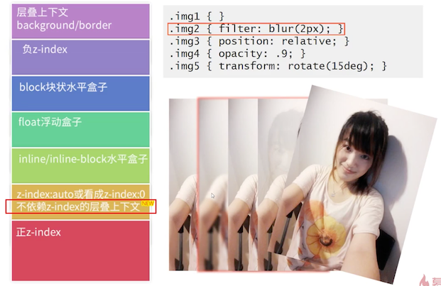

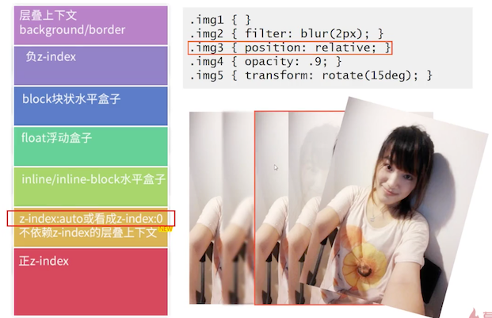


后面这 4 个图片的层叠上下文元素，层叠顺序与 auto 是一个级别

###  第 2 点

依赖 z-index 的层叠上下文元素的层叠顺序取决于 z-index 值

依赖 z-index 值创建层叠上下文的情况：

1. position 值为 relative/absolute 或 fixed
2. `display:flex|inline-flex`容器的子 flex 项

以上两种是需要使用 z-index 值来创建层叠上下文的

下图 1 是有层叠上下文的

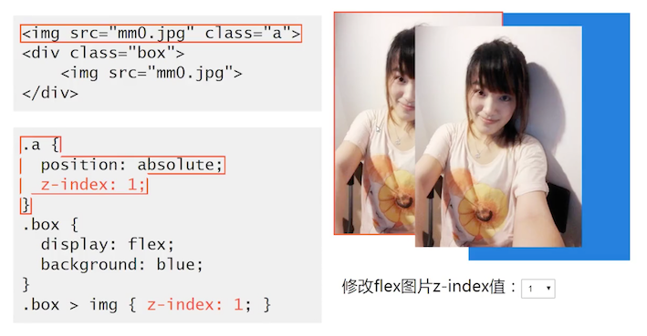

后面的 box 的图片覆盖了前一个，这只有出现层叠上下文的情况下，才会后来居上原则。

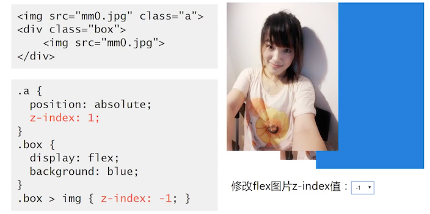

当修改它的值为负数时，图片都跑到 box 背景下面去了，这是因为图片要找他的层叠上下文，但是 `display:flex` 是普通元素，只是它的子项，也就是 图片才是层叠上下文元素；


修改为 0 时，与 auto 一个级别的

### 层叠上下文导致的有趣的现象

本节的类容你会了就知道是怎么回事了


如上，效果是，给了一个渐入的效果，本来想实现，从透明慢慢变成可见的效果。

[层叠上下文导致的有趣的现象 demo 演示](https://github.com/zq99299/css-zxx/tree/master/z-index/层叠上下文导致的有趣的现象.html)

实际上这个代码，只有在 opacity 1 的时候，才能看到图片上面的文字。

原因还是：层叠上下文的关系，**透明度不为 1 的元素是由层叠上下文的**

1. 元素的 opacity 值不是 1，的时候会创建层叠上下文，且这里没有指定 z-index，所以是 auto
2. 定位元素也会创建层叠上下文，且这里没有指定 z-index，所以是  auto
3. 他们的层级是一样的权重，都是 auto。后来居上，所以文字被覆盖掉了
4. （如果把 dom 顺序：p 标签放到图片后面，效果则比较完美）因为层叠水平是一样的，后来居上嘛。可以尝试修改下 z-index 的值，就能验证了


## 8. z-index 相关实践分享

1-7 全是讲解理论的。本节讲解最佳实践分享

1. 最小化影响原则
2. 不犯二准则
3. 组件层级计数器
4. 可访问性隐藏

### 最小化影响原则

该选择，在 relative 章节讲解过了

**目的**： 避免 z-index 嵌套层叠关系混乱

**原因：**

 1. 元素的层叠水平主要由所在的层叠上下文决定
 2. ie7 `z-index:auto` 也会新建层叠上下文

**做法**

 1. 避免使用定位属性（不产生层叠上下文）
 2. 定位属性从大容器平级分离为私有小容器

### 不犯二准则
**目的：** 避免 z-index 混乱，一山比一山高的样式问题

**原因： ** 多人协作以及后期维护

**做法： ** 对于非浮层元素，避免设置 z-index 值，z-index 值没有任何道理需要超过 2（ 不犯二准则）

可以使用本章讲解的创建层叠上下文之类的方式来解决

### 组件层级计数器
**目的： ** 避免浮层组件因 z-index 被覆盖的问题

**原因： ** 

1. 总会遇到意想不到的高层级元素
2. 组件的覆盖规则具有动态性

  比如弹框，后面弹出来的覆盖前面的弹框。

**做法： ** 组件层级计数器方法 ；通过 JS 获得 body 下子元素的最大 z-index 值。

作者一般会获取 body 下的子元素，判定并 +1 作为自己的 z-index 值

### 负值 z-index 与可访问性隐藏
**可访问性隐藏： ** 人肉眼不可见，但是辅助设备可以识别（比如把文字设置 left 为负数 -999，人眼看不见了，但是屏幕阅读器能看到）

解决方法：z-index 负值元素在层叠上下文的背景之上，其他元素之下

举个列子：

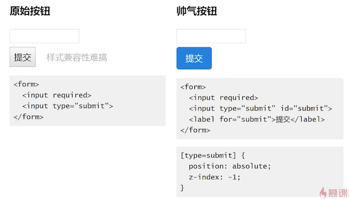

原始按钮特别的丑，可以使用右侧的方式，让原始按钮隐藏下去，通过 for 来关联按钮的 id

[z-index隐藏原始按钮 demo 演示](https://github.com/zq99299/css-zxx/tree/master/z-index/z-index隐藏原始按钮.html)

