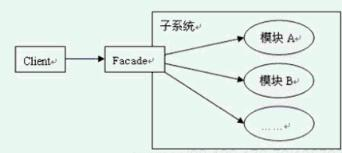
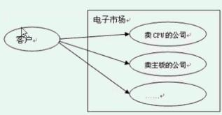
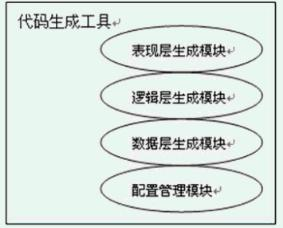
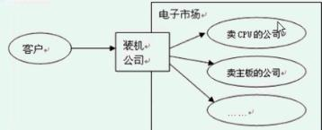

# 外观模式

## 初识外观模式
### 定义：
为子系统中`一组接口`提供一个`一致的界面`，Facade模式定义了`一个高层接口`，这个接口使得这一子系统`更加容易使用`

### 结构和说明：


**界面：**从客户端来看待这个系统，能看到的东西
**Facade ：** 定义子系统的多个模块对外的高层接口，通常需要调用内部多个模块，从而`把客户的请求代理给适当的子系统对象`。
**模块：**接收Facade对象的委派，真正实现功能，各个模块之间可能有交互。`☂注意：`Facade对象知道各个模块，但是各个模块不应该知道Facade对象


------------

## 体会外观模式
###  生活中的示列：组装电脑
1. 完全自己组装


2. 找专业装机公司组装


###  工具示例：代码生成工具


`问题：`如果现在客户端需要使用这个代码生成工具来生成需要的基础代码，该如何来实现呢？

###  不用模式解决方案


`存在的问题：`客户端为了使用生成代码的功能，需要与生成代码子系统内部的多个模块交互

### 使用模式解决方案


```java
public interface AModuleApi {
    void test();
}
public class AModuleImpl implements AModuleApi{
    @Override
    public void test() {
        System.out.println("模块a");
    }
}
public interface BModuleApi {
    void test();
}
public class BModuleImpl implements AModuleApi{
    @Override
    public void test() {
        System.out.println("模块b");
    }
}
public interface CModuleApi {
    void test();
}
public class CModuleImpl implements AModuleApi{
    @Override
    public void test() {
        System.out.println("模块");
    }
}
public class Facade {
    /**
     * 满足客户端需要的方法
     */
    public void test(){
        // 内部实现的时候，可能会调用各个模块
		// 如果遇到这样一种情况，需要按顺序调用这3个方法，那么在客户端使用的时候还需要搞懂先调用什么后调用什么，就很不方便了，所以使用外观模式封装起来
        new AModuleImpl().test();
        new BModuleImpl().test();
        new CModuleImpl().test();
    }
}
public class Client {
    public static void main(String[] args) {
        // 这里使用外观模式，就不再需要客户端与各个模块直接打交道了
        new Facade().test();
    }
}
```


------------


## 理解外观模式
### 认识外观模式
1. 外观模式的`目的不是给子系统添加新的功能接口`，`而是为了让外部减少与子系统内多个模块的交互，松散耦合`，从而让外部能够更简单的使用子系统。
	 `不能在外观模式的接口或则类中直接实现客户端的功能。应该是包装组合已有的功能`，来满足客户端的需求

2. 使用外观跟不使用外观有何变化？
	Facade方便了客户端的调用、封装了系统内部的细节功能、实现功能的共享和复用

	`重点在于Facade的位置`，Facade属于红框中的一部分。所以facade是可以知道具体实现的。 而客户端确是不知道的

3. 有外观，但是可以不使用

4. 外观提供了缺省的调用
	（对常用的进行一些包装，如果有特殊的需求，就使用第三点，直接调用具体的实现）

5. 外观模式的调用顺序示意图


### 外观模式的实现
1. 把外观类当成一个辅助工具类实现
2. facade可以实现为interface


3. Facade实现称为interface的附带好处
	能够有选择性的暴露接口方法，尽量减少模块对 外提供的接口方法。
4. Facade的方法实现
	Facade的方法实现中，一般是负责把客户端的请求转发给子系统内部的各个模块进行处理，Facade的方法本身并不进行功能的处理，Facade的方法的实现只是实现一个功能的组合调用


`待完结..`
