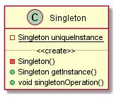
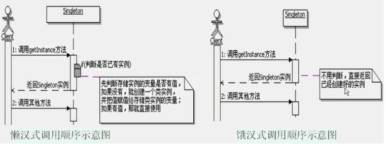

# 单例设计模式

## 初识单例模式

### 定义
保证一个类仅有一个实例，并提供一个访问它的全局访问点


## 结构和说明


Singleton：负责创建 singleton 类自己的唯一实例，并提供一个 getInstance 的方法，让外部来访问这个类的唯一实例。

------------


## 体会单例模式
**问题：**
	读取配置文件的内容：现在要读取配置文件的内容，该如何实现呢？
### 不用模式的解决方案：
```java
public class Appconfig {
    private Properties properties = new Properties();

    private Appconfig() {
        try {
            properties.load(new FileReader("xxx"));
        } catch (IOException e) {
            e.printStackTrace();
        }
    }
    public String getValue(String key){
        return (String) properties.get(key);
    }
}
public class Client{
    public static void main(String[] args) {
         new Appconfig().getValue("key");
    }
}
```
**存在的问题：**
	在系统运行期间，系统中会存在很多个 appconfig 的实例对象，这会严重浪费系统资源

**把上面的描述进一步抽象以下，问题就出来了：**
	在一个系统运行期间，某个类只需要一个类实例就可以了，那么应该怎么实现呢？

### 使用模式的解决方案：
```java
public class Appconfig {
    private Properties properties = new Properties();

    private static Appconfig appconfig = new Appconfig();
    private Appconfig() {
        try {
            properties.load(new FileReader("xxx"));
        } catch (IOException e) {
            e.printStackTrace();
        }
    }
    public static Appconfig getInstance(){
        return appconfig;
    }
    public String getValue(String key){
        return (String) properties.get(key);
    }
}

public class Client{
    public static void main(String[] args) {
        Appconfig.getInstance().getValue("key");
    }
}
```

------------

## 理解单例模式
### 认识单例模式
1. 单例模式的功能

	单例模式的功能是用来`保证这个类在运行期间只会被创建一个类实例`，并提供一个全局唯一访问这个类实例的访问点。
2. 单例模式的范围

	是一个 ClassLoader 及其子 ClassLoader 的范围【类装载】
3. 单例模式的命名

	一般建议单例模式的方法命名为：getInstance()。

	单例模式的名称：单例、单件、单体等等，翻译的不同，都是指的同一个模式


### 单例模式的写法
分为懒汉和饿汉

### 懒汉
以时间换空间的做法【只有在使用的时候才实例化对象】、`线程不安全的`
```java
public class Singleton {
	//4：定义一个变量来存储创建好的类实例
	//5：因为这个变量要在静态方法中使用，所以需要加上static修饰
	private static Singleton instance = null;
	//1：私有化构造方法，好在内部控制创建实例的数目
	private Singleton(){
	}
	//2：定义一个方法来为客户端提供类实例
	//3：这个方法需要定义成类方法，也就是要加static
	public static  Singleton getInstance(){
		//6：判断存储实例的变量是否有值
		if(instance == null){
			//6.1：如果没有，就创建一个类实例，并把值赋值给存储类实例的变量
			instance = new Singleton();
		}
		//6.2：如果有值，那就直接使用
		return instance;
	}
}
```

### 恶汉式
以空间换时间的做法【类加载的时候就实例化了对象】、`线程是安全的`

```java
public class Singleton {
    //4：定义一个静态变量来存储创建好的类实例
    //直接在这里创建类实例，只会创建一次
    private static Singleton instance = new Singleton();

    //1：私有化构造方法，好在内部控制创建实例的数目
    private Singleton() {
    }

    //2：定义一个方法来为客户端提供类实例
    //3：这个方法需要定义成类方法，也就是要加static
    public static Singleton getInstance() {
        //5：直接使用已经创建好的实例
        return instance;
    }
}
```

### 单例模式的调用顺序示意图


### 延迟加载的思想
**什么是延迟加载呢？**
	通俗点说，就是`一开始不要加载`资源或则数据，一直等到马上就要使用这个资源或则数据了，`躲不过去了才加载`，所以也称为 Lazy Load，不是懒惰啊，是”延迟加载“，这在实际开发中是一种很常见的思想，`尽可能的节约资源`

### 缓存的思想：
单例模式的懒汉式实现还体现了缓存的思想，缓存也是实际开发中非常常见的功能。

**简单讲就是：**
	如果某些资源或则数据会被`频繁的使用`，可以把这些数据`缓存到内存`里面，每次操作的时候，`先到内存里面找`，看有没有这些数据，`如果有，那么就直接使用`，如果`没有那么就获取它`，`并设置到缓存中，下一次访问`的时候就可以`直接从内存中获取`了。从而节省大量的时间，当然，缓存是一种典型的`空间换时间`的方案。

### java中缓存的基本实现
1. 定义一个存放缓存数据的容器
2. 从缓存中获取数据的做法
	1. 先从缓存里面取值
	2. 判断缓存里面是否有值

		有：直接使用

		没有：获取相应的数据，并设置到缓存中去，并返回

例如：在 web 开发中 scope   ---》 就是数据的缓存范围,把数据放到 request 中等

```java
import java.util.*;
/**
 * Java中缓存的基本实现示例
 */
public class JavaCache {
	/**
	 * 缓存数据的容器，定义成Map是方便访问，直接根据Key就可以获取Value了
	 * key选用String是为了简单，方便演示
	 */
	private Map<String,Object> map = new HashMap<String,Object>();
	/**
	 * 从缓存中获取值
	 * @param key 设置时候的key值
	 * @return key对应的Value值
	 */
	public Object getValue(String key){
		//先从缓存里面取值
		Object obj = map.get(key);
		//判断缓存里面是否有值
		if(obj == null){
			//如果没有，那么就去获取相应的数据，比如读取数据库或者文件
			//这里只是演示，所以直接写个假的值
			obj = key+",value";
			//把获取的值设置回到缓存里面
			map.put(key, obj);
		}
		//如果有值了，就直接返回使用
		return obj;
	}
}

```


### 利用缓存来模拟实现单例

```java
import java.util.*;
/**
 * 使用缓存来模拟实现单例
 */
public class Singleton {
	/**
	 * 定义一个缺省的key值，用来标识在缓存中的存放
	 */
	private final static String DEFAULT_KEY = "One";
	/**
	 * 缓存实例的容器
	 */
	private static Map<String,Singleton> map = new HashMap<String,Singleton>();
	/**
	 * 私有化构造方法
	 */
	private Singleton(){
		//
	}
	public static Singleton getInstance(){
		//先从缓存中获取
		Singleton instance = (Singleton)map.get(DEFAULT_KEY);
		//如果没有，就新建一个，然后设置回缓存中
		if(instance==null){
			instance = new Singleton();
			map.put(DEFAULT_KEY, instance);
		}
		//如果有就直接使用
		return instance;
	}
}
```

### 单例模式的优缺点：
1. 时间和空间

	懒汉式：是典型的`时间换空间`

	恶汉式：是典型的`空间换时间`
2. 线程安全

	懒汉式：不加同步的懒汉式是`线程不安全`的

	

	恶汉式：是`线程安全`的，因为虚拟机保证了只会装载一次

### 如何实现懒汉式的线程安全呢？
加上 synchronized 即可

**双重检查加锁**

1. 所谓双重检查枷锁机制，指的是：

	`并不是每次`进入 getInstance 方法`都需要同步`，而是先不同步，进入方法过后，`先检查`实例是否存在，`如果不存在`才进入下面的`同步块`，这是`第一重检查`。

	`进入同步块后`，`再次检查`实例是否存在，如果不存在，就在同步的情况下创建一个实例，这是`第二重检查`。

	`这样一来，就只需要同步一次了`，`从而减少`了多次在同步情况下`进行判断所浪费的时间`。
2. 双重检查加锁机制的实现会使用一个`关键字 volatile`，它的意思是：

	被 volatile 修饰的变量的值，将不会被本地线程缓存，所有对该变量的读写都是直接操作共享内存，从而确保多个线程能正确处理该变量。

	`注意：`在 java1.4 以及以前版本中，很多 jvm 对于 volatile 关键字的实现有问题，会导致双重检查加锁的失败，因此本机制只能用在 java5 以及以上的版本。

```java
public class Singleton {
	/**
	 * 对保存实例的变量添加volatile的修饰
	 */
	private volatile static Singleton instance = null;
	private Singleton(){

	}
	public static  Singleton getInstance(){
		//先检查实例是否存在，如果不存在才进入下面的同步块
		if(instance == null){
			//同步块，线程安全的创建实例
			synchronized(Singleton.class){
				//再次检查实例是否存在，如果不存在才真的创建实例
				if(instance == null){
					instance = new Singleton();
				}
			}
		}
		return instance;
	}
}
```

### 在 java 中一种更好的单例实现方式
Lazy initialization holder class 模式，这个模式综合使用了 java 的类级内部类和多线程缺省同步锁的知识，很巧妙的`同时实现了延迟加载和线程安全`

```java
public class Singleton {
	/**
	 * 类级的内部类，也就是静态的成员式内部类，该内部类的实例与外部类的实例没有绑定关系，
	 * 而且只有被调用到才会装载，从而实现了延迟加载
	 */
	private static class SingletonHolder{  //内部类只有在有调用的时候，该内部类才会初始化，达到了延迟加载
		/**
		 * 静态初始化器，由JVM来保证线程安全
		 */
		private static Singleton instance = new Singleton();
	}
	/**
	 * 私有化构造方法
	 */
	private Singleton(){
	}

	public static  Singleton getInstance(){
		return SingletonHolder.instance;
	}
}


===================  下面是测试内部类的初始化demo

public class Demo {
    private static Demo ins = new Demo();
    private static class DemoHoder {
        static {
            System.out.println("1：内部类被初始化了");
        }
        private static Demo instance = new Demo();
    }
    private Demo() {
        System.out.println("2：本类初始化了");
    }
    Demo(String str) {
        System.out.println("3：有参数的构造初始化了");
    }
    public static Demo getInstance() {
        return DemoHoder.instance;
    }

}
class Client2{
    public static void main(String[] args) throws ClassNotFoundException {
//        Class<?> aClass = Class.forName("singleton.Demo"); // 只会打印2. 是因为静态属性在类加载的时候被初始化赋值
        Demo.getInstance();// 打印 2. 1. 2. 因为 静态属性会先被初始化
    }
}
```

从上面的测试demo测试结果来看：

1. 直接在本类使用 static Demo ins = new Demo() 是属于恶汉式的
2. 而使用静态内部类的形式 属于恶汉式的

### 单例和枚举
按照《高效java第二版》中的说法：`单元素的枚举类型已经称为实现 singleton 的最佳方法`。

```java
/**
 * 使用枚举来实现单例模式的示例
 */
public enum Singleton {
	/**
	 * 定义一个枚举的元素,它就代表了Singleton的一个实例
	 */
	uniqueInstance;

	/**
	 * 示意方法，单例可以有自己的操作
	 */
	public void singletonOperation(){
		//功能处理
	}
}
public class Client {
	//使用这个单列类
	public static void main(String[] args) {
		Singleton.uniqueInstance.singletonOperation();
	}
}
```

------------


## 思考单例模式

**单例模式的本质是：** `控制实例数目`

### 单例的扩展
控制到任意个数目：该示例存在线程不安全，可以自由使用双重加锁在解决该问题
```java
import java.util.*;
/**
 * 简单演示如何扩展单例模式，控制实例数目为3个
 */
public class OneExtend {
	/**
	 * 定义一个缺省的key值的前缀
	 */
	private final static String DEFAULT_PREKEY = "Cache";
	/**
	 * 缓存实例的容器
	 */
	private static Map<String,OneExtend> map = new HashMap<String,OneExtend>();
	/**
	 * 用来记录当前正在使用第几个实例，到了控制的最大数目，就返回从1开始
	 */
	private static int num = 1;
	/**
	 * 定义控制实例的最大数目
	 */
	private final static int NUM_MAX = 3;
	private OneExtend(){}
	public static OneExtend getInstance(){
		String key = DEFAULT_PREKEY+num;
		OneExtend oneExtend = map.get(key);
		if(oneExtend==null){
			oneExtend = new OneExtend();
			map.put(key, oneExtend);
		}
		//把当前实例的序号加1
		num++;
		if(num > NUM_MAX){
			//如果实例的序号已经达到最大数目了，那就重复从1开始获取
			num = 1;
		}
		return oneExtend;
	}

	public static void main(String[] args) {
		OneExtend t1 = getInstance();
		OneExtend t2 = getInstance();
		OneExtend t3 = getInstance();
		OneExtend t4 = getInstance();
		OneExtend t5 = getInstance();
		OneExtend t6 = getInstance();

		System.out.println("t1=="+t1);
		System.out.println("t2=="+t2);
		System.out.println("t3=="+t3);
		System.out.println("t4=="+t4);
		System.out.println("t5=="+t5);
		System.out.println("t6=="+t6);
	}
}
```

### 何时选用简单工厂：
当需要控制`一个类的实例只能有一个`，而且客户`只能从一个全局访问点访问它时`，可以选用单例模式，这些功能恰好是单例模式要解决的问题
